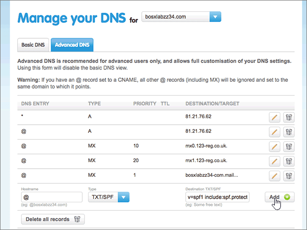

# DNS-records bij 123-reg.co.uk maken voor MicrosoftCreate DNS records at 123-reg.co.uk for Microsoft

 **[Raadpleeg de veelgestelde vragen over domeinen](../setup/domains-faq.md)** als u niet kunt vinden wat u zoekt.**[Check the Domains FAQ](../setup/domains-faq.md)** if you don't find what you're looking for. 
  
Als 123-reg.co.uk uw DNS-hostingprovider is, voert u de stappen in dit artikel uit om uw domein te verifiëren en DNS-records voor e-mail, Skype voor Bedrijven Online, enzovoort in te stellen.If 123-reg.co.uk is your DNS hosting provider, follow the steps in this article to verify your domain and set up DNS records for email, Skype for Business Online, and so on.
  
Nadat u deze records bij 123-reg.co.uk hebt toegevoegd, is uw domein ingesteld voor gebruik met Microsoft-services.After you add these records at 123-reg.co.uk, your domain will be set up to work with Microsoft services.
  
  
> [!NOTE]
> Het duurt meestal ongeveer 15 minuten voordat DNS-wijzigingen van kracht worden. Het kan echter soms wat langer duren voordat een wijziging die u hebt aangebracht, is bijgewerkt via het DNS-systeem op internet. Als u na het toevoegen van DNS-records problemen hebt met het ontvangen of verzenden van e-mail, raadpleegt u [Problemen opsporen en oplossen nadat u uw domein of DNS-records hebt toegevoegd](../get-help-with-domains/find-and-fix-issues.md).Typically it takes about 15 minutes for DNS changes to take effect. However, it can occasionally take longer for a change you've made to update across the Internet's DNS system. If you're having trouble with mail flow or other issues after adding DNS records, see [Find and fix issues after adding your domain or DNS records](../get-help-with-domains/find-and-fix-issues.md). 
  
## Een TXT-record toevoegen voor verificatieAdd a TXT record for verification

Voordat u uw domein met Microsoft kunt gebruiken, moet worden gecontroleerd dat u de eigenaar bent van het domein. Als u zich bij uw account bij de domeinregistrar kunt aanmelden en de DNS-record kunt maken, is dit voor Microsoft bewezen.Before you use your domain with Microsoft, we have to make sure that you own it. Your ability to log in to your account at your domain registrar and create the DNS record proves to Microsoft that you own the domain.
  
> [!NOTE]
> Deze record wordt alleen gebruikt om te verifiëren dat u de eigenaar van uw domein bent. Dit heeft verder geen invloed. U kunt deze record later desgewenst verwijderen.This record is used only to verify that you own your domain; it doesn't affect anything else. You can delete it later, if you like. 
  
1. Als u wilt beginnen, gaat u naar uw domeinenpagina bij 123-reg.co.uk via [deze koppeling](https://www.123-reg.co.uk/secure/cpanel/domain/overview). U wordt gevraagd u eerst aan te melden.To get started, go to your domains page at 123-reg.co.uk by using [this link](https://www.123-reg.co.uk/secure/cpanel/domain/overview). You'll be prompted to log in first.
    
2. Selecteer op de pagina **Domain name overview** de naam van het domein dat u wilt bewerken.On the **Domain name overview** page, select the name of the domain that you want to edit. 
    
3. Kies in de vervolgkeuzelijst **Select action** de optie **DNS**.Choose **DNS** from the **Select action** drop-down list. 
    
4. Op de pagina **Manage your DNS** selecteert u het tabblad **Advanced DNS** .On the **Manage your DNS** page, select the **Advanced DNS** tab. 
    
5. Ga naar het gebied **Advanced DNS**. In de vakken voor de nieuwe record in dit gebied kunt u vervolgens de waarden uit de volgende tabel typen of kopiëren en plakken.In the **Advanced DNS** section, in the boxes for the new record, type or copy and paste the values from the following table. 
    
    (Kies in de vervolgkeuzelijst de waarde **Type**).(Choose the **Type** value from the drop-down list.) 
    
    ||||
    |:-----|:-----|:-----|
    |**Hostname****Hostname**   |**Type****Type**   |**Destination TXT/SPF****Destination TXT/SPF**   |
    |@    |TXT/SPFTXT/SPF    |MS=ms *XXXXXXXX*MS=ms *XXXXXXXX*    **Opmerking:** Dit is een voorbeeld.**Note:** This is an example. Gebruik hier de specifieke waarde voor **Doel of adres waarnaar wordt verwezen** uit de tabel.Use your specific **Destination or Points to Address** value here, from the table. [Hoe kan ik dit vinden?How do I find this?](../get-help-with-domains/information-for-dns-records.md)          |
   
6. Kies **Toevoegen**.Select **Add**.
    
7. Wacht enkele minuten voordat u verder gaat, zodat de record die u zojuist hebt gemaakt via internet kan worden bijgewerkt.Wait a few minutes before you continue, so that the record you just created can update across the Internet.
    
Nu u de record hebt toegevoegd aan de site van uw domeinregistratie, gaat u terug naar Microsoft en vraagt u naar de record.Now that you've added the record at your domain registrar's site, you'll go back to Microsoft and request a search for the record.
  
Wanneer in Microsoft de juiste TXT-record is gevonden, is uw domein gecontroleerd.When Microsoft finds the correct TXT record, your domain is verified.
  
1. Ga in het Microsoft-beheercentrum naar **Instellingen** \> <a href="https://go.microsoft.com/fwlink/p/?linkid=834818" target="_blank">Domeinen</a>-pagina.In the Microsoft admin center, go to the **Settings** \> <a href="https://go.microsoft.com/fwlink/p/?linkid=834818" target="_blank">Domains</a> page.

    
2. Kies op de pagina **Domeinen** de naam van het domein dat u verifieert.On the **Domains** page, select the domain that you are verifying. 
    
3. Kies **Start setup** op de pagina **Setup**.On the **Setup** page, select **Start setup**.
    
4. Kies **Verifiëren** op de pagina **Domein verifiëren**.On the **Verify domain** page, select **Verify**.
    
> [!NOTE]
> Het duurt meestal ongeveer 15 minuten voordat DNS-wijzigingen van kracht worden. Het kan echter soms wat langer duren voordat een wijziging die u hebt aangebracht, is bijgewerkt via het DNS-systeem op internet. Als u na het toevoegen van DNS-records problemen hebt met het ontvangen of verzenden van e-mail, raadpleegt u [Problemen opsporen en oplossen nadat u uw domein of DNS-records hebt toegevoegd](../get-help-with-domains/find-and-fix-issues.md).Typically it takes about 15 minutes for DNS changes to take effect. However, it can occasionally take longer for a change you've made to update across the Internet's DNS system. If you're having trouble with mail flow or other issues after adding DNS records, see [Find and fix issues after adding your domain or DNS records](../get-help-with-domains/find-and-fix-issues.md). 
  
## Voeg een MX-record toe zodat e-mail voor uw domein naar Microsoft wordt verzondenAdd an MX record so email for your domain will come to Microsoft

1. Als u wilt beginnen, gaat u naar uw domeinenpagina bij 123-reg.co.uk via [deze koppeling](https://www.123-reg.co.uk/secure/cpanel/domain/overview). U wordt gevraagd u eerst aan te melden.To get started, go to your domains page at 123-reg.co.uk by using [this link](https://www.123-reg.co.uk/secure/cpanel/domain/overview). You'll be prompted to log in first.
    
2. Selecteer op de pagina **Domain name overview** de naam van het domein dat u wilt bewerken.On the **Domain name overview** page, select the name of the domain that you want to edit. 
    
3. Kies in de vervolgkeuzelijst **Select action** de optie **DNS**.Choose **DNS** from the **Select action** drop-down list. 
    
4. Op de pagina **Manage your DNS** selecteert u het tabblad **Advanced DNS** .On the **Manage your DNS** page, select the **Advanced DNS** tab. 
    
5. Ga naar het gebied **Advanced DNS**. In de vakken voor de nieuwe record in dit gebied kunt u vervolgens de waarden uit de volgende tabel typen of kopiëren en plakken.In the **Advanced DNS** section, in the boxes for the new record, type or copy and paste the values from the following table. 
    
    (Kies in de vervolgkeuzelijst de waarde **Type**).(Choose the **Type** value from the drop-down list.) 
    
    |**Hostname****Hostname**|**Type****Type**|**Priority****Priority**|**Destination MX****Destination MX**|
    |:-----|:-----|:-----|:-----|
    |@    |MXMX    |11    Zie [Wat is MX-prioriteit?](https://docs.microsoft.com/microsoft-365/admin/setup/domains-faq) voor meer informatie over prioriteit.   For more information about priority, see [What is MX priority?](https://docs.microsoft.com/microsoft-365/admin/setup/domains-faq)   | *\<domain-key\>*  . mail.protection.outlook.com.*\<domain-key\>*  .mail.protection.outlook.com.    **Deze waarde MOET eindigen op een punt (.)****This value MUST end with a period (.)**   **Opmerking:** Haal uw \<domain-key\> uit uw Microsoft-account.**Note:** Get your \<domain-key\> from your Microsoft account. [Hoe kan ik dit vinden?How do I find this?](../get-help-with-domains/information-for-dns-records.md)          |
   
    
  
6. Kies **Toevoegen**.Select **Add**.
    
    
  
7. Als er andere MX-records zijn, verwijdert u deze door het pictogram **Verwijderen (Prullenbak)** voor die records te kiezen.If there are any other MX records, remove each one by choosing the **Delete (trash can)** icon for that record. 
    
    
  
## De zes CNAME-records toevoegen die vereist zijn voor MicrosoftAdd the six CNAME records that are required for Microsoft

1. Als u wilt beginnen, gaat u naar uw domeinenpagina bij 123-reg.co.uk via [deze koppeling](https://www.123-reg.co.uk/secure/cpanel/domain/overview). U wordt gevraagd u eerst aan te melden.To get started, go to your domains page at 123-reg.co.uk by using [this link](https://www.123-reg.co.uk/secure/cpanel/domain/overview). You'll be prompted to log in first.
    
2. Selecteer op de pagina **Domain name overview** de naam van het domein dat u wilt bewerken.On the **Domain name overview** page, select the name of the domain that you want to edit. 
    
3. Kies in de vervolgkeuzelijst **Select action** de optie **DNS**.Choose **DNS** from the **Select action** drop-down list. 
    
4. Op de pagina **Manage your DNS** selecteert u het tabblad **Advanced DNS** .On the **Manage your DNS** page, select the **Advanced DNS** tab. 
    
5. Voeg de eerste van de zes CNAME-records toe.Add the first of the six CNAME records.
    
    Typ of kopieer en plak de waarden uit de volgende tabel in het gebied **Advanced DNS** in de vakken voor de nieuwe record.In the **Advanced DNS** section, in the boxes for the new record, type or copy and paste the values from the following table. 
    
    (Kies in de vervolgkeuzelijst de waarde **Type**).(Choose the **Type** value from the drop-down list.) 
    
    |**Hostname****Hostname**|**Type****Type**|**Destination CNAME****Destination CNAME**|
    |:-----|:-----|:-----|
    |autodiscoverautodiscover    |CNAMECNAME    |autodiscover.outlook.com.autodiscover.outlook.com.    **Deze waarde MOET eindigen op een punt (.)****This value MUST end with a period (.)**   |
    |sipsip    |CNAMECNAME    |sipdir.online.lync.com.sipdir.online.lync.com.    **Deze waarde MOET eindigen op een punt (.)****This value MUST end with a period (.)**   |
    |lyncdiscoverlyncdiscover    |CNAMECNAME    |webdir.online.lync.com.webdir.online.lync.com.    **Deze waarde MOET eindigen op een punt (.)****This value MUST end with a period (.)**   |
    |enterpriseregistrationenterpriseregistration    |CNAMECNAME    |enterpriseregistration.windows.net.enterpriseregistration.windows.net.    **Deze waarde MOET eindigen op een punt (.)****This value MUST end with a period (.)**   |
    |enterpriseenrollmententerpriseenrollment    |CNAMECNAME    |enterpriseenrollment-s.manage.microsoft.com.enterpriseenrollment-s.manage.microsoft.com.    **Deze waarde MOET eindigen op een punt (.)****This value MUST end with a period (.)**   |
   
    
  
6. Kies **Toevoegen**.Select **Add**.
    
    
  
7. Voeg de overige vijf CNAME-records toe.Add the other five CNAME records.
    
    Maak in de sectie **Advanced DNS** een record met behulp van de waarden uit de volgende rij in de tabel en selecteer vervolgens opnieuw **add** om de record te voltooien.In the **Advanced DNS** section, create a record using the values from the next row in the table, and then again select **Add** to complete that record. 
    
    Herhaal deze procedure totdat u alle zes CNAME-records hebt gemaakt.Repeat this process until you have created all six CNAME records.
    
## Een TXT-record voor SPF toevoegen om spam tegen te gaanAdd a TXT record for SPF to help prevent email spam

> [!IMPORTANT]
> U kunt maximaal 1 TXT-record hebben voor SPF voor een domein.You cannot have more than one TXT record for SPF for a domain. Als uw domein meer dan één SPF-record heeft, kan dit resulteren in e-mailfouten, evenals leverings- en spamclassificatieproblemen.If your domain has more than one SPF record, you'll get email errors, as well as delivery and spam classification issues. Als u al een SPF-record voor uw domein hebt, maakt u geen nieuwe SPF-record voor Microsfot.If you already have an SPF record for your domain, don't create a new one for Microsfot. In plaats daarvan voegt u de vereiste Microsoft-waarden toe aan de huidige record, zodat u  *één*  SPF-record hebt die beide sets met waarden bevat.Instead, add the required Microsoft values to the current record so that you have a  *single*  SPF record that includes both sets of values. Hebt u voorbeelden nodig?Need examples? Bekijk deze [Externe Domain Name System-records voor Microsoft](https://docs.microsoft.com/microsoft-365/enterprise/external-domain-name-system-records#external-dns-records-required-for-spf).Check out these [External Domain Name System records for Microsoft](https://docs.microsoft.com/microsoft-365/enterprise/external-domain-name-system-records#external-dns-records-required-for-spf). Voor het valideren van uw SPF-record, kunt u een van deze [SPF-validatiehulpmiddelen](../setup/domains-faq.md) gebruiken.To validate your SPF record, you can use one of these [SPF validation tools](../setup/domains-faq.md). 
  
1. Als u wilt beginnen, gaat u naar uw domeinenpagina bij 123-reg.co.uk via [deze koppeling](https://www.123-reg.co.uk/secure/cpanel/domain/overview). U wordt gevraagd u eerst aan te melden.To get started, go to your domains page at 123-reg.co.uk by using [this link](https://www.123-reg.co.uk/secure/cpanel/domain/overview). You'll be prompted to log in first.
    
2. Selecteer op de pagina **Domain name overview** de naam van het domein dat u wilt bewerken.On the **Domain name overview** page, select the name of the domain that you want to edit. 
    
3. Kies in de vervolgkeuzelijst **Select action** de optie **DNS**.Choose **DNS** from the **Select action** drop-down list. 
    
4. Op de pagina **Manage your DNS** selecteert u het tabblad **Advanced DNS** .On the **Manage your DNS** page, select the **Advanced DNS** tab. 
    
5. Ga naar het gebied **Advanced DNS**. In de vakken voor de nieuwe record in dit gebied kunt u vervolgens de waarden uit de volgende tabel typen of kopiëren en plakken.In the **Advanced DNS** section, in the boxes for the new record, type or copy and paste the values from the following table. 
    
    (Kies in de vervolgkeuzelijst de waarde **Type**).(Choose the **Type** value from the drop-down list.) 
    
    |**Hostname****Hostname**|**Type****Type**|**Destination TXT/SPF****Destination TXT/SPF**|
    |:-----|:-----|:-----|
    |@    |TXT/SPFTXT/SPF    |v=spf1 include:spf.protection.outlook.com -allv=spf1 include:spf.protection.outlook.com -all    **Opmerking:** het is raadzaam dit item te kopiëren en te plakken, zodat het spatiegebruik ongewijzigd blijft.**Note:** We recommend copying and pasting this entry, so that all of the spacing stays correct.           |
   
    
  
6. Kies **Toevoegen**.Select **Add**.
    
    
  
## De twee SRV-records toevoegen die zijn vereist voor MicrosoftAdd the two SRV records that are required for Microsoft

1. Als u wilt beginnen, gaat u naar uw domeinenpagina bij 123-reg.co.uk via [deze koppeling](https://www.123-reg.co.uk/secure/cpanel/domain/overview). U wordt gevraagd u eerst aan te melden.To get started, go to your domains page at 123-reg.co.uk by using [this link](https://www.123-reg.co.uk/secure/cpanel/domain/overview). You'll be prompted to log in first.
    
2. Selecteer op de pagina **Domain name overview** de naam van het domein dat u wilt bewerken.On the **Domain name overview** page, select the name of the domain that you want to edit. 
    
3. Kies in de vervolgkeuzelijst **Select action** de optie **DNS**.Choose **DNS** from the **Select action** drop-down list. 
    
4. Op de pagina **Manage your DNS** selecteert u het tabblad **Advanced DNS** .On the **Manage your DNS** page, select the **Advanced DNS** tab. 
    
5. Voeg als volgt de eerste van de twee SRV-records toe:Add the first of the two SRV records:
    
    Typ of kopieer en plak de waarden uit de volgende tabel in het gebied **Advanced DNS** in de vakken voor de nieuwe record.In the **Advanced DNS** section, in the boxes for the new record, type or copy and paste the values from the following table. 
    
    (Kies in de vervolgkeuzelijst de waarde **Type**).(Choose the **Type** value from the drop-down list.) 
    
    ||||||
    |:-----|:-----|:-----|:-----|:-----|
    |HostnameHostname|TypeType|PriorityPriority|TTLTTL|Destination SRVDestination SRV|
    |_sip. _tls_sip._tls|SRVSRV|100100|36003600|1 443 sipdir.online.lync.com.1 443 sipdir.online.lync.com. **Deze waarde MOET eindigen op een punt (.)****This value MUST end with a period (.)**  **Opmerking:** het is raadzaam dit item te kopiëren en te plakken, zodat het spatiegebruik ongewijzigd blijft.**Note:** We recommend copying and pasting this entry, so that all of the spacing stays correct.           |
    |_sipfederationtls. _tcp_sipfederationtls._tcp|SRVSRV|100100|36003600|1 5061 sipfed.online.lync.com.1 5061 sipfed.online.lync.com. **Deze waarde MOET eindigen op een punt (.)****This value MUST end with a period (.)**   **Opmerking:** het is raadzaam dit item te kopiëren en te plakken, zodat het spatiegebruik ongewijzigd blijft.**Note:** We recommend copying and pasting this entry, so that all of the spacing stays correct.           |
   
    
  
6. Kies **Toevoegen**.Select **Add**.
    
    
  
7. De andere SRV-record toevoegen:To add the other SRV record:
    
    Maak in de sectie **Advanced DNS** een record met behulp van de waarden uit de tweede rij in de tabel en selecteer vervolgens opnieuw **add** om de record te voltooien.In the **Advanced DNS** section, create a record by using the values from the second row in the table, and then again select **Add** to complete that record. 
    
> [!NOTE]
> Het duurt meestal ongeveer 15 minuten voordat DNS-wijzigingen van kracht worden. Het kan echter soms wat langer duren voordat een wijziging die u hebt aangebracht, is bijgewerkt via het DNS-systeem op internet. Als u na het toevoegen van DNS-records problemen hebt met het ontvangen of verzenden van e-mail, raadpleegt u [Problemen opsporen en oplossen nadat u uw domein of DNS-records hebt toegevoegd](../get-help-with-domains/find-and-fix-issues.md).Typically it takes about 15 minutes for DNS changes to take effect. However, it can occasionally take longer for a change you've made to update across the Internet's DNS system. If you're having trouble with mail flow or other issues after adding DNS records, see [Find and fix issues after adding your domain or DNS records](../get-help-with-domains/find-and-fix-issues.md). 
  
