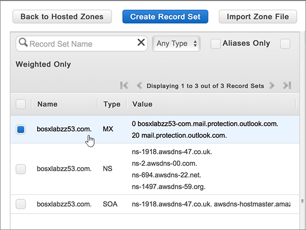
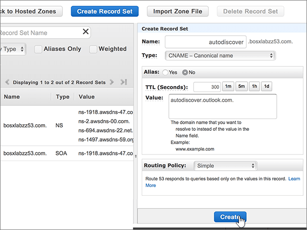
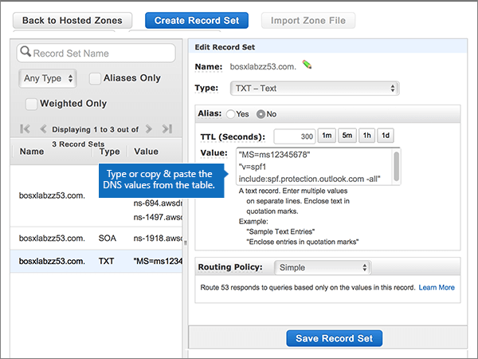

# DNS-records maken bij Amazon Web Services (AWS) voor Microsoft

 **[Raadpleeg de veelgestelde vragen over domeinen](../setup/domains-faq.md)** als u niet kunt vinden wat u zoekt. 
  
Als AWS uw DNS-hostingprovider is, voert u de stappen in dit artikel uit om uw domein te verifiëren en DNS-records in te stellen voor e-mail, Skype Online voor Bedrijven, enzovoort.
  
Nadat u deze records bij AWS hebt toegevoegd, wordt uw domein ingesteld om te werken met Microsoft-services.
  

  
> [!NOTE]
> Het duurt meestal ongeveer 15 minuten voordat DNS-wijzigingen van kracht worden. Het kan echter soms wat langer duren voordat een wijziging die u hebt aangebracht, is bijgewerkt via het DNS-systeem op internet. Als u na het toevoegen van DNS-records problemen hebt met het ontvangen of verzenden van e-mail, raadpleegt u [Problemen opsporen en oplossen nadat u uw domein of DNS-records hebt toegevoegd](../get-help-with-domains/find-and-fix-issues.md). 
  
## Een TXT-record toevoegen voor verificatie

Voordat u uw domein met Microsoft kunt gebruiken, moet worden gecontroleerd dat u de eigenaar bent van het domein. Als u zich bij uw account bij de domeinregistrar kunt aanmelden en de DNS-record kunt maken, is dit voor Microsoft bewezen.
  
> [!NOTE]
> Deze record wordt alleen gebruikt om te verifiëren dat u de eigenaar van uw domein bent. Dit heeft verder geen invloed. U kunt deze record later desgewenst verwijderen. 
  
1. Als u wilt beginnen, gaat u naar uw domeinenpagina bij AWS via [deze koppeling](https://console.aws.amazon.com/route53/home). U wordt gevraagd u eerst aan te melden.
    
2. Selecteer op de pagina **Resources** de optie **Gehoste zones**.
    
3. Selecteer op de pagina **Gehoste zones** in de kolom **Domeinnaam** de naam van het domein dat u wilt bewerken. 
    
4. Selecteer **Recordset maken**.
    
5. Typ of kopieer en plak de waarden uit de volgende tabel in het gebied **Create Record Set** in de vakken voor de nieuwe record. 
    
    (Kies in de vervolgkeuzelijsten de waarden **Type** en **Routing Policy**.) 
    
    > [!TIP]
    > De aanhalingstekens die zijn vereist volgens de instructies op het scherm, worden automatisch ingevoegd. U hoeft deze niet handmatig te typen. 
  
    |||||||
    |:-----|:-----|:-----|:-----|:-----|:-----|
    |**Name**   |**Type**   |**Alias**   |**TTL (Seconds)**   |**Value**   |**Routing Policy**   |
    |(Laat dit veld leeg.)    |TXT - Text    |No    |300    |MS=ms *XXXXXXXX*   **Opmerking:** Dit is een voorbeeld. Gebruik hier de specifieke waarde voor **Doel of adres waarnaar wordt verwezen** uit de tabel in Microsoft 365. [Hoe kan ik dit vinden?](../get-help-with-domains/information-for-dns-records.md)          |Simple    |
   
6. Selecteer **Maken**.
    
7. Wacht enkele minuten voordat u verder gaat, zodat de record die u zojuist hebt gemaakt via internet kan worden bijgewerkt.
    
Nu u de record op de site van uw domeinregistrar hebt toegevoegd, gaat u terug naar Microsoft en vraagt u om een zoekopdracht naar de record.
  
Wanneer in Microsoft de juiste TXT-record is gevonden, is uw domein gecontroleerd.
  
1. Ga in het Microsoft-beheercentrum naar **Instellingen** \> <a href="https://go.microsoft.com/fwlink/p/?linkid=834818" target="_blank">Domeinen</a>-pagina.

    
2. Kies op de pagina **Domeinen** de naam van het domein dat u verifieert. 
    
3. Kies **Start setup** op de pagina **Setup**.
    
4. Kies **Verifiëren** op de pagina **Domein verifiëren**.
    
> [!NOTE]
> Het duurt meestal ongeveer 15 minuten voordat DNS-wijzigingen van kracht worden. Het kan echter soms wat langer duren voordat een wijziging die u hebt aangebracht, is bijgewerkt via het DNS-systeem op internet. Als u na het toevoegen van DNS-records problemen hebt met het ontvangen of verzenden van e-mail, raadpleegt u [Problemen opsporen en oplossen nadat u uw domein of DNS-records hebt toegevoegd](../get-help-with-domains/find-and-fix-issues.md). 
  
## Voeg een MX-record toe, zodat e-mail voor uw domein naar Microsoft 365 komt

1. Als u wilt beginnen, gaat u naar uw domeinenpagina bij AWS via [deze koppeling](https://console.aws.amazon.com/route53/home). U wordt gevraagd u eerst aan te melden.
    
2. Selecteer op de pagina **Resources** de optie **Gehoste zones**.
    
3. Selecteer op de pagina **Gehoste zones** in de kolom **Domeinnaam** de naam van het domein dat u wilt bewerken. 
    
4. Selecteer **Recordset maken**.
    
5. Typ of kopieer en plak de waarden uit de volgende tabel in het gebied **Create Record Set** in de vakken voor de nieuwe record. 
    
    (Kies in de vervolgkeuzelijsten de waarden **Type** en **Routing Policy**.) 
    
    |**Naam**|**Type**|**Alias**|**TTL (Seconds)**|**Value**|**Routing Policy**|
    |:-----|:-----|:-----|:-----|:-----|:-----|
    |(Laat dit veld leeg.)    |MX - e-mailuitwisseling    |Nee    |300    |0  *\< domeinsleutel\>*  .mail.protection.outlook.com.    De 0 is de MX-prioriteitwaarde. Voeg deze toe aan het begin van de MX-waarde, van de rest van de waarde gescheiden door een spatie.    **Deze waarde MOET eindigen op een punt (.)**   **Let op:** Haal \<uw domeinsleutel\> op van uw Microsoft 365-account. *domain-key* [Hoe kan ik dit vinden?](../get-help-with-domains/information-for-dns-records.md)          |Simple    |
       
    
  
6. Selecteer **Maken**.
    
    
  
7. Als er andere MX-records zijn, verwijdert u deze.
    
    > [!IMPORTANT]
    > AWS slaat MX-records op als een set die meerdere records kan bevatten. **Selecteer recordset verwijderen NIET,** omdat hiermee al uw MX-records worden verwijderd, inclusief de records die u zojuist hebt toegevoegd. **Delete Record Set** Gebruik in plaats daarvan de volgende instructies. 
  
    Selecteer eerst de MX-recordset.
    
    
  
    Vervolgens verwijdert u in het gebied **Edit Record Set** (recordset bewerken) elk van de oude MX-records door de record te selecteren in het vak **Value** en op de toets **Delete** op uw toetsenbord te drukken. 
    
    
  
8. Selecteer **Recordset opslaan**.
    
    
  
## Voeg de vijf CNAME-records toe die nodig zijn voor Microsoft 365

1. Als u wilt beginnen, gaat u naar uw domeinenpagina bij AWS via [deze koppeling](https://console.aws.amazon.com/route53/home). U wordt gevraagd u eerst aan te melden.
    
2. Selecteer op de pagina **Resources** de optie **Gehoste zones**.
    
3. Selecteer op de pagina **Gehoste zones** in de kolom **Domeinnaam** de naam van het domein dat u wilt bewerken. 
    
4. Selecteer **Recordset maken**.
    
5. Voeg de eerste CNAME-record toe.
    
    Typ of kopieer en plak de waarden uit de eerste rij van de volgende tabel in het gebied **Create Record Set** (recordset maken) in de vakken voor de nieuwe record. 
    
    (Kies in de vervolgkeuzelijsten de waarden **Type** en **Routing Policy**.) 
    
    |**Naam**|**Type**|**Alias**|**TTL (Seconds)**|**Value**|**Routing Policy**|
    |:-----|:-----|:-----|:-----|:-----|:-----|
    |autodiscover    |CNAME - Canonical name    |Nee    |300    |autodiscover.outlook.com.    **Deze waarde MOET eindigen op een punt (.)**   |Simple    |
    |sip    |CNAME - Canonical name    |Nee    |300    |sipdir.online.lync.com.    **Deze waarde MOET eindigen op een punt (.)**   |Simple    |
    |lyncdiscover    |CNAME - Canonical name    |Nee    |300    |webdir.online.lync.com.    **Deze waarde MOET eindigen op een punt (.)**   |Dat is eenvoudig    |
    |enterpriseregistration    |CNAME - Canonical name    |Nee    |300    |enterpriseregistration.windows.net.    **Deze waarde MOET eindigen op een punt (.)**   |Simple    |
    |enterpriseenrollment    |CNAME - Canonical name    |Nee    |300    |enterpriseenrollment-s.manage.microsoft.com.    **Deze waarde MOET eindigen op een punt (.)**   |Simple    |
   
    
  
6. Selecteer **Maken**.
    
    
  
7. Voeg de andere vier CNAME-records toe.
    
    Selecteer op de pagina **Gehoste zones** **Recordset maken,** maak een record met de waarden uit de volgende rij in de tabel en selecteer vervolgens opnieuw **Maken** om die record te voltooien. 
    
    Herhaal dit proces totdat u alle vijf CNAME-records hebt gemaakt.
    
## Een TXT-record voor SPF toevoegen om spam tegen te gaan

> [!IMPORTANT]
> U kunt maximaal 1 TXT-record hebben voor SPF voor een domein. Als uw domein meer dan één SPF-record heeft, kan dit resulteren in e-mailfouten, evenals leverings- en spamclassificatieproblemen. Als u al een SPF-record voor uw domein hebt, hoeft u geen nieuwe te maken voor Microsoft. Voeg in plaats daarvan de vereiste Microsoft-waarden toe aan de huidige record, zodat u *één* SPF-record hebt die beide waardensets bevat. Hebt u voorbeelden nodig? Bekijk deze [Externe Domain Name System-records voor Microsoft](https://support.office.com/article/c0531a6f-9e25-4f2d-ad0e-a70bfef09ac0). Als u uw SPF-record wilt valideren, u een van deze[SPF-validatietools](../setup/domains-faq.md)gebruiken. 
  
1. Als u wilt beginnen, gaat u naar uw domeinenpagina bij AWS via [deze koppeling](https://console.aws.amazon.com/route53/home). U wordt gevraagd u eerst aan te melden.
    
2. Selecteer op de pagina **Resources** de optie **Gehoste zones**.
    
3. Selecteer op de pagina **Gehoste zones** in de kolom **Domeinnaam** de naam van het domein dat u wilt bewerken. 
    
4. Selecteer de **TXT-recordset.** 
    
    
  
5. Druk in het gebied **Edit Record Set** aan het einde van de huidige invoer in het vak **Value:** voor de bestaande record op Enter op uw toetsenbord om een nieuwe regel te maken, en typ of plak op die nieuwe regel (onder de bestaande waarde) de waarde uit de volgende tabel. (U ziet een voorbeeld in de afbeelding onder de tabel.) 
    
    |**Waarde:**|
    |:-----|
    |v=spf1 include:spf.protection.outlook.com -all    (De aanhalingstekens die volgens de instructies op het scherm vereist zijn, worden automatisch ingevoegd. U hoeft deze niet handmatig te typen.)    **Opmerking:** het is raadzaam dit item te kopiëren en te plakken, zodat het spatiegebruik ongewijzigd blijft.           |
   
    
  
6. Selecteer **Recordset opslaan**.
    
    
  
## Voeg de twee SRV-records toe die nodig zijn voor Microsoft 365

1. Als u wilt beginnen, gaat u naar uw domeinenpagina bij AWS via [deze koppeling](https://console.aws.amazon.com/route53/home). U wordt gevraagd u eerst aan te melden.
    
2. Selecteer op de pagina **Resources** de optie **Gehoste zones**.
    
3. Selecteer op de pagina **Gehoste zones** in de kolom **Domeinnaam** de naam van het domein dat u wilt bewerken. 
    
4. Selecteer **Recordset maken**.
    
5. Voeg de eerste SRV-record toe:
    
    Typ of kopieer en plak de waarden uit de eerste rij van de volgende tabel in het gebied **Create Record Set** (recordset maken) in de vakken voor de nieuwe record. 
    
    (Kies in de vervolgkeuzelijsten de waarden **Type** en **Routing Policy**.) 
    
    |**Name**|**Type**|**Alias**|**TTL (Seconds)**|**Value**|**Routing Policy**|
    |:-----|:-----|:-----|:-----|:-----|:-----|
    |_sip._tls|SRV - Service locator|Nee|300|100 1 443 sipdir.online.lync.com. **Deze waarde MOET eindigen met een periode (.)**>  **Opmerking:** het is raadzaam dit item te kopiëren en te plakken, zodat het spatiegebruik ongewijzigd blijft.           |Simple|
    |_sipfederationtls._tcp|SRV - Service locator|Nee|300|100 1 5061 sipfed.online.lync.com. **Deze waarde MOET eindigen op een punt (.)**  **Opmerking:** het is raadzaam dit item te kopiëren en te plakken, zodat het spatiegebruik ongewijzigd blijft.           |Simple|
   
    
  
6. Selecteer **Maken**.
    
    
  
7. De andere SRV-record toevoegen:
    
    Selecteer op de pagina **Gehoste zones** **Recordset maken,** maak een record met de waarden uit de volgende rij in de tabel en selecteer vervolgens opnieuw **Maken** om die record te voltooien. 
    
> [!NOTE]
> Het duurt meestal ongeveer 15 minuten voordat DNS-wijzigingen van kracht worden. Het kan echter soms wat langer duren voordat een wijziging die u hebt aangebracht, is bijgewerkt via het DNS-systeem op internet. Als u na het toevoegen van DNS-records problemen hebt met het ontvangen of verzenden van e-mail, raadpleegt u [Problemen opsporen en oplossen nadat u uw domein of DNS-records hebt toegevoegd](../get-help-with-domains/find-and-fix-issues.md). 
  
