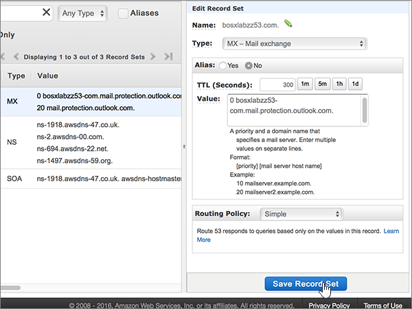
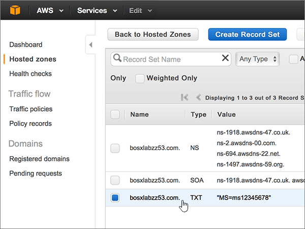

# DNS-records bij AWS (Amazon Web Services) maken voor Office 365Create DNS records at Amazon Web Services (AWS) for Office 365

 **[Raadpleeg de veelgestelde vragen over domeinen](../setup/domains-faq.md)** als u niet kunt vinden wat u zoekt.**[Check the Domains FAQ](../setup/domains-faq.md)** if you don't find what you're looking for. 
  
Als AWS uw DNS-hostingprovider is, voert u de stappen in dit artikel uit om uw domein te verifiëren en DNS-records in te stellen voor e-mail, Skype Online voor Bedrijven, enzovoort.If AWS is your DNS hosting provider, follow the steps in this article to verify your domain and set up DNS records for email, Skype Online for Business, and so on.
  
Nadat u deze records bij AWS hebt toegevoegd, is uw domein ingesteld voor gebruik met Office 365-services.After you add these records at AWS, your domain will be set up to work with Office 365 services.
  
Zie [Een openbare website gebruiken met Office 365](https://support.office.com/article/choose-a-public-website-3325d50e-d131-403c-a278-7f3296fe33a9) voor informatie over webhosting en DNS voor websites met Office 365.To learn about webhosting and DNS for websites with Office 365, see [Use a public website with Office 365](https://support.office.com/article/choose-a-public-website-3325d50e-d131-403c-a278-7f3296fe33a9).
  
> [!NOTE]
> Het duurt meestal ongeveer 15 minuten voordat DNS-wijzigingen van kracht worden. Het kan echter soms wat langer duren voordat een wijziging die u hebt aangebracht, is bijgewerkt via het DNS-systeem op internet. Als u na het toevoegen van DNS-records problemen hebt met het ontvangen of verzenden van e-mail, raadpleegt u [Problemen opsporen en oplossen nadat u uw domein of DNS-records hebt toegevoegd in Office 365](../get-help-with-domains/find-and-fix-issues.md).Typically it takes about 15 minutes for DNS changes to take effect. However, it can occasionally take longer for a change you've made to update across the Internet's DNS system. If you're having trouble with mail flow or other issues after adding DNS records, see [Find and fix issues after adding your domain or DNS records in Office 365](../get-help-with-domains/find-and-fix-issues.md). 
  
## Een TXT-record toevoegen voor verificatieAdd a TXT record for verification

Voordat u uw domein met Office 365 kunt gaan gebruiken, moet worden gecontroleerd dat u de eigenaar bent van het domein. Als u zich bij uw account bij de domeinregistrar kunt aanmelden en de DNS-record kunt maken, is dit voor Office 365 bewezen.Before you use your domain with Office 365, we have to make sure that you own it. Your ability to log in to your account at your domain registrar and create the DNS record proves to Office 365 that you own the domain.
  
> [!NOTE]
> Deze record wordt alleen gebruikt om te verifiëren dat u de eigenaar van uw domein bent. Dit heeft verder geen invloed. U kunt deze record later desgewenst verwijderen.This record is used only to verify that you own your domain; it doesn't affect anything else. You can delete it later, if you like. 
  
1. Als u wilt beginnen, gaat u naar uw domeinenpagina bij AWS via [deze koppeling](https://console.aws.amazon.com/route53/home).To get started, go to your domains page at AWS by using [this link](https://console.aws.amazon.com/route53/home). U wordt gevraagd u eerst aan te melden.You'll be prompted to log in first.
    
2. Selecteer op de pagina **Resources** de optie **Gehoste zones**.On the **Resources** page, select **Hosted Zones**.
    
3. Selecteer op de pagina \*\* Gehoste zones \*\* in de kolom **Domeinnaam** de naam van het domein dat u wilt bewerken.On the \*\* Hosted Zones \*\* page, in the **Domain Name** column, select the name of the domain that you want to edit. 
    
4. Selecteer **Recordset maken**.Select **Create Record Set**.
    
5. Typ of kopieer en plak de waarden uit de volgende tabel in het gebied **Create Record Set** in de vakken voor de nieuwe record.In the **Create Record Set** area, in the boxes for the new record, type or copy and paste the values from the following table. 
    
    (Kies in de vervolgkeuzelijsten de waarden **Type** en **Routing Policy**.)(Choose the **Type** and **Routing Policy** values from the drop-down lists.) 
    
    > [!TIP]
    > De aanhalingstekens die zijn vereist volgens de instructies op het scherm, worden automatisch ingevoegd. U hoeft deze niet handmatig te typen.The quotation marks required by the onscreen instructions are supplied automatically. You don't need to type them manually. 
  
    |||||||
    |:-----|:-----|:-----|:-----|:-----|:-----|
    |**Name****Name**   |**Type****Type**   |**Alias****Alias**   |**TTL (Seconds)****TTL (Seconds)**   |**Value****Value**   |**Routing Policy****Routing Policy**   |
    |(Laat dit veld leeg.)(Leave this field empty.)    |TXT - TextTXT - Text    |NoNo    |300300    |MS=ms *XXXXXXXX*MS=ms *XXXXXXXX*   **Opmerking:** Dit is een voorbeeld.**Note:** This is an example. Gebruik hier de specifieke waarde voor **Doel of adres waarnaar wordt verwezen** uit de tabel in Office 365.Use your specific **Destination or Points to Address** value here, from the table in Office 365. [Hoe kan ik dit vinden?How do I find this?](../get-help-with-domains/information-for-dns-records.md)          |SimpleSimple    |
   
6. Selecteer **Maken**.Select **Create**.
    
7. Wacht enkele minuten voordat u verder gaat, zodat de record die u zojuist hebt gemaakt via internet kan worden bijgewerkt.Wait a few minutes before you continue, so that the record you just created can update across the Internet.
    
Nu u de record hebt toegevoegd aan de site van uw domeinregistrar, gaat u terug naar Office 365 en vraagt u of Office 365 naar de record wil zoeken.Now that you've added the record at your domain registrar's site, you'll go back to Office 365 and request Office 365 to look for the record.
  
Wanneer in Office 365 de juiste TXT-record is gevonden, is uw domein gecontroleerd.When Office 365 finds the correct TXT record, your domain is verified.
  
1. Ga in het beheercentrum naar **Instellingen** \> <a href="https://go.microsoft.com/fwlink/p/?linkid=834818" target="_blank">Domeinen</a>-pagina.In the admin center, go to the **Settings** \> <a href="https://go.microsoft.com/fwlink/p/?linkid=834818" target="_blank">Domains</a> page.

    
2. Kies op de pagina **Domeinen** de naam van het domein dat u verifieert.On the **Domains** page, select the domain that you are verifying. 
    
3. Kies **Start setup** op de pagina **Setup**.On the **Setup** page, select **Start setup**.
    
4. Kies **Verifiëren** op de pagina **Domein verifiëren**.On the **Verify domain** page, select **Verify**.
    
> [!NOTE]
> Het duurt meestal ongeveer 15 minuten voordat DNS-wijzigingen van kracht worden. Het kan echter soms wat langer duren voordat een wijziging die u hebt aangebracht, is bijgewerkt via het DNS-systeem op internet. Als u na het toevoegen van DNS-records problemen hebt met het ontvangen of verzenden van e-mail, raadpleegt u [Problemen opsporen en oplossen nadat u uw domein of DNS-records hebt toegevoegd in Office 365](../get-help-with-domains/find-and-fix-issues.md).Typically it takes about 15 minutes for DNS changes to take effect. However, it can occasionally take longer for a change you've made to update across the Internet's DNS system. If you're having trouble with mail flow or other issues after adding DNS records, see [Find and fix issues after adding your domain or DNS records in Office 365](../get-help-with-domains/find-and-fix-issues.md). 
  
## Een MX-record toevoegen zodat e-mail voor uw domein bij Office 365 terechtkomtAdd an MX record so email for your domain will come to Office 365

1. Als u wilt beginnen, gaat u naar uw domeinenpagina bij AWS via [deze koppeling](https://console.aws.amazon.com/route53/home). U wordt gevraagd u eerst aan te melden.To get started, go to your domains page at AWS by using [this link](https://console.aws.amazon.com/route53/home). You'll be prompted to log in first.
    
2. Selecteer op de pagina **Resources** de optie **Gehoste zones**.On the **Resources** page, select **Hosted Zones**.
    
3. Selecteer op de pagina **Gehoste zones** in de kolom **Domeinnaam** de naam van het domein dat u wilt bewerken.On the **Hosted Zones** page, in the **Domain Name** column, select the name of the domain that you want to edit. 
    
4. Selecteer **Recordset maken**.Select **Create Record Set**.
    
5. Typ of kopieer en plak de waarden uit de volgende tabel in het gebied **Create Record Set** in de vakken voor de nieuwe record.In the **Create Record Set** area, in the boxes for the new record, type or copy and paste the values from the following table. 
    
    (Kies in de vervolgkeuzelijsten de waarden **Type** en **Routing Policy**.)(Choose the **Type** and **Routing Policy** values from the drop-down lists.) 
    
    |**Naam****Name**|**Type****Type**|**Alias****Alias**|**TTL (Seconds)****TTL (Seconds)**|**Value****Value**|**Routing Policy****Routing Policy**|
    |:-----|:-----|:-----|:-----|:-----|:-----|
    |(Laat dit veld leeg.)(Leave this field empty.)    |MX - e-mailuitwisselingMX - Mail exchange    |NeeNo    |300300    |0  *\< domeinsleutel\>*  .mail.protection.outlook.com.0  *\<domain-key\>*  .mail.protection.outlook.com.    De 0 is de MX-prioriteitwaarde. Voeg deze toe aan het begin van de MX-waarde, van de rest van de waarde gescheiden door een spatie.  The 0 is the MX priority value. Add it to the beginning of the MX value, separated from the remainder of the value by a space.    **Deze waarde MOET eindigen op een punt (.)****This value MUST end with a period (.)**   **Opmerking**: Uw \<*domeinsleutel*\> kunt u ophalen uit uw Office 365-account.**Note:** Get your \<*domain-key*\> from your Office 365 account. [Hoe kan ik dit vinden?How do I find this?](../get-help-with-domains/information-for-dns-records.md)          |SimpleSimple    |
       
    
  
6. Selecteer **Maken**.Select **Create**.
    
    
  
7. Als er andere MX-records zijn, verwijdert u deze.If there are any other MX records, remove them.
    
    > [!IMPORTANT]
    > AWS slaat MX-records op als een set die meerdere records kan bevatten.AWS stores MX records as a set that may contain multiple records. **Selecteer recordset verwijderen NIET,** omdat hiermee al uw MX-records worden verwijderd, inclusief de records die u zojuist hebt toegevoegd. **Delete Record Set****DO NOT** select **Delete Record Set**, as this will delete all of your MX records, including the one you just added. Gebruik in plaats daarvan de volgende instructies.Use the following instructions instead. 
  
    Selecteer eerst de MX-recordset.First, select the MX record set.
    
    
  
    Vervolgens verwijdert u in het gebied **Edit Record Set** (recordset bewerken) elk van de oude MX-records door de record te selecteren in het vak **Value** en op de toets **Delete** op uw toetsenbord te drukken.Next, in the **Edit Record Set** area, delete each obsolete MX record by selecting the entry in the **Value** box and then pressing the **Delete** key on your keyboard. 
    
    
  
8. Selecteer **Recordset opslaan**.Select **Save Record Set**.
    
    
  
## De vijf CNAME-records toevoegen die nodig zijn voor Office 365Add the five CNAME records that are required for Office 365

1. Als u wilt beginnen, gaat u naar uw domeinenpagina bij AWS via [deze koppeling](https://console.aws.amazon.com/route53/home). U wordt gevraagd u eerst aan te melden.To get started, go to your domains page at AWS by using [this link](https://console.aws.amazon.com/route53/home). You'll be prompted to log in first.
    
2. Selecteer op de pagina **Resources** de optie **Gehoste zones**.On the **Resources** page, select **Hosted Zones**.
    
3. Selecteer op de pagina **Gehoste zones** in de kolom **Domeinnaam** de naam van het domein dat u wilt bewerken.On the **Hosted Zones** page, in the **Domain Name** column, select the name of the domain that you want to edit. 
    
4. Selecteer **Recordset maken**.Select **Create Record Set**.
    
5. Voeg de eerste CNAME-record toe.Add the first CNAME record.
    
    Typ of kopieer en plak de waarden uit de eerste rij van de volgende tabel in het gebied **Create Record Set** (recordset maken) in de vakken voor de nieuwe record.In the **Create Record Set** area, in the boxes for the new record, type or copy and paste the values from the first row in the following table. 
    
    (Kies in de vervolgkeuzelijsten de waarden **Type** en **Routing Policy**.)(Choose the **Type** and **Routing Policy** values from the drop-down lists.) 
    
    |**Naam****Name**|**Type****Type**|**Alias****Alias**|**TTL (Seconds)****TTL (Seconds)**|**Value****Value**|**Routing Policy****Routing Policy**|
    |:-----|:-----|:-----|:-----|:-----|:-----|
    |autodiscoverautodiscover    |CNAME - Canonical nameCNAME - Canonical name    |NeeNo    |300300    |autodiscover.outlook.com.autodiscover.outlook.com.    **Deze waarde MOET eindigen op een punt (.)****This value MUST end with a period (.)**   |SimpleSimple    |
    |sipsip    |CNAME - Canonical nameCNAME - Canonical name    |NeeNo    |300300    |sipdir.online.lync.com.sipdir.online.lync.com.    **Deze waarde MOET eindigen op een punt (.)****This value MUST end with a period (.)**   |SimpleSimple    |
    |lyncdiscoverlyncdiscover    |CNAME - Canonical nameCNAME - Canonical name    |NeeNo    |300300    |webdir.online.lync.com.webdir.online.lync.com.    **Deze waarde MOET eindigen op een punt (.)****This value MUST end with a period (.)**   |Dat is eenvoudigSimple    |
    |enterpriseregistrationenterpriseregistration    |CNAME - Canonical nameCNAME - Canonical name    |NeeNo    |300300    |enterpriseregistration.windows.net.enterpriseregistration.windows.net.    **Deze waarde MOET eindigen op een punt (.)****This value MUST end with a period (.)**   |SimpleSimple    |
    |enterpriseenrollmententerpriseenrollment    |CNAME - Canonical nameCNAME - Canonical name    |NeeNo    |300300    |enterpriseenrollment-s.manage.microsoft.com.enterpriseenrollment-s.manage.microsoft.com.    **Deze waarde MOET eindigen op een punt (.)****This value MUST end with a period (.)**   |SimpleSimple    |
   
    
  
6. Selecteer **Maken**.Select **Create**.
    
    
  
7. Voeg de andere vier CNAME-records toe.Add the other four CNAME records.
    
    Selecteer op de pagina **Gehoste zones** **Recordset maken,** maak een record met de waarden uit de volgende rij in de tabel en selecteer vervolgens opnieuw **Maken** om die record te voltooien.In the **Hosted Zones** page, select **Create Record Set**, create a record using the values from the next row in the table, and then again select **Create** to complete that record. 
    
    Herhaal dit proces totdat u alle vijf CNAME-records hebt gemaakt.Repeat this process until you have created all five CNAME records.
    
## Een TXT-record voor SPF toevoegen om spam tegen te gaanAdd a TXT record for SPF to help prevent email spam

> [!IMPORTANT]
> U kunt maximaal 1 TXT-record hebben voor SPF voor een domein.You cannot have more than one TXT record for SPF for a domain. Als uw domein meer dan één SPF-record heeft, kan dit resulteren in e-mailfouten, evenals leverings- en spamclassificatieproblemen.If your domain has more than one SPF record, you'll get email errors, as well as delivery and spam classification issues. Als u al een SPF-record voor uw domein hebt, hoeft u geen nieuwe voor Office 365 te maken.If you already have an SPF record for your domain, don't create a new one for Office 365. In plaats daarvan voegt u de vereiste Office 365-waarden toe aan de huidige record, zodat u beschikt over  *één*  SPF-record waarin beide sets waarden zijn opgenomen.Instead, add the required Office 365 values to the current record so that you have a  *single*  SPF record that includes both sets of values. Hebt u voorbeelden nodig?Need examples? Bekijk deze [External Domain Name System records for Office 365](https://support.office.com/article/c0531a6f-9e25-4f2d-ad0e-a70bfef09ac0).Check out these [External Domain Name System records for Office 365](https://support.office.com/article/c0531a6f-9e25-4f2d-ad0e-a70bfef09ac0). Als u uw SPF-record wilt valideren, u een van deze[SPF-validatietools](../setup/domains-faq.md)gebruiken.To validate your SPF record, you can use one of these[SPF validation tools](../setup/domains-faq.md). 
  
1. Als u wilt beginnen, gaat u naar uw domeinenpagina bij AWS via [deze koppeling](https://console.aws.amazon.com/route53/home).To get started, go to your domains page at AWS by using [this link](https://console.aws.amazon.com/route53/home). U wordt gevraagd u eerst aan te melden.You'll be prompted to log in first.
    
2. Selecteer op de pagina **Resources** de optie **Gehoste zones**.On the **Resources** page, select **Hosted Zones**.
    
3. Selecteer op de pagina **Gehoste zones** in de kolom **Domeinnaam** de naam van het domein dat u wilt bewerken.On the **Hosted Zones** page, in the **Domain Name** column, select the name of the domain that you want to edit. 
    
4. Selecteer de **TXT-recordset.**Select the **TXT** record set. 
    
    
  
5. Druk in het gebied **Edit Record Set** aan het einde van de huidige invoer in het vak **Value:** voor de bestaande record op Enter op uw toetsenbord om een nieuwe regel te maken, en typ of plak op die nieuwe regel (onder de bestaande waarde) de waarde uit de volgende tabel. (U ziet een voorbeeld in de afbeelding onder de tabel.)In the **Edit Record Set** area, at the end of the current entry in the **Value:** box for the existing record, press Enter on your keyboard to create a new line; and then, on that new line (under the existing value), type or copy and paste the value from the following table. (You can see an example in the illustration below the table.) 
    
    |**Waarde:****Value:**|
    |:-----|
    |v=spf1 include:spf.protection.outlook.com -allv=spf1 include:spf.protection.outlook.com -all    (De aanhalingstekens die volgens de instructies op het scherm vereist zijn, worden automatisch ingevoegd. U hoeft deze niet handmatig te typen.)  (The quotation marks required by the onscreen instructions are supplied automatically. You don't need to type them manually.)    **Opmerking:** het is raadzaam dit item te kopiëren en te plakken, zodat het spatiegebruik ongewijzigd blijft.**Note:** We recommend copying and pasting this entry, so that all of the spacing stays correct.           |
   
    
  
6. Selecteer **Recordset opslaan**.Select **Save Record Set**.
    
    
  
## De twee SRV-records toevoegen die voor Office 365 vereist zijnAdd the two SRV records that are required for Office 365

1. Als u wilt beginnen, gaat u naar uw domeinenpagina bij AWS via [deze koppeling](https://console.aws.amazon.com/route53/home). U wordt gevraagd u eerst aan te melden.To get started, go to your domains page at AWS by using [this link](https://console.aws.amazon.com/route53/home). You'll be prompted to log in first.
    
2. Selecteer op de pagina **Resources** de optie **Gehoste zones**.On the **Resources** page, select **Hosted Zones**.
    
3. Selecteer op de pagina **Gehoste zones** in de kolom **Domeinnaam** de naam van het domein dat u wilt bewerken.On the **Hosted Zones** page, in the **Domain Name** column, select the name of the domain that you want to edit. 
    
4. Selecteer **Recordset maken**.Select **Create Record Set**.
    
5. Voeg de eerste SRV-record toe:Add the first SRV record:
    
    Typ of kopieer en plak de waarden uit de eerste rij van de volgende tabel in het gebied **Create Record Set** (recordset maken) in de vakken voor de nieuwe record.In the **Create Record Set** area, in the boxes for the new record, type or copy and paste the values from the first row in the following table. 
    
    (Kies in de vervolgkeuzelijsten de waarden **Type** en **Routing Policy**.)(Choose the **Type** and **Routing Policy** values from the drop-down lists.) 
    
    |**Name****Name**|**Type****Type**|**Alias****Alias**|**TTL (Seconds)****TTL (Seconds)**|**Value****Value**|**Routing Policy****Routing Policy**|
    |:-----|:-----|:-----|:-----|:-----|:-----|
    |_sip._tls_sip._tls|SRV - Service locatorSRV - Service locator|NeeNo|300300|100 1 443 sipdir.online.lync.com.100 1 443 sipdir.online.lync.com. **Deze waarde MOET eindigen met een periode (.)**>**This value MUST end with a period (.)**>  **Opmerking:** het is raadzaam dit item te kopiëren en te plakken, zodat het spatiegebruik ongewijzigd blijft.**Note:** We recommend copying and pasting this entry, so that all of the spacing stays correct.           |SimpleSimple|
    |_sipfederationtls._tcp_sipfederationtls._tcp|SRV - Service locatorSRV - Service locator|NeeNo|300300|100 1 5061 sipfed.online.lync.com.100 1 5061 sipfed.online.lync.com. **Deze waarde MOET eindigen op een punt (.)****This value MUST end with a period (.)**  **Opmerking:** het is raadzaam dit item te kopiëren en te plakken, zodat het spatiegebruik ongewijzigd blijft.**Note:** We recommend copying and pasting this entry, so that all of the spacing stays correct.           |SimpleSimple|
   
    
  
6. Selecteer **Maken**.Select **Create**.
    
    
  
7. De andere SRV-record toevoegen:To add the other SRV record:
    
    Selecteer op de pagina **Gehoste zones** **Recordset maken,** maak een record met de waarden uit de volgende rij in de tabel en selecteer vervolgens opnieuw **Maken** om die record te voltooien.In the **Hosted Zones** page, select **Create Record Set**, create a record using the values from the next row in the table, and then again select **Create** to complete that record. 
    
> [!NOTE]
> Het duurt meestal ongeveer 15 minuten voordat DNS-wijzigingen van kracht worden. Het kan echter soms wat langer duren voordat een wijziging die u hebt aangebracht, is bijgewerkt via het DNS-systeem op internet. Als u na het toevoegen van DNS-records problemen hebt met het ontvangen of verzenden van e-mail, raadpleegt u [Problemen opsporen en oplossen nadat u uw domein of DNS-records hebt toegevoegd in Office 365](../get-help-with-domains/find-and-fix-issues.md).Typically it takes about 15 minutes for DNS changes to take effect. However, it can occasionally take longer for a change you've made to update across the Internet's DNS system. If you're having trouble with mail flow or other issues after adding DNS records, see [Find and fix issues after adding your domain or DNS records in Office 365](../get-help-with-domains/find-and-fix-issues.md). 
  
