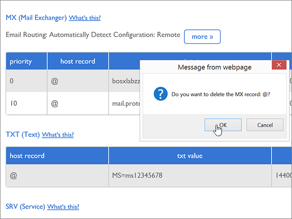
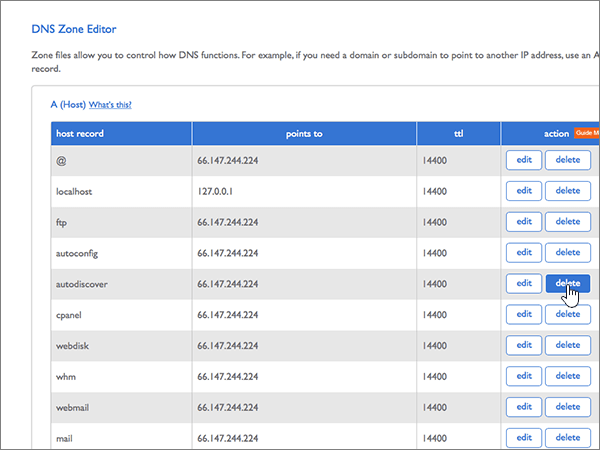
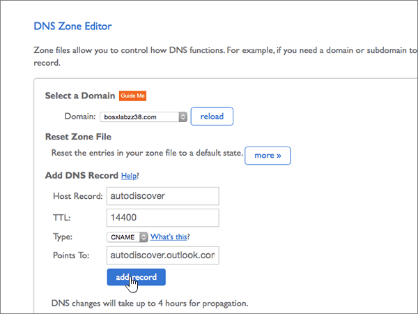
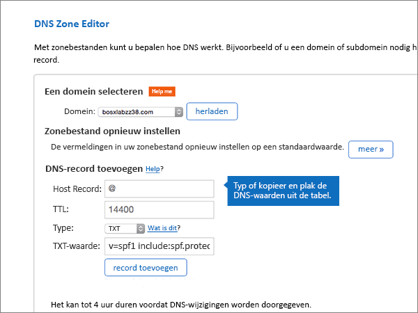

# DNS-records maken bij Bluehost voor MicrosoftCreate DNS records at Bluehost for Microsoft

 **[Raadpleeg de veelgestelde vragen over domeinen](../setup/domains-faq.md)** als u niet kunt vinden wat u zoekt.**[Check the Domains FAQ](../setup/domains-faq.md)** if you don't find what you're looking for. 
  
Als Bluehost uw DNS-hostingprovider is, voert u de stappen in dit artikel uit om uw domein te verifiëren en DNS-records voor e-mail, Skype voor Bedrijven Online enzovoort in te stellen.If Bluehost is your DNS hosting provider, follow the steps in this article to verify your domain and set up DNS records for email, Skype for Business Online, and so on.
  
Nadat u deze records bij Bluehost hebt toegevoegd, wordt uw domein ingesteld voor gebruik met Microsoft-services.After you add these records at Bluehost, your domain will be set up to work with Microsoft services.

> [!NOTE]
> Het duurt meestal ongeveer 15 minuten voordat DNS-wijzigingen van kracht worden. Het kan echter soms wat langer duren voordat een wijziging die u hebt aangebracht, is bijgewerkt via het DNS-systeem op internet. Als u na het toevoegen van DNS-records problemen hebt met het ontvangen of verzenden van e-mail, raadpleegt u [Problemen opsporen en oplossen nadat u uw domein of DNS-records hebt toegevoegd](../get-help-with-domains/find-and-fix-issues.md).Typically it takes about 15 minutes for DNS changes to take effect. However, it can occasionally take longer for a change you've made to update across the Internet's DNS system. If you're having trouble with mail flow or other issues after adding DNS records, see [Find and fix issues after adding your domain or DNS records](../get-help-with-domains/find-and-fix-issues.md). 
  
## Een TXT-record toevoegen voor verificatieAdd a TXT record for verification

Voordat u uw domein met Microsoft kunt gebruiken, moet worden gecontroleerd dat u de eigenaar bent van het domein. Als u zich bij uw account bij de domeinregistrar kunt aanmelden en de DNS-record kunt maken, is dit voor Microsoft bewezen.Before you use your domain with Microsoft, we have to make sure that you own it. Your ability to log in to your account at your domain registrar and create the DNS record proves to Microsoft that you own the domain.
  
> [!NOTE]
> Deze record wordt alleen gebruikt om te verifiëren dat u de eigenaar van uw domein bent. Dit heeft verder geen invloed. U kunt deze record later desgewenst verwijderen.This record is used only to verify that you own your domain; it doesn't affect anything else. You can delete it later, if you like. 
  
1. Ga eerst naar de pagina met domeinen bij Bluehost via [deze koppeling](https://my.bluehost.com/cgi/dm).To get started, go to your domains page at Bluehost by using [this link](https://my.bluehost.com/cgi/dm). U wordt gevraagd u eerst aan te melden.You'll be prompted to log in first.
    
2. Op de pagina **Domains**, in het gebied **domain**, zoekt u de rij voor het domein dat u wilt wijzigen, en schakelt u vervolgens het selectievakje in voor dat domein.On the **domains** page, in the **domain** area, find the row for the domain that you're changing, and then select the check box for that domain. 
    
    (Mogelijk moet u omlaag schuiven.)(You may have to scroll down.)
    
3. Selecteer **dns-records beheren**in het ***domain_name-gebied*** in de rij **DNS-zoneeditor** .In the ***domain_name*** area, on the **DNS Zone Editor** row, select **Manage DNS records**.
    
4. Typ of kopieer en plak de waarden uit de volgende tabel in het gebied **Add DNS Record** in de vakken voor de nieuwe record op de pagina **DNS Zone Editor**.On the **DNS Zone Editor** page, in the **Add DNS Record** area, in the boxes for the new record, type or copy and paste the values from the following table. 
    
    (Kies in de vervolgkeuzelijst de waarde **Type**).(Choose the **Type** value from the drop-down list.) 
    
    |||||
    |:-----|:-----|:-----|:-----|
    |**Host Record****Host Record**   |**TTL****TTL**   |**Type****Type**   |**TXT Value****TXT Value**   |
    |@    |1440014400    |TXTTXT    |MS=ms *XXXXXXXX*MS=ms *XXXXXXXX*    **Opmerking:** Dit is een voorbeeld.**Note:** This is an example. Gebruik hier de specifieke waarde voor **Doel of adres waarnaar wordt verwezen** uit de tabel.Use your specific **Destination or Points to Address** value here, from the table. [Hoe kan ik dit vinden?How do I find this?](../get-help-with-domains/information-for-dns-records.md)          |
   
5. Selecteer **Record toevoegen**.Select **add record**.
    
6. Wacht enkele minuten voordat u verder gaat, zodat de record die u zojuist hebt gemaakt via internet kan worden bijgewerkt.Wait a few minutes before you continue, so that the record you just created can update across the Internet.
    
Nu u de record op de site van uw domeinregistrar hebt toegevoegd, gaat u terug naar Microsoft en vraagt u om een zoekopdracht naar de record.Now that you've added the record at your domain registrar's site, you'll go back to Microsoft and request a search for the record.
  
Wanneer in Microsoft de juiste TXT-record is gevonden, is uw domein gecontroleerd.When Microsoft finds the correct TXT record, your domain is verified.
  
1. Ga in het Microsoft-beheercentrum naar **Instellingen** \> <a href="https://go.microsoft.com/fwlink/p/?linkid=834818" target="_blank">Domeinen</a>-pagina.In the Microsoft admin center, go to the **Settings** \> <a href="https://go.microsoft.com/fwlink/p/?linkid=834818" target="_blank">Domains</a> page.

    
2. Kies op de pagina **Domeinen** de naam van het domein dat u verifieert.On the **Domains** page, select the domain that you are verifying. 
    
3. Kies **Start setup** op de pagina **Setup**.On the **Setup** page, select **Start setup**.
    
4. Kies **Verifiëren** op de pagina **Domein verifiëren**.On the **Verify domain** page, select **Verify**.
    
> [!NOTE]
> Het duurt meestal ongeveer 15 minuten voordat DNS-wijzigingen van kracht worden. Het kan echter soms wat langer duren voordat een wijziging die u hebt aangebracht, is bijgewerkt via het DNS-systeem op internet. Als u na het toevoegen van DNS-records problemen hebt met het ontvangen of verzenden van e-mail, raadpleegt u [Problemen opsporen en oplossen nadat u uw domein of DNS-records hebt toegevoegd](../get-help-with-domains/find-and-fix-issues.md).Typically it takes about 15 minutes for DNS changes to take effect. However, it can occasionally take longer for a change you've made to update across the Internet's DNS system. If you're having trouble with mail flow or other issues after adding DNS records, see [Find and fix issues after adding your domain or DNS records](../get-help-with-domains/find-and-fix-issues.md). 
  
## Voeg een MX-record toe zodat e-mail voor uw domein naar Microsoft wordt verzondenAdd an MX record so email for your domain will come to Microsoft

1. Ga eerst naar de pagina met domeinen bij Bluehost via [deze koppeling](https://my.bluehost.com/cgi/dm).To get started, go to your domains page at Bluehost by using [this link](https://my.bluehost.com/cgi/dm). U wordt gevraagd u eerst aan te melden.You'll be prompted to log in first.
    
2. Op de pagina **Domains**, in het gebied **domain**, zoekt u de rij voor het domein dat u wilt wijzigen, en schakelt u vervolgens het selectievakje in voor dat domein.On the **domains** page, in the **domain** area, find the row for the domain that you're changing, and then select the check box for that domain. 
    
    (Mogelijk moet u omlaag schuiven.)(You may have to scroll down.)
    
3. Selecteer **dns-records beheren**in het ***domain_name-gebied*** in de rij **DNS-zoneeditor** .In the ***domain_name*** area, on the **DNS Zone Editor** row, select **Manage DNS records**.
    
4. Typ of kopieer en plak de waarden uit de volgende tabel in het gebied **Add DNS Record** in de vakken voor de nieuwe record op de pagina **DNS Zone Editor**.On the **DNS Zone Editor** page, in the **Add DNS Record** area, in the boxes for the new record, type or copy and paste the values from the following table. 
    
    (Kies in de vervolgkeuzelijst de waarde **Type**).(Choose the **Type** value from the drop-down list.) 
    
    |**Host Record****Host Record**|**TTL****TTL**|**Type****Type**|**Points To****Points To**|**Priority****Priority**|
    |:-----|:-----|:-----|:-----|:-----|
    |@    |1440014400    |MXMX    | *\<domain-key\>*.mail.protection.outlook.com*\<domain-key\>*  .mail.protection.outlook.com   **Let op:** Haal uw \<*domain-key*\> van uw Microsoft-account.**Note:** Get your \<*domain-key*\> from your Microsoft account. [Hoe kan ik dit vinden?How do I find this?](../get-help-with-domains/information-for-dns-records.md)          |00    Zie [Wat is MX-prioriteit?](https://docs.microsoft.com/microsoft-365/admin/setup/domains-faq) voor meer informatie over prioriteit.For more information about priority, see [What is MX priority?](https://docs.microsoft.com/microsoft-365/admin/setup/domains-faq)   |
   
   
  
5. Selecteer **Record toevoegen**.Select **add record**.
    
    
  
6. Als het gedeelte **MX (Mail Exchanger)** andere MX-records bevat, verwijdert u deze.If there are any other MX records in the **MX (Mail Exchanger)** section, delete each of them. 
    
    Selecteer **Verwijderen** voor een van de andere MX-records.For one of the other MX records, select **Delete.**
    
    
  
7. Selecteer **OK**in het bevestigingsdialoogvenster.In the confirmation dialog box, select **OK**.
    
    
  
8. Verwijder op dezelfde manier alle andere MX-records die al worden vermeld.Use the same process to delete any other MX records that were already listed.
    
## Voeg de zes CNAME-records toe die nodig zijn voor MicrosoftAdd the six CNAME records that are required for Microsoft

1. Ga eerst naar de pagina met domeinen bij Bluehost via [deze koppeling](https://my.bluehost.com/cgi/dm).To get started, go to your domains page at Bluehost by using [this link](https://my.bluehost.com/cgi/dm). U wordt gevraagd u eerst aan te melden.You'll be prompted to log in first.
    
2. Op de pagina **Domains**, in het gebied **domain**, zoekt u de rij voor het domein dat u wilt wijzigen, en schakelt u vervolgens het selectievakje in voor dat domein.On the **domains** page, in the **domain** area, find the row for the domain that you're changing, and then select the check box for that domain. 
    
    (Mogelijk moet u omlaag schuiven.)(You may have to scroll down.)
    
3. Selecteer **dns-records beheren**in het ***domain_name-gebied*** in de rij **DNS-zoneeditor** .In the ***domain_name*** area, on the **DNS Zone Editor** row, select **Manage DNS records**.
    
4. Zoek in de sectie **A-records** de rij voor de **record voor automatisch ontdekken** en selecteer vervolgens **verwijderen** voor die rij.In the **A (Host)** records section, find the row for the **autodiscover** record, and then select **delete** for that row. 
    
    > [!IMPORTANT]
    > U moet de bestaande **record voor automatisch ontdekken** verwijderen *voordat* u de **autodiscoverrecord** toevoegt die door Microsoft vereist is.You must delete the existing **autodiscover** record  *before*  adding the **autodiscover** record that is required by Microsoft. U kunt in Bluehost geen twee **autodiscover** -records tegelijk behouden.Bluehost does not allow you to maintain two **autodiscover** records simultaneously. 
  
    
  
5. Kies **OK**.Select **OK**.
    
    
  
6. Maak de eerste van de zes CNAME-records.Create the first of the six CNAME records.
    
    Typ of kopieer en plak de waarden uit de eerste rij van de volgende tabel in het gebied **Add DNS Record** in de vakken voor de nieuwe record op de pagina **DNS Zone Editor**.On the **DNS Zone Editor** page, in the **Add DNS Record** area, in the boxes for the new record, type or copy and paste the values from the first row in the following table. 
    
    (Kies in de vervolgkeuzelijst de waarde **Type**).(Choose the **Type** value from the drop-down list.) 
    
    |**Host Record****Host Record**|**TTL****TTL**|**Type****Type**|**Points To****Points To**|
    |:-----|:-----|:-----|:-----|
    |autodiscoverautodiscover    |1440014400    |CNAMECNAME    |autodiscover.outlook.comautodiscover.outlook.com    |
    |sipsip    |1440014400    |CNAMECNAME    |sipdir.online.lync.comsipdir.online.lync.com    |
    |lyncdiscoverlyncdiscover    |1440014400    |CNAMECNAME    |webdir.online.lync.comwebdir.online.lync.com    |
    |enterpriseregistrationenterpriseregistration    |1440014400    |CNAMECNAME    |enterpriseregistration.windows.netenterpriseregistration.windows.net    |
    |enterpriseenrollmententerpriseenrollment    |1440014400    |CNAMECNAME    |enterpriseenrollment-s.manage.microsoft.comenterpriseenrollment-s.manage.microsoft.com    |
   
    
  
7. Selecteer **Record toevoegen**.Select **add record**.
    
    
  
8. Voeg als volgt de andere vijf CNAME-records toe:Add each of the other five CNAME records.
    
    Maak nog steeds in de sectie **DNS-record toevoegen** een record met de waarden uit de volgende rij in de tabel en selecteer vervolgens opnieuw **Record toevoegen** om die record te voltooien.Still in the **Add DNS Record** section, create a record by using the values from the next row in the table, and then again select **add record** to complete that record. 
    
    Herhaal deze procedure totdat u alle zes CNAME-records hebt gemaakt.Repeat this process until you have created all six CNAME records.
    
## Een TXT-record voor SPF toevoegen om spam tegen te gaanAdd a TXT record for SPF to help prevent email spam

> [!IMPORTANT]
> U kunt maximaal 1 TXT-record hebben voor SPF voor een domein.You cannot have more than one TXT record for SPF for a domain. Als uw domein meer dan één SPF-record heeft, kan dit resulteren in e-mailfouten, evenals leverings- en spamclassificatieproblemen.If your domain has more than one SPF record, you'll get email errors, as well as delivery and spam classification issues. Als u al een SPF-record voor uw domein hebt, hoeft u geen nieuwe te maken voor Microsoft.If you already have an SPF record for your domain, don't create a new one for Microsoft. Voeg in plaats daarvan de vereiste Microsoft-waarden toe aan de huidige record, zodat u *één* SPF-record hebt die beide waardensets bevat.Instead, add the required Microsoft values to the current record so that you have a  *single*  SPF record that includes both sets of values. Hebt u voorbeelden nodig?Need examples? Bekijk deze [Externe Domain Name System-records voor Microsoft](https://docs.microsoft.com/office365/enterprise/external-domain-name-system-records).Check out these [External Domain Name System records for Microsoft](https://docs.microsoft.com/office365/enterprise/external-domain-name-system-records). Als u uw SPF-record wilt valideren, u een van deze[SPF-validatietools](../setup/domains-faq.md)gebruiken.To validate your SPF record, you can use one of these[SPF validation tools](../setup/domains-faq.md). 
  
1. Ga eerst naar de pagina met domeinen bij Bluehost via [deze koppeling](https://my.bluehost.com/cgi/dm).To get started, go to your domains page at Bluehost by using [this link](https://my.bluehost.com/cgi/dm). U wordt gevraagd u eerst aan te melden.You'll be prompted to log in first.
    
2. Op de pagina **Domains**, in het gebied **domain**, zoekt u de rij voor het domein dat u wilt wijzigen, en schakelt u vervolgens het selectievakje in voor dat domein.On the **domains** page, in the **domain** area, find the row for the domain that you're changing, and then select the check box for that domain. 
    
    (Mogelijk moet u omlaag schuiven.)(You may have to scroll down.)
    
3. Selecteer **dns-records beheren**in het ***domain_name-gebied*** in de rij **DNS-zoneeditor** .In the ***domain_name*** area, on the **DNS Zone Editor** row, select **Manage DNS records**.
    
4. Typ of kopieer en plak de waarden uit de volgende tabel in het gebied **Add DNS Record** in de vakken voor de nieuwe record op de pagina **DNS Zone Editor**.On the **DNS Zone Editor** page, in the **Add DNS Record** area, in the boxes for the new record, type or copy and paste the values from the following table. 
    
    (Kies in de vervolgkeuzelijst de waarde **Type**).(Choose the **Type** value from the drop-down list.) 
        
    |**Host Record****Host Record**|**TTL****TTL**|**Type****Type**|**TXT Value****TXT Value**|
    |:-----|:-----|:-----|:-----|
    |@    |1440014400    |TXTTXT    |v=spf1 include:spf.protection.outlook.com -allv=spf1 include:spf.protection.outlook.com -all   **Opmerking:** het is raadzaam dit item te kopiëren en te plakken, zodat het spatiegebruik ongewijzigd blijft.**Note:** We recommend copying and pasting this entry, so that all of the spacing stays correct.           |
   
    
  
5. Selecteer **Record toevoegen**.Select **add record**.
    
    
  
## De twee SRV-records toevoegen die zijn vereist voor MicrosoftAdd the two SRV records that are required for Microsoft

1. Ga eerst naar de pagina met domeinen bij Bluehost via [deze koppeling](https://my.bluehost.com/cgi/dm).To get started, go to your domains page at Bluehost by using [this link](https://my.bluehost.com/cgi/dm). U wordt gevraagd u eerst aan te melden.You'll be prompted to log in first.
    
2. Op de pagina **Domains**, in het gebied **domain**, zoekt u de rij voor het domein dat u wilt wijzigen, en schakelt u vervolgens het selectievakje in voor dat domein.On the **domains** page, in the **domain** area, find the row for the domain that you're changing, and then select the check box for that domain. 
    
    (Mogelijk moet u omlaag schuiven.)(You may have to scroll down.)
    
3. Selecteer **dns-records beheren**in het ***domain_name-gebied*** in de rij **DNS-zoneeditor** .In the ***domain_name*** area, on the **DNS Zone Editor** row, select **Manage DNS records**.
    
4. Maak als volgt de eerste van de twee SRV-records.Create the first of the two SRV records.
    
    Typ of kopieer en plak de waarden uit de eerste rij van de volgende tabel in het gebied **Add DNS Record** in de vakken voor de nieuwe record op de pagina **DNS Zone Editor**.On the **DNS Zone Editor** page, in the **Add DNS Record** area, in the boxes for the new record, type or copy and paste the values from the first row in the following table. 
    
    (Kies in de vervolgkeuzelijst de waarde **Type**).(Choose the **Type** value from the drop-down list.) 
    
    |**Service****Service**|**Protocol****Protocol**|**Host****Host**|**TTL****TTL**|**Type****Type**|**Prioriteit****Priority**|**Gewicht****Weight**|**Poort****Port**|**Points To****Points To**|
    |:-----|:-----|:-----|:-----|:-----|:-----|:-----|:-----|:-----|
    |_sip_sip    |_tls_tls    |@    |1440014400    |SRVSRV    |100100    |11    |443443    |sipdir.online.lync.comsipdir.online.lync.com    |
    |_sipfederationtls_sipfederationtls    |_tcp_tcp    |@    |1440014400    |SRVSRV    |100100    |11    |50615061    |sipfed.online.lync.comsipfed.online.lync.com    |
   
    
  
5. Selecteer **Record toevoegen**.Select **add record**.
    
    
  
6. Voeg de andere SRV-record toe.Add the other SRV record.
    
    Maak nog steeds in de sectie **DNS-record toevoegen** een record met de waarden uit de andere rij in de tabel en selecteer vervolgens opnieuw **Record toevoegen** om die record te voltooien.Still in the **Add DNS Record** section, create a record by using the values from the other row in the table, and then again select **add record** to complete that record. 
    
> [!NOTE]
> Het duurt meestal ongeveer 15 minuten voordat DNS-wijzigingen van kracht worden. Het kan echter soms wat langer duren voordat een wijziging die u hebt aangebracht, is bijgewerkt via het DNS-systeem op internet. Als u na het toevoegen van DNS-records problemen hebt met het ontvangen of verzenden van e-mail, raadpleegt u [Problemen opsporen en oplossen nadat u uw domein of DNS-records hebt toegevoegd](../get-help-with-domains/find-and-fix-issues.md).Typically it takes about 15 minutes for DNS changes to take effect. However, it can occasionally take longer for a change you've made to update across the Internet's DNS system. If you're having trouble with mail flow or other issues after adding DNS records, see [Find and fix issues after adding your domain or DNS records](../get-help-with-domains/find-and-fix-issues.md). 
  

