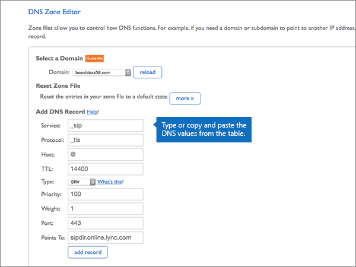

# DNS-records bij Bluehost maken voor Microsoft

 **[Raadpleeg de veelgestelde vragen over domeinen](../setup/domains-faq.md)** als u niet kunt vinden wat u zoekt. 
  
Als Bluehost uw DNS-hostingprovider is, voert u de stappen in dit artikel uit om uw domein te verifiëren en DNS-records voor e-mail, Skype voor Bedrijven Online enzovoort in te stellen.
  
Nadat u deze records bij Bluehost hebt toegevoegd, is uw domein ingesteld voor gebruik met Microsoft-services.

> [!NOTE]
> Het duurt meestal ongeveer 15 minuten voordat DNS-wijzigingen van kracht worden. Het kan echter soms wat langer duren voordat een wijziging die u hebt aangebracht, is bijgewerkt via het DNS-systeem op internet. Als u na het toevoegen van DNS-records problemen hebt met het ontvangen of verzenden van e-mail, raadpleegt u [Problemen opsporen en oplossen nadat u uw domein of DNS-records hebt toegevoegd](../get-help-with-domains/find-and-fix-issues.md). 
  
## Een TXT-record toevoegen voor verificatie

Voordat u uw domein met Microsoft kunt gebruiken, moet worden gecontroleerd dat u de eigenaar bent van het domein. Als u zich bij uw account bij de domeinregistrar kunt aanmelden en de DNS-record kunt maken, is dit voor Microsoft bewezen.
  
> [!NOTE]
> Deze record wordt alleen gebruikt om te verifiëren dat u de eigenaar van uw domein bent. Dit heeft verder geen invloed. U kunt deze record later desgewenst verwijderen. 
  
1. Ga eerst naar de pagina met domeinen bij Bluehost via [deze koppeling](https://my.bluehost.com/cgi/dm). U wordt gevraagd u eerst aan te melden.
    
2. Op de pagina **Domains**, in het gebied **domain**, zoekt u de rij voor het domein dat u wilt wijzigen, en schakelt u vervolgens het selectievakje in voor dat domein. 
    
    (Mogelijk moet u omlaag schuiven.)
    
3. Selecteer in het ** _domain_name_*gebied Domain_Name _, op de rij _* DNS-zone editor, de** optie **Manage DNS records**.
    
4. Typ of kopieer en plak de waarden uit de volgende tabel in het gebied **Add DNS Record** in de vakken voor de nieuwe record op de pagina **DNS Zone Editor**. 
    
    (Kies in de vervolgkeuzelijst de waarde **Type**). 
    
    |||||
    |:-----|:-----|:-----|:-----|
    |**Host Record**   |**TTL**   |**Type**   |**TXT Value**   |
    |@    |14400    |TXT    |MS=ms *XXXXXXXX*    **Opmerking:** Dit is een voorbeeld. Gebruik hier de specifieke waarde voor **Doel of adres waarnaar wordt verwezen** uit de tabel. [Hoe kan ik dit vinden?](../get-help-with-domains/information-for-dns-records.md)          |
   
5. Selecteer **record toevoegen**.
    
6. Wacht enkele minuten voordat u verder gaat, zodat de record die u zojuist hebt gemaakt via internet kan worden bijgewerkt.
    
Nu u de record hebt toegevoegd aan de site van uw domeinregistratie, gaat u terug naar Microsoft en vraagt u naar de record.
  
Wanneer in Microsoft de juiste TXT-record is gevonden, is uw domein gecontroleerd.
  
1. Ga in het Microsoft-beheercentrum naar **Instellingen** \> <a href="https://go.microsoft.com/fwlink/p/?linkid=834818" target="_blank">Domeinen</a>-pagina.

    
2. Kies op de pagina **Domeinen** de naam van het domein dat u verifieert. 
    
3. Kies **Start setup** op de pagina **Setup**.
    
4. Kies **Verifiëren** op de pagina **Domein verifiëren**.
    
> [!NOTE]
> Het duurt meestal ongeveer 15 minuten voordat DNS-wijzigingen van kracht worden. Het kan echter soms wat langer duren voordat een wijziging die u hebt aangebracht, is bijgewerkt via het DNS-systeem op internet. Als u na het toevoegen van DNS-records problemen hebt met het ontvangen of verzenden van e-mail, raadpleegt u [Problemen opsporen en oplossen nadat u uw domein of DNS-records hebt toegevoegd](../get-help-with-domains/find-and-fix-issues.md). 
  
## Voeg een MX-record toe zodat e-mail voor uw domein naar Microsoft wordt verzonden

1. Ga eerst naar de pagina met domeinen bij Bluehost via [deze koppeling](https://my.bluehost.com/cgi/dm). U wordt gevraagd u eerst aan te melden.
    
2. Op de pagina **Domains**, in het gebied **domain**, zoekt u de rij voor het domein dat u wilt wijzigen, en schakelt u vervolgens het selectievakje in voor dat domein. 
    
    (Mogelijk moet u omlaag schuiven.)
    
3. Selecteer in het ** _domain_name_*gebied Domain_Name _, op de rij _* DNS-zone editor, de** optie **Manage DNS records**.
    
4. Typ of kopieer en plak de waarden uit de volgende tabel in het gebied **Add DNS Record** in de vakken voor de nieuwe record op de pagina **DNS Zone Editor**. 
    
    (Kies in de vervolgkeuzelijst de waarde **Type**). 
    
    |**Host Record**|**TTL**|**Type**|**Points To**|**Priority**|
    |:-----|:-----|:-----|:-----|:-----|
    |@    |14400    |MX    | *\<domain-key\>*  .mail.protection.outlook.com   **Opmerking:** Haal uw \<*domain-key*\> uit uw Microsoft-account. [Hoe kan ik dit vinden?](../get-help-with-domains/information-for-dns-records.md)          |0    Zie [Wat is MX-prioriteit?](https://docs.microsoft.com/microsoft-365/admin/setup/domains-faq) voor meer informatie over prioriteit.   |
   
   
  
5. Selecteer **record toevoegen**.
    
    
  
6. Als het gedeelte **MX (Mail Exchanger)** andere MX-records bevat, verwijdert u deze. 
    
    Selecteer Delete voor een van de andere MX-records **.**
    
    
  
7. Selecteer **OK**in het bevestigingsvenster.
    
    
  
8. Verwijder op dezelfde manier alle andere MX-records die al worden vermeld.
    
## De zes CNAME-records toevoegen die vereist zijn voor Microsoft

1. Ga eerst naar de pagina met domeinen bij Bluehost via [deze koppeling](https://my.bluehost.com/cgi/dm). U wordt gevraagd u eerst aan te melden.
    
2. Op de pagina **Domains**, in het gebied **domain**, zoekt u de rij voor het domein dat u wilt wijzigen, en schakelt u vervolgens het selectievakje in voor dat domein. 
    
    (Mogelijk moet u omlaag schuiven.)
    
3. Selecteer in het ** _domain_name_*gebied Domain_Name _, op de rij _* DNS-zone editor, de** optie **Manage DNS records**.
    
4. Zoek in de sectie **A (host)** de rij voor de **Autodiscover** -record en selecteer **verwijderen** voor die rij. 
    
    > [!IMPORTANT]
    > U moet de bestaande record *voor* automatisch **opsporen** verwijderen voordat **u de record** voor automatisch opsporen toevoegt die voor Microsoft is vereist. U kunt in Bluehost geen twee **autodiscover** -records tegelijk behouden. 
  
    
  
5. Selecteer **OK**.
    
    
  
6. Maak de eerste van de zes CNAME-records.
    
    Typ of kopieer en plak de waarden uit de eerste rij van de volgende tabel in het gebied **Add DNS Record** in de vakken voor de nieuwe record op de pagina **DNS Zone Editor**. 
    
    (Kies in de vervolgkeuzelijst de waarde **Type**). 
    
    |**Host Record**|**TTL**|**Type**|**Points To**|
    |:-----|:-----|:-----|:-----|
    |autodiscover    |14400    |CNAME    |autodiscover.outlook.com    |
    |sip    |14400    |CNAME    |sipdir.online.lync.com    |
    |lyncdiscover    |14400    |CNAME    |webdir.online.lync.com    |
    |enterpriseregistration    |14400    |CNAME    |enterpriseregistration.windows.net    |
    |enterpriseenrollment    |14400    |CNAME    |enterpriseenrollment-s.manage.microsoft.com    |
   
    
  
7. Selecteer **record toevoegen**.
    
    
  
8. Voeg als volgt de andere vijf CNAME-records toe:
    
    Maak in de sectie **Add DNS record** een record met behulp van de waarden uit de volgende rij van de tabel en selecteer vervolgens opnieuw **add record** om deze record te voltooien. 
    
    Herhaal deze procedure totdat u alle zes CNAME-records hebt gemaakt.
    
## Een TXT-record voor SPF toevoegen om spam tegen te gaan

> [!IMPORTANT]
> U kunt maximaal 1 TXT-record hebben voor SPF voor een domein. Als uw domein meer dan één SPF-record heeft, kan dit resulteren in e-mailfouten, evenals leverings- en spamclassificatieproblemen. Als u al een SPF-record voor uw domein hebt, hoeft u geen nieuwe te maken voor Microsoft. In plaats daarvan voegt u de vereiste Microsoft-waarden toe aan de huidige record, zodat u  *één*  SPF-record hebt die beide sets met waarden bevat. Hebt u voorbeelden nodig? Bekijk deze [Externe Domain Name System-records voor Microsoft](https://docs.microsoft.com/microsoft-365/enterprise/external-domain-name-system-records). Voor het valideren van uw SPF-record gebruikt u een van deze[SPF-validatie hulpmiddelen](../setup/domains-faq.md). 
  
1. Ga eerst naar de pagina met domeinen bij Bluehost via [deze koppeling](https://my.bluehost.com/cgi/dm). U wordt gevraagd u eerst aan te melden.
    
2. Op de pagina **Domains**, in het gebied **domain**, zoekt u de rij voor het domein dat u wilt wijzigen, en schakelt u vervolgens het selectievakje in voor dat domein. 
    
    (Mogelijk moet u omlaag schuiven.)
    
3. Selecteer in het ** _domain_name_*gebied Domain_Name _, op de rij _* DNS-zone editor, de** optie **Manage DNS records**.
    
4. Typ of kopieer en plak de waarden uit de volgende tabel in het gebied **Add DNS Record** in de vakken voor de nieuwe record op de pagina **DNS Zone Editor**. 
    
    (Kies in de vervolgkeuzelijst de waarde **Type**). 
        
    |**Host Record**|**TTL**|**Type**|**TXT Value**|
    |:-----|:-----|:-----|:-----|
    |@    |14400    |TXT    |v=spf1 include:spf.protection.outlook.com -all   **Opmerking:** het is raadzaam dit item te kopiëren en te plakken, zodat het spatiegebruik ongewijzigd blijft.           |
   
    
  
5. Selecteer **record toevoegen**.
    
    
  
## De twee SRV-records toevoegen die zijn vereist voor Microsoft

1. Ga eerst naar de pagina met domeinen bij Bluehost via [deze koppeling](https://my.bluehost.com/cgi/dm). U wordt gevraagd u eerst aan te melden.
    
2. Op de pagina **Domains**, in het gebied **domain**, zoekt u de rij voor het domein dat u wilt wijzigen, en schakelt u vervolgens het selectievakje in voor dat domein. 
    
    (Mogelijk moet u omlaag schuiven.)
    
3. Selecteer in het ** _domain_name_*gebied Domain_Name _, op de rij _* DNS-zone editor, de** optie **Manage DNS records**.
    
4. Maak als volgt de eerste van de twee SRV-records.
    
    Typ of kopieer en plak de waarden uit de eerste rij van de volgende tabel in het gebied **Add DNS Record** in de vakken voor de nieuwe record op de pagina **DNS Zone Editor**. 
    
    (Kies in de vervolgkeuzelijst de waarde **Type**). 
    
    |**Service**|**Protocol**|**Host**|**TTL**|**Type**|**Prioriteit**|**Gewicht**|**Poort**|**Points To**|
    |:-----|:-----|:-----|:-----|:-----|:-----|:-----|:-----|:-----|
    |_sip    |_tls    |@    |14400    |SRV    |100    |1    |443    |sipdir.online.lync.com    |
    |_sipfederationtls    |_tcp    |@    |14400    |SRV    |100    |1    |5061    |sipfed.online.lync.com    |
   
    
  
5. Selecteer **record toevoegen**.
    
    
  
6. Voeg de andere SRV-record toe.
    
    Maak in de sectie **Add DNS record** een record met behulp van de waarden uit de andere rij in de tabel en selecteer vervolgens opnieuw **add record** om deze record te voltooien. 
    
> [!NOTE]
> Het duurt meestal ongeveer 15 minuten voordat DNS-wijzigingen van kracht worden. Het kan echter soms wat langer duren voordat een wijziging die u hebt aangebracht, is bijgewerkt via het DNS-systeem op internet. Als u na het toevoegen van DNS-records problemen hebt met het ontvangen of verzenden van e-mail, raadpleegt u [Problemen opsporen en oplossen nadat u uw domein of DNS-records hebt toegevoegd](../get-help-with-domains/find-and-fix-issues.md). 
  

