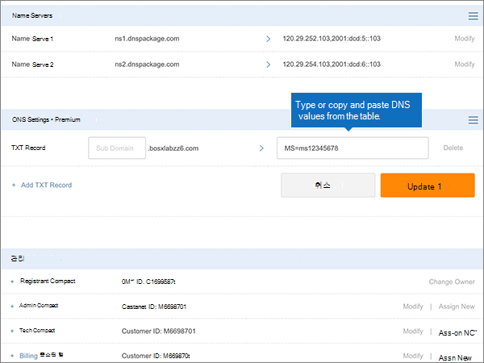
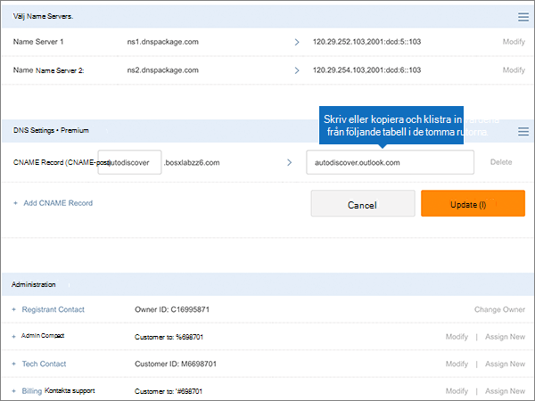
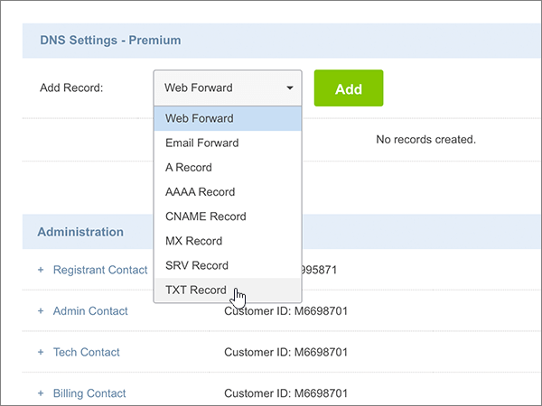
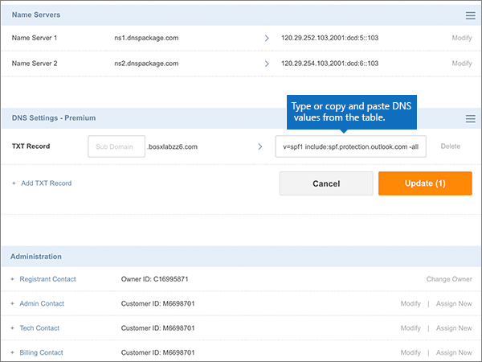

# DNS-records bij Crazy domains maken voor MicrosoftCreate DNS records at Crazy Domains for Microsoft

 **[Raadpleeg de veelgestelde vragen over domeinen](../setup/domains-faq.yml)** als u niet kunt vinden wat u zoekt.**[Check the Domains FAQ](../setup/domains-faq.yml)** if you don't find what you're looking for. 
  
Als Crazy Domains uw DNS-hostingprovider is, voert u de stappen in dit artikel uit om uw domein te verifiëren en DNS-records voor e-mail, Skype voor Bedrijven Online, enzovoort in te stellen.If Crazy Domains is your DNS hosting provider, follow the steps in this article to verify your domain and set up DNS records for email, Skype for Business Online, and so on.
  
Nadat u deze records bij Crazy domains hebt toegevoegd, is uw domein ingesteld voor gebruik met Microsoft-services.After you add these records at Crazy Domains, your domain will be set up to work with Microsoft services.
  

  
> [!NOTE]
> Het duurt gewoonlijk ongeveer 15 minuten voordat DNS-wijzigingen van kracht worden. Het kan echter soms wat langer duren voordat een wijziging die u hebt aangebracht, is bijgewerkt via het DNS-systeem op internet. Als u na het toevoegen van de DNS-records problemen hebt met het ontvangen of verzenden van e-mail, raadpleegt u [Problemen oplossen nadat u uw domeinnaam of DNS-records hebt gewijzigd](../get-help-with-domains/find-and-fix-issues.md).Typically it takes about 15 minutes for DNS changes to take effect. However, it can occasionally take longer for a change you've made to update across the Internet's DNS system. If you're having trouble with mail flow or other issues after adding DNS records, see [Troubleshoot issues after changing your domain name or DNS records](../get-help-with-domains/find-and-fix-issues.md). 
  
## Een TXT-record toevoegen voor verificatieAdd a TXT record for verification

Voordat u uw domein met Microsoft kunt gebruiken, moet worden gecontroleerd dat u de eigenaar bent van het domein. Als u zich bij uw account bij de domeinregistrar kunt aanmelden en de DNS-record kunt maken, is dit voor Microsoft bewezen.Before you use your domain with Microsoft, we have to make sure that you own it. Your ability to log in to your account at your domain registrar and create the DNS record proves to Microsoft that you own the domain.
  
> [!NOTE]
> Deze record wordt alleen gebruikt om te verifiëren dat u de eigenaar van uw domein bent. Dit heeft verder geen invloed. U kunt deze record later desgewenst verwijderen.This record is used only to verify that you own your domain; it doesn't affect anything else. You can delete it later, if you like. 
  
1. Ga eerst naar de pagina met domeinen bij Crazy Domains via [deze koppeling](https://manage.crazydomains.com/members/domains/). U wordt gevraagd u eerst aan te melden.To get started, go to your domains page at Crazy Domains by using [this link](https://manage.crazydomains.com/members/domains/). You'll be prompted to log in first.
    
    
  
2. Selecteer in de sectie **My account** de optie **Domains**.In the **My Account** section, select **Domains**.
    
    
  
3. Selecteer op de pagina **Domain names** in het gedeelte **Domain** de naam van het domein dat u wilt bijwerken.On the **Domain Names** page, in the **Domain** section, select the name of the domain that you are updating. 
    
    
  
4. Selecteer in de sectie **DNS Settings** het pictogram van de vervolgkeuzelijst.In the **DNS Settings** section, select the drop-down list icon. 
    
    
  
5. Selecteer **Record toevoegen**.Select **Add Record**.
    
    
  
6. Kies **TXT Record** in de vervolgkeuzelijst **Add Record**.Choose **TXT Record** from the **Add Record** drop-down list. 
    
    
  
7. Kies **Toevoegen**.Select **Add**.
    
    
  
8. Typ of kopieer en plak de waarden uit de volgende tabel in de vakken voor de nieuwe record.In the boxes for the new record, type or copy and paste the values from the following table.
    
    |**Sub Domain****Sub Domain**|**Text Record****Text Record**|
    |:-----|:-----|
    |(Laat dit veld leeg.)(Leave this field empty.)    |MS=ms *XXXXXXXX*MS=ms *XXXXXXXX*    **Opmerking:** Dit is een voorbeeld.**Note:** This is an example. Gebruik hier de specifieke waarde voor **Doel of adres waarnaar wordt verwezen** uit de tabel.Use your specific **Destination or Points to Address** value here, from the table.           [Hoe kan ik dit vinden?How do I find this?](../get-help-with-domains/information-for-dns-records.md)          |
   
    
  
9. Selecteer **bijwerken**.Select **Update**.
    
    
  
10. Wacht enkele minuten voordat u verder gaat, zodat de record die u zojuist hebt gemaakt via internet kan worden bijgewerkt.Wait a few minutes before you continue, so that the record you just created can update across the Internet.
    
Nu u de record hebt toegevoegd aan de site van uw domeinregistrar, gaat u terug naar Microsoft en vraagt u de record aan.Now that you've added the record at your domain registrar's site, you'll go back to Microsoft and request the record.
  
Wanneer in Microsoft de juiste TXT-record is gevonden, is uw domein gecontroleerd.When Microsoft finds the correct TXT record, your domain is verified.
  
1. Ga in het Microsoft-beheercentrum naar **Instellingen** \> <a href="https://go.microsoft.com/fwlink/p/?linkid=834818" target="_blank">Domeinen</a>-pagina.In the Microsoft admin center, go to the **Settings** \> <a href="https://go.microsoft.com/fwlink/p/?linkid=834818" target="_blank">Domains</a> page.

    
2. Kies op de pagina **Domeinen** de naam van het domein dat u verifieert.On the **Domains** page, select the domain that you are verifying. 
    
    
  
3. Kies **Start setup** op de pagina **Setup**.On the **Setup** page, select **Start setup**.
    
    
  
4. Kies **Verifiëren** op de pagina **Domein verifiëren**.On the **Verify domain** page, select **Verify**.
    
    
  
> [!NOTE]
>  Het duurt gewoonlijk ongeveer 15 minuten voordat DNS-wijzigingen van kracht worden. Het kan echter soms wat langer duren voordat een wijziging die u hebt aangebracht, is bijgewerkt via het DNS-systeem op internet. Als u na het toevoegen van de DNS-records problemen hebt met het ontvangen of verzenden van e-mail, raadpleegt u [Problemen oplossen nadat u uw domeinnaam of DNS-records hebt gewijzigd](../get-help-with-domains/find-and-fix-issues.md).Typically it takes about 15 minutes for DNS changes to take effect. However, it can occasionally take longer for a change you've made to update across the Internet's DNS system. If you're having trouble with mail flow or other issues after adding DNS records, see [Troubleshoot issues after changing your domain name or DNS records](../get-help-with-domains/find-and-fix-issues.md). 
  
## Voeg een MX-record toe zodat e-mail voor uw domein naar Microsoft wordt verzondenAdd an MX record so email for your domain will come to Microsoft

1. Ga eerst naar de pagina met domeinen bij Crazy Domains via [deze koppeling](https://manage.crazydomains.com/members/domains/). U wordt gevraagd u eerst aan te melden.To get started, go to your domains page at Crazy Domains by using [this link](https://manage.crazydomains.com/members/domains/). You'll be prompted to log in first.
    
    
  
2. Selecteer in de sectie **My account** de optie **Domains**.In the **My Account** section, select **Domains**.
    
    
  
3. Selecteer op de pagina **Domain names** in het gedeelte **Domain** de naam van het domein dat u wilt bijwerken.On the **Domain Names** page, in the **Domain** section, select the name of the domain that you are updating. 
    
    
  
4. Selecteer in de sectie **DNS Settings** het pictogram van de vervolgkeuzelijst.In the **DNS Settings** section, select the drop-down list icon. 
    
    
  
5. Selecteer **Record toevoegen**.Select **Add Record**.
    
    
  
6. Kies **TXT Record** uit de vervolgkeuzelijst **Add Record**.Choose **MX Record** from the **Add Record:** drop-down list. 
    
    
  
7. Kies **Toevoegen**.Select **Add**.
    
    
  
8. Typ of kopieer en plak de waarden uit de volgende tabel in de vakken voor de nieuwe record.In the boxes for the new record, type or copy and paste the values from the following table.
    
    (Kies in de vervolgkeuzelijst de waarde **Priority** .)(Choose the **Priority** value from the drop-down list.) 
    
    |**Mail For Zone****Mail For Zone**|**Priority****Priority**|**Assigned To Server****Assigned To Server**|
    |:-----|:-----|:-----|
    |(Laat dit veld leeg.)(Leave this field empty.)    |11    Zie [Wat is MX-prioriteit?](https://docs.microsoft.com/microsoft-365/admin/setup/domains-faq) voor meer informatie over prioriteit.For more information about priority, see [What is MX priority?](https://docs.microsoft.com/microsoft-365/admin/setup/domains-faq)   | *\<domain-key\>*  .mail.protection.outlook.com*\<domain-key\>*  .mail.protection.outlook.com    **Opmerking:** Neem uw  *\<domain-key\>*  van uw Microsoft-account.**Note:** Get your  *\<domain-key\>*  from your Microsoft account.           [Hoe kan ik dit vinden?How do I find this?](../get-help-with-domains/information-for-dns-records.md)          |
       
   
  
9. Selecteer **bijwerken**.Select **Update**.
    
    
  
10. Als er andere MX-records worden vermeld in de sectie **MX record** , selecteert u **Modify** voor een van die records.If there are any other MX records listed in the **MX Record** section, select **Modify** for one of those records. 
    
    
  
11. Selecteer **verwijderen**.Select **Delete**.
    
    
  
12. Selecteer **bijwerken** om het verwijderen te bevestigen.Select **Update** to confirm the deletion. 
    
    
  
13. Verwijder op dezelfde manier alle andere MX-records in de lijst, met uitzondering van de MX-record die u eerder met deze procedure hebt toegevoegd.Use the same process to remove any other MX records in the list, until only the one that you added earlier in this procedure remains.
    
## De zes CNAME-records toevoegen die vereist zijn voor MicrosoftAdd the six CNAME records that are required for Microsoft

1. Ga eerst naar de pagina met domeinen bij Crazy Domains via [deze koppeling](https://manage.crazydomains.com/members/domains/). U wordt gevraagd u eerst aan te melden.To get started, go to your domains page at Crazy Domains by using [this link](https://manage.crazydomains.com/members/domains/). You'll be prompted to log in first.
    
    
  
2. Selecteer in de sectie **My account** de optie **Domains**.In the **My Account** section, select **Domains**.
    
    
  
3. Selecteer op de pagina **Domain names** in het gedeelte **Domain** de naam van het domein dat u wilt bijwerken.On the **Domain Names** page, in the **Domain** section, select the name of the domain that you are updating. 
    
    
  
4. Selecteer in de sectie **DNS Settings** het pictogram van de vervolgkeuzelijst.In the **DNS Settings** section, select the drop-down list icon. 
    
    
  
5. Selecteer **Record toevoegen**.Select **Add Record**.
    
    
  
6. Kies **CNAME Record** uit de vervolgkeuzelijst **Add Record**.Choose **CNAME Record** from the **Add Record:** drop-down list. 
    
    
  
7. Kies **Toevoegen**.Select **Add**.
    
    
  
8. Voeg de eerste van de zes CNAME-records toe.Add the first of the six CNAME records.
    
    Typ of kopieer en plak de waarden uit de eerste rij in de volgende tabel in de velden voor de nieuwe record.In the boxes for the new record, type or copy and paste the values from the first row of the following table.
    
    |**Sub Domain****Sub Domain**|**Alias for****Alias for**|
    |:-----|:-----|
    |autodiscoverautodiscover    |autodiscover.outlook.comautodiscover.outlook.com    |
    |sipsip    |sipdir.online.lync.comsipdir.online.lync.com    |
    |lyncdiscoverlyncdiscover    |webdir.online.lync.comwebdir.online.lync.com    |
    |enterpriseregistrationenterpriseregistration    |enterpriseregistration.windows.netenterpriseregistration.windows.net    |
    |enterpriseenrollmententerpriseenrollment    |enterpriseenrollment-s.manage.microsoft.comenterpriseenrollment-s.manage.microsoft.com    |
   
    
  
9. Selecteer **Add CNAME record**.Select **Add CNAME Record**.
    
    
  
10. Voeg de tweede CNAME-record toe:Add the second CNAME record.
    
    Gebruik de waarden uit de volgende rij van de tabel in de vakken voor de nieuwe record en selecteer vervolgens opnieuw **Add CNAME record**.In the boxes for the new record, use the values from the next row in the table, and then again select **Add CNAME Record**.
    
    Herhaal deze procedure totdat u alle zes CNAME-records hebt gemaakt.Repeat this process until you have created all six CNAME records.
    
11. Selecteer **bijwerken** om de wijzigingen op te slaan.Select **Update** to save your changes. 
    
    
  
## Een TXT-record voor SPF toevoegen om spam tegen te gaanAdd a TXT record for SPF to help prevent email spam

> [!IMPORTANT]
> U kunt maximaal 1 TXT-record hebben voor SPF voor een domein.You cannot have more than one TXT record for SPF for a domain. Als uw domein meer dan één SPF-record heeft, kan dit resulteren in e-mailfouten, evenals leverings- en spamclassificatieproblemen.If your domain has more than one SPF record, you'll get email errors, as well as delivery and spam classification issues. Als u al een SPF-record voor uw domein hebt, hoeft u geen nieuwe te maken voor Microsoft.If you already have an SPF record for your domain, don't create a new one for Microsoft. In plaats daarvan voegt u de vereiste Microsoft-waarden toe aan de huidige record, zodat u  *één*  SPF-record hebt die beide sets met waarden bevat.Instead, add the required Microsoft values to the current record so that you have a  *single*  SPF record that includes both sets of values. 
  
1. Ga eerst naar de pagina met domeinen bij Crazy Domains via [deze koppeling](https://manage.crazydomains.com/members/domains/). U wordt gevraagd u eerst aan te melden.To get started, go to your domains page at Crazy Domains by using [this link](https://manage.crazydomains.com/members/domains/). You'll be prompted to log in first.
    
    
  
2. Selecteer in de sectie **My account** de optie **Domains**.In the **My Account** section, select **Domains**.
    
    
  
3. Selecteer op de pagina **Domain names** in het gedeelte **Domain** de naam van het domein dat u wilt bijwerken.On the **Domain Names** page, in the **Domain** section, select the name of the domain that you are updating. 
    
    
  
4. Selecteer in de sectie **DNS Settings** het pictogram van de vervolgkeuzelijst.In the **DNS Settings** section, select the drop-down list icon. 
    
    
  
5. Selecteer **Record toevoegen**.Select **Add Record**.
    
    
  
6. Kies **TXT Record** uit de vervolgkeuzelijst **Add Record**.Choose **TXT Record** from the **Add Record:** drop-down list. 
    
    
  
7. Kies **Toevoegen**.Select **Add**.
    
    
  
8. Typ of kopieer en plak de waarden uit de volgende tabel in de vakken voor de nieuwe record.In the boxes for the new record, type or paste the values from the following table.
    
    |**Sub Domain****Sub Domain**|**Text Record****Text Record**|
    |:-----|:-----|
    |(Laat dit veld leeg.)(Leave this field empty.)    |v=spf1 include:spf.protection.outlook.com -allv=spf1 include:spf.protection.outlook.com -all    **Opmerking:** het is raadzaam dit item te kopiëren en te plakken, zodat het spatiegebruik ongewijzigd blijft.**Note:** We recommend copying and pasting this entry, so that all of the spacing stays correct.           |
   
    
  
9. Selecteer **bijwerken**.Select **Update**.
    
    
  
## De twee SRV-records toevoegen die zijn vereist voor MicrosoftAdd the two SRV records that are required for Microsoft

1. Ga eerst naar de pagina met domeinen bij Crazy Domains via [deze koppeling](https://manage.crazydomains.com/members/domains/). U wordt gevraagd u eerst aan te melden.To get started, go to your domains page at Crazy Domains by using [this link](https://manage.crazydomains.com/members/domains/). You'll be prompted to log in first.
    
    
  
2. Selecteer in de sectie **My account** de optie **Domains**.In the **My Account** section, select **Domains**.
    
    
  
3. Selecteer op de pagina **Domain names** in het gedeelte **Domain** de naam van het domein dat u wilt bijwerken.On the **Domain Names** page, in the **Domain** section, select the name of the domain that you are updating. 
    
    
  
4. Selecteer in de sectie **DNS Settings** het pictogram van de vervolgkeuzelijst.In the **DNS Settings** section, select the drop-down list icon. 
    
    
  
5. Selecteer **Record toevoegen**.Select **Add Record**.
    
    
  
6. Kies **SRV Record** uit de vervolgkeuzelijst **Add Record**.Choose **SRV Record** from the **Add Record:** drop-down list. 
    
    
  
7. Kies **Toevoegen**.Select **Add**.
    
    
  
8. Voeg de eerste van de twee SRV-records toe.Add the first of the two SRV records.
    
    Typ of kopieer en plak de waarden uit de eerste rij in de volgende tabel in de velden voor de nieuwe record.In the boxes for the new record, type or copy and paste the values from the first row of the following table.
    
    |**Record Type****Record Type**|**Sub Domain****Sub Domain**|**Prioriteit****Priority**|**Gewicht****Weight**|**Poort****Port**|**Target****Target**|
    |:-----|:-----|:-----|:-----|:-----|:-----|
    |SRV RecordSRV Record    |_sip _sip._tls_sip._tls    |100100    |11    |443443    |sipdir.online.lync.comsipdir.online.lync.com    |
    |SRV RecordSRV Record    |_sipfederationtls _sipfederationtls._tcp_sipfederationtls._tcp    |100100    |11    |50615061    |sipfed.online.lync.comsipfed.online.lync.com    |
   
    
  
9. Selecteer **SRV-record toevoegen**.Select **Add SRV Record**.
    
    
  
10. Voeg de andere SRV-record toe.Add the other SRV record.
    
    Voeg in de vakken voor de nieuwe record de waarden uit de tweede rij in de tabel toe.In the boxes for the new record, use the values from the second row in the table.
    
11. Selecteer **bijwerken** om de wijzigingen op te slaan.Select **Update** to save your changes. 
    
    
  
> [!NOTE]
> Het duurt gewoonlijk ongeveer 15 minuten voordat DNS-wijzigingen van kracht worden. Het kan echter soms wat langer duren voordat een wijziging die u hebt aangebracht, is bijgewerkt via het DNS-systeem op internet. Als u na het toevoegen van de DNS-records problemen hebt met het ontvangen of verzenden van e-mail, raadpleegt u [Problemen oplossen nadat u uw domeinnaam of DNS-records hebt gewijzigd](../get-help-with-domains/find-and-fix-issues.md).Typically it takes about 15 minutes for DNS changes to take effect. However, it can occasionally take longer for a change you've made to update across the Internet's DNS system. If you're having trouble with mail flow or other issues after adding DNS records, see [Troubleshoot issues after changing your domain name or DNS records](../get-help-with-domains/find-and-fix-issues.md). 
  
