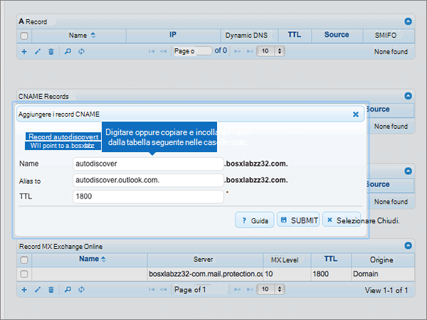
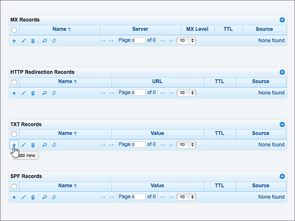

# DNS-records bij DNSMadeEasy maken voor MicrosoftCreate DNS records at DNSMadeEasy for Microsoft

 **[Raadpleeg de veelgestelde vragen over domeinen](../setup/domains-faq.md)** als u niet kunt vinden wat u zoekt.**[Check the Domains FAQ](../setup/domains-faq.md)** if you don't find what you're looking for. 
  
Als DNSMadeEasy uw DNS-hostingprovider is, voert u de stappen in dit artikel uit om uw domein te verifiëren en DNS-records voor e-mail, Skype voor Bedrijven Online enzovoort in te stellen.If DNSMadeEasy is your DNS hosting provider, follow the steps in this article to verify your domain and set up DNS records for email, Skype for Business Online, and so on.
  
Nadat u deze records bij DNSMadeEasy hebt toegevoegd, is uw domein ingesteld voor gebruik met Microsoft-services.After you add these records at DNSMadeEasy, your domain will be set up to work with Microsoft services.
  

  
> [!NOTE]
> Het duurt meestal ongeveer 15 minuten voordat DNS-wijzigingen van kracht worden. Het kan echter soms wat langer duren voordat een wijziging die u hebt aangebracht, is bijgewerkt via het DNS-systeem op internet. Als u na het toevoegen van DNS-records problemen hebt met het ontvangen of verzenden van e-mail, raadpleegt u [Problemen opsporen en oplossen nadat u uw domein of DNS-records hebt toegevoegd](../get-help-with-domains/find-and-fix-issues.md).Typically it takes about 15 minutes for DNS changes to take effect. However, it can occasionally take longer for a change you've made to update across the Internet's DNS system. If you're having trouble with mail flow or other issues after adding DNS records, see [Find and fix issues after adding your domain or DNS records](../get-help-with-domains/find-and-fix-issues.md). 
  
## Een TXT-record toevoegen voor verificatieAdd a TXT record for verification

Voordat u uw domein met Microsoft kunt gebruiken, moet worden gecontroleerd dat u de eigenaar bent van het domein. Als u zich bij uw account bij de domeinregistrar kunt aanmelden en de DNS-record kunt maken, is dit voor Microsoft bewezen.Before you use your domain with Microsoft, we have to make sure that you own it. Your ability to log in to your account at your domain registrar and create the DNS record proves to Microsoft that you own the domain.
  
> [!NOTE]
> Deze record wordt alleen gebruikt om te verifiëren dat u de eigenaar van uw domein bent. Dit heeft verder geen invloed. U kunt deze record later desgewenst verwijderen.This record is used only to verify that you own your domain; it doesn't affect anything else. You can delete it later, if you like. 
  
> [!IMPORTANT]
> Voor DNSMadeEasy-accounts is het domein dat u hebt toegevoegd, aangeschaft bij een afzonderlijke domeinregistratie.For DNSMadeEasy accounts, the domain you added was purchased from a separate domain registrar. DNSMadeEasy biedt geen Domain Registration Services.DNSMadeEasy does not offer domain registration services. De mogelijkheid om u aan te melden bij DNSMadeEasy en de DNS-record te maken, is voldoende bewijs van eigendom.Your ability to log in at DNSMadeEasy and create the DNS record is sufficient proof of ownership. 
  
1. Als u wilt beginnen, gaat u naar uw domeinenpagina bij DNSMadeEasy via [deze koppeling](https://cp.dnsmadeeasy.com/).To get started, go to your domains page at DNSMadeEasy by using [this link](https://cp.dnsmadeeasy.com/). U wordt gevraagd u eerst aan te melden.You'll be prompted to login first.
    
2. Selecteer het domein dat u wilt bijwerken in het gebied **Recently updated domains** op de pagina **Management Console** .On the **Management Console** page, in the **Recently Updated Domains** area, select the domain that you want to update. 
    
3. Selecteer op de pagina **Managed DNS** in het gebied **TXT records** het **+** besturingselement () ( **Add New**).On the **Managed DNS** page, in the **TXT Records** area, select the ( **+**) control ( **Add new**).
    
    (Mogelijk moet u omlaag schuiven.)(You may have to scroll down.)
    
4. Typ of kopieer en plak de waarden uit de volgende tabel in het gebied **Add TXT Records** in de vakken voor de nieuwe record.In the **Add TXT Records** area, in the boxes for the new record, type or copy and paste the values from the following table. 
    
    ||||
    |:-----|:-----|:-----|
    |**Naam****Name**   |**Waarde****Value**   |**TTL****TTL**   |
    |(Laat dit veld leeg.)(Leave this field empty.)    |MS=ms *XXXXXXXX*MS=ms *XXXXXXXX*    **Opmerking:** Dit is een voorbeeld.**Note:** This is an example. Gebruik hier de specifieke waarde voor **Doel of adres waarnaar wordt verwezen** uit de tabel.Use your specific **Destination or Points to Address** value here, from the table. [Hoe kan ik dit vinden?How do I find this?](../get-help-with-domains/information-for-dns-records.md)          |18001800    |
   
5. Selecteer **Submit**.Select **Submit**.
    
6. Wacht enkele minuten voordat u verder gaat, zodat de record die u zojuist hebt gemaakt via internet kan worden bijgewerkt.Wait a few minutes before you continue, so that the record you just created can update across the Internet.
    
Nu u de record hebt toegevoegd aan de site van uw domeinregistrar, gaat u terug naar Microsoft en vraagt u de record aan.Now that you've added the record at your domain registrar's site, you'll go back to Microsoft and request the record.
  
Wanneer in Microsoft de juiste TXT-record is gevonden, is uw domein gecontroleerd.When Microsoft finds the correct TXT record, your domain is verified.
  
1. Ga in het Microsoft-beheercentrum naar **Instellingen** \> <a href="https://go.microsoft.com/fwlink/p/?linkid=834818" target="_blank">Domeinen</a>-pagina.In the Microsoft admin center, go to the **Settings** \> <a href="https://go.microsoft.com/fwlink/p/?linkid=834818" target="_blank">Domains</a> page.

    
2. Kies op de pagina **Domeinen** de naam van het domein dat u verifieert.On the **Domains** page, select the domain that you are verifying. 
    
3. Kies **Start setup** op de pagina **Setup**.On the **Setup** page, select **Start setup**.
    
4. Kies **Verifiëren** op de pagina **Domein verifiëren**.On the **Verify domain** page, select **Verify**.
    
> [!NOTE]
> Het duurt meestal ongeveer 15 minuten voordat DNS-wijzigingen van kracht worden. Het kan echter soms wat langer duren voordat een wijziging die u hebt aangebracht, is bijgewerkt via het DNS-systeem op internet. Als u na het toevoegen van DNS-records problemen hebt met het ontvangen of verzenden van e-mail, raadpleegt u [Problemen opsporen en oplossen nadat u uw domein of DNS-records hebt toegevoegd](../get-help-with-domains/find-and-fix-issues.md).Typically it takes about 15 minutes for DNS changes to take effect. However, it can occasionally take longer for a change you've made to update across the Internet's DNS system. If you're having trouble with mail flow or other issues after adding DNS records, see [Find and fix issues after adding your domain or DNS records](../get-help-with-domains/find-and-fix-issues.md). 
  
## Voeg een MX-record toe zodat e-mail voor uw domein naar Microsoft wordt verzondenAdd an MX record so email for your domain will come to Microsoft

1. Als u wilt beginnen, gaat u naar uw domeinenpagina bij DNSMadeEasy via [deze koppeling](https://cp.dnsmadeeasy.com/). U wordt gevraagd u eerst aan te melden.To get started, go to your domains page at DNSMadeEasy by using [this link](https://cp.dnsmadeeasy.com/). You'll be prompted to login first.
    
2. Selecteer het domein dat u wilt bijwerken in het gebied **Recently updated domains** op de pagina **Management Console** .On the **Management Console** page, in the **Recently Updated Domains** area, select the domain that you want to update. 
    
    Selecteer het domein dat u wilt bijwerken in het gebied **Recently updated domains** op de pagina **Management Console** .On the **Management Console** page, in the **Recently Updated Domains** area, select the domain that you want to update. 
    
    
  
3. Selecteer op de pagina **Managed DNS** in het gebied **MX records** het besturingselement **(+)** ( **Add New**).On the **Managed DNS** page, in the **MX Records** area, select the **(+)** control ( **Add new**).
    
    (Mogelijk moet u omlaag schuiven.)(You may have to scroll down.)
    
    
  
4. Typ of kopieer en plak de waarden uit de volgende tabel in het gebied **Add MX Records** in de vakken voor de nieuwe record.In the **Add MX Records** area, in the boxes for the new record, type or copy and paste the values from the following table. 
    
    (Mogelijk moet u omlaag schuiven.)(You may have to scroll down.)
    
    |**Name****Name**|**Server****Server**|**MX Level****MX Level**|**TTL****TTL**|
    |:-----|:-----|:-----|:-----|
    |(Laat dit veld leeg.)(Leave this field empty.)    | *\<domain-key\>*  .mail.protection.outlook.com*\<domain-key\>*  .mail.protection.outlook.com    **Deze waarde MOET eindigen op een punt (.)****This value MUST end with a period (.)**   **Opmerking:** Haal uw \<*domain-key*\> uit uw Microsoft-account.**Note:** Get your \<*domain-key*\> from your Microsoft account. [Hoe kan ik dit vinden?How do I find this?](../get-help-with-domains/information-for-dns-records.md)          |1010    Zie [Wat is MX-prioriteit?](https://docs.microsoft.com/microsoft-365/admin/setup/domains-faq) voor meer informatie over prioriteit.   For more information about priority, see [What is MX priority?](https://docs.microsoft.com/microsoft-365/admin/setup/domains-faq)   |18001800    |
   
    
  
5. Selecteer **Submit**.Select **Submit**.
    
    
  
6. Als er andere MX-records zijn vermeld in de sectie **MX Records**, verwijdert u deze door elk record te selecteren.If there are any other MX records listed in the **MX Records** section, delete all of them by selecting each one. 
    
    
  
7. Wanneer alle records zijn geselecteerd, selecteert u **Delete selected**.When all records are selected, select **Delete selected**.
    
    
  
8. Selecteer in het dialoogvenster **MX-records verwijderen** de optie **verwijderen** om uw wijzigingen te bevestigen.In the **Delete MX Records** dialog box, select **Delete** to confirm your changes. 
    
    
  
## De vijf CNAME-records toevoegen die vereist zijn voor MicrosoftAdd the five CNAME records that are required for Microsoft

1. Als u wilt beginnen, gaat u naar uw domeinenpagina bij DNSMadeEasy via [deze koppeling](https://cp.dnsmadeeasy.com/). U wordt gevraagd u eerst aan te melden.To get started, go to your domains page at DNSMadeEasy by using [this link](https://cp.dnsmadeeasy.com/). You'll be prompted to login first.
    
2. Selecteer het domein dat u wilt bijwerken in het gebied **Recently updated domains** op de pagina **Management Console** .On the **Management Console** page, in the **Recently Updated Domains** area, select the domain that you want to update. 
    
3. Selecteer op de pagina **Managed DNS** in het gebied **CNAME records** het besturingselement **(+)** ( **Add New**).On the **Managed DNS** page, in the **CNAME Records** area, select the **(+)** control ( **Add new**).
    
    (Mogelijk moet u omlaag schuiven.)(You may have to scroll down.)
    
    
  
4. Voeg de eerste van de vijf CNAME-records toe.Add the first of the five CNAME records.
    
    Typ of kopieer en plak de waarden uit de eerste rij van de volgende tabel in het gebied **Add CNAME Records** in de vakken voor de nieuwe record.In the **Add CNAME Records** area, in the boxes for the new record, type or copy and paste the values from the first row in the following table. 
    
    |**Name****Name**|**Alias to****Alias to**|**TTL****TTL**|
    |:-----|:-----|:-----|
    |autodiscoverautodiscover    |autodiscover.outlook.com.autodiscover.outlook.com.    **Deze waarde MOET eindigen op een punt (.)****This value MUST end with a period (.)**   |18001800    |
    |sipsip    |sipdir.online.lync.com.sipdir.online.lync.com.    **Deze waarde MOET eindigen op een punt (.)****This value MUST end with a period (.)**   |18001800    |
    |lyncdiscoverlyncdiscover    |webdir.online.lync.com.webdir.online.lync.com.    **Deze waarde MOET eindigen op een punt (.)****This value MUST end with a period (.)**   |18001800    |
    |enterpriseregistrationenterpriseregistration    |enterpriseregistration.windows.net.enterpriseregistration.windows.net.    **Deze waarde MOET eindigen op een punt (.)****This value MUST end with a period (.)**   |18001800    |
    |enterpriseenrollmententerpriseenrollment    |enterpriseenrollment-s.manage.microsoft.com.enterpriseenrollment-s.manage.microsoft.com.    **Deze waarde MOET eindigen op een punt (.)****This value MUST end with a period (.)**   |18001800    |
   
    
  
5. Selecteer **Submit**.Select **Submit**.
    
    
  
6. Voeg de andere vier CNAME-records toe.Add each of the other four CNAME records.
    
    Selecteer in de sectie **CNAME records** het besturingselement **(+)** ( **Add New**), maak een record met behulp van de waarden uit de volgende rij in de tabel en selecteer vervolgens nogmaals **Submit** om het maken van die record af te ronden.In the **CNAME Records** section, select the **(+)** control ( **Add new**), create a record by using the values from the next row in the table, and then again select **Submit** to complete that record. 
    
    Herhaal deze procedure totdat u alle vijf CNAME-records hebt gemaakt.Repeat this process until you have created all five CNAME records.
    
## Een TXT-record voor SPF toevoegen om spam tegen te gaanAdd a TXT record for SPF to help prevent email spam

> [!IMPORTANT]
> U kunt maximaal 1 TXT-record hebben voor SPF voor een domein.You cannot have more than one TXT record for SPF for a domain. Als uw domein meer dan één SPF-record heeft, kan dit resulteren in e-mailfouten, evenals leverings- en spamclassificatieproblemen.If your domain has more than one SPF record, you'll get email errors, as well as delivery and spam classification issues. Als u al een SPF-record voor uw domein hebt, hoeft u geen nieuwe te maken voor Microsoft.If you already have an SPF record for your domain, don't create a new one for Microsoft. In plaats daarvan voegt u de vereiste Microsoft-waarden toe aan de huidige record, zodat u  *één*  SPF-record hebt die beide sets met waarden bevat.Instead, add the required Microsoft values to the current record so that you have a  *single*  SPF record that includes both sets of values. Hebt u voorbeelden nodig?Need examples? Bekijk deze [Externe Domain Name System-records voor Microsoft](https://docs.microsoft.com/microsoft-365/enterprise/external-domain-name-system-records).Check out these [External Domain Name System records for Microsoft](https://docs.microsoft.com/microsoft-365/enterprise/external-domain-name-system-records). Voor het valideren van uw SPF-record gebruikt u een van deze[SPF-validatie hulpmiddelen](../setup/domains-faq.md).To validate your SPF record, you can use one of these[SPF validation tools](../setup/domains-faq.md). 
  
1. Als u wilt beginnen, gaat u naar uw domeinenpagina bij DNSMadeEasy via [deze koppeling](https://cp.dnsmadeeasy.com/).To get started, go to your domains page at DNSMadeEasy by using [this link](https://cp.dnsmadeeasy.com/). U wordt gevraagd u eerst aan te melden.You'll be prompted to login first.
    
2. Selecteer het domein dat u wilt bijwerken in het gebied **Recently updated domains** op de pagina **Management Console** .On the **Management Console** page, in the **Recently Updated Domains** area, select the domain that you want to update. 
    
3. Selecteer op de pagina **Managed DNS** in het gebied **TXT records** het besturingselement **(+)** ( **Add New**).On the **Managed DNS** page, in the **TXT Records** area, select the **(+)** control ( **Add new**).
    
    (Mogelijk moet u omlaag schuiven.)(You may have to scroll down.)
    
    
  
4. Typ of kopieer en plak de waarden uit de volgende tabel in het gebied **Add TXT Records** in de vakken voor de nieuwe record.In the **Add TXT Records** area, in the boxes for the new record, type or copy and paste the values from the following table. 
    
    |**Naam****Name**|**Waarde****Value**|**TTL****TTL**|
    |:-----|:-----|:-----|
    |(Laat dit veld leeg.)(Leave this field empty.)    |v=spf1 include:spf.protection.outlook.com -allv=spf1 include:spf.protection.outlook.com -all    **Opmerking:** het is raadzaam dit item te kopiëren en te plakken, zodat het spatiegebruik ongewijzigd blijft.**Note:** We recommend copying and pasting this entry, so that all of the spacing stays correct.           |18001800    |
   
    
  
5. Selecteer **Submit**.Select **Submit**.
    
    
  
## De twee SRV-records toevoegen die zijn vereist voor MicrosoftAdd the two SRV records that are required for Microsoft

1. Als u wilt beginnen, gaat u naar uw domeinenpagina bij DNSMadeEasy via [deze koppeling](https://cp.dnsmadeeasy.com/). U wordt gevraagd u eerst aan te melden.To get started, go to your domains page at DNSMadeEasy by using [this link](https://cp.dnsmadeeasy.com/). You'll be prompted to login first.
    
2. Selecteer het domein dat u wilt bijwerken in het gebied **Recently updated domains** op de pagina **Management Console** .On the **Management Console** page, in the **Recently Updated Domains** area, select the domain that you want to update. 
    
3. Selecteer op de pagina **Managed DNS** in het gebied **SRV records** het besturingselement **(+)** ( **Add New**).On the **Managed DNS** page, in the **SRV Records** area, select the **(+)** control ( **Add new**).
    
    (Mogelijk moet u omlaag schuiven)(You may have to scroll down)
    
    
  
4. Voeg de eerste van de twee SRV-records toe.Add the first of the two SRV records.
    
    Typ of kopieer en plak de waarden uit de eerste rij van de volgende tabel in het gebied **Add SRV Records** in de vakken voor de nieuwe record.In the **Add SRV Records** area, in the boxes for the new record, type or copy and paste the values from the first row in the following table. 
    
    |**Name****Name**|**Prioriteit****Priority**|**Gewicht****Weight**|**Poort****Port**|**Host****Host**|**TTL****TTL**|
    |:-----|:-----|:-----|:-----|:-----|:-----|
    |_sip. _tls_sip._tls    |100100    |11    |443443    |sipdir.online.lync.com.sipdir.online.lync.com.    **Deze waarde MOET eindigen op een punt (.)****This value MUST end with a period (.)**   |18001800    |
    |_sipfederationtls. _tcp_sipfederationtls._tcp    |100100    |11    |50615061    |sipfed.online.lync.com.sipfed.online.lync.com.    **Deze waarde MOET eindigen op een punt (.)****This value MUST end with a period (.)**   |18001800    |
   
    
  
5. Selecteer **Submit**.Select **Submit**.
    
    
  
6. Voeg de andere SRV-record toe.Add the other SRV record.
    
    Selecteer in de sectie **SRV records** het besturingselement **(+)** ( **nieuwe toevoegen**), maak een record met behulp van de waarden uit de volgende rij in de tabel en selecteer vervolgens opnieuw **Submit** om het maken van die record af te ronden.In the **SRV Records** section, select the **(+)** control ( **Add new**), create a record by using the values from the next row in the table, and then again select **Submit** to complete that record. 
    
> [!NOTE]
> Het duurt meestal ongeveer 15 minuten voordat DNS-wijzigingen van kracht worden. Het kan echter soms wat langer duren voordat een wijziging die u hebt aangebracht, is bijgewerkt via het DNS-systeem op internet. Als u na het toevoegen van DNS-records problemen hebt met het ontvangen of verzenden van e-mail, raadpleegt u [Problemen opsporen en oplossen nadat u uw domein of DNS-records hebt toegevoegd](../get-help-with-domains/find-and-fix-issues.md).Typically it takes about 15 minutes for DNS changes to take effect. However, it can occasionally take longer for a change you've made to update across the Internet's DNS system. If you're having trouble with mail flow or other issues after adding DNS records, see [Find and fix issues after adding your domain or DNS records](../get-help-with-domains/find-and-fix-issues.md). 
  

