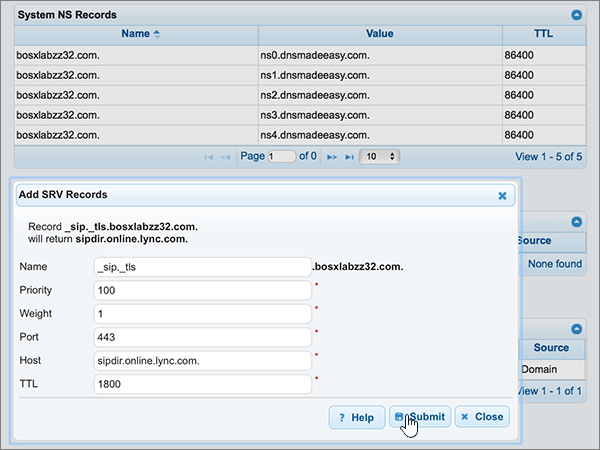

# DNS-records maken bij DNSMadeEasy voor MicrosoftCreate DNS records at DNSMadeEasy for Microsoft

 **[Raadpleeg de veelgestelde vragen over domeinen](../setup/domains-faq.md)** als u niet kunt vinden wat u zoekt.**[Check the Domains FAQ](../setup/domains-faq.md)** if you don't find what you're looking for. 
  
Als DNSMadeEasy uw DNS-hostingprovider is, voert u de stappen in dit artikel uit om uw domein te verifiëren en DNS-records voor e-mail, Skype voor Bedrijven Online enzovoort in te stellen.If DNSMadeEasy is your DNS hosting provider, follow the steps in this article to verify your domain and set up DNS records for email, Skype for Business Online, and so on.
  
Nadat u deze records hebt toegevoegd bij DNSMadeEasy, wordt uw domein ingesteld om te werken met Microsoft-services.After you add these records at DNSMadeEasy, your domain will be set up to work with Microsoft services.
  
Zie Een openbare website gebruiken met Microsoft voor meer informatie over webhosting en DNS voor websites met [Microsoft.](https://support.office.com/article/choose-a-public-website-3325d50e-d131-403c-a278-7f3296fe33a9)To learn about webhosting and DNS for websites with Microsoft, see [Use a public website with Microsoft](https://support.office.com/article/choose-a-public-website-3325d50e-d131-403c-a278-7f3296fe33a9).
  
> [!NOTE]
> Het duurt gewoonlijk ongeveer 15 minuten voordat DNS-wijzigingen van kracht worden.Typically it takes about 15 minutes for DNS changes to take effect. Het kan echter soms wat langer duren voordat een wijziging die u hebt aangebracht, is bijgewerkt via het DNS-systeem op internet.However, it can occasionally take longer for a change you've made to update across the Internet's DNS system. Zie Problemen zoeken en oplossen na het toevoegen van [uw domein- of DNS-records](../get-help-with-domains/find-and-fix-issues.md)als u problemen ondervindt met e-mailstroom of andere problemen na het toevoegen van DNS-records.If you're having trouble with mail flow or other issues after adding DNS records, see [Find and fix issues after adding your domain or DNS records](../get-help-with-domains/find-and-fix-issues.md). 
  
## Een TXT-record toevoegen voor verificatieAdd a TXT record for verification

Voordat u uw domein bij Microsoft gebruikt, moeten we ervoor zorgen dat u eigenaar bent.Before you use your domain with Microsoft, we have to make sure that you own it. Uw mogelijkheid om in te loggen op uw account bij uw domeinregistrar en de DNS-record te maken bewijst microsoft dat u eigenaar bent van het domein.Your ability to log in to your account at your domain registrar and create the DNS record proves to Microsoft that you own the domain.
  
> [!NOTE]
> Deze record wordt alleen gebruikt om te verifiëren dat u de eigenaar van uw domein bent. Dit heeft verder geen invloed. U kunt deze record later desgewenst verwijderen.This record is used only to verify that you own your domain; it doesn't affect anything else. You can delete it later, if you like. 
  
> [!IMPORTANT]
> Voor DNSMadeEasy-accounts is het domein dat u hebt toegevoegd, gekocht bij een afzonderlijke domeinregistrar.For DNSMadeEasy accounts, the domain you added was purchased from a separate domain registrar. DNSMadeEasy biedt geen domeinregistratieservices aan.DNSMadeEasy does not offer domain registration services. Uw vermogen om in te loggen bij DNSMadeEasy en de DNS-record te maken is voldoende bewijs van eigendom.Your ability to log in at DNSMadeEasy and create the DNS record is sufficient proof of ownership. 
  
1. Als u wilt beginnen, gaat u naar uw domeinenpagina bij DNSMadeEasy via [deze koppeling](https://cp.dnsmadeeasy.com/).To get started, go to your domains page at DNSMadeEasy by using [this link](https://cp.dnsmadeeasy.com/). U wordt gevraagd u eerst aan te melden.You'll be prompted to login first.
    
2. Selecteer op de pagina **Beheerconsole** in het gebied **Onlangs bijgewerkte domeinen** het domein dat u wilt bijwerken.On the **Management Console** page, in the **Recently Updated Domains** area, select the domain that you want to update. 
    
3. Selecteer op de pagina **Beheerde DNS** in het **+** gebied **TXT Records** het besturingselement ( Nieuw **toevoegen**).On the **Managed DNS** page, in the **TXT Records** area, select the ( **+**) control ( **Add new**).
    
    (Mogelijk moet u omlaag schuiven.)(You may have to scroll down.)
    
4. Typ of kopieer en plak de waarden uit de volgende tabel in het gebied **Add TXT Records** in de vakken voor de nieuwe record.In the **Add TXT Records** area, in the boxes for the new record, type or copy and paste the values from the following table. 
    
    ||||
    |:-----|:-----|:-----|
    |**Naam****Name**   |**Waarde****Value**   |**TTL****TTL**   |
    |(Laat dit veld leeg.)(Leave this field empty.)    |MS=ms *XXXXXXXX*MS=ms *XXXXXXXX*    **Opmerking:** Dit is een voorbeeld.**Note:** This is an example. Gebruik hier de waarde van uw specifieke **bestemming of adrespunt** in de tabel.Use your specific **Destination or Points to Address** value here, from the table. [Hoe kan ik dit vinden?How do I find this?](../get-help-with-domains/information-for-dns-records.md)          |18001800    |
   
5. Selecteer **Verzenden**.Select **Submit**.
    
6. Wacht enkele minuten voordat u verder gaat, zodat de record die u zojuist hebt gemaakt via internet kan worden bijgewerkt.Wait a few minutes before you continue, so that the record you just created can update across the Internet.
    
Nu u de record op de site van uw domeinregistrar hebt toegevoegd, gaat u terug naar Microsoft en vraagt u de record aan.Now that you've added the record at your domain registrar's site, you'll go back to Microsoft and request the record.
  
Wanneer Microsoft de juiste TXT-record vindt, wordt uw domein geverifieerd.When Microsoft finds the correct TXT record, your domain is verified.
  
1. Ga in het Microsoft-beheercentrum naar de pagina \> <a href="https://go.microsoft.com/fwlink/p/?linkid=834818" target="_blank">Instellingendomeinen.</a> **Settings**In the Microsoft admin center, go to the **Settings** \> <a href="https://go.microsoft.com/fwlink/p/?linkid=834818" target="_blank">Domains</a> page.

    
2. Kies op de pagina **Domeinen** de naam van het domein dat u verifieert.On the **Domains** page, select the domain that you are verifying. 
    
3. Kies **Start setup** op de pagina **Setup**.On the **Setup** page, select **Start setup**.
    
4. Kies **Verifiëren** op de pagina **Domein verifiëren**.On the **Verify domain** page, select **Verify**.
    
> [!NOTE]
> Het duurt gewoonlijk ongeveer 15 minuten voordat DNS-wijzigingen van kracht worden.Typically it takes about 15 minutes for DNS changes to take effect. Het kan echter soms wat langer duren voordat een wijziging die u hebt aangebracht, is bijgewerkt via het DNS-systeem op internet.However, it can occasionally take longer for a change you've made to update across the Internet's DNS system. Zie Problemen zoeken en oplossen na het toevoegen van [uw domein- of DNS-records](../get-help-with-domains/find-and-fix-issues.md)als u problemen ondervindt met e-mailstroom of andere problemen na het toevoegen van DNS-records.If you're having trouble with mail flow or other issues after adding DNS records, see [Find and fix issues after adding your domain or DNS records](../get-help-with-domains/find-and-fix-issues.md). 
  
## Voeg een MX-record toe, zodat e-mail voor uw domein naar Microsoft komtAdd an MX record so email for your domain will come to Microsoft

1. Als u wilt beginnen, gaat u naar uw domeinenpagina bij DNSMadeEasy via [deze koppeling](https://cp.dnsmadeeasy.com/). U wordt gevraagd u eerst aan te melden.To get started, go to your domains page at DNSMadeEasy by using [this link](https://cp.dnsmadeeasy.com/). You'll be prompted to login first.
    
2. Selecteer op de pagina **Beheerconsole** in het gebied **Onlangs bijgewerkte domeinen** het domein dat u wilt bijwerken.On the **Management Console** page, in the **Recently Updated Domains** area, select the domain that you want to update. 
    
    Selecteer op de pagina **Beheerconsole** in het gebied **Onlangs bijgewerkte domeinen** het domein dat u wilt bijwerken.On the **Management Console** page, in the **Recently Updated Domains** area, select the domain that you want to update. 
    
    
  
3. Selecteer op de pagina **Beheerde DNS** in het gebied **MX Records** het **besturingselement (+)** **(Nieuw toevoegen).**On the **Managed DNS** page, in the **MX Records** area, select the **(+)** control ( **Add new**).
    
    (Mogelijk moet u omlaag schuiven.)(You may have to scroll down.)
    
    
  
4. Typ of kopieer en plak de waarden uit de volgende tabel in het gebied **Add MX Records** in de vakken voor de nieuwe record.In the **Add MX Records** area, in the boxes for the new record, type or copy and paste the values from the following table. 
    
    (Mogelijk moet u omlaag schuiven.)(You may have to scroll down.)
    
    |**Naam****Name**|**Server****Server**|**MX Level****MX Level**|**TTL****TTL**|
    |:-----|:-----|:-----|:-----|
    |(Laat dit veld leeg.)(Leave this field empty.)    | *\<domeinsleutel\>*  .mail.protection.outlook.com*\<domain-key\>*  .mail.protection.outlook.com    **Deze waarde MOET eindigen op een punt (.)****This value MUST end with a period (.)**   **Let op:** Haal \<uw domeinsleutel\> uit uw *Microsoft-account.***Note:** Get your \<*domain-key*\> from your Microsoft account. [Hoe kan ik dit vinden?How do I find this?](../get-help-with-domains/information-for-dns-records.md)          |1010    Zie [Wat is MX-prioriteit?](https://support.office.com/article/2784cc4d-95be-443d-b5f7-bb5dd867ba83.aspx) voor meer informatie over prioriteit.   For more information about priority, see [What is MX priority?](https://support.office.com/article/2784cc4d-95be-443d-b5f7-bb5dd867ba83.aspx)   |18001800    |
   
    
  
5. Selecteer **Verzenden**.Select **Submit**.
    
    
  
6. Als er andere MX-records zijn vermeld in de sectie **MX Records**, verwijdert u deze door elk record te selecteren.If there are any other MX records listed in the **MX Records** section, delete all of them by selecting each one. 
    
    
  
7. Wanneer alle records zijn geselecteerd, selecteert u **Geselecteerd verwijderen**.When all records are selected, select **Delete selected**.
    
    
  
8. Selecteer **Verwijderen** om uw wijzigingen te bevestigen in het dialoogvenster **MX-records verwijderen.**In the **Delete MX Records** dialog box, select **Delete** to confirm your changes. 
    
    
  
## Voeg de vijf CNAME-records toe die nodig zijn voor MicrosoftAdd the five CNAME records that are required for Microsoft

1. Als u wilt beginnen, gaat u naar uw domeinenpagina bij DNSMadeEasy via [deze koppeling](https://cp.dnsmadeeasy.com/). U wordt gevraagd u eerst aan te melden.To get started, go to your domains page at DNSMadeEasy by using [this link](https://cp.dnsmadeeasy.com/). You'll be prompted to login first.
    
2. Selecteer op de pagina **Beheerconsole** in het gebied **Onlangs bijgewerkte domeinen** het domein dat u wilt bijwerken.On the **Management Console** page, in the **Recently Updated Domains** area, select the domain that you want to update. 
    
3. Selecteer op de pagina **Beheerde DNS** in het gebied **CNAME Records** het besturingselement **(+)** **(Nieuw toevoegen).**On the **Managed DNS** page, in the **CNAME Records** area, select the **(+)** control ( **Add new**).
    
    (Mogelijk moet u omlaag schuiven.)(You may have to scroll down.)
    
    
  
4. Voeg de eerste van de vijf CNAME-records toe.Add the first of the five CNAME records.
    
    Typ of kopieer en plak de waarden uit de eerste rij van de volgende tabel in het gebied **Add CNAME Records** in de vakken voor de nieuwe record.In the **Add CNAME Records** area, in the boxes for the new record, type or copy and paste the values from the first row in the following table. 
    
    |**Name****Name**|**Alias to****Alias to**|**TTL****TTL**|
    |:-----|:-----|:-----|
    |autodiscoverautodiscover    |autodiscover.outlook.com.autodiscover.outlook.com.    **Deze waarde MOET eindigen op een punt (.)****This value MUST end with a period (.)**   |18001800    |
    |sipsip    |sipdir.online.lync.com.sipdir.online.lync.com.    **Deze waarde MOET eindigen op een punt (.)****This value MUST end with a period (.)**   |18001800    |
    |lyncdiscoverlyncdiscover    |webdir.online.lync.com.webdir.online.lync.com.    **Deze waarde MOET eindigen op een punt (.)****This value MUST end with a period (.)**   |18001800    |
    |enterpriseregistrationenterpriseregistration    |enterpriseregistration.windows.net.enterpriseregistration.windows.net.    **Deze waarde MOET eindigen op een punt (.)****This value MUST end with a period (.)**   |18001800    |
    |enterpriseenrollmententerpriseenrollment    |enterpriseenrollment-s.manage.microsoft.com.enterpriseenrollment-s.manage.microsoft.com.    **Deze waarde MOET eindigen op een punt (.)****This value MUST end with a period (.)**   |18001800    |
   
    
  
5. Selecteer **Verzenden**.Select **Submit**.
    
    
  
6. Voeg elk van de andere vier CNAME-records toe.Add each of the other four CNAME records.
    
    Selecteer in de sectie **CNAME Records** het **besturingselement (+)** **(Nieuw toevoegen),** een record maken met de waarden uit de volgende rij in de tabel en selecteer vervolgens opnieuw **Verzenden** om die record te voltooien.In the **CNAME Records** section, select the **(+)** control ( **Add new**), create a record by using the values from the next row in the table, and then again select **Submit** to complete that record. 
    
    Herhaal dit proces totdat u alle vijf CNAME-records hebt gemaakt.Repeat this process until you have created all five CNAME records.
    
## Een TXT-record voor SPF toevoegen om spam tegen te gaanAdd a TXT record for SPF to help prevent email spam

> [!IMPORTANT]
> U kunt maximaal 1 TXT-record hebben voor SPF voor een domein.You cannot have more than one TXT record for SPF for a domain. Als uw domein meer dan één SPF-record heeft, kan dit resulteren in e-mailfouten, evenals leverings- en spamclassificatieproblemen.If your domain has more than one SPF record, you'll get email errors, as well as delivery and spam classification issues. Als u al een SPF-record voor uw domein hebt, maakt u geen nieuwe voor Microsoft.If you already have an SPF record for your domain, don't create a new one for Microsoft. Voeg in plaats daarvan de vereiste Microsoft-waarden toe aan de huidige record, zodat u *één* SPF-record hebt die beide waardensets bevat.Instead, add the required Microsoft values to the current record so that you have a  *single*  SPF record that includes both sets of values. Hebt u voorbeelden nodig?Need examples? Bekijk deze [externe domeinnaamsysteemrecords voor Microsoft.](https://support.office.com/article/c0531a6f-9e25-4f2d-ad0e-a70bfef09ac0)Check out these [External Domain Name System records for Microsoft](https://support.office.com/article/c0531a6f-9e25-4f2d-ad0e-a70bfef09ac0). Als u uw SPF-record wilt valideren, u een van deze[SPF-validatietools](../setup/domains-faq.md)gebruiken.To validate your SPF record, you can use one of these[SPF validation tools](../setup/domains-faq.md). 
  
1. Als u wilt beginnen, gaat u naar uw domeinenpagina bij DNSMadeEasy via [deze koppeling](https://cp.dnsmadeeasy.com/).To get started, go to your domains page at DNSMadeEasy by using [this link](https://cp.dnsmadeeasy.com/). U wordt gevraagd u eerst aan te melden.You'll be prompted to login first.
    
2. Selecteer op de pagina **Beheerconsole** in het gebied **Onlangs bijgewerkte domeinen** het domein dat u wilt bijwerken.On the **Management Console** page, in the **Recently Updated Domains** area, select the domain that you want to update. 
    
3. Selecteer op de pagina **Beheerde DNS** in het gebied **TXT Records** het **besturingselement (+)** **(Nieuw toevoegen).**On the **Managed DNS** page, in the **TXT Records** area, select the **(+)** control ( **Add new**).
    
    (Mogelijk moet u omlaag schuiven.)(You may have to scroll down.)
    
    
  
4. Typ of kopieer en plak de waarden uit de volgende tabel in het gebied **Add TXT Records** in de vakken voor de nieuwe record.In the **Add TXT Records** area, in the boxes for the new record, type or copy and paste the values from the following table. 
    
    |**Naam****Name**|**Waarde****Value**|**TTL****TTL**|
    |:-----|:-----|:-----|
    |(Laat dit veld leeg.)(Leave this field empty.)    |v=spf1 include:spf.protection.outlook.com -allv=spf1 include:spf.protection.outlook.com -all    **Opmerking:** het is raadzaam dit item te kopiëren en te plakken, zodat het spatiegebruik ongewijzigd blijft.**Note:** We recommend copying and pasting this entry, so that all of the spacing stays correct.           |18001800    |
   
    
  
5. Selecteer **Verzenden**.Select **Submit**.
    
    
  
## Voeg de twee SRV-records toe die nodig zijn voor MicrosoftAdd the two SRV records that are required for Microsoft

1. Als u wilt beginnen, gaat u naar uw domeinenpagina bij DNSMadeEasy via [deze koppeling](https://cp.dnsmadeeasy.com/). U wordt gevraagd u eerst aan te melden.To get started, go to your domains page at DNSMadeEasy by using [this link](https://cp.dnsmadeeasy.com/). You'll be prompted to login first.
    
2. Selecteer op de pagina **Beheerconsole** in het gebied **Onlangs bijgewerkte domeinen** het domein dat u wilt bijwerken.On the **Management Console** page, in the **Recently Updated Domains** area, select the domain that you want to update. 
    
3. Selecteer op de pagina **Beheerde DNS** in het gebied **SRV Records** het **besturingselement (+)** **(Nieuw toevoegen).**On the **Managed DNS** page, in the **SRV Records** area, select the **(+)** control ( **Add new**).
    
    (Mogelijk moet u omlaag schuiven)(You may have to scroll down)
    
    
  
4. Voeg de eerste van de twee SRV-records toe.Add the first of the two SRV records.
    
    Typ of kopieer en plak de waarden uit de eerste rij van de volgende tabel in het gebied **Add SRV Records** in de vakken voor de nieuwe record.In the **Add SRV Records** area, in the boxes for the new record, type or copy and paste the values from the first row in the following table. 
    
    |**Name****Name**|**Prioriteit****Priority**|**Gewicht****Weight**|**Poort****Port**|**Host****Host**|**TTL****TTL**|
    |:-----|:-----|:-----|:-----|:-----|:-----|
    |_sip._tls_sip._tls    |100100    |11    |443443    |sipdir.online.lync.com.sipdir.online.lync.com.    **Deze waarde MOET eindigen op een punt (.)****This value MUST end with a period (.)**   |18001800    |
    |_sipfederationtls._tcp_sipfederationtls._tcp    |100100    |11    |50615061    |sipfed.online.lync.com.sipfed.online.lync.com.    **Deze waarde MOET eindigen op een punt (.)****This value MUST end with a period (.)**   |18001800    |
   
    
  
5. Selecteer **Verzenden**.Select **Submit**.
    
    
  
6. Voeg de andere SRV-record toe.Add the other SRV record.
    
    Selecteer in de sectie **SRV Records** het **besturingselement (+)** **(Nieuw toevoegen),** een record maken met de waarden uit de volgende rij in de tabel en selecteer vervolgens opnieuw **Verzenden** om die record te voltooien.In the **SRV Records** section, select the **(+)** control ( **Add new**), create a record by using the values from the next row in the table, and then again select **Submit** to complete that record. 
    
> [!NOTE]
> Het duurt gewoonlijk ongeveer 15 minuten voordat DNS-wijzigingen van kracht worden.Typically it takes about 15 minutes for DNS changes to take effect. Het kan echter soms wat langer duren voordat een wijziging die u hebt aangebracht, is bijgewerkt via het DNS-systeem op internet.However, it can occasionally take longer for a change you've made to update across the Internet's DNS system. Zie Problemen zoeken en oplossen na het toevoegen van [uw domein- of DNS-records](../get-help-with-domains/find-and-fix-issues.md)als u problemen ondervindt met e-mailstroom of andere problemen na het toevoegen van DNS-records.If you're having trouble with mail flow or other issues after adding DNS records, see [Find and fix issues after adding your domain or DNS records](../get-help-with-domains/find-and-fix-issues.md). 
  

