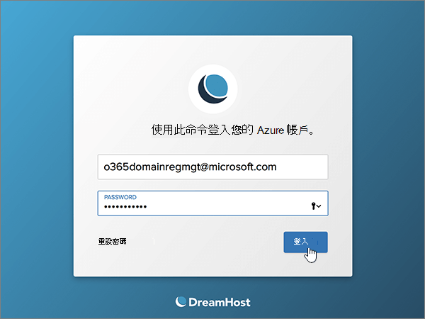
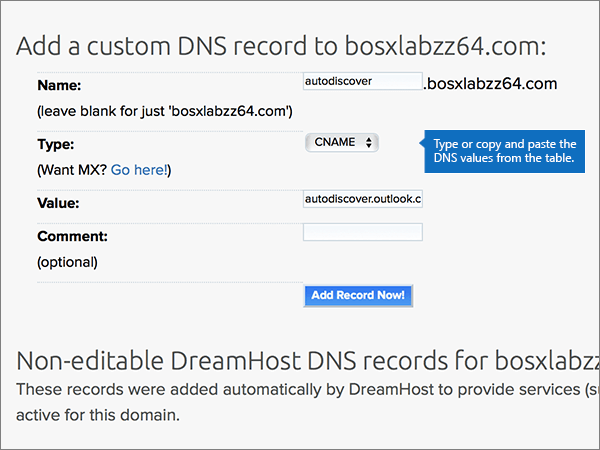

# DNS-records bij Dreamhost maken voor Microsoft

 **[Raadpleeg de veelgestelde vragen over domeinen](../setup/domains-faq.yml)** als u niet kunt vinden wat u zoekt. 
  
Als DreamHost uw DNS-hostingprovider is, voert u de stappen in dit artikel uit om uw domein te verifiëren en DNS-records voor e-mail, Lync enzovoort in te stellen.
 
Nadat u deze records bij DreamHost hebt toegevoegd, is uw domein ingesteld voor gebruik met Microsoft-services.
  
  
> [!NOTE]
> Het duurt gewoonlijk ongeveer 15 minuten voordat DNS-wijzigingen van kracht worden. Het kan echter soms wat langer duren voordat een wijziging die u hebt aangebracht, is bijgewerkt via het DNS-systeem op internet. Als u na het toevoegen van de DNS-records problemen hebt met het ontvangen of verzenden van e-mail, raadpleegt u [Problemen oplossen nadat u uw domeinnaam of DNS-records hebt gewijzigd](../get-help-with-domains/find-and-fix-issues.md). 
  
## Een TXT-record toevoegen voor verificatie

Voordat u uw domein met Microsoft kunt gebruiken, moet worden gecontroleerd dat u de eigenaar bent van het domein. Als u zich bij uw account bij de domeinregistrar kunt aanmelden en de DNS-record kunt maken, is dit voor Microsoft bewezen.
  
> [!NOTE]
> Deze record wordt alleen gebruikt om te verifiëren dat u de eigenaar van uw domein bent. Dit heeft verder geen invloed. U kunt deze record later desgewenst verwijderen. 
  
1. Ga om te beginnen [via deze koppeling](https://panel.dreamhost.com/) naar uw domeinenpagina bij DreamHost. U wordt gevraagd u aan te melden.
    
    
  
2. Selecteer op de pagina **Dashboard** de optie **Domains** en vervolgens **Manage Domains**.
    
    
  
3. Selecteer op de pagina **domeinen beheren** in de sectie **Domain** de optie **DNS** voor het domein dat u wilt bewerken. 
    
    
  
4. Typ of kopieer en plak de waarden uit de volgende tabel in het gebied **Add a custom DNS record** in de vakken voor de nieuwe record. 
    
    (Mogelijk moet u omlaag schuiven.)
    
    (Kies in de vervolgkeuzelijst de waarde **Type**). 
    
    |**Name**|**Type**|**Value**|**Opmerking**|
    |:-----|:-----|:-----|:-----|
    |(Laat dit veld leeg.)    |TXT    |MS=ms *XXXXXXXX*    **Opmerking:** Dit is een voorbeeld. Gebruik hier de specifieke waarde voor **Doel of adres waarnaar wordt verwezen** uit de tabel.           [Hoe kan ik dit vinden?](../get-help-with-domains/information-for-dns-records.md)          |(Dit veld is optioneel.)    |
   
   
  
5. Selecteer **record nu toevoegen.**
    
    
  
6. Wacht enkele minuten voordat u verder gaat, zodat de record die u zojuist hebt gemaakt via internet kan worden bijgewerkt.
    
Nu u de record hebt toegevoegd aan de site van uw domeinregistrar, gaat u terug naar Microsoft en vraagt u de record aan.
  
Wanneer in Microsoft de juiste TXT-record is gevonden, is uw domein gecontroleerd.
  
1. Ga in het Microsoft-beheercentrum naar **Instellingen** \> <a href="https://go.microsoft.com/fwlink/p/?linkid=834818" target="_blank">Domeinen</a>-pagina.

    
2. Kies op de pagina **Domeinen** de naam van het domein dat u verifieert. 
    
    
  
3. Kies **Start setup** op de pagina **Setup**.
    
    
  
4. Kies **Verifiëren** op de pagina **Domein verifiëren**.
    
    
  
> [!NOTE]
>  Het duurt gewoonlijk ongeveer 15 minuten voordat DNS-wijzigingen van kracht worden. Het kan echter soms wat langer duren voordat een wijziging die u hebt aangebracht, is bijgewerkt via het DNS-systeem op internet. Als u na het toevoegen van de DNS-records problemen hebt met het ontvangen of verzenden van e-mail, raadpleegt u [Problemen oplossen nadat u uw domeinnaam of DNS-records hebt gewijzigd](../get-help-with-domains/find-and-fix-issues.md). 
  

  
## Voeg een MX-record toe zodat e-mail voor uw domein naar Microsoft wordt verzonden

Voer de onderstaande stappen uit:
  
1. Ga om te beginnen [via deze koppeling](https://panel.dreamhost.com/) naar uw domeinenpagina bij DreamHost. U wordt gevraagd u aan te melden.
    
    
  
2. Selecteer op de pagina **Dashboard** de optie **mail** en vervolgens **Custom MX**.
    
    
  
3. Selecteer in de sectie **e-mail bezorgen beheren** , in de kolom **acties** , de optie **bewerken** voor het domein dat u wilt bewerken. 
    
    
  
4. Typ of kopieer en plak de volgende waarden uit de volgende tabel in het gebied **Custom MX Record** in de vakken voor de nieuwe record. 
    
    (Mogelijk moet u omlaag schuiven.)
    
    (Als er andere bestaande MX-records zijn, markeert u deze records om te worden verwijderd.)
    
    |**MX-record (vereist)**|
    |:-----|
    |0  *\<domain-key\>*  . mail.Protection.Outlook.com.    **Deze waarde MOET eindigen op een punt (.)**   De 0 is de MX-prioriteitwaarde. Voeg deze toe aan het begin van de MX-waarde, van de rest van de waarde gescheiden door een spatie.    **Opmerking:** Neem uw  *\<domain-key\>*  van uw Microsoft-account.           [Hoe kan ik dit vinden?](../get-help-with-domains/information-for-dns-records.md)          |
   
    
  
5. Selecteer **dit domein wijzigen om nu aangepaste MX-records te gebruiken!**
    
    
  
6. Als er andere bestaande MX-records zijn, verwijdert u elke record door deze te selecteren en vervolgens op de toets **Delete** op het toetsenbord te drukken. 
    
    
  
7. Als u records hebt verwijderd, selecteert u **uw aangepaste MX-records nu bijwerken.**
    
    

  
## De zes CNAME-records toevoegen die vereist zijn voor Microsoft

Voer de onderstaande stappen uit:
  
1. Ga om te beginnen [via deze koppeling](https://panel.dreamhost.com/) naar uw domeinenpagina bij DreamHost. U wordt gevraagd u aan te melden.
    
    
  
2. Selecteer op de pagina **Dashboard** de optie **Domains** en vervolgens **Manage Domains**.
    
    
  
3. Selecteer op de pagina **domeinen beheren** in de sectie **Domain** de optie **DNS** voor het domein dat u wilt bewerken. 
    
    
  
4. Typ of kopieer en plak de waarden uit de eerste rij in de volgende tabel in het gebied **Add a custom DNS record** in de vakken voor de nieuwe record. 
    
    (Mogelijk moet u omlaag schuiven.)
    
    (Kies in de vervolgkeuzelijst de waarde **Type**). 
    
    |**Name**|**Type**|**Value**|**Opmerking**|
    |:-----|:-----|:-----|:-----|
    |autodiscover    |CNAME    |autodiscover.outlook.com.    **Deze waarde MOET eindigen op een punt (.)**   |(Dit veld is optioneel.)    |
    |sip    |CNAME    |sipdir.online.lync.com.    **Deze waarde MOET eindigen op een punt (.)**   |(Dit veld is optioneel.)    |
    |lyncdiscover    |CNAME    |webdir.online.lync.com.    **Deze waarde MOET eindigen op een punt (.)**   |(Dit veld is optioneel.)    |
    |enterpriseregistration    |CNAME    |enterpriseregistration.windows.net.    **Deze waarde MOET eindigen op een punt (.)**   |(Dit veld is optioneel.)    |
    |enterpriseenrollment    |CNAME    |enterpriseenrollment-s.manage.microsoft.com.    **Deze waarde MOET eindigen op een punt (.)**   |(Dit veld is optioneel.)    |
   
    
  
5. Selecteer **record nu toevoegen.**
    
    
  
6. Met de twee voorgaande stappen en de waarden uit de andere vijf rijen in de tabel voegt u de andere vijf CNAME-records toe.

  
## Een TXT-record voor SPF toevoegen om spam tegen te gaan

> [!IMPORTANT]
> U kunt maximaal 1 TXT-record hebben voor SPF voor een domein. Als uw domein meer dan één SPF-record heeft, kan dit resulteren in e-mailfouten, evenals leverings- en spamclassificatieproblemen. Als u al een SPF-record voor uw domein hebt, hoeft u geen nieuwe te maken voor Microsoft. In plaats daarvan voegt u de vereiste Microsoft-waarden toe aan de huidige record, zodat u  *één*  SPF-record hebt die beide sets met waarden bevat.
  
Voer de onderstaande stappen uit:
  
1. Ga om te beginnen [via deze koppeling](https://panel.dreamhost.com/) naar uw domeinenpagina bij DreamHost. U wordt gevraagd u aan te melden.
    
    
  
2. Selecteer op de pagina **Dashboard** de optie **Domains** en vervolgens **Manage Domains**.
    
    
  
3. Selecteer op de pagina **domeinen beheren** in de sectie **Domain** de optie **DNS** voor het domein dat u wilt bewerken. 
    
    
  
4. Typ of kopieer en plak de waarden uit de eerste rij in de volgende tabel in het gebied **Add a custom DNS record** in de vakken voor de nieuwe record. 
    
    (Mogelijk moet u omlaag schuiven.)
    
    (Kies in de vervolgkeuzelijst de waarde **Type**). 
    
    |**Name**|**Type**|**Value**|**Opmerking**|
    |:-----|:-----|:-----|:-----|
    |(Laat dit veld leeg.)    |TXT    |v=spf1 include:spf.protection.outlook.com -all    **Opmerking:** het is raadzaam dit item te kopiëren en te plakken, zodat het spatiegebruik ongewijzigd blijft.           |(Dit veld is optioneel.)    |
   
   
  
5. Selecteer **record nu toevoegen.**
    
    
  
6. Met de twee voorgaande stappen en de waarden uit de tweede rij in de tabel, moet u de andere SRV-record toevoegen.
    
  
## De twee SRV-records toevoegen die zijn vereist voor Microsoft

Voer de onderstaande stappen uit:
  
1. Ga om te beginnen [via deze koppeling](https://panel.dreamhost.com/) naar uw domeinenpagina bij DreamHost. U wordt gevraagd u aan te melden.
    
    
  
2. Selecteer op de pagina **Dashboard** de optie **Domains** en vervolgens **Manage Domains**.
    
    
  
3. Selecteer op de pagina **domeinen beheren** in de sectie **Domain** de optie **DNS** voor het domein dat u wilt bewerken. 
    
    
  
4. Typ of kopieer en plak de waarden uit de eerste rij in de volgende tabel in het gebied **Add a custom DNS record** in de vakken voor de nieuwe record. 
    
    (Mogelijk moet u omlaag schuiven.)
    
    (Kies in de vervolgkeuzelijst de waarde **Type**). 
    
    |**Name**|**Type**|**Value**|**Opmerking**|
    |:-----|:-----|:-----|:-----|
    |_sip _sip._tls    |SRV    |100 1 443    sipdir.online.lync.com.    **Deze waarde MOET eindigen op een punt (.)**   |(Dit veld is optioneel.)    |
    |_sipfederationtls _sipfederationtls._tcp    |SRV    |100 1 5061    sipfed.online.lync.com.    **Deze waarde MOET eindigen op een punt (.)**   |(Dit veld is optioneel.)    |
   
    
  
5. Selecteer **Add Record Now!**.
    
    
  
6. Met de twee voorgaande stappen en de waarden uit de tweede rij in de tabel, moet u de andere SRV-record toevoegen.
    
> [!NOTE]
>  Het duurt gewoonlijk ongeveer 15 minuten voordat DNS-wijzigingen van kracht worden. Het kan echter soms wat langer duren voordat een wijziging die u hebt aangebracht, is bijgewerkt via het DNS-systeem op internet. Als u na het toevoegen van de DNS-records problemen hebt met het ontvangen of verzenden van e-mail, raadpleegt u [Problemen oplossen nadat u uw domeinnaam of DNS-records hebt gewijzigd](../get-help-with-domains/find-and-fix-issues.md). 

  
