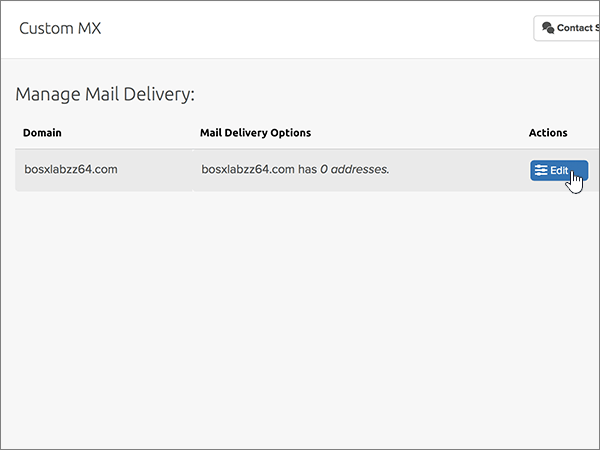

# DNS-records bij Dreamhost maken voor MicrosoftCreate DNS records at Dreamhost for Microsoft

 **[Raadpleeg de veelgestelde vragen over domeinen](../setup/domains-faq.md)** als u niet kunt vinden wat u zoekt.**[Check the Domains FAQ](../setup/domains-faq.md)** if you don't find what you're looking for. 
  
Als DreamHost uw DNS-hostingprovider is, voert u de stappen in dit artikel uit om uw domein te verifiëren en DNS-records voor e-mail, Lync enzovoort in te stellen.If DreamHost is your DNS hosting provider, follow the steps in this article to verify your domain and set up DNS records for email, Lync, and so on.
 
Nadat u deze records bij DreamHost hebt toegevoegd, is uw domein ingesteld voor gebruik met Microsoft-services.After you add these records at DreamHost, your domain will be set up to work with Microsoft services.
  
  
> [!NOTE]
> Het duurt gewoonlijk ongeveer 15 minuten voordat DNS-wijzigingen van kracht worden. Het kan echter soms wat langer duren voordat een wijziging die u hebt aangebracht, is bijgewerkt via het DNS-systeem op internet. Als u na het toevoegen van de DNS-records problemen hebt met het ontvangen of verzenden van e-mail, raadpleegt u [Problemen oplossen nadat u uw domeinnaam of DNS-records hebt gewijzigd](../get-help-with-domains/find-and-fix-issues.md).Typically it takes about 15 minutes for DNS changes to take effect. However, it can occasionally take longer for a change you've made to update across the Internet's DNS system. If you're having trouble with mail flow or other issues after adding DNS records, see [Troubleshoot issues after changing your domain name or DNS records](../get-help-with-domains/find-and-fix-issues.md). 
  
## Een TXT-record toevoegen voor verificatieAdd a TXT record for verification

Voordat u uw domein met Microsoft kunt gebruiken, moet worden gecontroleerd dat u de eigenaar bent van het domein. Als u zich bij uw account bij de domeinregistrar kunt aanmelden en de DNS-record kunt maken, is dit voor Microsoft bewezen.Before you use your domain with Microsoft, we have to make sure that you own it. Your ability to log in to your account at your domain registrar and create the DNS record proves to Microsoft that you own the domain.
  
> [!NOTE]
> Deze record wordt alleen gebruikt om te verifiëren dat u de eigenaar van uw domein bent. Dit heeft verder geen invloed. U kunt deze record later desgewenst verwijderen.This record is used only to verify that you own your domain; it doesn't affect anything else. You can delete it later, if you like. 
  
1. Ga om te beginnen [via deze koppeling](https://panel.dreamhost.com/) naar uw domeinenpagina bij DreamHost. U wordt gevraagd u aan te melden.To get started, go to your domains page at DreamHost by using [this link](https://panel.dreamhost.com/). You'll be prompted to Sign in.
    
    
  
2. Selecteer op de pagina **Dashboard** de optie **Domains**en vervolgens **Manage Domains**.On the **Dashboard** page, select **Domains**, and then **Manage Domains**.
    
    
  
3. Selecteer op de pagina **domeinen beheren** in de sectie **Domain** de optie **DNS** voor het domein dat u wilt bewerken.On the **Manage Domains** page, in the **Domain** section, select **DNS** for the domain that you want to edit. 
    
    
  
4. Typ of kopieer en plak de waarden uit de volgende tabel in het gebied **Add a custom DNS record** in de vakken voor de nieuwe record.In the **Add a custom DNS record** section, in the boxes for the new record, type or copy and paste the values from the following table. 
    
    (Mogelijk moet u omlaag schuiven.)(You may have to scroll down.)
    
    (Kies in de vervolgkeuzelijst de waarde **Type**).(Choose the **Type** value from the drop-down list.) 
    
    |**Name****Name**|**Type****Type**|**Value****Value**|**Opmerking****Comment**|
    |:-----|:-----|:-----|:-----|
    |(Laat dit veld leeg.)(Leave this field empty.)    |TXTTXT    |MS=ms *XXXXXXXX*MS=ms *XXXXXXXX*    **Opmerking:** Dit is een voorbeeld.**Note:** This is an example. Gebruik hier de specifieke waarde voor **Doel of adres waarnaar wordt verwezen** uit de tabel.Use your specific **Destination or Points to Address** value here, from the table.           [Hoe kan ik dit vinden?How do I find this?](../get-help-with-domains/information-for-dns-records.md)          |(Dit veld is optioneel.)(This field is optional.)    |
   
   
  
5. Selecteer **record nu toevoegen.**Select **Add Record Now!**
    
    
  
6. Wacht enkele minuten voordat u verder gaat, zodat de record die u zojuist hebt gemaakt via internet kan worden bijgewerkt.Wait a few minutes before you continue, so that the record you just created can update across the Internet.
    
Nu u de record hebt toegevoegd aan de site van uw domeinregistrar, gaat u terug naar Microsoft en vraagt u de record aan.Now that you've added the record at your domain registrar's site, you'll go back to Microsoft and request the record.
  
Wanneer in Microsoft de juiste TXT-record is gevonden, is uw domein gecontroleerd.When Microsoft finds the correct TXT record, your domain is verified.
  
1. Ga in het Microsoft-beheercentrum naar **Instellingen** \> <a href="https://go.microsoft.com/fwlink/p/?linkid=834818" target="_blank">Domeinen</a>-pagina.In the Microsoft admin center, go to the **Settings** \> <a href="https://go.microsoft.com/fwlink/p/?linkid=834818" target="_blank">Domains</a> page.

    
2. Kies op de pagina **Domeinen** de naam van het domein dat u verifieert.On the **Domains** page, select the domain that you are verifying. 
    
    
  
3. Kies **Start setup** op de pagina **Setup**.On the **Setup** page, select **Start setup**.
    
    
  
4. Kies **Verifiëren** op de pagina **Domein verifiëren**.On the **Verify domain** page, select **Verify**.
    
    
  
> [!NOTE]
>  Het duurt gewoonlijk ongeveer 15 minuten voordat DNS-wijzigingen van kracht worden. Het kan echter soms wat langer duren voordat een wijziging die u hebt aangebracht, is bijgewerkt via het DNS-systeem op internet. Als u na het toevoegen van de DNS-records problemen hebt met het ontvangen of verzenden van e-mail, raadpleegt u [Problemen oplossen nadat u uw domeinnaam of DNS-records hebt gewijzigd](../get-help-with-domains/find-and-fix-issues.md).Typically it takes about 15 minutes for DNS changes to take effect. However, it can occasionally take longer for a change you've made to update across the Internet's DNS system. If you're having trouble with mail flow or other issues after adding DNS records, see [Troubleshoot issues after changing your domain name or DNS records](../get-help-with-domains/find-and-fix-issues.md). 
  

  
## Voeg een MX-record toe zodat e-mail voor uw domein naar Microsoft wordt verzondenAdd an MX record so email for your domain will come to Microsoft

Voer de onderstaande stappen uit:Follow the steps below.
  
1. Ga om te beginnen [via deze koppeling](https://panel.dreamhost.com/) naar uw domeinenpagina bij DreamHost. U wordt gevraagd u aan te melden.To get started, go to your domains page at DreamHost by using [this link](https://panel.dreamhost.com/). You'll be prompted to Sign in.
    
    
  
2. Selecteer op de pagina **Dashboard** de optie **mail**en vervolgens **Custom MX**.On the **Dashboard** page, select **Mail**, and then **Custom MX**.
    
    
  
3. Selecteer in de sectie **e-mail bezorgen beheren** , in de kolom **acties** , de optie **bewerken** voor het domein dat u wilt bewerken.In the **Manage Mail Delivery** section, in the **Actions** column, select **Edit** for the domain that you want to edit. 
    
    
  
4. Typ of kopieer en plak de volgende waarden uit de volgende tabel in het gebied **Custom MX Record** in de vakken voor de nieuwe record.In the **Custom MX Record** section, in the boxes for the new record, type or copy and paste the following values from the following table. 
    
    (Mogelijk moet u omlaag schuiven.)(You may have to scroll down.)
    
    (Als er andere bestaande MX-records zijn, markeert u deze records om te worden verwijderd.)(If there are any other existing MX records, mark those records to be deleted.)
    
    |**MX-record (vereist)****MX Record (required)**|
    |:-----|
    |0  *\<domain-key\>*  . mail.Protection.Outlook.com.0  *\<domain-key\>*  .mail.protection.outlook.com.    **Deze waarde MOET eindigen op een punt (.)****This value MUST end with a period (.)**   De 0 is de MX-prioriteitwaarde. Voeg deze toe aan het begin van de MX-waarde, van de rest van de waarde gescheiden door een spatie.  The 0 is the MX priority value. Add it to the beginning of the MX value, separated from the remainder of the value by a space.    **Opmerking:** Neem uw  *\<domain-key\>*  van uw Microsoft-account.**Note:** Get your  *\<domain-key\>*  from your Microsoft account.           [Hoe kan ik dit vinden?How do I find this?](../get-help-with-domains/information-for-dns-records.md)          |
   
    
  
5. Selecteer **dit domein wijzigen om nu aangepaste MX-records te gebruiken!**Select **Change this domain to use custom MX records now!**
    
    
  
6. Als er andere bestaande MX-records zijn, verwijdert u elke record door deze te selecteren en vervolgens op de toets **Delete** op het toetsenbord te drukken.If there are any other existing MX records, delete each record by selecting the entry and then pressing the **Delete** key on your keyboard. 
    
    
  
7. Als u records hebt verwijderd, selecteert u **uw aangepaste MX-records nu bijwerken.**If you have deleted any records, select **Update your custom MX records now!**
    
    

  
## De zes CNAME-records toevoegen die vereist zijn voor MicrosoftAdd the six CNAME records that are required for Microsoft

Voer de onderstaande stappen uit:Follow the steps below.
  
1. Ga om te beginnen [via deze koppeling](https://panel.dreamhost.com/) naar uw domeinenpagina bij DreamHost. U wordt gevraagd u aan te melden.To get started, go to your domains page at DreamHost by using [this link](https://panel.dreamhost.com/). You'll be prompted to Sign in.
    
    
  
2. Selecteer op de pagina **Dashboard** de optie **Domains**en vervolgens **Manage Domains**.On the **Dashboard** page, select **Domains**, and then **Manage Domains**.
    
    
  
3. Selecteer op de pagina **domeinen beheren** in de sectie **Domain** de optie **DNS** voor het domein dat u wilt bewerken.On the **Manage Domains** page, in the **Domain** section, select **DNS** for the domain that you want to edit. 
    
    
  
4. Typ of kopieer en plak de waarden uit de eerste rij in de volgende tabel in het gebied **Add a custom DNS record** in de vakken voor de nieuwe record.In the **Add a custom DNS record** section, in the boxes for the new record, type or copy and paste the values from the first row in the following table. 
    
    (Mogelijk moet u omlaag schuiven.)(You may have to scroll down.)
    
    (Kies in de vervolgkeuzelijst de waarde **Type**).(Choose the **Type** value from the drop-down list.) 
    
    |**Name****Name**|**Type****Type**|**Value****Value**|**Opmerking****Comment**|
    |:-----|:-----|:-----|:-----|
    |autodiscoverautodiscover    |CNAMECNAME    |autodiscover.outlook.com.autodiscover.outlook.com.    **Deze waarde MOET eindigen op een punt (.)****This value MUST end with a period (.)**   |(Dit veld is optioneel.)(This field is optional.)    |
    |sipsip    |CNAMECNAME    |sipdir.online.lync.com.sipdir.online.lync.com.    **Deze waarde MOET eindigen op een punt (.)****This value MUST end with a period (.)**   |(Dit veld is optioneel.)(This field is optional.)    |
    |lyncdiscoverlyncdiscover    |CNAMECNAME    |webdir.online.lync.com.webdir.online.lync.com.    **Deze waarde MOET eindigen op een punt (.)****This value MUST end with a period (.)**   |(Dit veld is optioneel.)(This field is optional.)    |
    |enterpriseregistrationenterpriseregistration    |CNAMECNAME    |enterpriseregistration.windows.net.enterpriseregistration.windows.net.    **Deze waarde MOET eindigen op een punt (.)****This value MUST end with a period (.)**   |(Dit veld is optioneel.)(This field is optional.)    |
    |enterpriseenrollmententerpriseenrollment    |CNAMECNAME    |enterpriseenrollment-s.manage.microsoft.com.enterpriseenrollment-s.manage.microsoft.com.    **Deze waarde MOET eindigen op een punt (.)****This value MUST end with a period (.)**   |(Dit veld is optioneel.)(This field is optional.)    |
   
    
  
5. Selecteer **record nu toevoegen.**Select **Add Record Now!**
    
    
  
6. Met de twee voorgaande stappen en de waarden uit de andere vijf rijen in de tabel voegt u de andere vijf CNAME-records toe.Using the preceding two steps and the values from the other five rows in the table, add each of the other five CNAME records.

  
## Een TXT-record voor SPF toevoegen om spam tegen te gaanAdd a TXT record for SPF to help prevent email spam

> [!IMPORTANT]
> U kunt maximaal 1 TXT-record hebben voor SPF voor een domein.You cannot have more than one TXT record for SPF for a domain. Als uw domein meer dan één SPF-record heeft, kan dit resulteren in e-mailfouten, evenals leverings- en spamclassificatieproblemen.If your domain has more than one SPF record, you'll get email errors, as well as delivery and spam classification issues. Als u al een SPF-record voor uw domein hebt, hoeft u geen nieuwe te maken voor Microsoft.If you already have an SPF record for your domain, don't create a new one for Microsoft. In plaats daarvan voegt u de vereiste Microsoft-waarden toe aan de huidige record, zodat u  *één*  SPF-record hebt die beide sets met waarden bevat.Instead, add the required Microsoft values to the current record so that you have a  *single*  SPF record that includes both sets of values.
  
Voer de onderstaande stappen uit:Follow the steps below.
  
1. Ga om te beginnen [via deze koppeling](https://panel.dreamhost.com/) naar uw domeinenpagina bij DreamHost. U wordt gevraagd u aan te melden.To get started, go to your domains page at DreamHost by using [this link](https://panel.dreamhost.com/). You'll be prompted to Sign in.
    
    
  
2. Selecteer op de pagina **Dashboard** de optie **Domains**en vervolgens **Manage Domains**.On the **Dashboard** page, select **Domains**, and then **Manage Domains**.
    
    
  
3. Selecteer op de pagina **domeinen beheren** in de sectie **Domain** de optie **DNS** voor het domein dat u wilt bewerken.On the **Manage Domains** page, in the **Domain** section, select **DNS** for the domain that you want to edit. 
    
    
  
4. Typ of kopieer en plak de waarden uit de eerste rij in de volgende tabel in het gebied **Add a custom DNS record** in de vakken voor de nieuwe record.In the **Add a custom DNS record** section, in the boxes for the new record, type or copy and paste the values from the first row in the following table. 
    
    (Mogelijk moet u omlaag schuiven.)(You may have to scroll down.)
    
    (Kies in de vervolgkeuzelijst de waarde **Type**).(Choose the **Type** value from the drop-down list.) 
    
    |**Name****Name**|**Type****Type**|**Value****Value**|**Opmerking****Comment**|
    |:-----|:-----|:-----|:-----|
    |(Laat dit veld leeg.)(Leave this field empty.)    |TXTTXT    |v=spf1 include:spf.protection.outlook.com -allv=spf1 include:spf.protection.outlook.com -all    **Opmerking:** het is raadzaam dit item te kopiëren en te plakken, zodat het spatiegebruik ongewijzigd blijft.**Note:** We recommend copying and pasting this entry, so that all of the spacing stays correct.           |(Dit veld is optioneel.)(This field is optional.)    |
   
   
  
5. Selecteer **record nu toevoegen.**Select **Add Record Now!**
    
    
  
6. Met de twee voorgaande stappen en de waarden uit de tweede rij in de tabel, moet u de andere SRV-record toevoegen.Using the preceding two steps and the values from the second row in the table, add the other SRV record.
    
  
## De twee SRV-records toevoegen die zijn vereist voor MicrosoftAdd the two SRV records that are required for Microsoft

Voer de onderstaande stappen uit:Follow the steps below.
  
1. Ga om te beginnen [via deze koppeling](https://panel.dreamhost.com/) naar uw domeinenpagina bij DreamHost. U wordt gevraagd u aan te melden.To get started, go to your domains page at DreamHost by using [this link](https://panel.dreamhost.com/). You'll be prompted to Sign in.
    
    
  
2. Selecteer op de pagina **Dashboard** de optie **Domains**en vervolgens **Manage Domains**.On the **Dashboard** page, select **Domains**, and then **Manage Domains**.
    
    
  
3. Selecteer op de pagina **domeinen beheren** in de sectie **Domain** de optie **DNS** voor het domein dat u wilt bewerken.On the **Manage Domains** page, in the **Domain** section, select **DNS** for the domain that you want to edit. 
    
    
  
4. Typ of kopieer en plak de waarden uit de eerste rij in de volgende tabel in het gebied **Add a custom DNS record** in de vakken voor de nieuwe record.In the **Add a custom DNS record** section, in the boxes for the new record, type or copy and paste the values from the first row in the following table. 
    
    (Mogelijk moet u omlaag schuiven.)(You may have to scroll down.)
    
    (Kies in de vervolgkeuzelijst de waarde **Type**).(Choose the **Type** value from the drop-down list.) 
    
    |**Name****Name**|**Type****Type**|**Value****Value**|**Opmerking****Comment**|
    |:-----|:-----|:-----|:-----|
    |_sip _sip._tls_sip._tls    |SRVSRV    |100 1 443100 1 443    sipdir.online.lync.com.sipdir.online.lync.com.    **Deze waarde MOET eindigen op een punt (.)****This value MUST end with a period (.)**   |(Dit veld is optioneel.)(This field is optional.)    |
    |_sipfederationtls _sipfederationtls._tcp_sipfederationtls._tcp    |SRVSRV    |100 1 5061100 1 5061    sipfed.online.lync.com.sipfed.online.lync.com.    **Deze waarde MOET eindigen op een punt (.)****This value MUST end with a period (.)**   |(Dit veld is optioneel.)(This field is optional.)    |
   
    
  
5. Selecteer **Add Record Now!**.Select **Add Record Now!**.
    
    
  
6. Met de twee voorgaande stappen en de waarden uit de tweede rij in de tabel, moet u de andere SRV-record toevoegen.Using the preceding two steps and the values from the second row in the table, add the other SRV record.
    
> [!NOTE]
>  Het duurt gewoonlijk ongeveer 15 minuten voordat DNS-wijzigingen van kracht worden. Het kan echter soms wat langer duren voordat een wijziging die u hebt aangebracht, is bijgewerkt via het DNS-systeem op internet. Als u na het toevoegen van de DNS-records problemen hebt met het ontvangen of verzenden van e-mail, raadpleegt u [Problemen oplossen nadat u uw domeinnaam of DNS-records hebt gewijzigd](../get-help-with-domains/find-and-fix-issues.md).Typically it takes about 15 minutes for DNS changes to take effect. However, it can occasionally take longer for a change you've made to update across the Internet's DNS system. If you're having trouble with mail flow or other issues after adding DNS records, see [Troubleshoot issues after changing your domain name or DNS records](../get-help-with-domains/find-and-fix-issues.md). 

  
