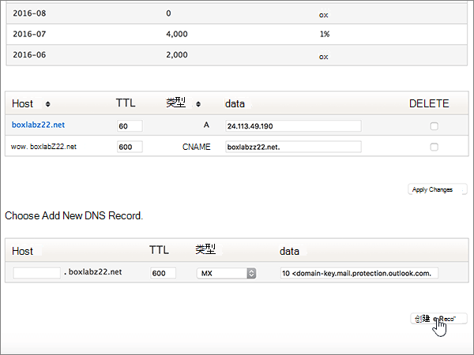
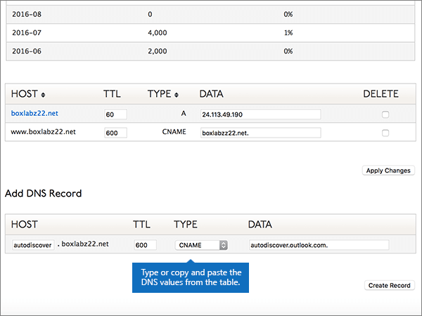
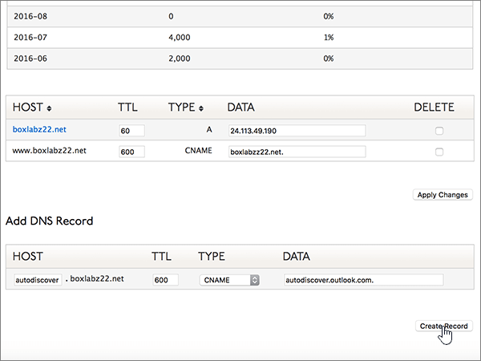
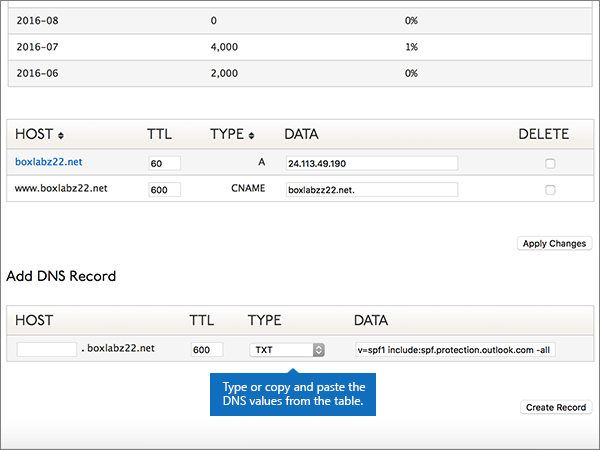
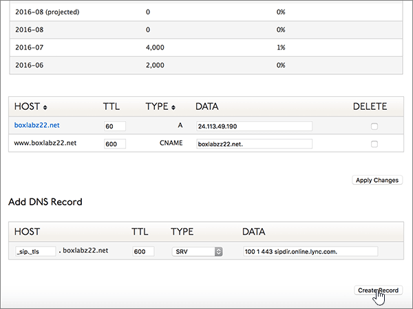

# DNS-records maken op Dyn.com voor Microsoft

 **[Raadpleeg de veelgestelde vragen over domeinen](../setup/domains-faq.md)** als u niet kunt vinden wat u zoekt. 
  
Als Dyn.com uw DNS-hostingprovider is, voert u de stappen in dit artikel uit om uw domein te verifiëren en DNS-records voor e-mail, Skype voor Bedrijven Online enzovoort in te stellen.
 
Zie Een openbare website gebruiken met Microsoft voor meer informatie over webhosting en DNS voor websites met [Microsoft.](https://support.office.com/article/choose-a-public-website-3325d50e-d131-403c-a278-7f3296fe33a9)
  
> [!NOTE]
>  Het duurt gewoonlijk ongeveer 15 minuten voordat DNS-wijzigingen van kracht worden. Het kan echter soms wat langer duren voordat een wijziging die u hebt aangebracht, is bijgewerkt via het DNS-systeem op internet. Als u na het toevoegen van de DNS-records problemen hebt met het ontvangen of verzenden van e-mail, raadpleegt u [Problemen oplossen nadat u uw domeinnaam of DNS-records hebt gewijzigd](../get-help-with-domains/find-and-fix-issues.md). 
  
## Een TXT-record toevoegen voor verificatie

1. Als u wilt beginnen, gaat u naar uw domeinenpagina bij Dyn.com via [deze koppeling](https://account.dyn.com/dns/). U wordt gevraagd u eerst aan te melden.
    
    
  
2. Selecteer **op** de pagina Zone Level Services de optie **Dyn Standard DNS-service** voor het domein dat u wilt bewerken. 
    
3. Selecteer **Voorkeuren**op de **PAGINA DNS** voor uw domein .
    
4. Selecteer **Expertinterface inschakelen**.
    
5. Typ of kopieer en plak de waarden uit de volgende tabel in het gebied **Add DNS Record** in de vakken voor de nieuwe record. 
    
    (Kies in de vervolgkeuzelijst de waarde **Type**.) 
    
    |**Host**|**TTL**|**Type**|**Data**|
    |:-----|:-----|:-----|:-----|
    |(Laat dit veld leeg.)    |600    |TXT    |MS=ms *XXXXXXXX*    **Opmerking:** Dit is een voorbeeld. Gebruik hier de waarde van uw specifieke **bestemming of adrespunt** in de tabel.           [Hoe kan ik dit vinden?](../get-help-with-domains/information-for-dns-records.md)          |
       
   
  
6. Selecteer **Record maken**.
    
    
  
7. Wacht enkele minuten voordat u verder gaat, zodat de record die u zojuist hebt gemaakt via internet kan worden bijgewerkt.
    
Nu u de record op de site van uw domeinregistrar hebt toegevoegd, gaat u terug naar Microsoft en vraagt u de record aan.
  
Wanneer Microsoft de juiste TXT-record vindt, wordt uw domein geverifieerd.
  
1. Ga in het Microsoft-beheercentrum naar de pagina \> <a href="https://go.microsoft.com/fwlink/p/?linkid=834818" target="_blank">Instellingendomeinen.</a> **Settings**

    
2. Kies op de pagina **Domeinen** de naam van het domein dat u verifieert. 
    
    
  
3. Kies **Start setup** op de pagina **Setup**.
    
    
  
4. Kies **Verifiëren** op de pagina **Domein verifiëren**.
    
    
  
> [!NOTE]
>  Het duurt gewoonlijk ongeveer 15 minuten voordat DNS-wijzigingen van kracht worden. Het kan echter soms wat langer duren voordat een wijziging die u hebt aangebracht, is bijgewerkt via het DNS-systeem op internet. Als u na het toevoegen van de DNS-records problemen hebt met het ontvangen of verzenden van e-mail, raadpleegt u [Problemen oplossen nadat u uw domeinnaam of DNS-records hebt gewijzigd](../get-help-with-domains/find-and-fix-issues.md). 
  
## Voeg een MX-record toe, zodat e-mail voor uw domein naar Microsoft komt

1. Als u wilt beginnen, gaat u naar uw domeinenpagina bij Dyn.com via [deze koppeling](https://account.dyn.com/dns/). U wordt gevraagd u eerst aan te melden.
    
    
  
2. Selecteer **op** de pagina Zone Level Services de optie **Dyn Standard DNS-service** voor het domein dat u wilt bewerken. 
    
3. Selecteer **Voorkeuren**op de PAGINA DNS voor uw domein .
    
4. Selecteer **Expertinterface inschakelen**.
    
5. Typ of kopieer en plak de waarden uit de volgende tabel in het gebied **Add DNS Record** in de vakken voor de nieuwe record. 
    
    (Kies in de vervolgkeuzelijst de waarde **Type**.) 
    
    |**Host**|**TTL**|**Type**|**Data**|
    |:-----|:-----|:-----|:-----|
    |(Laat dit veld leeg.)    |600    |MX    |10  *\<domeinsleutel\>*  .mail.protection.outlook.com.    **Deze waarde MOET eindigen op een punt (.)**   De **10** is de MX-prioriteitwaarde. Voeg deze toe aan het begin van de MX-waarde, van de rest van de waarde gescheiden door een spatie.    **Let op:** Haal uw * \<domeinsleutel\> * uit uw Microsoft-account.           [Hoe kan ik dit vinden?](../get-help-with-domains/information-for-dns-records.md)           Zie [Wat is MX-prioriteit?](https://support.office.com/article/2784cc4d-95be-443d-b5f7-bb5dd867ba83.aspx) voor meer informatie over prioriteit.   |
   
    
  
6. Selecteer **Record maken**.
    
    
  
7. Als er andere MX-records zijn, verwijder deze dan door in de kolom **Delete** het selectievakje voor die records in te schakelen. 
    
    
  
8. Selecteer **Wijzigingen toepassen**.
    
    
  
## Voeg de zes CNAME-records toe die nodig zijn voor Microsoft

1. Als u wilt beginnen, gaat u naar uw domeinenpagina bij Dyn.com via [deze koppeling](https://account.dyn.com/dns/). U wordt gevraagd u eerst aan te melden.
    
    
  
2. Selecteer **op** de pagina Zone Level Services de optie **Dyn Standard DNS-service** voor het domein dat u wilt bewerken. 
    
3. Selecteer **Voorkeuren**op de **PAGINA DNS** voor uw domein .
    
4. Selecteer **Expertinterface inschakelen**.
    
5. Voeg de eerste van de zes CNAME-records toe.
    
    Typ of kopieer en plak in de sectie **Add DNS Record** de waarden uit de eerste rij van de volgende tabel in de vakken voor de nieuwe record. 
    
    (Kies in de vervolgkeuzelijst de waarde **Type**). 
    
    |**Host**|**TTL**|**Type**|**Data**|
    |:-----|:-----|:-----|:-----|
    |autodiscover    |600    |CNAME    |autodiscover.outlook.com.    **Deze waarde MOET eindigen op een punt (.)**   |
    |sip    |600    |CNAME    |sipdir.online.lync.com.    **Deze waarde MOET eindigen op een punt (.)**   |
    |lyncdiscover    |600    |CNAME    |webdir.online.lync.com.    **Deze waarde MOET eindigen op een punt (.)**   |
    |enterpriseregistration    |600    |CNAME    |enterpriseregistration.windows.net.    **Deze waarde MOET eindigen op een punt (.)**   |
    |enterpriseenrollment    |600    |CNAME    |enterpriseenrollment-s.manage.microsoft.com.    **Deze waarde MOET eindigen op een punt (.)**   |
   
    
  
6. Selecteer **Record maken**.
    
    
  
7. Voeg de resterende vijf CNAME-records toe.
    
    Maak in de sectie **DNS-record toevoegen** een record met de waarden uit de volgende rij in de tabel en selecteer vervolgens opnieuw **Record maken** om die record te voltooien. 
    
    Herhaal deze procedure totdat u alle zes CNAME-records hebt gemaakt.
    
## Een TXT-record voor SPF toevoegen om spam tegen te gaan

> [!IMPORTANT]
> U kunt maximaal 1 TXT-record hebben voor SPF voor een domein. Als uw domein meer dan één SPF-record heeft, kan dit resulteren in e-mailfouten, evenals leverings- en spamclassificatieproblemen. Als u al een SPF-record voor uw domein hebt, maakt u geen nieuwe voor Microsoft. Voeg in plaats daarvan de vereiste Microsoft-waarden toe aan de huidige record, zodat u *één* SPF-record hebt die beide waardensets bevat.
  
1. Als u wilt beginnen, gaat u naar uw domeinenpagina bij Dyn.com via [deze koppeling](https://account.dyn.com/dns/). U wordt gevraagd u eerst aan te melden.
    
    
  
2. Selecteer **op** de pagina Zone Level Services de optie **Dyn Standard DNS-service** voor het domein dat u wilt bewerken. 
    
3. Selecteer **Voorkeuren**op de **PAGINA DNS** voor uw domein .
    
4. Selecteer **Expertinterface inschakelen**.
    
5. Typ of kopieer en plak de waarden uit de volgende tabel in het gebied **Add DNS Record** in de vakken voor de nieuwe record. 
    
    (Kies in de vervolgkeuzelijst de waarde **Type**.) 
    
    |**Host**|**TTL**|**Type**|**Data**|
    |:-----|:-----|:-----|:-----|
    |(Laat dit veld leeg.)    |600    |TXT    |v=spf1 include:spf.protection.outlook.com -all    **Opmerking:** het is raadzaam dit item te kopiëren en te plakken, zodat het spatiegebruik ongewijzigd blijft.           |
   
    
  
6. Selecteer **Record maken**.
    
    
  
## Voeg de twee SRV-records toe die nodig zijn voor Microsoft

1. Als u wilt beginnen, gaat u naar uw domeinenpagina bij Dyn.com via [deze koppeling](https://account.dyn.com/dns/). Je wordt gevraagd om eerst in te loggen 
    
    
  
2. Selecteer **op** de pagina Zone Level Services de optie **Dyn Standard DNS-service** voor het domein dat u wilt bewerken. 
    
3. Selecteer **Voorkeuren**op de **PAGINA DNS** voor uw domein .
    
4. Selecteer **Expertinterface inschakelen**.
    
5. Voeg de eerste van de twee SRV-records toe.
    
    Typ of kopieer en plak in de sectie **Add DNS Record** de waarden uit de eerste rij van de volgende tabel in de vakken voor de nieuwe record. 
    
    (Kies in de vervolgkeuzelijst de waarde **Type**). 
    
    |**Host**|**TTL**|**Type**|**Data**|
    |:-----|:-----|:-----|:-----|
    |_sip._tls|600|SRV|100 1 443 sipdir.online.lync.com. **Deze waarde MOET eindigen op een punt (.)** **Opmerking:** het is raadzaam dit item te kopiëren en te plakken, zodat het spatiegebruik ongewijzigd blijft.           |
    |_sipfederationtls._tcp|600|SRV|100 1 5061 sipfed.online.lync.com. **Deze waarde MOET eindigen op een punt (.)**  **Opmerking:** het is raadzaam dit item te kopiëren en te plakken, zodat het spatiegebruik ongewijzigd blijft.           |
   
    
  
6. Selecteer **Record maken**.
    
    
  
7. Voeg de andere SRV-record toe.
    
    Maak in de sectie **DNS-record toevoegen** een record met de waarden uit de tweede rij in de tabel en selecteer vervolgens opnieuw **Record maken** om die record te voltooien. 
    
> [!NOTE]
>  Het duurt gewoonlijk ongeveer 15 minuten voordat DNS-wijzigingen van kracht worden. Het kan echter soms wat langer duren voordat een wijziging die u hebt aangebracht, is bijgewerkt via het DNS-systeem op internet. Als u na het toevoegen van de DNS-records problemen hebt met het ontvangen of verzenden van e-mail, raadpleegt u [Problemen oplossen nadat u uw domeinnaam of DNS-records hebt gewijzigd](../get-help-with-domains/find-and-fix-issues.md). 
  
