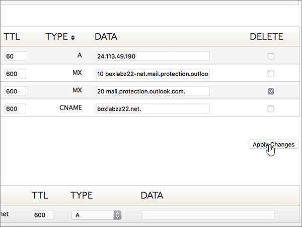

# DNS-records maken op Dyn.com voor MicrosoftCreate DNS records at Dyn.com for Microsoft

 **[Raadpleeg de veelgestelde vragen over domeinen](../setup/domains-faq.md)** als u niet kunt vinden wat u zoekt.**[Check the Domains FAQ](../setup/domains-faq.md)** if you don't find what you're looking for. 
  
Als Dyn.com uw DNS-hostingprovider is, voert u de stappen in dit artikel uit om uw domein te verifiëren en DNS-records voor e-mail, Skype voor Bedrijven Online enzovoort in te stellen.If Dyn.com is your DNS hosting provider, follow the steps in this article to verify your domain and set up DNS records for email, Skype for Business Online, and so on.
 
Zie Een openbare website gebruiken met Microsoft voor meer informatie over webhosting en DNS voor websites met [Microsoft.](https://support.office.com/article/choose-a-public-website-3325d50e-d131-403c-a278-7f3296fe33a9)To learn about webhosting and DNS for websites with Microsoft, see [Use a public website with Microsoft](https://support.office.com/article/choose-a-public-website-3325d50e-d131-403c-a278-7f3296fe33a9).
  
> [!NOTE]
>  Het duurt gewoonlijk ongeveer 15 minuten voordat DNS-wijzigingen van kracht worden. Het kan echter soms wat langer duren voordat een wijziging die u hebt aangebracht, is bijgewerkt via het DNS-systeem op internet. Als u na het toevoegen van de DNS-records problemen hebt met het ontvangen of verzenden van e-mail, raadpleegt u [Problemen oplossen nadat u uw domeinnaam of DNS-records hebt gewijzigd](../get-help-with-domains/find-and-fix-issues.md).Typically it takes about 15 minutes for DNS changes to take effect. However, it can occasionally take longer for a change you've made to update across the Internet's DNS system. If you're having trouble with mail flow or other issues after adding DNS records, see [Troubleshoot issues after changing your domain name or DNS records](../get-help-with-domains/find-and-fix-issues.md). 
  
## Een TXT-record toevoegen voor verificatieAdd a TXT record for verification

1. Als u wilt beginnen, gaat u naar uw domeinenpagina bij Dyn.com via [deze koppeling](https://account.dyn.com/dns/). U wordt gevraagd u eerst aan te melden.To get started, go to your domains page at Dyn.com by using [this link](https://account.dyn.com/dns/). You'll be prompted to login first.
    
    
  
2. Selecteer **op** de pagina Zone Level Services de optie **Dyn Standard DNS-service** voor het domein dat u wilt bewerken.On the **Zone Level Services** page, select **Dyn Standard DNS Service** for the domain that you want to edit. 
    
3. Selecteer **Voorkeuren**op de **PAGINA DNS** voor uw domein .On the **DNS** page for your domain, select **Preferences**.
    
4. Selecteer **Expertinterface inschakelen**.Select **Enable Expert Interface**.
    
5. Typ of kopieer en plak de waarden uit de volgende tabel in het gebied **Add DNS Record** in de vakken voor de nieuwe record.In the **Add DNS Record** section, in the boxes for the new record, type or copy and paste the values from the following table. 
    
    (Kies in de vervolgkeuzelijst de waarde **Type**.)(Choose the **Type** value from the drop-down list.) 
    
    |**Host****Host**|**TTL****TTL**|**Type****Type**|**Data****Data**|
    |:-----|:-----|:-----|:-----|
    |(Laat dit veld leeg.)(Leave this field empty.)    |600600    |TXTTXT    |MS=ms *XXXXXXXX*MS=ms *XXXXXXXX*    **Opmerking:** Dit is een voorbeeld.**Note:** This is an example. Gebruik hier de waarde van uw specifieke **bestemming of adrespunt** in de tabel.Use your specific **Destination or Points to Address** value here, from the table.           [Hoe kan ik dit vinden?How do I find this?](../get-help-with-domains/information-for-dns-records.md)          |
       
   
  
6. Selecteer **Record maken**.Select **Create Record**.
    
    
  
7. Wacht enkele minuten voordat u verder gaat, zodat de record die u zojuist hebt gemaakt via internet kan worden bijgewerkt.Wait a few minutes before you continue, so that the record you just created can update across the Internet.
    
Nu u de record op de site van uw domeinregistrar hebt toegevoegd, gaat u terug naar Microsoft en vraagt u de record aan.Now that you've added the record at your domain registrar's site, you'll go back to Microsoft and request the record.
  
Wanneer Microsoft de juiste TXT-record vindt, wordt uw domein geverifieerd.When Microsoft finds the correct TXT record, your domain is verified.
  
1. Ga in het Microsoft-beheercentrum naar de pagina \> <a href="https://go.microsoft.com/fwlink/p/?linkid=834818" target="_blank">Instellingendomeinen.</a> **Settings**In the Microsoft admin center, go to the **Settings** \> <a href="https://go.microsoft.com/fwlink/p/?linkid=834818" target="_blank">Domains</a> page.

    
2. Kies op de pagina **Domeinen** de naam van het domein dat u verifieert.On the **Domains** page, select the domain that you are verifying. 
    
    
  
3. Kies **Start setup** op de pagina **Setup**.On the **Setup** page, select **Start setup**.
    
    
  
4. Kies **Verifiëren** op de pagina **Domein verifiëren**.On the **Verify domain** page, select **Verify**.
    
    
  
> [!NOTE]
>  Het duurt gewoonlijk ongeveer 15 minuten voordat DNS-wijzigingen van kracht worden. Het kan echter soms wat langer duren voordat een wijziging die u hebt aangebracht, is bijgewerkt via het DNS-systeem op internet. Als u na het toevoegen van de DNS-records problemen hebt met het ontvangen of verzenden van e-mail, raadpleegt u [Problemen oplossen nadat u uw domeinnaam of DNS-records hebt gewijzigd](../get-help-with-domains/find-and-fix-issues.md).Typically it takes about 15 minutes for DNS changes to take effect. However, it can occasionally take longer for a change you've made to update across the Internet's DNS system. If you're having trouble with mail flow or other issues after adding DNS records, see [Troubleshoot issues after changing your domain name or DNS records](../get-help-with-domains/find-and-fix-issues.md). 
  
## Voeg een MX-record toe, zodat e-mail voor uw domein naar Microsoft komtAdd an MX record so email for your domain will come to Microsoft

1. Als u wilt beginnen, gaat u naar uw domeinenpagina bij Dyn.com via [deze koppeling](https://account.dyn.com/dns/). U wordt gevraagd u eerst aan te melden.To get started, go to your domains page at Dyn.com by using [this link](https://account.dyn.com/dns/). You'll be prompted to login first.
    
    
  
2. Selecteer **op** de pagina Zone Level Services de optie **Dyn Standard DNS-service** voor het domein dat u wilt bewerken.On the **Zone Level Services** page, select **Dyn Standard DNS Service** for the domain that you want to edit. 
    
3. Selecteer **Voorkeuren**op de PAGINA DNS voor uw domein .On the DNS page for your domain, select **Preferences**.
    
4. Selecteer **Expertinterface inschakelen**.Select **Enable Expert Interface**.
    
5. Typ of kopieer en plak de waarden uit de volgende tabel in het gebied **Add DNS Record** in de vakken voor de nieuwe record.In the **Add DNS Record** section, in the boxes for the new record, type or copy and paste the values from the following table. 
    
    (Kies in de vervolgkeuzelijst de waarde **Type**.)(Choose the **Type** value from the drop-down list.) 
    
    |**Host****Host**|**TTL****TTL**|**Type****Type**|**Data****Data**|
    |:-----|:-----|:-----|:-----|
    |(Laat dit veld leeg.)(Leave this field empty.)    |600600    |MXMX    |10  *\<domeinsleutel\>*  .mail.protection.outlook.com.10  *\<domain-key\>*  .mail.protection.outlook.com.    **Deze waarde MOET eindigen op een punt (.)****This value MUST end with a period (.)**   De **10** is de MX-prioriteitwaarde. Voeg deze toe aan het begin van de MX-waarde, van de rest van de waarde gescheiden door een spatie.  The **10** is the MX priority value. Add it to the beginning of the MX value, separated from the remainder of the value by a space.    **Let op:** Haal uw \* \<domeinsleutel\> \* uit uw Microsoft-account.**Note:** Get your  *\<domain-key\>*  from your Microsoft account.           [Hoe kan ik dit vinden?How do I find this?](../get-help-with-domains/information-for-dns-records.md)           Zie [Wat is MX-prioriteit?](https://support.office.com/article/2784cc4d-95be-443d-b5f7-bb5dd867ba83.aspx) voor meer informatie over prioriteit.For more information about priority, see [What is MX priority?](https://support.office.com/article/2784cc4d-95be-443d-b5f7-bb5dd867ba83.aspx)   |
   
    
  
6. Selecteer **Record maken**.Select **Create Record**.
    
    
  
7. Als er andere MX-records zijn, verwijder deze dan door in de kolom **Delete** het selectievakje voor die records in te schakelen.If there are any other MX records, remove them by selecting the check box for each one in the **Delete** column. 
    
    
  
8. Selecteer **Wijzigingen toepassen**.Select **Apply Changes**.
    
    
  
## Voeg de zes CNAME-records toe die nodig zijn voor MicrosoftAdd the six CNAME records that are required for Microsoft

1. Als u wilt beginnen, gaat u naar uw domeinenpagina bij Dyn.com via [deze koppeling](https://account.dyn.com/dns/). U wordt gevraagd u eerst aan te melden.To get started, go to your domains page at Dyn.com by using [this link](https://account.dyn.com/dns/). You'll be prompted to login first.
    
    
  
2. Selecteer **op** de pagina Zone Level Services de optie **Dyn Standard DNS-service** voor het domein dat u wilt bewerken.On the **Zone Level Services** page, select **Dyn Standard DNS Service** for the domain that you want to edit. 
    
3. Selecteer **Voorkeuren**op de **PAGINA DNS** voor uw domein .On the **DNS** page for your domain, select **Preferences**.
    
4. Selecteer **Expertinterface inschakelen**.Select **Enable Expert Interface**.
    
5. Voeg de eerste van de zes CNAME-records toe.Add the first of the six CNAME records.
    
    Typ of kopieer en plak in de sectie **Add DNS Record** de waarden uit de eerste rij van de volgende tabel in de vakken voor de nieuwe record.In the **Add DNS Record** section, in the boxes for the new record, type or copy and paste the values from the first row of the following table. 
    
    (Kies in de vervolgkeuzelijst de waarde **Type**).(Choose the **Type** value from the drop-down list.) 
    
    |**Host****Host**|**TTL****TTL**|**Type****Type**|**Data****Data**|
    |:-----|:-----|:-----|:-----|
    |autodiscoverautodiscover    |600600    |CNAMECNAME    |autodiscover.outlook.com.autodiscover.outlook.com.    **Deze waarde MOET eindigen op een punt (.)****This value MUST end with a period (.)**   |
    |sipsip    |600600    |CNAMECNAME    |sipdir.online.lync.com.sipdir.online.lync.com.    **Deze waarde MOET eindigen op een punt (.)****This value MUST end with a period (.)**   |
    |lyncdiscoverlyncdiscover    |600600    |CNAMECNAME    |webdir.online.lync.com.webdir.online.lync.com.    **Deze waarde MOET eindigen op een punt (.)****This value MUST end with a period (.)**   |
    |enterpriseregistrationenterpriseregistration    |600600    |CNAMECNAME    |enterpriseregistration.windows.net.enterpriseregistration.windows.net.    **Deze waarde MOET eindigen op een punt (.)****This value MUST end with a period (.)**   |
    |enterpriseenrollmententerpriseenrollment    |600600    |CNAMECNAME    |enterpriseenrollment-s.manage.microsoft.com.enterpriseenrollment-s.manage.microsoft.com.    **Deze waarde MOET eindigen op een punt (.)****This value MUST end with a period (.)**   |
   
    
  
6. Selecteer **Record maken**.Select **Create Record**.
    
    
  
7. Voeg de resterende vijf CNAME-records toe.Add the remaining five CNAME records.
    
    Maak in de sectie **DNS-record toevoegen** een record met de waarden uit de volgende rij in de tabel en selecteer vervolgens opnieuw **Record maken** om die record te voltooien.In the **Add DNS Record** section, create a record by using the values from the next row in the table, and then again select **Create Record** to complete that record. 
    
    Herhaal deze procedure totdat u alle zes CNAME-records hebt gemaakt.Repeat this process until you have created all six CNAME records.
    
## Een TXT-record voor SPF toevoegen om spam tegen te gaanAdd a TXT record for SPF to help prevent email spam

> [!IMPORTANT]
> U kunt maximaal 1 TXT-record hebben voor SPF voor een domein.You cannot have more than one TXT record for SPF for a domain. Als uw domein meer dan één SPF-record heeft, kan dit resulteren in e-mailfouten, evenals leverings- en spamclassificatieproblemen.If your domain has more than one SPF record, you'll get email errors, as well as delivery and spam classification issues. Als u al een SPF-record voor uw domein hebt, maakt u geen nieuwe voor Microsoft.If you already have an SPF record for your domain, don't create a new one for Microsoft. Voeg in plaats daarvan de vereiste Microsoft-waarden toe aan de huidige record, zodat u *één* SPF-record hebt die beide waardensets bevat.Instead, add the required Microsoft values to the current record so that you have a  *single*  SPF record that includes both sets of values.
  
1. Als u wilt beginnen, gaat u naar uw domeinenpagina bij Dyn.com via [deze koppeling](https://account.dyn.com/dns/). U wordt gevraagd u eerst aan te melden.To get started, go to your domains page at Dyn.com by using [this link](https://account.dyn.com/dns/). You'll be prompted to login first.
    
    
  
2. Selecteer **op** de pagina Zone Level Services de optie **Dyn Standard DNS-service** voor het domein dat u wilt bewerken.On the **Zone Level Services** page, select **Dyn Standard DNS Service** for the domain that you want to edit. 
    
3. Selecteer **Voorkeuren**op de **PAGINA DNS** voor uw domein .On the **DNS** page for your domain, select **Preferences**.
    
4. Selecteer **Expertinterface inschakelen**.Select **Enable Expert Interface**.
    
5. Typ of kopieer en plak de waarden uit de volgende tabel in het gebied **Add DNS Record** in de vakken voor de nieuwe record.In the **Add DNS Record** section, in the boxes for the new record, type or copy and paste the values from the following table. 
    
    (Kies in de vervolgkeuzelijst de waarde **Type**.)(Choose the **Type** value from the drop-down list.) 
    
    |**Host****Host**|**TTL****TTL**|**Type****Type**|**Data****Data**|
    |:-----|:-----|:-----|:-----|
    |(Laat dit veld leeg.)(Leave this field empty.)    |600600    |TXTTXT    |v=spf1 include:spf.protection.outlook.com -allv=spf1 include:spf.protection.outlook.com -all    **Opmerking:** het is raadzaam dit item te kopiëren en te plakken, zodat het spatiegebruik ongewijzigd blijft.**Note:** We recommend copying and pasting this entry, so that all of the spacing stays correct.           |
   
    
  
6. Selecteer **Record maken**.Select **Create Record**.
    
    
  
## Voeg de twee SRV-records toe die nodig zijn voor MicrosoftAdd the two SRV records that are required for Microsoft

1. Als u wilt beginnen, gaat u naar uw domeinenpagina bij Dyn.com via [deze koppeling](https://account.dyn.com/dns/).To get started, go to your domains page at Dyn.com by using [this link](https://account.dyn.com/dns/). Je wordt gevraagd om eerst in te loggenYou'll be prompted to login first 
    
    
  
2. Selecteer **op** de pagina Zone Level Services de optie **Dyn Standard DNS-service** voor het domein dat u wilt bewerken.On the **Zone Level Services** page, select **Dyn Standard DNS Service** for the domain that you want to edit. 
    
3. Selecteer **Voorkeuren**op de **PAGINA DNS** voor uw domein .On the **DNS** page for your domain, select **Preferences**.
    
4. Selecteer **Expertinterface inschakelen**.Select **Enable Expert Interface**.
    
5. Voeg de eerste van de twee SRV-records toe.Add the first of the two SRV records.
    
    Typ of kopieer en plak in de sectie **Add DNS Record** de waarden uit de eerste rij van de volgende tabel in de vakken voor de nieuwe record.In the **Add DNS Record** section, in the boxes for the new record, type or copy and paste the values from the first row of the following table. 
    
    (Kies in de vervolgkeuzelijst de waarde **Type**).(Choose the **Type** value from the drop-down list.) 
    
    |**Host****Host**|**TTL****TTL**|**Type****Type**|**Data****Data**|
    |:-----|:-----|:-----|:-----|
    |_sip._tls_sip._tls|600600|SRVSRV|100 1 443 sipdir.online.lync.com.100 1 443 sipdir.online.lync.com. **Deze waarde MOET eindigen op een punt (.)****This value MUST end with a period (.)** **Opmerking:** het is raadzaam dit item te kopiëren en te plakken, zodat het spatiegebruik ongewijzigd blijft.**Note:** We recommend copying and pasting this entry, so that all of the spacing stays correct.           |
    |_sipfederationtls._tcp_sipfederationtls._tcp|600600|SRVSRV|100 1 5061 sipfed.online.lync.com.100 1 5061 sipfed.online.lync.com. **Deze waarde MOET eindigen op een punt (.)****This value MUST end with a period (.)**  **Opmerking:** het is raadzaam dit item te kopiëren en te plakken, zodat het spatiegebruik ongewijzigd blijft.**Note:** We recommend copying and pasting this entry, so that all of the spacing stays correct.           |
   
    
  
6. Selecteer **Record maken**.Select **Create Record**.
    
    
  
7. Voeg de andere SRV-record toe.Add the other SRV record.
    
    Maak in de sectie **DNS-record toevoegen** een record met de waarden uit de tweede rij in de tabel en selecteer vervolgens opnieuw **Record maken** om die record te voltooien.In the **Add DNS Record** section, create a record by using the values from the second row in the table, and then again select **Create Record** to complete that record. 
    
> [!NOTE]
>  Het duurt gewoonlijk ongeveer 15 minuten voordat DNS-wijzigingen van kracht worden. Het kan echter soms wat langer duren voordat een wijziging die u hebt aangebracht, is bijgewerkt via het DNS-systeem op internet. Als u na het toevoegen van de DNS-records problemen hebt met het ontvangen of verzenden van e-mail, raadpleegt u [Problemen oplossen nadat u uw domeinnaam of DNS-records hebt gewijzigd](../get-help-with-domains/find-and-fix-issues.md).Typically it takes about 15 minutes for DNS changes to take effect. However, it can occasionally take longer for a change you've made to update across the Internet's DNS system. If you're having trouble with mail flow or other issues after adding DNS records, see [Troubleshoot issues after changing your domain name or DNS records](../get-help-with-domains/find-and-fix-issues.md). 
  
