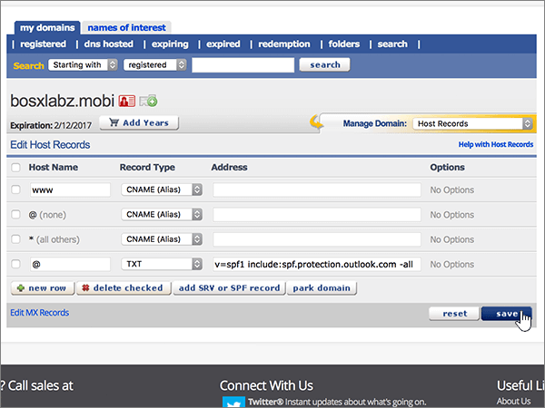

# DNS-records bij eNomCentral maken voor Microsoft

 **[Raadpleeg de veelgestelde vragen over domeinen](../setup/domains-faq.md)** als u niet kunt vinden wat u zoekt.

Als eNomCentral uw DNS-hostingprovider is, voert u de stappen in dit artikel uit om uw domein te verifiëren en DNS-records voor e-mail, Skype voor Bedrijven Online, enzovoort in te stellen.

Nadat u deze records bij eNomCentral hebt toegevoegd, is uw domein ingesteld voor gebruik met Microsoft-services.

> [!NOTE]
> Het duurt gewoonlijk ongeveer 15 minuten voordat DNS-wijzigingen van kracht worden. Het kan echter soms wat langer duren voordat een wijziging die u hebt aangebracht, is bijgewerkt via het DNS-systeem op internet. Als u na het toevoegen van de DNS-records problemen hebt met het ontvangen of verzenden van e-mail, raadpleegt u [Problemen oplossen nadat u uw domeinnaam of DNS-records hebt gewijzigd](../get-help-with-domains/find-and-fix-issues.md).

## Een TXT-record toevoegen voor verificatie

Voordat u uw domein met Microsoft kunt gebruiken, moet worden gecontroleerd dat u de eigenaar bent van het domein. Als u zich bij uw account bij de domeinregistrar kunt aanmelden en de DNS-record kunt maken, is dit voor Microsoft bewezen.

> [!NOTE]
> Deze record wordt alleen gebruikt om te verifiëren dat u de eigenaar van uw domein bent. Dit heeft verder geen invloed. U kunt deze record later desgewenst verwijderen.

Volg onderstaande stappen of [bekijk de video (start op 0:46)](https://support.microsoft.com/office/3766a9e8-77dd-4a42-908d-89b076143e7d).

1. Als u wilt beginnen, gaat u [via deze koppeling](https://www.enomcentral.com/domains/Domain-Manager.aspx?tab=registered) naar uw pagina met domeinen bij eNom Central. U wordt gevraagd u aan te melden.

   

2. Selecteer onder **My Domains**de naam van het domein dat u wilt bewerken.

   

3. Kies in de vervolgkeuzelijst **Manage Domain** de optie **Host Records**.

   

4. Typ of kopieer en plak de waarden uit de volgende tabel in de vakken voor de nieuwe record.

   Kies in de vervolgkeuzelijst de waarde **record type** .

   |Host name|Recordtype|Adres|
   |---|---|---|
   |@|TXT|MS=ms *XXXXXXXX*    **Opmerking:** Dit is een voorbeeld. Gebruik hier de specifieke waarde voor **Doel of adres waarnaar wordt verwezen** uit de tabel. [Hoe kan ik dit vinden?](../get-help-with-domains/information-for-dns-records.md)|

   

5. Selecteer **Opslaan**.

   

6. Wacht enkele minuten voordat u verder gaat, zodat de record die u zojuist hebt gemaakt via internet kan worden bijgewerkt.

Nu u de record hebt toegevoegd aan de site van uw domeinregistrar, gaat u terug naar Microsoft 365 en vraagt u of Microsoft 365 naar de record wil zoeken.

Wanneer in Microsoft de juiste TXT-record is gevonden, is uw domein gecontroleerd.

1. Ga in het Microsoft-beheercentrum naar **Instellingen** \> <a href="https://go.microsoft.com/fwlink/p/?linkid=834818" target="_blank">Domeinen</a>-pagina.

2. Kies op de pagina **Domeinen** de naam van het domein dat u verifieert.

3. Kies **Start setup** op de pagina **Setup**.

4. Kies **Verifiëren** op de pagina **Domein verifiëren**.

> [!NOTE]
> Het duurt gewoonlijk ongeveer 15 minuten voordat DNS-wijzigingen van kracht worden. Het kan echter soms wat langer duren voordat een wijziging die u hebt aangebracht, is bijgewerkt via het DNS-systeem op internet. Als u na het toevoegen van de DNS-records problemen hebt met het ontvangen of verzenden van e-mail, raadpleegt u [Problemen oplossen nadat u uw domeinnaam of DNS-records hebt gewijzigd](../get-help-with-domains/find-and-fix-issues.md).

## Voeg een MX-record toe zodat e-mail voor uw domein naar Microsoft wordt verzonden

Volg onderstaande stappen of [bekijk de video (start op 3:40)](https://support.microsoft.com/office/3766a9e8-77dd-4a42-908d-89b076143e7d).

1. Als u wilt beginnen, gaat u [via deze koppeling](https://www.enomcentral.com/domains/Domain-Manager.aspx?tab=registered) naar uw pagina met domeinen bij eNom Central. U wordt gevraagd u aan te melden.

   

2. Selecteer onder **My Domains**de naam van het domein dat u wilt bewerken.

   

3. Kies in de vervolgkeuzelijst **Manage Domain** de optie **Email Settings**.

   

4. Kies in de vervolgkeuzelijst **Service Selection** de optie **User (MX)**.

   

5. Typ of kopieer en plak de waarden uit de volgende tabel in de vakken voor de nieuwe record.

   |Host name|Adres|Pref|
   |---|---|---|
   |@| *\<domain-key\>*  . mail.protection.outlook.com.    **Deze waarde MOET eindigen op een punt (.)**   **Opmerking:** Neem uw  *\<domain-key\>*  van uw Microsoft-account. [Hoe kan ik dit vinden?](../get-help-with-domains/information-for-dns-records.md)|10    Zie [Wat is MX-prioriteit?](https://docs.microsoft.com/microsoft-365/admin/setup/domains-faq) voor meer informatie over prioriteit.   |

   

6. Selecteer **Opslaan**.

   

7. Als er andere MX-records zijn, schakelt u de selectievakjes voor deze records in om deze te selecteren.

   

8. Selecteer **Delete checked**.

   

## De CNAME-records toevoegen die zijn vereist voor Microsoft

Volg onderstaande stappen of [bekijk de video (start op 4:24)](https://support.microsoft.com/office/3766a9e8-77dd-4a42-908d-89b076143e7d).

1. Als u wilt beginnen, gaat u [via deze koppeling](https://www.enomcentral.com/domains/Domain-Manager.aspx?tab=registered) naar uw pagina met domeinen bij eNom Central. U wordt gevraagd u aan te melden.

   

2. Selecteer onder **My Domains**de naam van het domein dat u wilt bewerken.

   

3. Kies in de vervolgkeuzelijst **Manage Domain** de optie **Host Records**.

   

4. Selecteer **nieuwe rij**.

   

5. Typ of kopieer en plak de volgende waarden in de vakken voor de zes nieuwe records.

   Kies in de vervolgkeuzelijst de waarde **record type** .

   |Host name|Recordtype|Adres|
   |---|---|---|
   |autodiscover|CNAME (alias)|autodiscover.outlook.com.    **Deze waarde MOET eindigen op een punt (.)**|
   |sip|CNAME (alias)|sipdir.online.lync.com.    **Deze waarde MOET eindigen op een punt (.)**|
   |lyncdiscover|CNAME (alias)|webdir.online.lync.com.    **Deze waarde MOET eindigen op een punt (.)**|
   |enterpriseregistration|CNAME (alias)|enterpriseregistration.windows.net.    **Deze waarde MOET eindigen op een punt (.)**|
   |enterpriseenrollment|CNAME (alias)|enterpriseenrollment-s.manage.microsoft.com.    **Deze waarde MOET eindigen op een punt (.)**|

   

6. Selecteer **Opslaan**.

   

## Een TXT-record voor SPF toevoegen om spam tegen te gaan

> [!IMPORTANT]
> U kunt maximaal 1 TXT-record hebben voor SPF voor een domein. Als uw domein meer dan één SPF-record heeft, kan dit resulteren in e-mailfouten, evenals leverings- en spamclassificatieproblemen. Als u al een SPF-record voor uw domein hebt, hoeft u geen nieuwe te maken voor Microsoft. In plaats daarvan voegt u de vereiste Microsoft-waarden toe aan de huidige record, zodat u  *één*  SPF-record hebt die beide sets met waarden bevat.

Volg onderstaande stappen of [bekijk de video (start op 5:12)](https://support.microsoft.com/office/3766a9e8-77dd-4a42-908d-89b076143e7d).

1. Als u wilt beginnen, gaat u [via deze koppeling](https://www.enomcentral.com/domains/Domain-Manager.aspx?tab=registered) naar uw pagina met domeinen bij eNom Central. U wordt gevraagd u aan te melden.

   

2. Selecteer onder **My Domains**de naam van het domein dat u wilt bewerken.

   

3. Kies in de vervolgkeuzelijst **Manage Domain** de optie **Host Records**.

   

4. Typ of kopieer en plak de waarden uit de volgende tabel in de vakken voor de nieuwe record.

   Kies in de vervolgkeuzelijst de waarde **record type** .

   |Host name|Recordtype|Adres|
   |---|---|---|
   |@|TXT|v=spf1 include:spf.protection.outlook.com -all   **Opmerking:** het is raadzaam dit item te kopiëren en te plakken, zodat het spatiegebruik ongewijzigd blijft.|

   

5. Selecteer **Opslaan**.

   

## De twee SRV-records toevoegen die zijn vereist voor Microsoft

Volg onderstaande stappen of [bekijk de video (start op 5:50)](https://support.microsoft.com/office/3766a9e8-77dd-4a42-908d-89b076143e7d).

1. Als u wilt beginnen, gaat u [via deze koppeling](https://www.enomcentral.com/domains/Domain-Manager.aspx?tab=registered) naar uw pagina met domeinen bij eNom Central. U wordt gevraagd u aan te melden.

   

2. Selecteer onder **My Domains**de naam van het domein dat u wilt bewerken.

   

3. Kies in de vervolgkeuzelijst **Manage Domain** de optie **Host Records**.

   

4. Selecteer aan de rechterkant van **nieuwe rij**de optie **SRV-of SPF-record toevoegen**.

   

5. Typ of kopieer en plak de waarden uit de volgende tabel in de vakken voor de twee nieuwe records.

   |Service|Protocol|Priority|Dikte|Poort|Doel (hostnaam)|
   |---|---|---|---|---|---|
   |_sip|_tls|100|1|443|sipdir.online.lync.com.    **Deze waarde MOET eindigen op een punt (.)**|
   |_sipfederationtls|_tcp|100|1|5061|sipfed.online.lync.com.    **Deze waarde MOET eindigen op een punt (.)**|

   

6. Selecteer **Opslaan** .

   

> [!NOTE]
> Het duurt gewoonlijk ongeveer 15 minuten voordat DNS-wijzigingen van kracht worden. Het kan echter soms wat langer duren voordat een wijziging die u hebt aangebracht, is bijgewerkt via het DNS-systeem op internet. Als u na het toevoegen van de DNS-records problemen hebt met het ontvangen of verzenden van e-mail, raadpleegt u [Problemen oplossen nadat u uw domeinnaam of DNS-records hebt gewijzigd](../get-help-with-domains/find-and-fix-issues.md).
