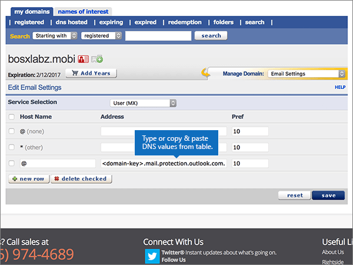
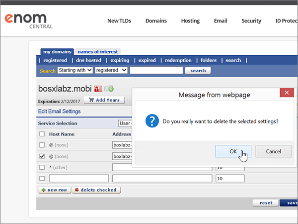

# DNS-records maken bij eNomCentral voor MicrosoftCreate DNS records at eNomCentral for Microsoft

 **[Raadpleeg de veelgestelde vragen over domeinen](../setup/domains-faq.md)** als u niet kunt vinden wat u zoekt.**[Check the Domains FAQ](../setup/domains-faq.md)** if you don't find what you're looking for. 
  
Als eNomCentral uw DNS-hostingprovider is, voert u de stappen in dit artikel uit om uw domein te verifiëren en DNS-records voor e-mail, Skype voor Bedrijven Online, enzovoort in te stellen.If eNomCentral is your DNS hosting provider, follow the steps in this article to verify your domain and set up DNS records for email, Skype for Business Online, and so on.
  
Nadat u deze records hebt toegevoegd bij eNomCentral, wordt uw domein ingesteld om te werken met Microsoft-services.After you add these records at eNomCentral, your domain will be set up to work with Microsoft services.
  
Zie Een openbare website gebruiken met Microsoft voor meer informatie over webhosting en DNS voor websites met [Microsoft.](https://support.office.com/article/choose-a-public-website-3325d50e-d131-403c-a278-7f3296fe33a9)To learn about webhosting and DNS for websites with Microsoft, see [Use a public website with Microsoft](https://support.office.com/article/choose-a-public-website-3325d50e-d131-403c-a278-7f3296fe33a9).
  
> [!NOTE]
>  Het duurt gewoonlijk ongeveer 15 minuten voordat DNS-wijzigingen van kracht worden. Het kan echter soms wat langer duren voordat een wijziging die u hebt aangebracht, is bijgewerkt via het DNS-systeem op internet. Als u na het toevoegen van de DNS-records problemen hebt met het ontvangen of verzenden van e-mail, raadpleegt u [Problemen oplossen nadat u uw domeinnaam of DNS-records hebt gewijzigd](../get-help-with-domains/find-and-fix-issues.md).Typically it takes about 15 minutes for DNS changes to take effect. However, it can occasionally take longer for a change you've made to update across the Internet's DNS system. If you're having trouble with mail flow or other issues after adding DNS records, see [Troubleshoot issues after changing your domain name or DNS records](../get-help-with-domains/find-and-fix-issues.md). 
  
## Een TXT-record toevoegen voor verificatieAdd a TXT record for verification

Voordat u uw domein bij Microsoft gebruikt, moeten we ervoor zorgen dat u eigenaar bent.Before you use your domain with Microsoft, we have to make sure that you own it. Uw mogelijkheid om in te loggen op uw account bij uw domeinregistrar en de DNS-record te maken bewijst microsoft dat u eigenaar bent van het domein.Your ability to log in to your account at your domain registrar and create the DNS record proves to Microsoft that you own the domain.
  
> [!NOTE]
> Deze record wordt alleen gebruikt om te verifiëren dat u de eigenaar van uw domein bent. Dit heeft verder geen invloed. U kunt deze record later desgewenst verwijderen.This record is used only to verify that you own your domain; it doesn't affect anything else. You can delete it later, if you like. 
  
Volg onderstaande stappen of [bekijk de video (start op 0:46)](https://support.office.com/article/Video-Create-DNS-records-at-eNomCentral-for-Office-365-3766a9e8-77dd-4a42-908d-89b076143e7d?ui=en-US&amp;rs=en-US&amp;ad=US).Follow the steps below or [watch the video (start at 0:46)](https://support.office.com/article/Video-Create-DNS-records-at-eNomCentral-for-Office-365-3766a9e8-77dd-4a42-908d-89b076143e7d?ui=en-US&amp;rs=en-US&amp;ad=US).
  
1. Als u wilt beginnen, gaat u [via deze koppeling](https://www.enomcentral.com/domains/Domain-Manager.aspx?tab=registered) naar uw pagina met domeinen bij eNom Central. U wordt gevraagd u aan te melden.To get started, go to your domains page at eNom Central by using [this link](https://www.enomcentral.com/domains/Domain-Manager.aspx?tab=registered). You'll be prompted to login.
    
    
  
2. Selecteer **onder mijn domeinen**de naam van het domein dat u wilt bewerken.Under **my domains**, select the name of the domain that you want to edit.
    
    
  
3. Kies in de vervolgkeuzelijst **Manage Domain** de optie **Host Records**.On the **Manage Domain** drop-down list, choose **Host Records**.
    
    
  
4. Typ of kopieer en plak de waarden uit de volgende tabel in de vakken voor de nieuwe record.In the boxes for the new record, type or copy and paste the values from the following table.
    
    (Kies in de vervolgkeuzelijst de waarde **Record Type**.)(Choose the **Record Type** value from the drop-down list.) 
    
    ||||
    |:-----|:-----|:-----|
    |**Host Name****Host Name**   |**Recordtype****Record Type**   |**Address****Address**   |
    |@    |TXTTXT    |MS=ms *XXXXXXXX*MS=ms *XXXXXXXX*    **Opmerking:** Dit is een voorbeeld.**Note:** This is an example. Gebruik hier de waarde van uw specifieke **bestemming of adrespunt** in de tabel.Use your specific **Destination or Points to Address** value here, from the table.           [Hoe kan ik dit vinden?How do I find this?](../get-help-with-domains/information-for-dns-records.md)          |
       
   
  
5. Selecteer **Opslaan**.Select **save**.
    
    
  
6. Wacht enkele minuten voordat u verder gaat, zodat de record die u zojuist hebt gemaakt via internet kan worden bijgewerkt.Wait a few minutes before you continue, so that the record you just created can update across the Internet.
    
Nu u de record op de site van uw domeinregistrar hebt toegevoegd, gaat u terug naar Microsoft 365 en vraagt u Microsoft 365 om de record te zoeken.Now that you've added the record at your domain registrar's site, you'll go back to Microsoft 365 and request Microsoft 365 to look for the record.
  
Wanneer Microsoft de juiste TXT-record vindt, wordt uw domein geverifieerd.When Microsoft finds the correct TXT record, your domain is verified.
  
1. Ga in het Microsoft-beheercentrum naar de pagina \> <a href="https://go.microsoft.com/fwlink/p/?linkid=834818" target="_blank">Instellingendomeinen.</a> **Settings**In the Microsoft admin center, go to the **Settings** \> <a href="https://go.microsoft.com/fwlink/p/?linkid=834818" target="_blank">Domains</a> page.

    
2. Kies op de pagina **Domeinen** de naam van het domein dat u verifieert.On the **Domains** page, select the domain that you are verifying. 
    
    
  
3. Kies **Start setup** op de pagina **Setup**.On the **Setup** page, select **Start setup**.
    
    
  
4. Kies **Verifiëren** op de pagina **Domein verifiëren**.On the **Verify domain** page, select **Verify**.
    
    
  
> [!NOTE]
>  Het duurt gewoonlijk ongeveer 15 minuten voordat DNS-wijzigingen van kracht worden. Het kan echter soms wat langer duren voordat een wijziging die u hebt aangebracht, is bijgewerkt via het DNS-systeem op internet. Als u na het toevoegen van de DNS-records problemen hebt met het ontvangen of verzenden van e-mail, raadpleegt u [Problemen oplossen nadat u uw domeinnaam of DNS-records hebt gewijzigd](../get-help-with-domains/find-and-fix-issues.md).Typically it takes about 15 minutes for DNS changes to take effect. However, it can occasionally take longer for a change you've made to update across the Internet's DNS system. If you're having trouble with mail flow or other issues after adding DNS records, see [Troubleshoot issues after changing your domain name or DNS records](../get-help-with-domains/find-and-fix-issues.md). 
  
## Voeg een MX-record toe, zodat e-mail voor uw domein naar Microsoft komtAdd an MX record so email for your domain will come to Microsoft

Volg onderstaande stappen of [bekijk de video (start op 3:40)](https://support.office.com/article/Video-Create-DNS-records-at-eNomCentral-for-Office-365-3766a9e8-77dd-4a42-908d-89b076143e7d?ui=en-US&amp;rs=en-US&amp;ad=US).Follow the steps below or [watch the video (start at 3:40)](https://support.office.com/article/Video-Create-DNS-records-at-eNomCentral-for-Office-365-3766a9e8-77dd-4a42-908d-89b076143e7d?ui=en-US&amp;rs=en-US&amp;ad=US).
  
1. Als u wilt beginnen, gaat u [via deze koppeling](https://www.enomcentral.com/domains/Domain-Manager.aspx?tab=registered) naar uw pagina met domeinen bij eNom Central. U wordt gevraagd u aan te melden.To get started, go to your domains page at eNom Central by using [this link](https://www.enomcentral.com/domains/Domain-Manager.aspx?tab=registered). You'll be prompted to login.
    
    
  
2. Selecteer **onder mijn domeinen**de naam van het domein dat u wilt bewerken.Under **my domains**, select the name of the domain that you want to edit.
    
    
  
3. Kies in de vervolgkeuzelijst **Manage Domain** de optie **Email Settings**.On the **Manage Domain** drop-down list, choose **Email Settings**.
    
    
  
4. Kies in de vervolgkeuzelijst **Service Selection** de optie **User (MX)**.On the **Service Selection** drop-down list, choose **User (MX)**.
    
    
  
5. Typ of kopieer en plak de waarden uit de volgende tabel in de vakken voor de nieuwe record.In the boxes for the new record, type or copy and paste the values from the following table.
    
    |**Hostnaam****Host Name**|**Address****Address**|**Pref****Pref**|
    |:-----|:-----|:-----|
    |@    | *\<domeinsleutel\>*  .mail.protection.outlook.com.*\<domain-key\>*  .mail.protection.outlook.com.    **Deze waarde MOET eindigen op een punt (.)****This value MUST end with a period (.)**   **Let op:** Haal uw \* \<domeinsleutel\> \* uit uw Microsoft-account.**Note:** Get your  *\<domain-key\>*  from your Microsoft account.           [Hoe kan ik dit vinden?How do I find this?](../get-help-with-domains/information-for-dns-records.md)          |1010    Zie [Wat is MX-prioriteit?](https://support.office.com/article/2784cc4d-95be-443d-b5f7-bb5dd867ba83.aspx) voor meer informatie over prioriteit.   For more information about priority, see [What is MX priority?](https://support.office.com/article/2784cc4d-95be-443d-b5f7-bb5dd867ba83.aspx)   |
       
   
  
6. Selecteer **Opslaan**.Select **save**.
    
    
  
7. Als er andere MX-records zijn, schakelt u de selectievakjes voor deze records in om deze te selecteren.If there are any other existing MX records, select the check boxes for those records to select them.
    
    
  
8. Selecteer **aangevinkt verwijderen**.Select **delete checked**.
    
    
  
## De CNAME-records toevoegen die voor Microsoft vereist zijnAdd the CNAME records that are required for Microsoft 

Volg onderstaande stappen of [bekijk de video (start op 4:24)](https://support.office.com/article/Video-Create-DNS-records-at-eNomCentral-for-Office-365-3766a9e8-77dd-4a42-908d-89b076143e7d?ui=en-US&amp;rs=en-US&amp;ad=US).Follow the steps below or [watch the video (start at 4:24)](https://support.office.com/article/Video-Create-DNS-records-at-eNomCentral-for-Office-365-3766a9e8-77dd-4a42-908d-89b076143e7d?ui=en-US&amp;rs=en-US&amp;ad=US).
  
1. Als u wilt beginnen, gaat u [via deze koppeling](https://www.enomcentral.com/domains/Domain-Manager.aspx?tab=registered) naar uw pagina met domeinen bij eNom Central. U wordt gevraagd u aan te melden.To get started, go to your domains page at eNom Central by using [this link](https://www.enomcentral.com/domains/Domain-Manager.aspx?tab=registered). You'll be prompted to login.
    
    
  
2. Selecteer **onder mijn domeinen**de naam van het domein dat u wilt bewerken.Under **my domains**, select the name of the domain that you want to edit.
    
    
  
3. Kies in de vervolgkeuzelijst **Manage Domain** de optie **Host Records**.On the **Manage Domain** drop-down list, choose **Host Records**.
    
    
  
4. Selecteer **nieuwe rij**.Select **new row**.
    
    
  
5. Typ of kopieer en plak de volgende waarden in de vakken voor de zes nieuwe records.In the boxes for the six new records, type or copy and paste the following values.
    
        (Choose the **Record Type** value from the drop-down list.) 
        
    |**Host Name****Host Name**|**Recordtype****Record Type**|**Address****Address**|
    |:-----|:-----|:-----|
    |autodiscoverautodiscover    |CNAME (alias)CNAME (Alias)    |autodiscover.outlook.com.autodiscover.outlook.com.    **Deze waarde MOET eindigen op een punt (.)****This value MUST end with a period (.)**   |
    |sipsip    |CNAME (alias)CNAME (Alias)    |sipdir.online.lync.com.sipdir.online.lync.com.    **Deze waarde MOET eindigen op een punt (.)****This value MUST end with a period (.)**   |
    |lyncdiscoverlyncdiscover    |CNAME (alias)CNAME (Alias)    |webdir.online.lync.com.webdir.online.lync.com.    **Deze waarde MOET eindigen op een punt (.)****This value MUST end with a period (.)**   |
    |enterpriseregistrationenterpriseregistration    |CNAME (alias)CNAME (Alias)    |enterpriseregistration.windows.net.enterpriseregistration.windows.net.    **Deze waarde MOET eindigen op een punt (.)****This value MUST end with a period (.)**   |
    |enterpriseenrollmententerpriseenrollment    |CNAME (alias)CNAME (Alias)    |enterpriseenrollment-s.manage.microsoft.com.enterpriseenrollment-s.manage.microsoft.com.    **Deze waarde MOET eindigen op een punt (.)****This value MUST end with a period (.)**   |
   
    
  
6. Selecteer **Opslaan**.Select **save**.
    
    
  
## Een TXT-record voor SPF toevoegen om spam tegen te gaanAdd a TXT record for SPF to help prevent email spam

> [!IMPORTANT]
> U kunt maximaal 1 TXT-record hebben voor SPF voor een domein.You cannot have more than one TXT record for SPF for a domain. Als uw domein meer dan één SPF-record heeft, kan dit resulteren in e-mailfouten, evenals leverings- en spamclassificatieproblemen.If your domain has more than one SPF record, you'll get email errors, as well as delivery and spam classification issues. Als u al een SPF-record voor uw domein hebt, maakt u geen nieuwe voor Microsoft.If you already have an SPF record for your domain, don't create a new one for Microsoft. Voeg in plaats daarvan de vereiste Microsoft-waarden toe aan de huidige record, zodat u *één* SPF-record hebt die beide waardensets bevat.Instead, add the required Microsoft values to the current record so that you have a  *single*  SPF record that includes both sets of values.
  
Volg onderstaande stappen of [bekijk de video (start op 5:12)](https://support.office.com/article/Video-Create-DNS-records-at-eNomCentral-for-Office-365-3766a9e8-77dd-4a42-908d-89b076143e7d?ui=en-US&amp;rs=en-US&amp;ad=US).Follow the steps below or [watch the video (start at 5:12)](https://support.office.com/article/Video-Create-DNS-records-at-eNomCentral-for-Office-365-3766a9e8-77dd-4a42-908d-89b076143e7d?ui=en-US&amp;rs=en-US&amp;ad=US).
  
1. Als u wilt beginnen, gaat u [via deze koppeling](https://www.enomcentral.com/domains/Domain-Manager.aspx?tab=registered) naar uw pagina met domeinen bij eNom Central. U wordt gevraagd u aan te melden.To get started, go to your domains page at eNom Central by using [this link](https://www.enomcentral.com/domains/Domain-Manager.aspx?tab=registered). You'll be prompted to login.
    
    
  
2. Selecteer **onder mijn domeinen**de naam van het domein dat u wilt bewerken.Under **my domains**, select the name of the domain that you want to edit.
    
    
  
3. Kies in de vervolgkeuzelijst **Manage Domain** de optie **Host Records**.On the **Manage Domain** drop-down list, choose **Host Records**.
    
    
  
4. Typ of kopieer en plak de waarden uit de volgende tabel in de vakken voor de nieuwe record.In the boxes for the new record, type or copy and paste the values from the following table.
    
    (Kies in de vervolgkeuzelijst de waarde **Record Type**.)(Choose the **Record Type** value from the drop-down list.) 
    
    |**Host Name****Host Name**|**Recordtype****Record Type**|**Address****Address**|
    |:-----|:-----|:-----|
    |@    |TXTTXT    |v=spf1 include:spf.protection.outlook.com -allv=spf1 include:spf.protection.outlook.com -all   **Opmerking:** het is raadzaam dit item te kopiëren en te plakken, zodat het spatiegebruik ongewijzigd blijft.**Note:** We recommend copying and pasting this entry, so that all of the spacing stays correct.           |
   
   
  
5. Selecteer **Opslaan**.Select **save**.
    
    
  
## Voeg de twee SRV-records toe die nodig zijn voor MicrosoftAdd the two SRV records that are required for Microsoft

Volg onderstaande stappen of [bekijk de video (start op 5:50)](https://support.office.com/article/Video-Create-DNS-records-at-eNomCentral-for-Office-365-3766a9e8-77dd-4a42-908d-89b076143e7d?ui=en-US&amp;rs=en-US&amp;ad=US).Follow the steps below or [watch the video (start at 5:50)](https://support.office.com/article/Video-Create-DNS-records-at-eNomCentral-for-Office-365-3766a9e8-77dd-4a42-908d-89b076143e7d?ui=en-US&amp;rs=en-US&amp;ad=US).
  
1. Als u wilt beginnen, gaat u [via deze koppeling](https://www.enomcentral.com/domains/Domain-Manager.aspx?tab=registered) naar uw pagina met domeinen bij eNom Central. U wordt gevraagd u aan te melden.To get started, go to your domains page at eNom Central by using [this link](https://www.enomcentral.com/domains/Domain-Manager.aspx?tab=registered). You'll be prompted to login.
    
    
  
2. Selecteer **onder mijn domeinen**de naam van het domein dat u wilt bewerken.Under **my domains**, select the name of the domain that you want to edit.
    
    
  
3. Kies in de vervolgkeuzelijst **Manage Domain** de optie **Host Records**.On the **Manage Domain** drop-down list, choose **Host Records**.
    
    
  
4. Selecteer Rechts van **de nieuwe rij**De optie **SRV- of SPF-record toevoegen**.To the right of **new row**, select **add SRV or SPF record**.
    
    
  
5. Typ of kopieer en plak de waarden uit de volgende tabel in de vakken voor de twee nieuwe records.In the boxes for the two new records, type or copy and paste the values from the following table.
    
    |**Service****Service**|**Protocol****Protocol**|**Prioriteit****Priority**|**Gewicht****Weight**|**Poort****Port**|**Target          (Hostname)****Target          (Hostname)**|
    |:-----|:-----|:-----|:-----|:-----|:-----|
    |_sip_sip    |_tls_tls    |100100    |11    |443443    |sipdir.online.lync.com.sipdir.online.lync.com.    **Deze waarde MOET eindigen op een punt (.)****This value MUST end with a period (.)**   |
    |_sipfederationtls_sipfederationtls    |_tcp_tcp    |100100    |11    |50615061    |sipfed.online.lync.com.sipfed.online.lync.com.    **Deze waarde MOET eindigen op een punt (.)****This value MUST end with a period (.)**   |
   
    
  
6. Selecteer **opslaan**Select **save**
    
    
  
> [!NOTE]
>  Het duurt gewoonlijk ongeveer 15 minuten voordat DNS-wijzigingen van kracht worden. Het kan echter soms wat langer duren voordat een wijziging die u hebt aangebracht, is bijgewerkt via het DNS-systeem op internet. Als u na het toevoegen van de DNS-records problemen hebt met het ontvangen of verzenden van e-mail, raadpleegt u [Problemen oplossen nadat u uw domeinnaam of DNS-records hebt gewijzigd](../get-help-with-domains/find-and-fix-issues.md).Typically it takes about 15 minutes for DNS changes to take effect. However, it can occasionally take longer for a change you've made to update across the Internet's DNS system. If you're having trouble with mail flow or other issues after adding DNS records, see [Troubleshoot issues after changing your domain name or DNS records](../get-help-with-domains/find-and-fix-issues.md). 
  

