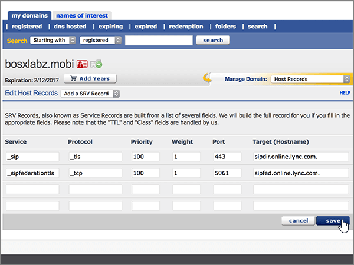

# DNS-records maken bij eNomCentral voor Microsoft

 **[Raadpleeg de veelgestelde vragen over domeinen](../setup/domains-faq.md)** als u niet kunt vinden wat u zoekt. 
  
Als eNomCentral uw DNS-hostingprovider is, voert u de stappen in dit artikel uit om uw domein te verifiëren en DNS-records voor e-mail, Skype voor Bedrijven Online, enzovoort in te stellen.
  
Nadat u deze records hebt toegevoegd bij eNomCentral, wordt uw domein ingesteld om te werken met Microsoft-services.

  
> [!NOTE]
>  Typically it takes about 15 minutes for DNS changes to take effect. However, it can occasionally take longer for a change you've made to update across the Internet's DNS system. If you're having trouble with mail flow or other issues after adding DNS records, see [Troubleshoot issues after changing your domain name or DNS records](../get-help-with-domains/find-and-fix-issues.md). 
  
## Een TXT-record toevoegen voor verificatie

Before you use your domain with Microsoft, we have to make sure that you own it. Your ability to log in to your account at your domain registrar and create the DNS record proves to Microsoft that you own the domain.
  
> [!NOTE]
> This record is used only to verify that you own your domain; it doesn't affect anything else. You can delete it later, if you like. 
  
Volg onderstaande stappen of [bekijk de video (start op 0:46)](https://support.microsoft.com/office/3766a9e8-77dd-4a42-908d-89b076143e7d).
  
1. To get started, go to your domains page at eNom Central by using [this link](https://www.enomcentral.com/domains/Domain-Manager.aspx?tab=registered). You'll be prompted to login.
    
    
  
2. Selecteer onder **mijn domeinen**de naam van het domein dat u wilt bewerken.
    
    
  
3. Kies in de vervolgkeuzelijst **Manage Domain** de optie **Host Records**.
    
    
  
4. Typ of kopieer en plak de waarden uit de volgende tabel in de vakken voor de nieuwe record.
    
    Kies de waarde **Recordtype** in de vervolgkeuzelijst.
    
    ||||
    |:-----|:-----|:-----|
    |**Host Name**   |**Recordtype**   |**Address**   |
    |@    |TXT    |MS=ms *XXXXXXXX*    **Opmerking:** Dit is een voorbeeld. Gebruik hier de specifieke waarde voor **Doel of adres waarnaar wordt verwezen** uit de tabel.           [Hoe kan ik dit vinden?](../get-help-with-domains/information-for-dns-records.md)          |
       
   
  
5. Selecteer **opslaan**.
    
    
  
6. Wacht enkele minuten voordat u verder gaat, zodat de record die u zojuist hebt gemaakt via internet kan worden bijgewerkt.
    
Nu u de record hebt toegevoegd aan de site van uw domeinregistrar, gaat u terug naar Microsoft 365 en vraagt u of Microsoft 365 naar de record wil zoeken.
  
Wanneer in Microsoft de juiste TXT-record is gevonden, is uw domein gecontroleerd.
  
1. Ga in het Microsoft-beheercentrum naar **Instellingen** \> <a href="https://go.microsoft.com/fwlink/p/?linkid=834818" target="_blank">Domeinen</a>-pagina.

    
2. Kies op de pagina **Domeinen** de naam van het domein dat u verifieert. 
    
    
  
3. Kies **Start setup** op de pagina **Setup**.
    
    
  
4. Kies **Verifiëren** op de pagina **Domein verifiëren**.
    
    
  
> [!NOTE]
>  Typically it takes about 15 minutes for DNS changes to take effect. However, it can occasionally take longer for a change you've made to update across the Internet's DNS system. If you're having trouble with mail flow or other issues after adding DNS records, see [Troubleshoot issues after changing your domain name or DNS records](../get-help-with-domains/find-and-fix-issues.md). 
  
## Voeg een MX-record toe zodat e-mail voor uw domein naar Microsoft wordt verzonden

Volg onderstaande stappen of [bekijk de video (start op 3:40)](https://support.microsoft.com/office/3766a9e8-77dd-4a42-908d-89b076143e7d).
  
1. To get started, go to your domains page at eNom Central by using [this link](https://www.enomcentral.com/domains/Domain-Manager.aspx?tab=registered). You'll be prompted to login.
    
    
  
2. Selecteer onder **mijn domeinen**de naam van het domein dat u wilt bewerken.
    
    
  
3. Kies in de vervolgkeuzelijst **Manage Domain** de optie **Email Settings**.
    
    
  
4. Kies in de vervolgkeuzelijst **Service Selection** de optie **User (MX)**.
    
    
  
5. Typ of kopieer en plak de waarden uit de volgende tabel in de vakken voor de nieuwe record.
    
    |**Hostnaam**|**Address**|**Pref**|
    |:-----|:-----|:-----|
    |@    | *\<domain-key\>* mail.protection.outlook.com.    **Deze waarde MOET eindigen op een punt (.)**   **Let op:** Haal je *\<domain-key\>* van je Microsoft-account.           [Hoe kan ik dit vinden?](../get-help-with-domains/information-for-dns-records.md)          |10    Zie [Wat is MX-prioriteit?](https://docs.microsoft.com/microsoft-365/admin/setup/domains-faq) voor meer informatie over prioriteit.      |
       
   
  
6. Selecteer **opslaan**.
    
    
  
7. Als er andere MX-records zijn, schakelt u de selectievakjes voor deze records in om deze te selecteren.
    
    
  
8. Selecteer **Verwijderen gecontroleerd**.
    
    
  
## De CNAME-records toevoegen die zijn vereist voor Microsoft 

Volg onderstaande stappen of [bekijk de video (start op 4:24)](https://support.microsoft.com/office/3766a9e8-77dd-4a42-908d-89b076143e7d).
  
1. To get started, go to your domains page at eNom Central by using [this link](https://www.enomcentral.com/domains/Domain-Manager.aspx?tab=registered). You'll be prompted to login.
    
    
  
2. Selecteer onder **mijn domeinen**de naam van het domein dat u wilt bewerken.
    
    
  
3. Kies in de vervolgkeuzelijst **Manage Domain** de optie **Host Records**.
    
    
  
4. Selecteer **een nieuwe rij**.
    
    
  
5. Typ of kopieer en plak de volgende waarden in de vakken voor de zes nieuwe records.
    
Kies de waarde **Recordtype** in de vervolgkeuzelijst.
        
    |**Host Name**|**Recordtype**|**Address**|
    |:-----|:-----|:-----|
    |autodiscover    |CNAME (alias)    |autodiscover.outlook.com.    **Deze waarde MOET eindigen op een punt (.)**   |
    |sip    |CNAME (alias)    |sipdir.online.lync.com.    **Deze waarde MOET eindigen op een punt (.)**   |
    |lyncdiscover    |CNAME (alias)    |webdir.online.lync.com.    **Deze waarde MOET eindigen op een punt (.)**   |
    |enterpriseregistration    |CNAME (alias)    |enterpriseregistration.windows.net.    **Deze waarde MOET eindigen op een punt (.)**   |
    |enterpriseenrollment    |CNAME (alias)    |enterpriseenrollment-s.manage.microsoft.com.    **Deze waarde MOET eindigen op een punt (.)**   |
   
    
  
6. Selecteer **opslaan**.
    
    
  
## Een TXT-record voor SPF toevoegen om spam tegen te gaan

> [!IMPORTANT]
> U kunt maximaal 1 TXT-record hebben voor SPF voor een domein. Als uw domein meer dan één SPF-record heeft, kan dit resulteren in e-mailfouten, evenals leverings- en spamclassificatieproblemen. Als u al een SPF-record voor uw domein hebt, hoeft u geen nieuwe te maken voor Microsoft. Voeg in plaats daarvan de vereiste Microsoft-waarden toe aan de huidige record, zodat u *één* SPF-record hebt die beide waardensets bevat.
  
Volg onderstaande stappen of [bekijk de video (start op 5:12)](https://support.microsoft.com/office/3766a9e8-77dd-4a42-908d-89b076143e7d).
  
1. To get started, go to your domains page at eNom Central by using [this link](https://www.enomcentral.com/domains/Domain-Manager.aspx?tab=registered). You'll be prompted to login.
    
    
  
2. Selecteer onder **mijn domeinen**de naam van het domein dat u wilt bewerken.
    
    
  
3. Kies in de vervolgkeuzelijst **Manage Domain** de optie **Host Records**.
    
    
  
4. Typ of kopieer en plak de waarden uit de volgende tabel in de vakken voor de nieuwe record.
    
Kies de waarde **Recordtype** in de vervolgkeuzelijst.
    
    |**Host Name**|**Recordtype**|**Address**|
    |:-----|:-----|:-----|
    |@    |TXT    |v=spf1 include:spf.protection.outlook.com -all   **Opmerking:** het is raadzaam dit item te kopiëren en te plakken, zodat het spatiegebruik ongewijzigd blijft.           |
   
   
  
5. Selecteer **opslaan**.
    
    
  
## De twee SRV-records toevoegen die zijn vereist voor Microsoft

Volg onderstaande stappen of [bekijk de video (start op 5:50)](https://support.microsoft.com/office/3766a9e8-77dd-4a42-908d-89b076143e7d).
  
1. To get started, go to your domains page at eNom Central by using [this link](https://www.enomcentral.com/domains/Domain-Manager.aspx?tab=registered). You'll be prompted to login.
    
    
  
2. Selecteer onder **mijn domeinen**de naam van het domein dat u wilt bewerken.
    
    
  
3. Kies in de vervolgkeuzelijst **Manage Domain** de optie **Host Records**.
    
    
  
4. Selecteer rechts van de **nieuwe rij** **SRV- of SPF-record toevoegen**.
    
    
  
5. Typ of kopieer en plak de waarden uit de volgende tabel in de vakken voor de twee nieuwe records.
    
    |**Service**|**Protocol**|**Prioriteit**|**Gewicht**|**Poort**|**Target          (Hostname)**|
    |:-----|:-----|:-----|:-----|:-----|:-----|
    |_sip    |_tls    |100    |1    |443    |sipdir.online.lync.com.    **Deze waarde MOET eindigen op een punt (.)**   |
    |_sipfederationtls    |_tcp    |100    |1    |5061    |sipfed.online.lync.com.    **Deze waarde MOET eindigen op een punt (.)**   |
   
    
  
6. Opslaan **selecteren**
    
    
  
> [!NOTE]
>  Typically it takes about 15 minutes for DNS changes to take effect. However, it can occasionally take longer for a change you've made to update across the Internet's DNS system. If you're having trouble with mail flow or other issues after adding DNS records, see [Troubleshoot issues after changing your domain name or DNS records](../get-help-with-domains/find-and-fix-issues.md). 
  

