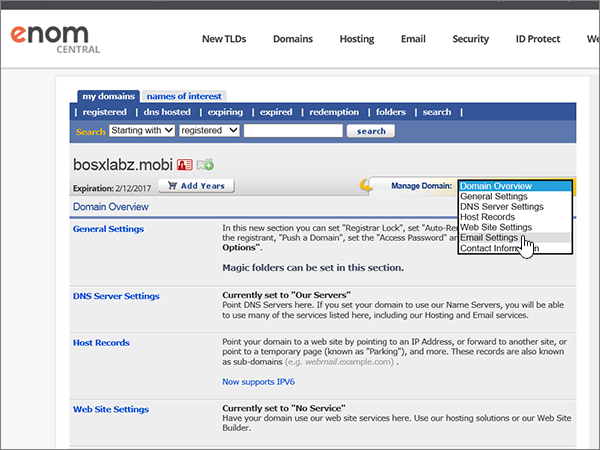

# DNS-records maken op eNomCentral voor Office 365

 **[Raadpleeg de veelgestelde vragen over domeinen](../setup/domains-faq.md)** als u niet kunt vinden wat u zoekt. 
  
Als eNomCentral uw DNS-hostingprovider is, voert u de stappen in dit artikel uit om uw domein te verifiëren en DNS-records voor e-mail, Skype voor Bedrijven Online, enzovoort in te stellen.
  
Nadat u deze records bij eNomCentral hebt toegevoegd, is uw domein ingesteld voor gebruik met Office 365-services.
  
Zie [Een openbare website gebruiken met Office 365](https://support.office.com/article/choose-a-public-website-3325d50e-d131-403c-a278-7f3296fe33a9) voor informatie over webhosting en DNS voor websites met Office 365.
  
> [!NOTE]
>  Het duurt gewoonlijk ongeveer 15 minuten voordat DNS-wijzigingen van kracht worden. Het kan echter soms wat langer duren voordat een wijziging die u hebt aangebracht, is bijgewerkt via het DNS-systeem op internet. Als u na het toevoegen van de DNS-records problemen hebt met het ontvangen of verzenden van e-mail, raadpleegt u [Problemen oplossen nadat u uw domeinnaam of DNS-records hebt gewijzigd](../get-help-with-domains/find-and-fix-issues.md). 
  
## Een TXT-record toevoegen voor verificatie

Voordat u uw domein met Office 365 kunt gaan gebruiken, moet worden gecontroleerd dat u de eigenaar bent van het domein. Als u zich bij uw account bij de domeinregistrar kunt aanmelden en de DNS-record kunt maken, is dit voor Office 365 bewezen.
  
> [!NOTE]
> Deze record wordt alleen gebruikt om te verifiëren dat u de eigenaar van uw domein bent. Dit heeft verder geen invloed. U kunt deze record later desgewenst verwijderen. 
  
Volg onderstaande stappen of [bekijk de video (start op 0:46)](https://support.office.com/article/Video-Create-DNS-records-at-eNomCentral-for-Office-365-3766a9e8-77dd-4a42-908d-89b076143e7d?ui=en-US&amp;rs=en-US&amp;ad=US).
  
1. Als u wilt beginnen, gaat u [via deze koppeling](https://www.enomcentral.com/domains/Domain-Manager.aspx?tab=registered) naar uw pagina met domeinen bij eNom Central. U wordt gevraagd u aan te melden.
    
    
  
2. Selecteer **onder mijn domeinen**de naam van het domein dat u wilt bewerken.
    
    
  
3. Kies in de vervolgkeuzelijst **Manage Domain** de optie **Host Records**.
    
    
  
4. Typ of kopieer en plak de waarden uit de volgende tabel in de vakken voor de nieuwe record.
    
    (Kies in de vervolgkeuzelijst de waarde **Record Type**.) 
    
    ||||
    |:-----|:-----|:-----|
    |**Host Name**   |**Recordtype**   |**Address**   |
    |@    |TXT    |MS=ms *XXXXXXXX*    **Opmerking:** Dit is een voorbeeld. Gebruik hier de specifieke waarde voor **Doel of adres waarnaar wordt verwezen** uit de tabel in Office 365.           [Hoe kan ik dit vinden?](../get-help-with-domains/information-for-dns-records.md)          |
       
   
  
5. Selecteer **Opslaan**.
    
    
  
6. Wacht enkele minuten voordat u verder gaat, zodat de record die u zojuist hebt gemaakt via internet kan worden bijgewerkt.
    
Nu u de record hebt toegevoegd aan de site van uw domeinregistrar, gaat u terug naar Office 365 en vraagt u of Office 365 naar de record wil zoeken.
  
Wanneer in Office 365 de juiste TXT-record is gevonden, is uw domein gecontroleerd.
  
1. Ga in het beheercentrum naar de pagina \> <a href="https://go.microsoft.com/fwlink/p/?linkid=834818" target="_blank">Instellingendomeinen.</a> **Settings**

    
2. Selecteer **op** de pagina Domeinen het domein dat u verifieert. 
    
    
  
3. Selecteer **op** de pagina Setup de optie **Installatie starten**.
    
    
  
4. Selecteer **op** de pagina Domein verifiëren de optie **Verifiëren**.
    
    
  
> [!NOTE]
>  Het duurt gewoonlijk ongeveer 15 minuten voordat DNS-wijzigingen van kracht worden. Het kan echter soms wat langer duren voordat een wijziging die u hebt aangebracht, is bijgewerkt via het DNS-systeem op internet. Als u na het toevoegen van de DNS-records problemen hebt met het ontvangen of verzenden van e-mail, raadpleegt u [Problemen oplossen nadat u uw domeinnaam of DNS-records hebt gewijzigd](../get-help-with-domains/find-and-fix-issues.md). 
  
## Voeg een MX-record toe zodat e-mail voor uw domein bij Office 365 terechtkomt

Volg onderstaande stappen of [bekijk de video (start op 3:40)](https://support.office.com/article/Video-Create-DNS-records-at-eNomCentral-for-Office-365-3766a9e8-77dd-4a42-908d-89b076143e7d?ui=en-US&amp;rs=en-US&amp;ad=US).
  
1. Als u wilt beginnen, gaat u [via deze koppeling](https://www.enomcentral.com/domains/Domain-Manager.aspx?tab=registered) naar uw pagina met domeinen bij eNom Central. U wordt gevraagd u aan te melden.
    
    
  
2. Selecteer **onder mijn domeinen**de naam van het domein dat u wilt bewerken.
    
    
  
3. Kies in de vervolgkeuzelijst **Manage Domain** de optie **Email Settings**.
    
    
  
4. Kies in de vervolgkeuzelijst **Service Selection** de optie **User (MX)**.
    
    
  
5. Typ of kopieer en plak de waarden uit de volgende tabel in de vakken voor de nieuwe record.
    
    |**Hostnaam**|**Address**|**Pref**|
    |:-----|:-----|:-----|
    |@    | *\<domeinsleutel\>*  .mail.protection.outlook.com.    **Deze waarde MOET eindigen op een punt (.)**   **Let op:** Haal uw * \<domeinsleutel\> * op uit uw Office 365-account.           [Hoe kan ik dit vinden?](../get-help-with-domains/information-for-dns-records.md)          |10    Zie [Wat is MX-prioriteit?](https://support.office.com/article/2784cc4d-95be-443d-b5f7-bb5dd867ba83.aspx) voor meer informatie over prioriteit.      |
       
   
  
6. Selecteer **Opslaan**.
    
    
  
7. Als er andere MX-records zijn, schakelt u de selectievakjes voor deze records in om deze te selecteren.
    
    
  
8. Selecteer **aangevinkt verwijderen**.
    
    
  
## De CNAME-records toevoegen die voor Office 365 vereist zijn

Volg onderstaande stappen of [bekijk de video (start op 4:24)](https://support.office.com/article/Video-Create-DNS-records-at-eNomCentral-for-Office-365-3766a9e8-77dd-4a42-908d-89b076143e7d?ui=en-US&amp;rs=en-US&amp;ad=US).
  
1. Als u wilt beginnen, gaat u [via deze koppeling](https://www.enomcentral.com/domains/Domain-Manager.aspx?tab=registered) naar uw pagina met domeinen bij eNom Central. U wordt gevraagd u aan te melden.
    
    
  
2. Selecteer **onder mijn domeinen**de naam van het domein dat u wilt bewerken.
    
    
  
3. Kies in de vervolgkeuzelijst **Manage Domain** de optie **Host Records**.
    
    
  
4. Selecteer **nieuwe rij**.
    
    
  
5. Typ of kopieer en plak de volgende waarden in de vakken voor de zes nieuwe records.
    
        (Choose the **Record Type** value from the drop-down list.) 
        
    |**Host Name**|**Recordtype**|**Address**|
    |:-----|:-----|:-----|
    |autodiscover    |CNAME (alias)    |autodiscover.outlook.com.    **Deze waarde MOET eindigen op een punt (.)**   |
    |sip    |CNAME (alias)    |sipdir.online.lync.com.    **Deze waarde MOET eindigen op een punt (.)**   |
    |lyncdiscover    |CNAME (alias)    |webdir.online.lync.com.    **Deze waarde MOET eindigen op een punt (.)**   |
    |enterpriseregistration    |CNAME (alias)    |enterpriseregistration.windows.net.    **Deze waarde MOET eindigen op een punt (.)**   |
    |enterpriseenrollment    |CNAME (alias)    |enterpriseenrollment-s.manage.microsoft.com.    **Deze waarde MOET eindigen op een punt (.)**   |
   
    
  
6. Selecteer **Opslaan**.
    
    
  
## Een TXT-record voor SPF toevoegen om spam tegen te gaan

> [!IMPORTANT]
> U kunt maximaal 1 TXT-record hebben voor SPF voor een domein. Als uw domein meer dan één SPF-record heeft, kan dit resulteren in e-mailfouten, evenals leverings- en spamclassificatieproblemen. Als u al een SPF-record voor uw domein hebt, hoeft u geen nieuwe voor Office 365 te maken. In plaats daarvan voegt u de vereiste Office 365-waarden toe aan de huidige record, zodat u beschikt over  *één*  SPF-record waarin beide sets waarden zijn opgenomen.
  
Volg onderstaande stappen of [bekijk de video (start op 5:12)](https://support.office.com/article/Video-Create-DNS-records-at-eNomCentral-for-Office-365-3766a9e8-77dd-4a42-908d-89b076143e7d?ui=en-US&amp;rs=en-US&amp;ad=US).
  
1. Als u wilt beginnen, gaat u [via deze koppeling](https://www.enomcentral.com/domains/Domain-Manager.aspx?tab=registered) naar uw pagina met domeinen bij eNom Central. U wordt gevraagd u aan te melden.
    
    
  
2. Selecteer **onder mijn domeinen**de naam van het domein dat u wilt bewerken.
    
    
  
3. Kies in de vervolgkeuzelijst **Manage Domain** de optie **Host Records**.
    
    
  
4. Typ of kopieer en plak de waarden uit de volgende tabel in de vakken voor de nieuwe record.
    
    (Kies in de vervolgkeuzelijst de waarde **Record Type**.) 
    
    |**Host Name**|**Recordtype**|**Address**|
    |:-----|:-----|:-----|
    |@    |TXT    |v=spf1 include:spf.protection.outlook.com -all   **Opmerking:** het is raadzaam dit item te kopiëren en te plakken, zodat het spatiegebruik ongewijzigd blijft.           |
   
   
  
5. Selecteer **Opslaan**.
    
    
  
## Voeg de vier SRV-records toe die voor Office 365 vereist zijn.

Volg onderstaande stappen of [bekijk de video (start op 5:50)](https://support.office.com/article/Video-Create-DNS-records-at-eNomCentral-for-Office-365-3766a9e8-77dd-4a42-908d-89b076143e7d?ui=en-US&amp;rs=en-US&amp;ad=US).
  
1. Als u wilt beginnen, gaat u [via deze koppeling](https://www.enomcentral.com/domains/Domain-Manager.aspx?tab=registered) naar uw pagina met domeinen bij eNom Central. U wordt gevraagd u aan te melden.
    
    
  
2. Selecteer **onder mijn domeinen**de naam van het domein dat u wilt bewerken.
    
    
  
3. Kies in de vervolgkeuzelijst **Manage Domain** de optie **Host Records**.
    
    
  
4. Selecteer Rechts van **de nieuwe rij**De optie **SRV- of SPF-record toevoegen**.
    
    
  
5. Typ of kopieer en plak de waarden uit de volgende tabel in de vakken voor de twee nieuwe records.
    
    |**Service**|**Protocol**|**Prioriteit**|**Weight**|**Port**|**Target          (Hostname)**|
    |:-----|:-----|:-----|:-----|:-----|:-----|
    |_sip    |_tls    |100    |1    |443    |sipdir.online.lync.com.    **Deze waarde MOET eindigen op een punt (.)**   |
    |_sipfederationtls    |_tcp    |100    |1    |5061    |sipfed.online.lync.com.    **Deze waarde MOET eindigen op een punt (.)**   |
   
    
  
6. Selecteer **opslaan**
    
    
  
> [!NOTE]
>  Het duurt gewoonlijk ongeveer 15 minuten voordat DNS-wijzigingen van kracht worden. Het kan echter soms wat langer duren voordat een wijziging die u hebt aangebracht, is bijgewerkt via het DNS-systeem op internet. Als u na het toevoegen van de DNS-records problemen hebt met het ontvangen of verzenden van e-mail, raadpleegt u [Problemen oplossen nadat u uw domeinnaam of DNS-records hebt gewijzigd](../get-help-with-domains/find-and-fix-issues.md). 
  

