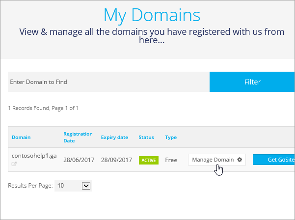

# DNS-records bij Freenom maken voor Office 365Create DNS records at Freenom for Office 365

[Raadpleeg de veelgestelde vragen over domeinen](../setup/domains-faq.md) als u niet kunt vinden wat u zoekt.[Check the Domains FAQ ](../setup/domains-faq.md) if you don't find what you're looking for. 
  
> [!CAUTION]
> De website Freenom ondersteunt geen SRV-records, wat betekent dat verschillende functies in Skype voor Bedrijven Online en de webversie van Outlook niet werken. Ongeacht uw Office 365-abonnement, zijn de servicebeperkingen aanzienlijk. We adviseren dan ook om over te stappen op een andere DNS-hostingprovider.The Freenom website doesn't support SRV records, which means that several Skype for Business Online and Outlook Web App features won't work. No matter which Office 365 plan you use, there are significant service limitations, and you may want to switch to a different DNS hosting provider. 
  
Als u er ondanks de servicebeperkingen voor kiest om uw eigen DNS-records van Office 365 op Freenom te beheren, volgt u de stappen in dit artikel om uw domein te verifiëren en DNS-records in te stellen voor e-mail en andere services.If despite the service limitations, you choose to manage your own Office 365 DNS records at Freenom, follow the steps in this article to verify your domain and set up DNS records for email and other services.
  
Zie [Een openbare website gebruiken met Office 365](https://support.office.com/article/a8178510-501d-4bd8-9921-b04f2e9517a5.aspx) voor informatie over webhosting en DNS voor websites met Office 365.To learn about webhosting and DNS for websites with Office 365, see [Use a public website with Office 365](https://support.office.com/article/a8178510-501d-4bd8-9921-b04f2e9517a5.aspx).
  
> [!NOTE]
> Het duurt gewoonlijk ongeveer 15 minuten voordat DNS-wijzigingen van kracht worden. Het kan echter soms wat langer duren voordat een wijziging die u hebt aangebracht, is bijgewerkt via het DNS-systeem op internet. Als u na het toevoegen van de DNS-records problemen hebt met het ontvangen of verzenden van e-mail, raadpleegt u [Problemen oplossen nadat u uw domeinnaam of DNS-records hebt gewijzigd](../get-help-with-domains/find-and-fix-issues.md).Typically it takes about 15 minutes for DNS changes to take effect. However, it can occasionally take longer for a change you've made to update across the Internet's DNS system. If you're having trouble with mail flow or other issues after adding DNS records, see [Troubleshoot issues after changing your domain name or DNS records](../get-help-with-domains/find-and-fix-issues.md). 
  
## Een TXT-record toevoegen voor verificatieAdd a TXT record for verification

Voordat u uw domein met Office 365 kunt gaan gebruiken, moet worden gecontroleerd dat u de eigenaar bent van het domein. Als u zich bij uw account bij de domeinregistrar kunt aanmelden en de DNS-record kunt maken, is dit voor Office 365 bewezen.Before you use your domain with Office 365, we have to make sure that you own it. Your ability to log in to your account at your domain registrar and create the DNS record proves to Office 365 that you own the domain.
  
> [!NOTE]
> Deze record wordt alleen gebruikt om te verifiëren dat u de eigenaar van uw domein bent. Dit heeft verder geen invloed. U kunt deze record later desgewenst verwijderen.This record is used only to verify that you own your domain; it doesn't affect anything else. You can delete it later, if you like. 
  
1. Ga om te beginnen naar de pagina domeinen in Freenom via [deze link.](https://my.freenom.com/)To get started, go to your domains page in Freenom by using [this link](https://my.freenom.com/). U wordt gevraagd u aan te melden.You'll be prompted to log in.
    
    
  
2. Selecteer **Services**en selecteer **Mijn domeinen**.Select **Services**, and then select **My Domains**.
    
    
  
3. Selecteer **Domein beheren**voor het domein dat u wilt bewerken.For the domain that you want to edit, select **Manage Domain**.
    
    
  
4. Selecteer **Freenom DNS beheren**.Select **Manage Freenom DNS**.
    
    
  
5. Ga onder **Add Record** naar de kolom **Type** en kies **TXT** in de lijst.Under **Add Record**, in the **Type** column, choose **TXT** from the menu. 
    
    
  
6. Typ of kopieer en plak de waarden uit de volgende tabel in de vakken voor de nieuwe record.In the boxes for the new record, type or copy and paste the values from the following table. 
    
    |**Name****Name**|**Type****Type**|**TTL****TTL**|**Doel****Target**|
    |:-----|:-----|:-----|:-----|
    |(laat leeg)(leave blank)    |TXTTXT    |3600 (seconden)3600 (seconds)    |MS=msXXXXXXXXMS=msXXXXXXXX    **Opmerking:** Dit is een voorbeeld. Gebruik hier de specifieke waarde voor **Doel of adres waarnaar wordt verwezen** uit de tabel in Office 365.           [Hoe kan ik dit vinden?](../get-help-with-domains/information-for-dns-records.md)**Note:** This is an example. Use your specific **Destination or Points to Address** value here, from the table in Office 365.           [How do I find this?](../get-help-with-domains/information-for-dns-records.md)          |
   
    
  
7. Selecteer **Wijzigingen opslaan**.Select **Save Changes**.
    
    
  
8. Wacht enkele minuten voordat u verder gaat, zodat de record die u zojuist hebt gemaakt via internet kan worden bijgewerkt.Wait a few minutes before you continue, so that the record you just created can update across the Internet.
    
Nu u de record hebt toegevoegd aan de site van uw domeinregistrar, gaat u terug naar Office 365 en vraagt u of Office 365 naar de record wil zoeken.Now that you've added the record at your domain registrar's site, you'll go back to Office 365 and request Office 365 to look for the record.
  
Wanneer in Office 365 de juiste TXT-record is gevonden, is uw domein gecontroleerd.When Office 365 finds the correct TXT record, your domain is verified.
  
1. Ga in het beheercentrum naar **Instellingen** \> <a href="https://go.microsoft.com/fwlink/p/?linkid=834818" target="_blank">Domeinen</a>-pagina.In the admin center, go to the **Settings** \> <a href="https://go.microsoft.com/fwlink/p/?linkid=834818" target="_blank">Domains</a> page.

    
2. Kies op de pagina **Domeinen** de naam van het domein dat u verifieert.On the **Domains** page, select the domain that you are verifying. 
    
    
  
3. Kies **Start setup** op de pagina **Setup**.On the **Setup** page, select **Start setup**.
    
    
  
4. Kies **Verifiëren** op de pagina **Domein verifiëren**.On the **Verify domain** page, select **Verify**.
    
    
  
> [!NOTE]
>  Het duurt gewoonlijk ongeveer 15 minuten voordat DNS-wijzigingen van kracht worden. Het kan echter soms wat langer duren voordat een wijziging die u hebt aangebracht, is bijgewerkt via het DNS-systeem op internet. Als u na het toevoegen van de DNS-records problemen hebt met het ontvangen of verzenden van e-mail, raadpleegt u [Problemen oplossen nadat u uw domeinnaam of DNS-records hebt gewijzigd](../get-help-with-domains/find-and-fix-issues.md).Typically it takes about 15 minutes for DNS changes to take effect. However, it can occasionally take longer for a change you've made to update across the Internet's DNS system. If you're having trouble with mail flow or other issues after adding DNS records, see [Troubleshoot issues after changing your domain name or DNS records](../get-help-with-domains/find-and-fix-issues.md). 
  
## Een MX-record toevoegen zodat e-mail voor uw domein bij Office 365 terechtkomtAdd an MX record so email for your domain will come to Office 365

1. Ga om te beginnen naar de pagina domeinen in Freenom via [deze link.](https://my.freenom.com/)To get started, go to your domains page in Freenom by using [this link](https://my.freenom.com/). U wordt gevraagd u aan te melden.You'll be prompted to log in.
    
    
  
2. Selecteer **Services**en selecteer **Mijn domeinen**.Select **Services**, and then select **My Domains**.
    
    
  
3. Selecteer **Domein beheren**voor het domein dat u wilt bewerken.For the domain that you want to edit, select **Manage Domain**.
    
    
  
4. Stel de naam dient voor uw domein op de standaard Freenom-naamservers.Set the name serves for your domain to the default Freenom name servers. Selecteer **Beheerhulpprogramma's**en selecteer **vervolgens Nameservers**.Select **Management Tools**, and then select **Nameservers**.
    
    
  
5. Controleer of **Standaardnaamservers gebruiken** is geselecteerd en selecteer **Naamservers wijzigen**.Make sure **Use default nameservers** is selected, and then select **Change Nameservers**.
    
    
  
6. Selecteer **Freenom DNS beheren**.Select **Manage Freenom DNS**.
    
    
  
7. Ga onder **Add Record** naar de kolom **Type** en kies **MX** in de lijst.Under **Add Record**, in the **Type** column, choose **MX** from the menu. 
    
    
  
8. Typ of kopieer en plak de waarden uit de eerste rij van de volgende tabel in de velden voor de nieuwe record.In the boxes for the new record, type or copy and paste the values from the first row of the following table. 
    
    |**Name****Name**|**Type****Type**|**TTL****TTL**|**Doel****Target**|**Priority****Priority**|
    |:-----|:-----|:-----|:-----|:-----|
    |(laat leeg)(leave blank)    |MX (Mail Exchanger)MX (Mail Exchanger)    |3600 (seconden)3600 (seconds)    |\<domeinsleutel\>.mail.protection.outlook.com\<domain-key\>.mail.protection.outlook.com    **Let op:** Haal uw \* \<domeinsleutel\> \* op uit uw Office 365-account.**Note:** Get your  *\<domain-key\>*  from your Office 365 account.   [Hoe kan ik dit vinden?How do I find this?](../get-help-with-domains/information-for-dns-records.md)          |1010    Zie [What is MX priority?](https://support.office.com/article/17d415c1-067e-4974-84d5-aaeaf3a0c0a9) voor meer informatie over prioriteit.   For more information about priority, see [What is MX priority?](https://support.office.com/article/17d415c1-067e-4974-84d5-aaeaf3a0c0a9)   |
   
   
  
9. Selecteer **Wijzigingen opslaan**.Select **Save Changes**.
    
    
  
10. Als er andere MX-records zijn, verwijdert u ze allemaal.If there are any other MX records, delete them all. Selecteer Voor elke record **Delete**.For each record, select **Delete**. Wanneer het bericht Wilt u dit item echt **OK** **verwijderen?**When the message **Do you really want to remove this entry?** appears, select **OK**.
    
## De CNAME-records toevoegen die voor Office 365 vereist zijnAdd the CNAME records that are required for Office 365

1. Ga om te beginnen naar de pagina domeinen in Freenom via [deze link.](https://my.freenom.com/)To get started, go to your domains page in Freenom by using [this link](https://my.freenom.com/). U wordt gevraagd u aan te melden.You'll be prompted to log in.
    
    
  
2. Selecteer **Services**en selecteer **Mijn domeinen**.Select **Services**, and then select **My Domains**.
    
    
  
3. Selecteer **Domein beheren**voor het domein dat u wilt bewerken.For the domain that you want to edit, select **Manage Domain**.
    
    
  
4. Selecteer **Freenom DNS beheren**.Select **Manage Freenom DNS**.
    
    
  
5. Ga onder **Add Record** naar de kolom **Type** en kies **CNAME** in de lijst.Under **Add Record**, in the **Type** column, choose **CNAME** from the menu. 
    
    
  
6. Maak de eerste CNAME-record. Typ of kopieer en plak de waarden uit de eerste rij van de volgende tabel in de vakken voor de nieuwe record.Create the first CNAME record. In the boxes for the new record, type or copy and paste the values from the first row of the following table. 
    
    |**Naam****Name**|**Recordtype****Record type**|**TTL****TTL**|**Doel****Target**|
    |:-----|:-----|:-----|:-----|
    |autodiscoverautodiscover    |CNAMECNAME    |3600 (seconden)3600 (seconds)    |autodiscover.outlook.comautodiscover.outlook.com    |
    |sipsip    |CNAMECNAME    |3600 (seconden)3600 (seconds)    |sipdir.online.lync.comsipdir.online.lync.com    |
    |lyncdiscoverlyncdiscover    |CNAMECNAME    |3600 (seconden)3600 (seconds)    |webdir.online.lync.comwebdir.online.lync.com    |
    |enterpriseregistrationenterpriseregistration    |CNAMECNAME    |3600 (seconden)3600 (seconds)    |enterpriseregistration.windows.netenterpriseregistration.windows.net    |
    |enterpriseenrollmententerpriseenrollment    |CNAMECNAME    |3600 (seconden)3600 (seconds)    |enterpriseenrollment-s.manage.microsoft.comenterpriseenrollment-s.manage.microsoft.com    |
   
    
  
7. Selecteer **Wijzigingen opslaan**.Select **Save Changes**.
    
    
  
8. Herhaal de vorige stappen om de vijf andere CNAME-records te maken.Repeat the previous steps to create the other five CNAME records. 
    
    Typ of kopieer en plak voor elke record de waarden uit de volgende rij van de bovenstaande tabel in de velden voor die record.For each record, type or copy and paste the values from the next row of the table above into the boxes for that record.
    
## Een TXT-record voor SPF toevoegen om spam tegen te gaanAdd a TXT record for SPF to help prevent email spam

> [!IMPORTANT]
> U kunt maximaal 1 TXT-record hebben voor SPF voor een domein.You cannot have more than one TXT record for SPF for a domain. Als uw domein meer dan één SPF-record heeft, kan dit resulteren in e-mailfouten, evenals leverings- en spamclassificatieproblemen.If your domain has more than one SPF record, you'll get email errors, as well as delivery and spam classification issues. Als u al een SPF-record voor uw domein hebt, hoeft u geen nieuwe voor Office 365 te maken.If you already have an SPF record for your domain, don't create a new one for Office 365. In plaats daarvan voegt u de vereiste Office 365-waarden toe aan de huidige record, zodat u beschikt over  *één*  SPF-record waarin beide sets waarden zijn opgenomen.Instead, add the required Office 365 values to the current record so that you have a  *single*  SPF record that includes both sets of values. 

1. Ga om te beginnen naar de pagina domeinen in Freenom via [deze link.](https://my.freenom.com/)To get started, go to your domains page in Freenom by using [this link](https://my.freenom.com/). U wordt gevraagd u aan te melden.You'll be prompted to log in.
    
    
  
2. Selecteer **Services**en selecteer **Mijn domeinen**.Select **Services**, and then select **My Domains**.
    
    
  
3. Selecteer **Domein beheren**voor het domein dat u wilt bewerken.For the domain that you want to edit, select **Manage Domain**.
    
    
  
4. Selecteer **Freenom DNS beheren**.Select **Manage Freenom DNS**.
    
    
  
5. Ga onder **Add Record** naar de kolom **Type** en kies **TXT** in de lijst.Under **Add Record**, in the **Type** column, choose **TXT** from the menu. 
    
    
  
6. Typ of kopieer en plak de volgende waarden in de vakken voor de nieuwe record.In the boxes for the new record, type or copy and paste the following values. 
    
    |**Naam****Name**|**Recordtype****Record type**|**TTL****TTL**|**Doel****Target**|
    |:-----|:-----|:-----|:-----|
    |(laat leeg)(leave blank)    |TXTTXT    |3600 (seconden)3600 (seconds)    |v=spf1 include:spf.protection.outlook.com -allv=spf1 include:spf.protection.outlook.com -all   **Opmerking:** het is raadzaam dit item te kopiëren en te plakken, zodat het spatiegebruik ongewijzigd blijft.**Note:** We recommend copying and pasting this entry, so that all of the spacing stays correct.           |
   
    
  
7. Selecteer **Wijzigingen opslaan**.Select **Save Changes**.
    
    
  

