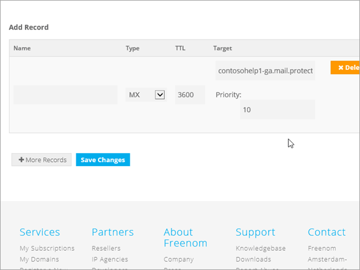

# DNS-records maken bij Freenom voor Microsoft

[Raadpleeg de veelgestelde vragen over domeinen](../setup/domains-faq.md) als u niet kunt vinden wat u zoekt. 
  
> [!CAUTION]
> De Freenom-website biedt geen ondersteuning voor SRV-records, wat betekent dat verschillende functies van Skype voor Bedrijven Online en Outlook Web App niet werken. Het maakt niet uit welk Microsoft-abonnement u gebruikt, er zijn aanzienlijke servicebeperkingen en u overschakelen naar een andere DNS-hostingprovider. 
  
Als u ondanks de servicebeperkingen ervoor kiest om uw eigen Microsoft DNS-records op Freenom te beheren, volgt u de stappen in dit artikel om uw domein te verifiëren en DNS-records in te stellen voor e-mail en andere services.
  
Zie Een openbare website gebruiken met Microsoft voor meer informatie over webhosting en DNS voor websites met [Microsoft.](https://support.office.com/article/a8178510-501d-4bd8-9921-b04f2e9517a5.aspx)
  
> [!NOTE]
> Het duurt gewoonlijk ongeveer 15 minuten voordat DNS-wijzigingen van kracht worden. Het kan echter soms wat langer duren voordat een wijziging die u hebt aangebracht, is bijgewerkt via het DNS-systeem op internet. Als u na het toevoegen van de DNS-records problemen hebt met het ontvangen of verzenden van e-mail, raadpleegt u [Problemen oplossen nadat u uw domeinnaam of DNS-records hebt gewijzigd](../get-help-with-domains/find-and-fix-issues.md). 
  
## Een TXT-record toevoegen voor verificatie

Voordat u uw domein bij Microsoft gebruikt, moeten we ervoor zorgen dat u eigenaar bent. Uw mogelijkheid om in te loggen op uw account bij uw domeinregistrar en de DNS-record te maken bewijst microsoft dat u eigenaar bent van het domein.
  
> [!NOTE]
> Deze record wordt alleen gebruikt om te verifiëren dat u de eigenaar van uw domein bent. Dit heeft verder geen invloed. U kunt deze record later desgewenst verwijderen. 
  
1. Ga om te beginnen naar de pagina domeinen in Freenom via [deze link.](https://my.freenom.com/) U wordt gevraagd u aan te melden.
    
    
  
2. Selecteer **Services**en selecteer **Mijn domeinen**.
    
    
  
3. Selecteer **Domein beheren**voor het domein dat u wilt bewerken.
    
    
  
4. Selecteer **Freenom DNS beheren**.
    
    
  
5. Ga onder **Add Record** naar de kolom **Type** en kies **TXT** in de lijst. 
    
    
  
6. Typ of kopieer en plak de waarden uit de volgende tabel in de vakken voor de nieuwe record. 
    
    |**Name**|**Type**|**TTL**|**Doel**|
    |:-----|:-----|:-----|:-----|
    |(laat leeg)    |TXT    |3600 (seconden)    |MS=msXXXXXXXX    **Opmerking:** Dit is een voorbeeld. Gebruik hier de waarde van uw specifieke **bestemming of adrespunt** in de tabel.           [Hoe kan ik dit vinden?](../get-help-with-domains/information-for-dns-records.md)          |
   
    
  
7. Selecteer **Wijzigingen opslaan**.
    
    
  
8. Wacht enkele minuten voordat u verder gaat, zodat de record die u zojuist hebt gemaakt via internet kan worden bijgewerkt.
    
Nu u de record op de site van uw domeinregistrar hebt toegevoegd, gaat u terug naar Microsoft en vraagt u de record aan.
  
Wanneer Microsoft de juiste TXT-record vindt, wordt uw domein geverifieerd.
  
1. Ga in het Microsoft-beheercentrum naar de pagina \> <a href="https://go.microsoft.com/fwlink/p/?linkid=834818" target="_blank">Instellingendomeinen.</a> **Settings**

    
2. Kies op de pagina **Domeinen** de naam van het domein dat u verifieert. 
    
    
  
3. Kies **Start setup** op de pagina **Setup**.
    
    
  
4. Kies **Verifiëren** op de pagina **Domein verifiëren**.
    
    
  
> [!NOTE]
>  Het duurt gewoonlijk ongeveer 15 minuten voordat DNS-wijzigingen van kracht worden. Het kan echter soms wat langer duren voordat een wijziging die u hebt aangebracht, is bijgewerkt via het DNS-systeem op internet. Als u na het toevoegen van de DNS-records problemen hebt met het ontvangen of verzenden van e-mail, raadpleegt u [Problemen oplossen nadat u uw domeinnaam of DNS-records hebt gewijzigd](../get-help-with-domains/find-and-fix-issues.md). 
  
## Voeg een MX-record toe, zodat e-mail voor uw domein naar Microsoft komt

1. Ga om te beginnen naar de pagina domeinen in Freenom via [deze link.](https://my.freenom.com/) U wordt gevraagd u aan te melden.
    
    
  
2. Selecteer **Services**en selecteer **Mijn domeinen**.
    
    
  
3. Selecteer **Domein beheren**voor het domein dat u wilt bewerken.
    
    
  
4. Stel de naam dient voor uw domein op de standaard Freenom-naamservers. Selecteer **Beheerhulpprogramma's**en selecteer **vervolgens Nameservers**.
    
    
  
5. Controleer of **Standaardnaamservers gebruiken** is geselecteerd en selecteer **Naamservers wijzigen**.
    
    
  
6. Selecteer **Freenom DNS beheren**.
    
    
  
7. Ga onder **Add Record** naar de kolom **Type** en kies **MX** in de lijst. 
    
    
  
8. Typ of kopieer en plak de waarden uit de eerste rij van de volgende tabel in de velden voor de nieuwe record. 
    
    |**Name**|**Type**|**TTL**|**Doel**|**Priority**|
    |:-----|:-----|:-----|:-----|:-----|
    |(laat leeg)    |MX (Mail Exchanger)    |3600 (seconden)    |\<domeinsleutel\>.mail.protection.outlook.com    **Let op:** Haal uw * \<domeinsleutel\> * uit uw Microsoft-account.   [Hoe kan ik dit vinden?](../get-help-with-domains/information-for-dns-records.md)          |10    Zie [What is MX priority?](https://support.office.com/article/17d415c1-067e-4974-84d5-aaeaf3a0c0a9) voor meer informatie over prioriteit.      |
   
   
  
9. Selecteer **Wijzigingen opslaan**.
    
    
  
10. Als er andere MX-records zijn, verwijdert u ze allemaal. Selecteer Voor elke record **Delete**. Wanneer het bericht Wilt u dit item echt **OK** **verwijderen?**
    
## De CNAME-records toevoegen die voor Microsoft vereist zijn

1. Ga om te beginnen naar de pagina domeinen in Freenom via [deze link.](https://my.freenom.com/) U wordt gevraagd u aan te melden.
    
    
  
2. Selecteer **Services**en selecteer **Mijn domeinen**.
    
    
  
3. Selecteer **Domein beheren**voor het domein dat u wilt bewerken.
    
    
  
4. Selecteer **Freenom DNS beheren**.
    
    
  
5. Ga onder **Add Record** naar de kolom **Type** en kies **CNAME** in de lijst. 
    
    
  
6. Maak de eerste CNAME-record. Typ of kopieer en plak de waarden uit de eerste rij van de volgende tabel in de vakken voor de nieuwe record. 
    
    |**Naam**|**Recordtype**|**TTL**|**Doel**|
    |:-----|:-----|:-----|:-----|
    |autodiscover    |CNAME    |3600 (seconden)    |autodiscover.outlook.com    |
    |sip    |CNAME    |3600 (seconden)    |sipdir.online.lync.com    |
    |lyncdiscover    |CNAME    |3600 (seconden)    |webdir.online.lync.com    |
    |enterpriseregistration    |CNAME    |3600 (seconden)    |enterpriseregistration.windows.net    |
    |enterpriseenrollment    |CNAME    |3600 (seconden)    |enterpriseenrollment-s.manage.microsoft.com    |
   
    
  
7. Selecteer **Wijzigingen opslaan**.
    
    
  
8. Herhaal de vorige stappen om de vijf andere CNAME-records te maken. 
    
    Typ of kopieer en plak voor elke record de waarden uit de volgende rij van de bovenstaande tabel in de velden voor die record.
    
## Een TXT-record voor SPF toevoegen om spam tegen te gaan

> [!IMPORTANT]
> U kunt maximaal 1 TXT-record hebben voor SPF voor een domein. Als uw domein meer dan één SPF-record heeft, kan dit resulteren in e-mailfouten, evenals leverings- en spamclassificatieproblemen. Als u al een SPF-record voor uw domein hebt, maakt u geen nieuwe voor Microsoft. Voeg in plaats daarvan de vereiste Microsoft-waarden toe aan de huidige record, zodat u *één* SPF-record hebt die beide waardensets bevat. 

1. Ga om te beginnen naar de pagina domeinen in Freenom via [deze link.](https://my.freenom.com/) U wordt gevraagd u aan te melden.
    
    
  
2. Selecteer **Services**en selecteer **Mijn domeinen**.
    
    
  
3. Selecteer **Domein beheren**voor het domein dat u wilt bewerken.
    
    
  
4. Selecteer **Freenom DNS beheren**.
    
    
  
5. Ga onder **Add Record** naar de kolom **Type** en kies **TXT** in de lijst. 
    
    
  
6. Typ of kopieer en plak de volgende waarden in de vakken voor de nieuwe record. 
    
    |**Naam**|**Recordtype**|**TTL**|**Doel**|
    |:-----|:-----|:-----|:-----|
    |(laat leeg)    |TXT    |3600 (seconden)    |v=spf1 include:spf.protection.outlook.com -all   **Opmerking:** het is raadzaam dit item te kopiëren en te plakken, zodat het spatiegebruik ongewijzigd blijft.           |
   
    
  
7. Selecteer **Wijzigingen opslaan**.
    
    
  

