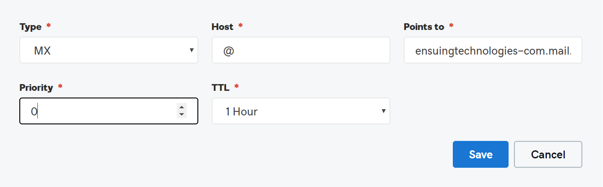

# DNS-records bij GoDaddy maken voor Microsoft

 **[Raadpleeg de veelgestelde vragen over domeinen](../setup/domains-faq.yml)** als u niet kunt vinden wat u zoekt.

Als GoDaddy uw DNS-hostingprovider is, voert u de stappen in dit artikel uit om uw domein te verifiëren en DNS-records voor e-mail, Skype voor Bedrijven Online enzovoort in te stellen.

Nadat u deze records bij GoDaddy hebt toevoegt, is uw domein ingesteld voor gebruik met Microsoft-services.

> [!NOTE]
> Het duurt gewoonlijk ongeveer 15 minuten voordat DNS-wijzigingen van kracht worden. Het kan echter soms wat langer duren voordat een wijziging die u hebt aangebracht, is bijgewerkt via het DNS-systeem op internet. Als u na het toevoegen van de DNS-records problemen hebt met het ontvangen of verzenden van e-mail, raadpleegt u [Problemen oplossen nadat u uw domeinnaam of DNS-records hebt gewijzigd](../get-help-with-domains/find-and-fix-issues.md).

## Een TXT-record toevoegen voor verificatie

Voordat u uw domein met Microsoft kunt gebruiken, moet worden gecontroleerd dat u de eigenaar bent van het domein. Als u zich bij uw account bij de domeinregistrar kunt aanmelden en de DNS-record kunt maken, is dit voor Microsoft bewezen.

> [!NOTE]
> Deze record wordt alleen gebruikt om te verifiëren dat u de eigenaar van uw domein bent. Dit heeft verder geen invloed. U kunt deze record later desgewenst verwijderen.

Voer de onderstaande stappen uit:

1. Als u wilt beginnen, gaat u naar uw domeinenpagina bij GoDaddy via [deze koppeling](https://account.godaddy.com/products/?go_redirect=disabled). U wordt gevraagd u aan te melden.

    

2. Selecteer **dns onder** Domeinen onder het domein dat u wilt bewerken.

    

3. Kies **Toevoegen**.

    

4. Kies **TXT (Text)** in de vervolgkeuzelijst. Typ of kopieer en plak de waarden uit de volgende tabel in de vakken voor de nieuwe record.

    |**Recordtype** |**Host**|**TXT-waarde**|**TTL** |
    |:-----|:-----|:-----|:-----|
    |TXT (Text)|@|MS=ms *XXXXXXXX* **Opmerking:** Dit is een voorbeeld. Gebruik hier de specifieke waarde voor **Doel of adres waarnaar wordt verwezen** uit de tabel. [Hoe kan ik dit vinden?](../get-help-with-domains/information-for-dns-records.md)|1 uur   (Selecteer een waarde in de vervolgkeuzelijst.)|

      

5. Kies **Opslaan**.

6. Wacht enkele minuten voordat u verder gaat, zodat de record die u zojuist hebt gemaakt via internet kan worden bijgewerkt.

Nu u de record hebt toegevoegd aan de site van uw domeinregistrar, gaat u terug naar Microsoft en vraagt u de record aan.

Wanneer in Microsoft de juiste TXT-record is gevonden, is uw domein gecontroleerd.
  
1. Ga in het Microsoft-beheercentrum naar **Instellingen** \> <a href="https://go.microsoft.com/fwlink/p/?linkid=834818" target="_blank">Domeinen</a>-pagina.

    
2. Kies op de pagina **Domeinen** de naam van het domein dat u verifieert. 
    
    
  
3. Kies **Start setup** op de pagina **Setup**.

4. Kies **Verifiëren** op de pagina **Domein verifiëren**.

> [!NOTE]
>  Het duurt gewoonlijk ongeveer 15 minuten voordat DNS-wijzigingen van kracht worden. Het kan echter soms wat langer duren voordat een wijziging die u hebt aangebracht, is bijgewerkt via het DNS-systeem op internet. Als u na het toevoegen van de DNS-records problemen hebt met het ontvangen of verzenden van e-mail, raadpleegt u [Problemen oplossen nadat u uw domeinnaam of DNS-records hebt gewijzigd](../get-help-with-domains/find-and-fix-issues.md).

## Voeg een MX-record toe zodat e-mail voor uw domein naar Microsoft wordt verzonden

Voer de onderstaande stappen uit:

1. Als u wilt beginnen, gaat u naar uw domeinenpagina bij GoDaddy via [deze koppeling](https://account.godaddy.com/products/?go_redirect=disabled). U wordt gevraagd u aan te melden.

    

2. Selecteer **dns onder** Domeinen onder het domein dat u wilt bewerken.

    

3. Kies **Toevoegen**.

    

4. Kies **MX (Mail Exchanger)** in de vervolgkeuzelijst.

    

5. Typ of kopieer en plak de waarden uit de volgende tabel in de vakken voor de nieuwe record.

    (Kies de **TTL-waarde** in de vervolgkeuzelijst.)

    |**Recordtype**|**Host**|**Verwijst naar**|**Priority**|**TTL**|
    |:-----|:-----|:-----|:-----|:-----|
    |MX (Mail Exchanger)    |@    | *\<domain-key\>*  .mail.protection.outlook.com    **Opmerking:** Kom uit  *\<domain-key\>*  uw Microsoft-account.           [Hoe kan ik dit vinden?](../get-help-with-domains/information-for-dns-records.md)          |10    Zie [Wat is MX-prioriteit?](https://docs.microsoft.com/microsoft-365/admin/setup/domains-faq) voor meer informatie over prioriteit.      |1 uur    |

6. Kies **Opslaan**.

## De CNAME-records toevoegen die zijn vereist voor Microsoft

Voer de onderstaande stappen uit:

1. Als u wilt beginnen, gaat u naar uw domeinenpagina bij GoDaddy via [deze koppeling](https://account.godaddy.com/products/?go_redirect=disabled). U wordt gevraagd u aan te melden.

    

2. Selecteer **dns onder** Domeinen onder het domein dat u wilt bewerken.

    

3. Kies **Toevoegen**.

    

4. Kies **CNAME (Alias)** in de vervolgkeuzelijst.

    

5. Maak de eerste CNAME-record.

    Typ of kopieer en plak de waarden uit de eerste rij van de volgende tabel in de vakken voor de nieuwe record.

    (Kies de **TTL-waarde** in de vervolgkeuzelijst.)

    |**Recordtype**|**Host**|**Verwijst naar**|**TTL**|
    |:-----|:-----|:-----|:-----|
    |CNAME (alias)    |autodiscover    |autodiscover.outlook.com    |1 uur    |
    |CNAME (alias)    |sip    |sipdir.online.lync.com    |1 uur    |
    |CNAME (alias)    |lyncdiscover    |webdir.online.lync.com    |1 uur    |
    |CNAME (alias)    |enterpriseregistration    |enterpriseregistration.windows.net    |1 uur    |
    |CNAME (alias)    |enterpriseenrollment    |enterpriseenrollment.manage.microsoft.com    |1 uur    |

6. Herhaal deze stappen om de volgende CNAME-record toe te voegen totdat u alle zes CNAME-records hebt gemaakt.

## Een TXT-record voor SPF toevoegen om spam tegen te gaan

> [!IMPORTANT]
> U kunt maximaal 1 TXT-record hebben voor SPF voor een domein. Als uw domein meer dan één SPF-record heeft, kan dit resulteren in e-mailfouten, evenals leverings- en spamclassificatieproblemen. Als u al een SPF-record voor uw domein hebt, hoeft u geen nieuwe te maken voor Microsoft. In plaats daarvan voegt u de vereiste Microsoft-waarden toe aan de huidige record, zodat u beschikt over één  SPF-record die beide sets met waarden bevat.

Voer de onderstaande stappen uit:

1. Als u wilt beginnen, gaat u naar uw domeinenpagina bij GoDaddy via [deze koppeling](https://account.godaddy.com/products/?go_redirect=disabled). U wordt gevraagd u aan te melden.

    

2. Selecteer **dns onder** Domeinen onder het domein dat u wilt bewerken.

    

3. Kies **Toevoegen**.

    

4. Kies **TXT (Text)** in de vervolgkeuzelijst.

    

5. Typ of kopieer en plak de volgende waarden in de vakken voor de nieuwe record.

    (Kies de **TTL-waarde** in de vervolgkeuzelijsten.)

    |**Recordtype**|**Host**|**TXT-waarde**|**TTL**|
    |:-----|:-----|:-----|:-----|
    |TXT (Text)    |@    |v=spf1 include:spf.protection.outlook.com -all    **Opmerking:** het is raadzaam dit item te kopiëren en te plakken, zodat het spatiegebruik ongewijzigd blijft.           |1 uur    |

    

6. Kies **Opslaan**.

## De twee SRV-records toevoegen die zijn vereist voor Microsoft

Voer de onderstaande stappen uit:

1. Als u wilt beginnen, gaat u naar uw domeinenpagina bij GoDaddy via [deze koppeling](https://account.godaddy.com/products/?go_redirect=disabled). U wordt gevraagd u aan te melden.

    

2. Selecteer **dns onder** Domeinen onder het domein dat u wilt bewerken.

    

3. Kies **Toevoegen**.

    

4. Kies **SRV (Service)** in de vervolgkeuzelijst.

    

5. Maak de eerste SRV-record.

    Typ of kopieer en plak de waarden uit de eerste rij van de volgende tabel in de vakken voor de nieuwe record.

    (Kies in **de vervolgkeuzelijsten** het recordtype en de **TTL-waarden.)**

    |**Recordtype**|**Naam**|**Doel**|**Protocol**|**Service**|**Prioriteit**|**Gewicht**|**Poort**|**TTL**|
    |:-----|:-----|:-----|:-----|:-----|:-----|:-----|:-----|:-----|
    |SRV (service)    |@    |sipdir.online.lync.com    |_tls    |_sip    |100    |1    |443    |1 uur    |
    |SRV (service)    |@    |sipfed.online.lync.com    |_tcp    |_sipfederationtls    |100    |1    |5061    |1 uur    |

    

6. Herhaal **stap 5 om** de andere SRV-record te maken.

7. Kies **Opslaan**.

> [!NOTE]
> Het duurt gewoonlijk ongeveer 15 minuten voordat DNS-wijzigingen van kracht worden. Het kan echter soms wat langer duren voordat een wijziging die u hebt aangebracht, is bijgewerkt via het DNS-systeem op internet. Als u na het toevoegen van de DNS-records problemen hebt met het ontvangen of verzenden van e-mail, raadpleegt u [Problemen oplossen nadat u uw domeinnaam of DNS-records hebt gewijzigd](../get-help-with-domains/find-and-fix-issues.md).
