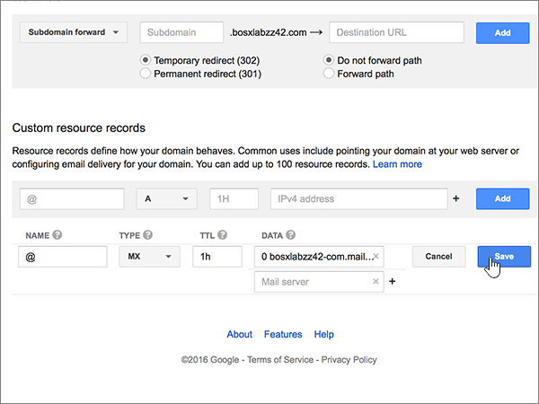
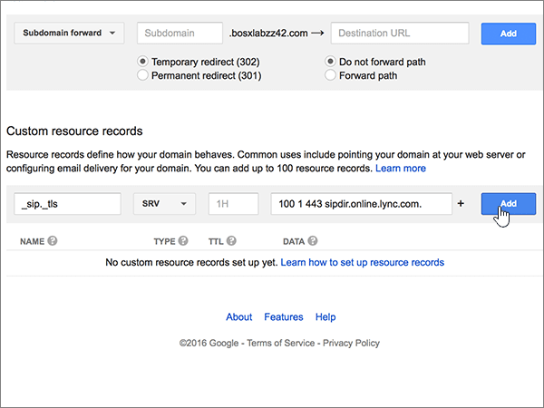

# DNS-records maken bij Google Domains voor MicrosoftCreate DNS records at Google Domains for Microsoft

 **[Raadpleeg de veelgestelde vragen over domeinen](../setup/domains-faq.md)** als u niet kunt vinden wat u zoekt.**[Check the Domains FAQ](../setup/domains-faq.md)** if you don't find what you're looking for. 
  
Als Google Domains uw DNS-hostingprovider is, voert u de stappen in dit artikel uit om uw domein te verifiëren en DNS-records voor e-mail, Lync enzovoort in te stellen.If Google Domains is your DNS hosting provider, follow the steps in this article to verify your domain and set up DNS records for email, Lync, and so on.
  
Nadat u deze records hebt toegevoegd bij Google Domains, wordt uw domein ingesteld voor gebruik met Microsoft-services.After you add these records at Google Domains, your domain will be set up to work with Microsoft services.
  

  
> [!NOTE]
> Het duurt gewoonlijk ongeveer 15 minuten voordat DNS-wijzigingen van kracht worden.Typically it takes about 15 minutes for DNS changes to take effect. Het kan echter soms wat langer duren voordat een wijziging die u hebt aangebracht, is bijgewerkt via het DNS-systeem op internet.However, it can occasionally take longer for a change you've made to update across the Internet's DNS system. Zie Problemen zoeken en oplossen na het toevoegen van [uw domein- of DNS-records in Microsoft](../get-help-with-domains/find-and-fix-issues.md)als u problemen ondervindt met e-mailstroom of andere problemen na het toevoegen van DNS-records.If you're having trouble with mail flow or other issues after adding DNS records, see [Find and fix issues after adding your domain or DNS records in Microsoft](../get-help-with-domains/find-and-fix-issues.md). 
  
## Een TXT-record toevoegen voor verificatieAdd a TXT record for verification

Voordat u uw domein met Microsoft kunt gebruiken, moet worden gecontroleerd dat u de eigenaar bent van het domein. Als u zich bij uw account bij de domeinregistrar kunt aanmelden en de DNS-record kunt maken, is dit voor Microsoft bewezen.Before you use your domain with Microsoft, we have to make sure that you own it. Your ability to log in to your account at your domain registrar and create the DNS record proves to Microsoft that you own the domain.
  
> [!NOTE]
> Deze record wordt alleen gebruikt om te verifiëren dat u de eigenaar van uw domein bent. Dit heeft verder geen invloed. U kunt deze record later desgewenst verwijderen.This record is used only to verify that you own your domain; it doesn't affect anything else. You can delete it later, if you like. 
  
1. Ga eerst naar de pagina met domeinen bij Google Domains via [deze koppeling](https://domains.google.com/registrar). U wordt gevraagd om u aan te melden. U gaat hiervoor als volgt te werk:To get started, go to your domains page at Google Domains by using [this link](https://domains.google.com/registrar). You'll be prompted to sign in. To do so:
    
1. Selecteer **Aanmelden**.Select **Sign In**.
    
2. Voer uw inloggegevens in en selecteer **Opnieuw Aanmelden**.Enter your login credentials, and then again select **Sign In**.
    
2. Zoek op de pagina **Mijn domeinen** het domein dat u met Microsoft wilt gebruiken en selecteer de koppeling **MANAGE** ernaast.On the **My domains** page, find the domain you want to use with Microsoft, and select the **MANAGE** link next to it. Selecteer IN de linkernavigatie de optie **DNS**.In the left navigation, select **DNS**.
    
3. Typ of kopieer en plak de waarden uit de volgende tabel in de sectie **Custom resource records** in de vakken voor de nieuwe record.In the **Custom resource records** section, in the boxes for the new record, type or copy and paste the values from the following table. 
    
    (Mogelijk moet u omlaag schuiven.)(You may have to scroll down.)
    
    (Kies in de vervolgkeuzelijst de waarde **Type**).(Choose the **Type** value from the drop-down list.) 
    
    |||||
    |:-----|:-----|:-----|:-----|
    |**Name****Name**   |**Type****Type**   |**TTL****TTL**   |**Data****Data**   |
    |@    |TXTTXT    |1H1H    |MS=ms *XXXXXXXX*MS=ms *XXXXXXXX*    **Opmerking:** Dit is een voorbeeld.**Note:** This is an example. Gebruik hier de specifieke waarde voor **Doel of adres waarnaar wordt verwezen** uit de tabel.Use your specific **Destination or Points to Address** value here, from the table. [Hoe kan ik dit vinden?How do I find this?](../get-help-with-domains/information-for-dns-records.md)          |
   
4. Kies **Toevoegen**.Select **Add**.
    
5. Wacht enkele minuten voordat u verder gaat, zodat de record die u zojuist hebt gemaakt via internet kan worden bijgewerkt.Wait a few minutes before you continue, so that the record you just created can update across the Internet.
    
Nu u de record hebt toegevoegd aan de site van uw domeinregistrar, gaat u terug naar Microsoft en vraagt u de record aan.Now that you've added the record at your domain registrar's site, you'll go back to Microsoft and request the record.
  
Wanneer in Microsoft de juiste TXT-record is gevonden, is uw domein gecontroleerd.When Microsoft finds the correct TXT record, your domain is verified.
  
1. Ga in het Microsoft-beheercentrum naar **Instellingen** \> <a href="https://go.microsoft.com/fwlink/p/?linkid=834818" target="_blank">Domeinen</a>-pagina.In the Microsoft admin center, go to the **Settings** \> <a href="https://go.microsoft.com/fwlink/p/?linkid=834818" target="_blank">Domains</a> page.

    
2. Kies op de pagina **Domeinen** de naam van het domein dat u verifieert.On the **Domains** page, select the domain that you are verifying. 
    
3. Kies **Start setup** op de pagina **Setup**.On the **Setup** page, select **Start setup**.
    
4. Kies **Verifiëren** op de pagina **Domein verifiëren**.On the **Verify domain** page, select **Verify**.
    
> [!NOTE]
> Het duurt meestal ongeveer 15 minuten voordat DNS-wijzigingen van kracht worden. Het kan echter soms wat langer duren voordat een wijziging die u hebt aangebracht, is bijgewerkt via het DNS-systeem op internet. Als u na het toevoegen van DNS-records problemen hebt met het ontvangen of verzenden van e-mail, raadpleegt u [Problemen opsporen en oplossen nadat u uw domein of DNS-records hebt toegevoegd](../get-help-with-domains/find-and-fix-issues.md).Typically it takes about 15 minutes for DNS changes to take effect. However, it can occasionally take longer for a change you've made to update across the Internet's DNS system. If you're having trouble with mail flow or other issues after adding DNS records, see [Find and fix issues after adding your domain or DNS records](../get-help-with-domains/find-and-fix-issues.md). 

  
## Voeg een MX-record toe zodat e-mail voor uw domein naar Microsoft wordt verzondenAdd an MX record so email for your domain will come to Microsoft

1. Ga eerst naar de pagina met domeinen bij Google Domains via [deze koppeling](https://domains.google.com/registrar). U wordt gevraagd om u aan te melden. U gaat hiervoor als volgt te werk:To get started, go to your domains page at Google Domains by using [this link](https://domains.google.com/registrar). You'll be prompted to sign in. To do so:
    
2. Selecteer **Aanmelden**.Select **Sign In**.
    
3. Voer uw inloggegevens in en selecteer **Opnieuw Aanmelden**.Enter your login credentials, and then again select **Sign In**.
4. Selecteer **op** de pagina Domeinen in de sectie **Domein** de optie **DNS configureren** voor het domein dat u wilt bewerken.On the **Domains** page, in the **Domain** section, select **Configure DNS** for the domain that you want to edit.
    
    > [!IMPORTANT]
    > Als u een G Suite-e-mailaccount hebt, moet u eerst de aan dit account gekoppelde MX-records verwijderen.If you have a G Suite email account, you must first delete the MX records associated with that account. De G Suite MX-records voorkomen dat u andere MX-records toevoegt, inclusief die welke voor Microsoft vereist zijn.The G Suite MX records prevent you from adding any other MX records, including those required for Microsoft. Als u de Suite G-records verwijdert, wordt uw G Suite-account niet verwijderd.Note that deleting the G Suite records does not delete your G Suite account. Voer de volgende stappen uit als u de MX-records voor G Suite wilt verwijderen.To delete your G Suite MX records, use the following steps. 
  
5. Selecteer in de sectie **Synthetische records** in het gebied **G Suite** de optie **Verwijderen**.In the **Synthetic records** section, in the **G Suite** area, select **Delete**.
    
    (Mogelijk moet u omlaag schuiven.)(You may have to scroll down.)
    
    
  
6. Selecteer **Verwijderen**.Select **Delete**.
    
    
  
7. Typ of kopieer en plak de waarden uit de volgende tabel in de sectie **Custom resource records** in de vakken voor de nieuwe record.In the **Custom resource records** section, in the boxes for the new record, type or copy and paste the values from the following table. 
    
    (Mogelijk moet u omlaag schuiven.)(You may have to scroll down.)
    
    (Kies in de vervolgkeuzelijst de waarde **Type**).(Choose the **Type** value from the drop-down list.) 
    
    |**Name****Name**|**Type****Type**|**TTL****TTL**|**Data****Data**|
    |:-----|:-----|:-----|:-----|
    |@    |MXMX    |1H1H    |*\<domain-key\>* 0,mail.protection.outlook.com.0  *\<domain-key\>*  .mail.protection.outlook.com.    **Deze waarde MOET eindigen op een punt (.)****This value MUST end with a period (.)**   De **0** is de MX-prioriteitwaarde. Voeg deze toe aan het begin van de MX-waarde, van de rest van de waarde gescheiden door een spatie.  The **0** is the MX priority value. Add it to the beginning of the MX value, separated from the remainder of the value by a space.    **Let op:** Haal uw \<*domain-key*\> van uw Microsoft-account.**Note:** Get your \<*domain-key*\> from your Microsoft account.  [Hoe kan ik dit vinden?How do I find this?](../get-help-with-domains/information-for-dns-records.md)          Zie [Wat is MX-prioriteit?](https://docs.microsoft.com/microsoft-365/admin/setup/domains-faq) voor meer informatie over prioriteit.For more information about priority, see [What is MX priority?](https://docs.microsoft.com/microsoft-365/admin/setup/domains-faq)   |
   
    
  
5. Kies **Toevoegen**.Select **Add**.
    
    
  
6. Als er andere aangepaste MX-records zijn, verwijdert u deze.If there are any other Custom MX records, remove them.
    
1. Selecteer **Bewerken** in de rij MX-record.Select **Edit** in the MX record row. 
    
    
  
2. Selecteer voor elk van de andere Aangepaste MX-records de vermelding in het vak **Gegevens** en druk vervolgens op **delete** op het toetsenbord om die record te verwijderen.For each of the other Custom MX records, select the entry in the **Data** box and then press the **Delete** key on your keyboard to delete that record. 
    
    Ga door totdat u de **Data**-vermelding voor alle andere MX-records hebt verwijderd.Continue until you have deleted the **Data** entry for each of the other MX records. 
    
    
  
7. Wanneer u de **gegevensvermelding** voor elk van de andere MX-records hebt verwijderd, selecteert u **Opslaan** om uw wijzigingen op te slaan.When you have deleted the **Data** entry for each of the other MX records, select **Save** to save your changes. 
    
    
  
## Voeg de vijf CNAME-records toe die nodig zijn voor MicrosoftAdd the five CNAME records that are required for Microsoft

1. Ga naar de pagina [Google Domeinen] en meld u aan om aan de slag te https://domains.google.com/registrar) gaan.To get started, go to your [Google Domains page] (https://domains.google.com/registrar) and sign in.
    
2. Selecteer **op** de pagina Domeinen in de sectie **Domein** de optie **DNS configureren** voor het domein dat u wilt bewerken.On the **Domains** page, in the **Domain** section, select **Configure DNS** for the domain that you want to edit. 
    
3. Voeg de eerste CNAME-record toe.Add the first CNAME record.
    
    Typ of kopieer en plak de waarden uit de eerste rij van de volgende tabel in de sectie **Custom resource records** in de vakken voor de nieuwe record.In the **Custom resource records** section, in the boxes for the new record, type or copy and paste the values from first row of the following table. 
    
    (Mogelijk moet u omlaag schuiven.)(You may have to scroll down.)
    
    (Kies in de vervolgkeuzelijst de waarde **Type**).(Choose the **Type** value from the drop-down list.) 
    
    |**Name****Name**|**Type****Type**|**TTL****TTL**|**Data****Data**|
    |:-----|:-----|:-----|:-----|
    |autodiscoverautodiscover    |CNAMECNAME    |1H1H    |autodiscover.outlook.com.autodiscover.outlook.com.    **Deze waarde MOET eindigen op een punt (.)****This value MUST end with a period (.)**   |
    |sipsip    |CNAMECNAME    |1H1H    |sipdir.online.lync.com.sipdir.online.lync.com.    **Deze waarde MOET eindigen op een punt (.)****This value MUST end with a period (.)**   |
    |lyncdiscoverlyncdiscover    |CNAMECNAME    |1H1H    |webdir.online.lync.com.webdir.online.lync.com.    **Deze waarde MOET eindigen op een punt (.)****This value MUST end with a period (.)**   |
    |enterpriseregistrationenterpriseregistration    |CNAMECNAME    |1H1H    |enterpriseregistration.windows.net.enterpriseregistration.windows.net.    **Deze waarde MOET eindigen op een punt (.)****This value MUST end with a period (.)**   |
    |enterpriseenrollmententerpriseenrollment    |CNAMECNAME    |1H1H    |enterpriseenrollment-s.manage.microsoft.com.enterpriseenrollment-s.manage.microsoft.com.    **Deze waarde MOET eindigen op een punt (.)****This value MUST end with a period (.)**   |
   
    
  
4. Kies **Toevoegen**.Select **Add**.
    
    
  
5. Voeg de andere vier CNAME-records toe.Add the other four CNAME records.
    
    Maak in de sectie **Aangepaste resourcerecords** een record met de waarden uit de volgende rij in de tabel en selecteer vervolgens opnieuw **Toevoegen** om die record te voltooien.In the **Custom resource records** section, create a record by using the values from the next row in the table, and then again select **Add** to complete that record. 
    
    Herhaal dit proces totdat u alle vereiste CNAME-records hebt gemaakt.Repeat this process until you have created all of the required CNAME records.
    
## Een TXT-record voor SPF toevoegen om spam tegen te gaanAdd a TXT record for SPF to help prevent email spam

> [!IMPORTANT]
> U kunt maximaal 1 TXT-record hebben voor SPF voor een domein.You cannot have more than one TXT record for SPF for a domain. Als uw domein meer dan één SPF-record heeft, kan dit resulteren in e-mailfouten, evenals leverings- en spamclassificatieproblemen.If your domain has more than one SPF record, you'll get email errors, as well as delivery and spam classification issues. Als u al een SPF-record voor uw domein hebt, hoeft u geen nieuwe te maken voor Microsoft.If you already have an SPF record for your domain, don't create a new one for Microsoft. In plaats hiervan voegt u de vereiste Microsoft-waarden toe aan de huidige record, zodat u beschikt over één SPF-record waarin beide sets waarden zijn opgenomen.Instead, add the required Microsoft values to the current record so that you have a single SPF record that includes both sets of values. Hebt u voorbeelden nodig?Need examples? Bekijk deze [Externe Domain Name System-records voor Microsoft](https://docs.microsoft.com/office365/enterprise/external-domain-name-system-records#bkmk_spfrecords).Check out these [External Domain Name System records for Microsoft](https://docs.microsoft.com/office365/enterprise/external-domain-name-system-records#bkmk_spfrecords). Voor het valideren van uw SPF-record, kunt u een van deze [SPF-validatiehulpmiddelen](../setup/domains-faq.md) gebruiken.To validate your SPF record, you can use one of these [SPF validation tools](../setup/domains-faq.md). 
  
1. Ga eerst naar de pagina met domeinen bij Google Domains via [deze koppeling](https://domains.google.com/registrar). U wordt gevraagd om u aan te melden. U gaat hiervoor als volgt te werk:To get started, go to your domains page at Google Domains by using [this link](https://domains.google.com/registrar). You'll be prompted to sign in. To do so:
    
1. Selecteer **Aanmelden**.Select **Sign In**.
    
2. Voer uw inloggegevens in en selecteer **Opnieuw Aanmelden**.Enter your login credentials, and then again select **Sign In**.
    
3. Selecteer **op** de pagina Domeinen in de sectie **Domein** de optie **DNS configureren** voor het domein dat u wilt bewerken.On the **Domains** page, in the **Domain** section, select **Configure DNS** for the domain that you want to edit. 
    
4. Selecteer in de sectie **Aangepaste resourcerecords** in de rij TXT-record de optie **Bewerken**.In the **Custom resource records** section, on the TXT record row, select **Edit**. 
    
    > [!IMPORTANT]
    > Google Domains slaat MX-records op als een set die meerdere records kan bevatten. Wanneer u minimaal één andere TXT-record hebt, zoals de TXT-record die u hebt gebruikt om uw domein te verifiëren, moet u de nieuwe TXT-records aan deze recordset toevoegen. Als u extra TXT-records als afzonderlijke vermeldingen probeert toe te voegen, wordt het foutbericht **Duplicate record** (Dubbele record) weergegeven.Google Domains stores TXT records as a set that may contain multiple records. When you have at least one other TXT record, such as the TXT record you used to verify your domain, you must add TXT new records to that record set. Any attempt to enter additional TXT records as separate entries will result in a **Duplicate record** error message. 
  
    
  
5. Selecteer het **besturingselement (+).**Select the **(+)** control. 
    
    
  
6. Typ of kopieer en plak de waarden uit de volgende tabel in de vakken voor de nieuwe record.In the boxes for the new record, type or copy and paste the values from the following table.
    
    (Mogelijk moet u omlaag schuiven.)(You may have to scroll down.)
    
    |**Data****Data**|
    |:-----|
    |v=spf1 include:spf.protection.outlook.com -allv=spf1 include:spf.protection.outlook.com -all    

    > [!NOTE]
    > Het is raadzaam dit item te kopiëren en te plakken, zodat alle spatiëring ongewijzigd blijft.We recommend copying and pasting this entry, so that all of the spacing stays correct.           
   
   
  
7. Kies **Opslaan**.Select **Save**.
    
    
  
## De twee SRV-records toevoegen die zijn vereist voor MicrosoftAdd the two SRV records that are required for Microsoft

1. Ga eerst naar de pagina met domeinen bij Google Domains via [deze koppeling](https://domains.google.com/registrar). U wordt gevraagd om u aan te melden. U gaat hiervoor als volgt te werk:To get started, go to your domains page at Google Domains by using [this link](https://domains.google.com/registrar). You'll be prompted to sign in. To do so:
    
2. Selecteer **Aanmelden**.Select **Sign In**.
    
3. Voer uw inloggegevens in en selecteer **Opnieuw Aanmelden**.Enter your login credentials, and then again select **Sign In**.
    
4. Selecteer **op** de pagina Domeinen in de sectie **Domein** de optie **DNS configureren** voor het domein dat u wilt bewerken.On the **Domains** page, in the **Domain** section, select **Configure DNS** for the domain that you want to edit. 
    
5. Voeg de eerste SRV-record toe.Add the first SRV record.
    
    Typ of kopieer en plak de waarden uit de volgende tabel in de sectie **Custom resource records** in de vakken voor de nieuwe record.In the **Custom resource records** section, in the boxes for the new record, type or copy and paste the values from the following table. 
    
    (Mogelijk moet u omlaag schuiven.)(You may have to scroll down.)
    
    (Kies in de vervolgkeuzelijst de waarde **Type**).(Choose the **Type** value from the drop-down list.) 
    
    |**Name****Name**|**Type****Type**|**TTL****TTL**|**Data****Data**|
    |:-----|:-----|:-----|:-----|
    |_sip._tls_sip._tls|SRVSRV|1H1H|100 1 443 sipdir.online.lync.com.100 1 443 sipdir.online.lync.com. **Deze waarde MOET eindigen met een periode (.)** **Let op:** We raden u aan dit item te kopiëren en te plakken, zodat alle afstand correct blijft.**This value MUST end with a period (.)** **Note:** We recommend copying and pasting this entry, so that all of the spacing stays correct.           |
    |_sipfederationtls._tcp_sipfederationtls._tcp|SRVSRV|1H1H|100 1 5061 sipfed.online.lync.com.100 1 5061 sipfed.online.lync.com. **Deze waarde MOET eindigen op een punt (.)****This value MUST end with a period (.)**

    Het is raadzaam dit item te kopiëren en te plakken, zodat alle spatiëring ongewijzigd blijft.We recommend copying and pasting this entry, so that all of the spacing stays correct.       
   
    
  
6. Kies **Toevoegen**.Select **Add**.
    
    
  
7. Voeg de andere SRV-record toe.Add the other SRV record.
    
    Maak in de sectie **Aangepaste resourcerecords** een record met de waarden uit de tweede rij in de tabel en selecteer vervolgens opnieuw **Toevoegen** om die record te voltooien.In the **Custom resource records** section, create a record by using the values from the second row in the table, and then again select **Add** to complete that record. 
    
    > [!NOTE]
    > Het duurt meestal ongeveer 15 minuten voordat DNS-wijzigingen van kracht worden. Het kan echter soms wat langer duren voordat een wijziging die u hebt aangebracht, is bijgewerkt via het DNS-systeem op internet. Als u na het toevoegen van DNS-records problemen hebt met het ontvangen of verzenden van e-mail, raadpleegt u [Problemen opsporen en oplossen nadat u uw domein of DNS-records hebt toegevoegd](../get-help-with-domains/find-and-fix-issues.md).Typically it takes about 15 minutes for DNS changes to take effect. However, it can occasionally take longer for a change you've made to update across the Internet's DNS system. If you're having trouble with mail flow or other issues after adding DNS records, see [Find and fix issues after adding your domain or DNS records](../get-help-with-domains/find-and-fix-issues.md). 
  
