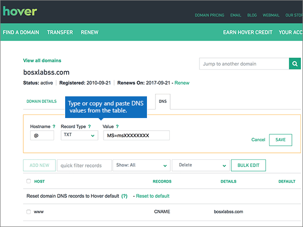
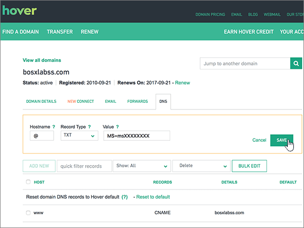
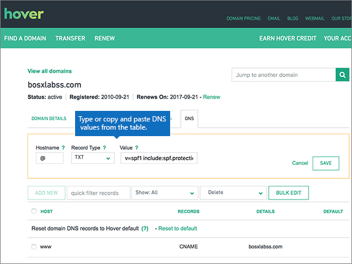

# DNS-records maken bij Hover for MicrosoftCreate DNS records at Hover for Microsoft

 **[Raadpleeg de veelgestelde vragen over domeinen](../setup/domains-faq.md)** als u niet kunt vinden wat u zoekt.**[Check the Domains FAQ](../setup/domains-faq.md)** if you don't find what you're looking for. 
  
Als Hover uw DNS-hostingprovider is, voert u de stappen in dit artikel uit om uw domein te verifiëren en DNS-records voor e-mail, Skype voor Bedrijven Online, enzovoort in te stellen.If Hover is your DNS hosting provider, follow the steps in this article to verify your domain and set up DNS records for email, Skype for Business Online, and so on.
     
Nadat u deze records hebt toegevoegd bij Hover, wordt uw domein ingesteld om te werken met Microsoft-services.After you add these records at Hover, your domain will be set up to work with Microsoft services.
  

  
> [!NOTE]
>  Typically it takes about 15 minutes for DNS changes to take effect.Typically it takes about 15 minutes for DNS changes to take effect. However, it can occasionally take longer for a change you've made to update across the Internet's DNS system.However, it can occasionally take longer for a change you've made to update across the Internet's DNS system. If you're having trouble with mail flow or other issues after adding DNS records, see [Troubleshoot issues after changing your domain name or DNS records](../get-help-with-domains/find-and-fix-issues.md).If you're having trouble with mail flow or other issues after adding DNS records, see [Troubleshoot issues after changing your domain name or DNS records](../get-help-with-domains/find-and-fix-issues.md). 
  
## Een TXT-record toevoegen voor verificatieAdd a TXT record for verification

Before you use your domain with Microsoft, we have to make sure that you own it.Before you use your domain with Microsoft, we have to make sure that you own it. Your ability to log in to your account at your domain registrar and create the DNS record proves to Microsoft that you own the domain.Your ability to log in to your account at your domain registrar and create the DNS record proves to Microsoft that you own the domain.
  
> [!NOTE]
> This record is used only to verify that you own your domain; it doesn't affect anything else.This record is used only to verify that you own your domain; it doesn't affect anything else. You can delete it later, if you like.You can delete it later, if you like. 
  
Volg onderstaande stappen of [bekijk de video](https://support.microsoft.com/office/182bd58e-8fe4-4717-9233-3a3546b72ad2).Follow the steps below or [watch the video](https://support.microsoft.com/office/182bd58e-8fe4-4717-9233-3a3546b72ad2).
  
1. To get started, go to your domains page at Hover by using [this link](https://www.hover.com/domains).To get started, go to your domains page at Hover by using [this link](https://www.hover.com/domains). You'll be prompted to sign in.You'll be prompted to sign in.
    
    
  
2. Selecteer onder **Uw domeinen beheren**de naam van het domein dat u wilt bewerken.Under **Manage Your Domains**, select the name of the domain that you want to edit.
    
    
  
3. Selecteer het tabblad **DNS.**Select the **DNS** tab. 
    
    
  
4. Selecteer **Nieuw toevoegen**.Select **Add New**.
    
    
  
5. Selecteer in de vakken voor de nieuwe record de optie **TXT** voor het **recordtype** en typ of kopieer en plak de waarden uit de volgende tabel.In the boxes for the new record, select **TXT** for the **Record Type**, and then type or copy and paste the values from the following table.
    
    ||||
    |:-----|:-----|:-----|
    |HostnameHostname    |RecordtypeRecord Type    |ValueValue    |
    |@    |TXTTXT    |MS=ms *XXXXXXXX*MS=ms *XXXXXXXX*    **Opmerking:** Dit is een voorbeeld.**Note:** This is an example. Gebruik hier de specifieke waarde voor **Doel of adres waarnaar wordt verwezen** uit de tabel.Use your specific **Destination or Points to Address** value here, from the table.           [Hoe kan ik dit vinden?How do I find this?](../get-help-with-domains/information-for-dns-records.md)          |
   
    
  
6. Kies **Opslaan**.Select **Save**.
    
    
  
7. Wacht enkele minuten voordat u verder gaat, zodat de record die u zojuist hebt gemaakt via internet kan worden bijgewerkt.Wait a few minutes before you continue, so that the record you just created can update across the Internet.
    
Nu u de record hebt toegevoegd aan de site van uw domeinregistrar, gaat u terug naar Microsoft 365 en vraagt u of Microsoft 365 naar de record wil zoeken.Now that you've added the record at your domain registrar's site, you'll go back to Microsoft 365 and request Microsoft 365 to look for the record.
  
Wanneer in Microsoft de juiste TXT-record is gevonden, is uw domein gecontroleerd.When Microsoft finds the correct TXT record, your domain is verified.
  
1. Ga in het Microsoft-beheercentrum naar **Instellingen** \> <a href="https://go.microsoft.com/fwlink/p/?linkid=834818" target="_blank">Domeinen</a>-pagina.In the Microsoft admin center, go to the **Settings** \> <a href="https://go.microsoft.com/fwlink/p/?linkid=834818" target="_blank">Domains</a> page.
    
2. Kies op de pagina **Domeinen** de naam van het domein dat u verifieert.On the **Domains** page, select the domain that you are verifying. 
    
    
  
3. Kies **Start setup** op de pagina **Setup**.On the **Setup** page, select **Start setup**.
    
    
  
4. Kies **Verifiëren** op de pagina **Domein verifiëren**.On the **Verify domain** page, select **Verify**.
    
    
  
> [!NOTE]
>  Typically it takes about 15 minutes for DNS changes to take effect.Typically it takes about 15 minutes for DNS changes to take effect. However, it can occasionally take longer for a change you've made to update across the Internet's DNS system.However, it can occasionally take longer for a change you've made to update across the Internet's DNS system. If you're having trouble with mail flow or other issues after adding DNS records, see [Troubleshoot issues after changing your domain name or DNS records](../get-help-with-domains/find-and-fix-issues.md).If you're having trouble with mail flow or other issues after adding DNS records, see [Troubleshoot issues after changing your domain name or DNS records](../get-help-with-domains/find-and-fix-issues.md). 
  
## Voeg een MX-record toe zodat e-mail voor uw domein naar Microsoft wordt verzondenAdd an MX record so email for your domain will come to Microsoft

Volg onderstaande stappen of [bekijk de video](https://support.microsoft.com/office/182bd58e-8fe4-4717-9233-3a3546b72ad2).Follow the steps below or [watch the video](https://support.microsoft.com/office/182bd58e-8fe4-4717-9233-3a3546b72ad2).
  
1. To get started, go to your domains page at Hover by using [this link](https://www.hover.com/domains).To get started, go to your domains page at Hover by using [this link](https://www.hover.com/domains). You'll be prompted to sign in.You'll be prompted to sign in.
    
    
  
2. Selecteer onder **Uw domeinen beheren**de naam van het domein dat u wilt bewerken.Under **Manage Your Domains**, select the name of the domain that you want to edit.
    
    
  
3. Selecteer het tabblad **DNS.**Select the **DNS** tab. 
    
    
  
4. Selecteer **Nieuw toevoegen**.Select **Add New**.
    
    
  
5. Selecteer in de vakken voor de nieuwe record de optie **MX** voor het **recordtype** en typ of kopieer en plak de waarden uit de volgende tabel.In the boxes for the new record, select **MX** for the **Record Type**, and then type or copy and paste the values from the following table.
    
    |**Hostnaam****Hostname**|**Record Type****Record Type**|**Priority****Priority**|**Hostname****Hostname**|
    |:-----|:-----|:-----|:-----|
    |@    |MXMX    |00    Zie [Wat is MX-prioriteit?](https://docs.microsoft.com/microsoft-365/admin/setup/domains-faq) voor meer informatie over prioriteit.For more information about priority, see [What is MX priority?](https://docs.microsoft.com/microsoft-365/admin/setup/domains-faq)   | *\<domain-key\>*,,Mail.protection.outlook.com*\<domain-key\>*  .mail.protection.outlook.com    **Let op:** Haal je *\<domain-key\>* van je Microsoft-account.**Note:** Get your  *\<domain-key\>*  from your Microsoft account.           [Hoe kan ik dit vinden?How do I find this?](../get-help-with-domains/information-for-dns-records.md)          |
   
    
  
6. Kies **Opslaan**.Select **Save**.
    
    
  
7. Als er andere MX-records zijn, verwijdert u deze met behulp van de volgende tweestapsprocedure:If there are any other MX records, use the following two-step process to remove each of them:
    
    Selecteer eerst verwijderen door een record te **verwijderen.**First, mousing over a record that you want to remove, select **Delete**.
    
    
  
    Selecteer ten tweede **Ja** om elke verwijdering te bevestigen.Second, select **Yes** to confirm each deletion. 
    
    
  
    Herhaal dit proces tot u alle MX-records hebt verwijderd, behalve die welke u eerder in deze procedure hebt toegevoegd.Repeat this process until you have deleted all MX records except for the one that you added earlier in this procedure.
    
## De CNAME-records toevoegen die zijn vereist voor MicrosoftAdd the CNAME records that are required for Microsoft

Volg onderstaande stappen of [bekijk de video](https://support.microsoft.com/office/182bd58e-8fe4-4717-9233-3a3546b72ad2).Follow the steps below or [watch the video](https://support.microsoft.com/office/182bd58e-8fe4-4717-9233-3a3546b72ad2).
  
1. To get started, go to your domains page at Hover by using [this link](https://www.hover.com/domains).To get started, go to your domains page at Hover by using [this link](https://www.hover.com/domains). You'll be prompted to sign in.You'll be prompted to sign in.
    
    
  
2. Selecteer onder **Uw domeinen beheren**de naam van het domein dat u wilt bewerken.Under **Manage Your Domains**, select the name of the domain that you want to edit.
    
    
  
3. Selecteer het tabblad **DNS.**Select the **DNS** tab. 
    
    
  
4. Voeg de eerste van de zes CNAME-records toe.Add the first of the six CNAME records.
    
    Selecteer **Nieuw toevoegen**.Select **Add New**.
    
    
  
5. Selecteer in de lege vakken voor de nieuwe record de optie **CNAME** voor het **recordtype** en typ of kopieer en plak de waarden uit de eerste rij in de volgende tabel.In the empty boxes for the new record, select **CNAME** for the **Record Type**, and then type or copy and paste the values from the first row in the following table.
    
    |**Hostnaam****Hostname**|**Record Type****Record Type**|**Doelhost****Target Host**|
    |:-----|:-----|:-----|
    |autodiscoverautodiscover    |CNAMECNAME    |autodiscover.outlook.comautodiscover.outlook.com    |
    |sipsip    |CNAMECNAME    |sipdir.online.lync.comsipdir.online.lync.com    |
    |lyncdiscoverlyncdiscover    |CNAMECNAME    |webdir.online.lync.comwebdir.online.lync.com    |
    |enterpriseregistrationenterpriseregistration    |CNAMECNAME    |enterpriseregistration.windows.netenterpriseregistration.windows.net    |
    |enterpriseenrollmententerpriseenrollment    |CNAMECNAME    |enterpriseenrollment-s.manage.microsoft.comenterpriseenrollment-s.manage.microsoft.com    |
   
    
  
6. Kies **Opslaan**.Select **Save**.
    
    
  
7. Met de voorgaande drie stappen en de waarden uit de andere vijf rijen in de tabel voegt u de andere vijf CNAME-records toe.Using the preceding three steps and the values from the other five rows in the table, add each of the other five CNAME records.
    
## Een TXT-record voor SPF toevoegen om spam tegen te gaanAdd a TXT record for SPF to help prevent email spam

> [!IMPORTANT]
> U kunt maximaal 1 TXT-record hebben voor SPF voor een domein.You cannot have more than one TXT record for SPF for a domain. Als uw domein meer dan één SPF-record heeft, kan dit resulteren in e-mailfouten, evenals leverings- en spamclassificatieproblemen.If your domain has more than one SPF record, you'll get email errors, as well as delivery and spam classification issues. Als u al een SPF-record voor uw domein hebt, hoeft u geen nieuwe te maken voor Microsoft.If you already have an SPF record for your domain, don't create a new one for Microsoft. Voeg in plaats daarvan de vereiste Microsoft-waarden toe aan de huidige record, zodat u *één* SPF-record hebt die beide waardensets bevat.Instead, add the required Microsoft values to the current record so that you have a  *single*  SPF record that includes both sets of values. 
  
Volg onderstaande stappen of [bekijk de video](https://support.microsoft.com/office/182bd58e-8fe4-4717-9233-3a3546b72ad2).Follow the steps below or [watch the video](https://support.microsoft.com/office/182bd58e-8fe4-4717-9233-3a3546b72ad2).
  
1. To get started, go to your domains page at Hover by using [this link](https://www.hover.com/domains).To get started, go to your domains page at Hover by using [this link](https://www.hover.com/domains). You'll be prompted to sign in.You'll be prompted to sign in.
    
    
  
2. Selecteer onder **Uw domeinen beheren**de naam van het domein dat u wilt bewerken.Under **Manage Your Domains**, select the name of the domain that you want to edit.
    
    
  
3. Selecteer het tabblad **DNS.**Select the **DNS** tab. 
    
    
  
4. Selecteer **Nieuw toevoegen**.Select **Add New**.
    
    
  
5. Selecteer in de vakken voor de nieuwe record de optie **TXT** voor het **Recordtype** en typ of kopieer en plak de waarden uit de volgende tabel.In the boxes for the new record, select **TXT** for the **Record Type**, and then type or copy and paste the values from the following table.
    
    |**Hostname****Hostname**|**Record Type****Record Type**|**Value****Value**|
    |:-----|:-----|:-----|
    |@    |TXTTXT    |v=spf1 include:spf.protection.outlook.com -allv=spf1 include:spf.protection.outlook.com -all   **Opmerking:** het is raadzaam dit item te kopiëren en te plakken, zodat het spatiegebruik ongewijzigd blijft.**Note:** We recommend copying and pasting this entry, so that all of the spacing stays correct.           |
   
    
  
6. Kies **Opslaan**.Select **Save**.
    
    
  
## De twee SRV-records toevoegen die zijn vereist voor MicrosoftAdd the two SRV records that are required for Microsoft

Volg onderstaande stappen of [bekijk de video](https://support.microsoft.com/office/182bd58e-8fe4-4717-9233-3a3546b72ad2).Follow the steps below or [watch the video](https://support.microsoft.com/office/182bd58e-8fe4-4717-9233-3a3546b72ad2).
  
1. To get started, go to your domains page at Hover by using [this link](https://www.hover.com/domains).To get started, go to your domains page at Hover by using [this link](https://www.hover.com/domains). You'll be prompted to sign in.You'll be prompted to sign in.
    
    
  
2. Selecteer onder **Uw domeinen beheren**de naam van het domein dat u wilt bewerken.Under **Manage Your Domains**, select the name of the domain that you want to edit.
    
    
  
3. Selecteer het tabblad **DNS.**Select the **DNS** tab. 
    
    
  
4. Voeg de eerste van de twee SRV-records toe.Add the first of the two SRV records.
    
    Selecteer **Nieuw toevoegen**.Select **Add New**.
    
    
  
5. Selecteer in de lege vakken voor de nieuwe record de optie **SRV** voor het **recordtype** en typ of kopieer en plak de waarden uit de eerste rij in de volgende tabel.In the empty boxes for the new record, select **SRV** for the **Record Type**, and then type or copy and paste the values from the first row in the following table.
    
    |**Hostname****Hostname**|**Record Type****Record Type**|**Prioriteit****Priority**|**Gewicht****Weight**|**Poort****Port**|**Target****Target**|
    |:-----|:-----|:-----|:-----|:-----|:-----|
    |_sip._tls_sip._tls    |SRVSRV    |100100    |11    |443443    |sipdir.online.lync.comsipdir.online.lync.com    |
    |_sipfederationtls._tcp_sipfederationtls._tcp    |SRVSRV    |100100    |11    |50615061    |sipfed.online.lync.comsipfed.online.lync.com    |
   
    
  
6. Kies **Opslaan**.Select **Save**.
    
    
  
7. Met de drie voorgaande stappen en de waarden uit de tweede rij in de tabel voegt u de andere SRV-record toe.Using the preceding three steps and the values from the second row in the table, add the other SRV record.
    
> [!NOTE]
> Typically it takes about 15 minutes for DNS changes to take effect.Typically it takes about 15 minutes for DNS changes to take effect. However, it can occasionally take longer for a change you've made to update across the Internet's DNS system.However, it can occasionally take longer for a change you've made to update across the Internet's DNS system. If you're having trouble with mail flow or other issues after adding DNS records, see [Troubleshoot issues after changing your domain name or DNS records](../get-help-with-domains/find-and-fix-issues.md).If you're having trouble with mail flow or other issues after adding DNS records, see [Troubleshoot issues after changing your domain name or DNS records](../get-help-with-domains/find-and-fix-issues.md). 
  
