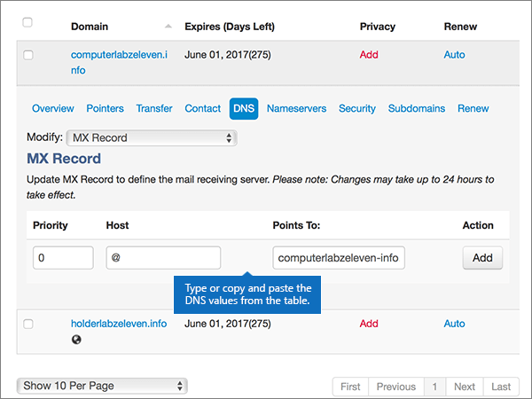
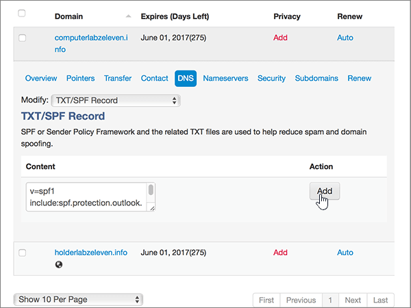

# DNS-records maken op MyDomain voor Microsoft

  
 **[Raadpleeg de veelgestelde vragen over domeinen](../setup/domains-faq.md)** als u niet kunt vinden wat u zoekt. 
  
> [!CAUTION]
> The MyDomain website doesn't support SRV records, which means several Skype for Business Online and Outlook Web App features won't work. No matter which Microsoft plan you use, if you manage your DNS records at MyDomain, there are [significant service limitations](https://docs.microsoft.com/microsoft-365/admin/setup/domains-faq), and you might want to switch to a different DNS hosting provider. 
  
Als u ondanks deze beperkingen uw eigen DNS-records voor Microsoft via MyDomain wilt beheren, volgt u de stappen in dit artikel om uw DNS-records in te stellen voor e-mail, Skype voor Bedrijven Online, enzovoort.
    
Nadat u deze records op MyDomain hebt toegevoegd, is uw domein ingesteld voor gebruik met Microsoft-services.
  

  
> [!NOTE]
> Typically it takes about 15 minutes for DNS changes to take effect. However, it can occasionally take longer for a change you've made to update across the Internet's DNS system. If you're having trouble with mail flow or other issues after adding DNS records, see [Find and fix issues after adding your domain or DNS records](../get-help-with-domains/find-and-fix-issues.md). 
  
## Een TXT-record toevoegen voor verificatie

Before you use your domain with Microsoft, we have to make sure that you own it. Your ability to log in to your account at your domain registrar and create the DNS record proves to Microsoft that you own the domain.
  
> [!NOTE]
> This record is used only to verify that you own your domain; it doesn't affect anything else. You can delete it later, if you like. 
  
1. To get started, go to your domains page at MyDomain by using [this link](https://www.mydomain.com/controlpanel). You'll be prompted to log in first.
    
2. Kies in de sectie **Mijn favorieten** de optie **Domain Central**.
    
3. Kies onder **Domein** de naam van het domein dat u wilt bewerken.
    
4. Kies in de rij **Overzicht** de optie **DNS**.
    
5. Kies in de vervolgkeuzelijst **Wijzigen** de optie **TXT/SPF-record**.
    
6. Typ of kopieer en plak de waarden uit de volgende tabel in het vak voor de nieuwe record onder **Content**.
    
    ||
    |:-----|
    |**Content**   |
    |MS=ms *XXXXXXXX*    **Opmerking:** Dit is een voorbeeld. Gebruik hier de specifieke waarde voor **Doel of adres waarnaar wordt verwezen** uit de tabel. [Hoe kan ik dit vinden?](../get-help-with-domains/information-for-dns-records.md)          |
   
7. Kies **Toevoegen**.
    
8. Wacht enkele minuten voordat u verder gaat, zodat de record die u zojuist hebt gemaakt via internet kan worden bijgewerkt.
    
Nu u de record hebt toegevoegd aan de site van uw domeinregistrar, gaat u terug naar Microsoft en vraagt u de record aan.
  
Wanneer in Microsoft de juiste TXT-record is gevonden, is uw domein gecontroleerd.
  
1. Ga in het Microsoft-beheercentrum naar **Instellingen** \> <a href="https://go.microsoft.com/fwlink/p/?linkid=834818" target="_blank">Domeinen</a>-pagina.
    
2. Kies op de pagina **Domeinen** de naam van het domein dat u verifieert. 
    
3. Kies **Start setup** op de pagina **Setup**.
    
4. Kies **Verifiëren** op de pagina **Domein verifiëren**.
    
> [!NOTE]
> Typically it takes about 15 minutes for DNS changes to take effect. However, it can occasionally take longer for a change you've made to update across the Internet's DNS system. If you're having trouble with mail flow or other issues after adding DNS records, see [Find and fix issues after adding your domain or DNS records](../get-help-with-domains/find-and-fix-issues.md). 
  
## Voeg een MX-record toe zodat e-mail voor uw domein naar Microsoft wordt verzonden

1. To get started, go to your domains page at MyDomain by using [this link](https://www.mydomain.com/controlpanel). You'll be prompted to log in first.
    
2. Kies in de sectie **Mijn favorieten** de optie **Domain Central**.
    
3. Kies onder **Domein** de naam van het domein dat u wilt bewerken.
    
4. Kies in de rij **Overzicht** de optie **DNS**.
    
5. Kies in de vervolgkeuzelijst **Modify** de optie **MX Record**.
    
    
  
6. Typ of kopieer en plak de waarden uit de volgende tabel in de vakken voor de nieuwe record.
    
    |**Prioriteit**|**Host**|**Points To:**|
    |:-----|:-----|:-----|
    |0    Zie [Wat is MX-prioriteit?](https://docs.microsoft.com/microsoft-365/admin/setup/domains-faq) voor meer informatie over prioriteit.   |@    | *\<domain-key\>*  .mail.protection.outlook.com    **Opmerking:** Haal uw \<*domain-key*\> uit uw Microsoft-account. > [Hoe kan ik dit vinden?](../get-help-with-domains/information-for-dns-records.md)          |
   
    
  
7. Kies **Toevoegen**.
    
    
  
8. Als er andere MX-records aanwezig zijn, selecteert u **Remove** in de kolom **Action** voor elke te verwijderen record. 
    
    
  
9. Kies **OK**.
    
    
  
## De CNAME-records toevoegen die zijn vereist voor Microsoft

1. To get started, go to your domains page at MyDomain by using [this link](https://www.mydomain.com/controlpanel). You'll be prompted to log in first.
    
2. Kies in de sectie **Mijn favorieten** de optie **Domain Central**.
    
3. Kies onder **Domein** de naam van het domein dat u wilt bewerken.
    
4. Kies in de rij **Overzicht** de optie **DNS**.
    
5. Kies in de vervolgkeuzelijst **Modify** de optie **CNAME Alias**.
    
    
  
6. Voeg de eerste CNAME-record toe.
    
    Typ of kopieer en plak de waarden uit de eerste rij van de volgende tabel in de velden voor de nieuwe record.
    
    |**Host**|**Points To:**|
    |:-----|:-----|
    |autodiscover    |autodiscover.outlook.com    |
    |sip    |sipdir.online.lync.com    |
    |lyncdiscover    |webdir.online.lync.com    |
    |enterpriseregistration    |enterpriseregistration.windows.net    |
    |enterpriseenrollment    |enterpriseenrollment-s.manage.microsoft.com    |
   
    
  
7. Kies **Toevoegen** om een eerste record toe te voegen. 
    
    
  
8. Voeg de tweede CNAME-record toe:
    
    Gebruik de waarden uit de tweede rij van de bovenstaande tabel en kies vervolgens **Toevoegen** om de tweede record toe te voegen. 
    
    Voeg de resterende records op dezelfde manier toe met behulp van de waarden uit de derde, vierde, vijfde en zesde rij van de tabel.
    
## Een TXT-record voor SPF toevoegen om spam tegen te gaan

> [!IMPORTANT]
> U kunt maximaal 1 TXT-record hebben voor SPF voor een domein. Als uw domein meer dan één SPF-record heeft, kan dit resulteren in e-mailfouten, evenals leverings- en spamclassificatieproblemen. Als u al een SPF-record voor uw domein hebt, hoeft u geen nieuwe te maken voor Microsoft. In plaats hiervan voegt u de vereiste Microsoft-waarden toe aan de huidige record, zodat u beschikt over één SPF-record waarin beide sets waarden zijn opgenomen. Hebt u voorbeelden nodig? Bekijk deze [Externe Domain Name System-records voor Microsoft](https://docs.microsoft.com/office365/enterprise/external-domain-name-system-records#bkmk_spfrecords). Voor het valideren van uw SPF-record, kunt u een van deze [SPF-validatiehulpmiddelen](../setup/domains-faq.md) gebruiken. 
  
1. To get started, go to your domains page at MyDomain by using [this link](https://www.mydomain.com/controlpanel). You'll be prompted to log in first.
    
2. Kies in de sectie **Mijn favorieten** de optie **Domain Central**.
    
3. Kies onder **Domein** de naam van het domein dat u wilt bewerken.
    
4. Kies in de rij **Overzicht** de optie **DNS**.
    
5. Kies in de vervolgkeuzelijst **Modify** de optie **TXT/SPF Record**.
    
    
  
6. Typ of kopieer en plak de waarden uit de volgende tabel in het vak voor de nieuwe record onder **Content**.
    
    |**Content**|
    |:-----|
    |v=spf1 include:spf.protection.outlook.com -all    **Opmerking:** het is raadzaam dit item te kopiëren en te plakken, zodat het spatiegebruik ongewijzigd blijft.           |
   
    
  
7. Kies **Toevoegen**.
    
    
  
## De twee SRV-records toevoegen die zijn vereist voor Microsoft

> [!CAUTION]
> The MyDomain website doesn't support SRV records, which means several Skype for Business Online and Outlook Web App features won't work. No matter which Microsoft plan you use, if you manage your DNS records at MyDomain, there are [significant service limitations](https://docs.microsoft.com/microsoft-365/admin/setup/domains-faq), and you might want to switch to a different DNS hosting provider. 
  
> [!NOTE]
> Typically it takes about 15 minutes for DNS changes to take effect. However, it can occasionally take longer for a change you've made to update across the Internet's DNS system. If you're having trouble with mail flow or other issues after adding DNS records, see [Find and fix issues after adding your domain or DNS records](../get-help-with-domains/find-and-fix-issues.md). 
  
