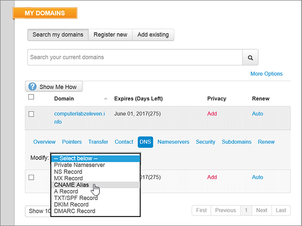
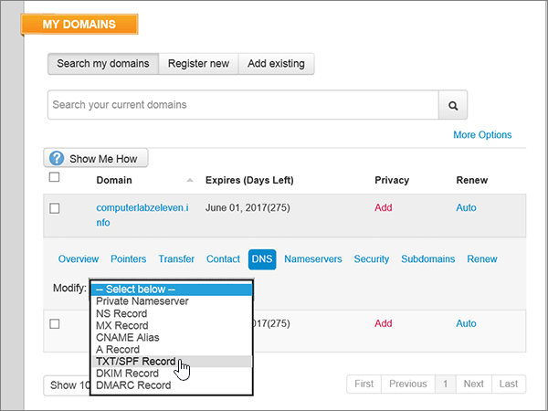

# DNS-records maken op MyDomain voor MicrosoftCreate DNS records at MyDomain for Microsoft

  
 **[Raadpleeg de veelgestelde vragen over domeinen](../setup/domains-faq.md)** als u niet kunt vinden wat u zoekt.**[Check the Domains FAQ](../setup/domains-faq.md)** if you don't find what you're looking for. 
  
> [!CAUTION]
> De website MyDomain ondersteunt geen SRV-records. Dit betekent dat een aantal functies in Skype voor Bedrijven Online en Outlook Web App niet werkt. Als u uw DNS-records beheert via MyDomain, dan gelden er, ongeacht uw Microsoft-abonnement, [aanzienlijke servicebeperkingen](https://docs.microsoft.com/microsoft-365/admin/setup/domains-faq). U kunt overwegen over te schakelen naar een andere DNS-hostingprovider.The MyDomain website doesn't support SRV records, which means several Skype for Business Online and Outlook Web App features won't work. No matter which Microsoft plan you use, if you manage your DNS records at MyDomain, there are [significant service limitations](https://docs.microsoft.com/microsoft-365/admin/setup/domains-faq), and you might want to switch to a different DNS hosting provider. 
  
Als u ondanks deze beperkingen uw eigen DNS-records voor Microsoft via MyDomain wilt beheren, volgt u de stappen in dit artikel om uw DNS-records in te stellen voor e-mail, Skype voor Bedrijven Online, enzovoort.If you choose to manage your own Microsoft DNS records at MyDomain despite the service limitations, follow the steps in this article to set up your DNS records for email, Skype for Business Online, and so on.
    
Nadat u deze records op MyDomain hebt toegevoegd, is uw domein ingesteld voor gebruik met Microsoft-services.After you add these records at MyDomain, your domain will be set up to work with Microsoft services.
  

  
> [!NOTE]
> Het duurt meestal ongeveer 15 minuten voordat DNS-wijzigingen van kracht worden. Het kan echter soms wat langer duren voordat een wijziging die u hebt aangebracht, is bijgewerkt via het DNS-systeem op internet. Als u na het toevoegen van DNS-records problemen hebt met het ontvangen of verzenden van e-mail, raadpleegt u [Problemen opsporen en oplossen nadat u uw domein of DNS-records hebt toegevoegd](../get-help-with-domains/find-and-fix-issues.md).Typically it takes about 15 minutes for DNS changes to take effect. However, it can occasionally take longer for a change you've made to update across the Internet's DNS system. If you're having trouble with mail flow or other issues after adding DNS records, see [Find and fix issues after adding your domain or DNS records](../get-help-with-domains/find-and-fix-issues.md). 
  
## Een TXT-record toevoegen voor verificatieAdd a TXT record for verification

Voordat u uw domein met Microsoft kunt gebruiken, moet worden gecontroleerd dat u de eigenaar bent van het domein. Als u zich bij uw account bij de domeinregistrar kunt aanmelden en de DNS-record kunt maken, is dit voor Microsoft bewezen.Before you use your domain with Microsoft, we have to make sure that you own it. Your ability to log in to your account at your domain registrar and create the DNS record proves to Microsoft that you own the domain.
  
> [!NOTE]
> Deze record wordt alleen gebruikt om te verifiëren dat u de eigenaar van uw domein bent. Dit heeft verder geen invloed. U kunt deze record later desgewenst verwijderen.This record is used only to verify that you own your domain; it doesn't affect anything else. You can delete it later, if you like. 
  
1. Ga eerst naar de pagina met domeinen bij MyDomain via [deze koppeling](https://www.mydomain.com/controlpanel). U wordt gevraagd u eerst aan te melden.To get started, go to your domains page at MyDomain by using [this link](https://www.mydomain.com/controlpanel). You'll be prompted to log in first.
    
2. Kies in de sectie **Mijn favorieten** de optie **Domain Central**.In the **My Favorites** section, select **Domain Central**.
    
3. Kies onder **Domein** de naam van het domein dat u wilt bewerken.Under **Domain**, select the name of the domain that you want to edit.
    
4. Kies in de rij **Overzicht** de optie **DNS**.In the **Overview** row, select **DNS**.
    
5. Kies in de vervolgkeuzelijst **Wijzigen** de optie **TXT/SPF-record**.From the **Modify** drop-down list, choose **TXT/SPF Record**.
    
6. Typ of kopieer en plak de waarden uit de volgende tabel in het vak voor de nieuwe record onder **Content**.Under **Content**, in the box for the new record, type or copy and paste the value from the following table.
    
    ||
    |:-----|
    |**Content****Content**   |
    |MS=ms *XXXXXXXX*MS=ms *XXXXXXXX*    **Opmerking:** Dit is een voorbeeld.**Note:** This is an example. Gebruik hier de specifieke waarde voor **Doel of adres waarnaar wordt verwezen** uit de tabel.Use your specific **Destination or Points to Address** value here, from the table. [Hoe kan ik dit vinden?How do I find this?](../get-help-with-domains/information-for-dns-records.md)          |
   
7. Kies **Toevoegen**.Select **Add**.
    
8. Wacht enkele minuten voordat u verder gaat, zodat de record die u zojuist hebt gemaakt via internet kan worden bijgewerkt.Wait a few minutes before you continue, so that the record you just created can update across the Internet.
    
Nu u de record hebt toegevoegd aan de site van uw domeinregistrar, gaat u terug naar Microsoft en vraagt u de record aan.Now that you've added the record at your domain registrar's site, you'll go back to Microsoft and request the record.
  
Wanneer in Microsoft de juiste TXT-record is gevonden, is uw domein gecontroleerd.When Microsoft finds the correct TXT record, your domain is verified.
  
1. Ga in het Microsoft-beheercentrum naar **Instellingen** \> <a href="https://go.microsoft.com/fwlink/p/?linkid=834818" target="_blank">Domeinen</a>-pagina.In the Microsoft admin center, go to the **Settings** \> <a href="https://go.microsoft.com/fwlink/p/?linkid=834818" target="_blank">Domains</a> page.
    
2. Kies op de pagina **Domeinen** de naam van het domein dat u verifieert.On the **Domains** page, select the domain that you are verifying. 
    
3. Kies **Start setup** op de pagina **Setup**.On the **Setup** page, select **Start setup**.
    
4. Kies **Verifiëren** op de pagina **Domein verifiëren**.On the **Verify domain** page, select **Verify**.
    
> [!NOTE]
> Het duurt meestal ongeveer 15 minuten voordat DNS-wijzigingen van kracht worden. Het kan echter soms wat langer duren voordat een wijziging die u hebt aangebracht, is bijgewerkt via het DNS-systeem op internet. Als u na het toevoegen van DNS-records problemen hebt met het ontvangen of verzenden van e-mail, raadpleegt u [Problemen opsporen en oplossen nadat u uw domein of DNS-records hebt toegevoegd](../get-help-with-domains/find-and-fix-issues.md).Typically it takes about 15 minutes for DNS changes to take effect. However, it can occasionally take longer for a change you've made to update across the Internet's DNS system. If you're having trouble with mail flow or other issues after adding DNS records, see [Find and fix issues after adding your domain or DNS records](../get-help-with-domains/find-and-fix-issues.md). 
  
## Voeg een MX-record toe zodat e-mail voor uw domein naar Microsoft wordt verzondenAdd an MX record so email for your domain will come to Microsoft

1. Ga eerst naar de pagina met domeinen bij MyDomain via [deze koppeling](https://www.mydomain.com/controlpanel). U wordt gevraagd u eerst aan te melden.To get started, go to your domains page at MyDomain by using [this link](https://www.mydomain.com/controlpanel). You'll be prompted to log in first.
    
2. Kies in de sectie **Mijn favorieten** de optie **Domain Central**.In the **My Favorites** section, select **Domain Central**.
    
3. Kies onder **Domein** de naam van het domein dat u wilt bewerken.Under **Domain**, select the name of the domain that you want to edit.
    
4. Kies in de rij **Overzicht** de optie **DNS**.In the **Overview** row, select **DNS**.
    
5. Kies in de vervolgkeuzelijst **Modify** de optie **MX Record**.From the **Modify** drop-down list, choose **MX Record**.
    
    
  
6. Typ of kopieer en plak de waarden uit de volgende tabel in de vakken voor de nieuwe record.In the boxes for the new record, type or copy and paste the values from the following table.
    
    |**Prioriteit****Priority**|**Host****Host**|**Points To:****Points To:**|
    |:-----|:-----|:-----|
    |00    Zie [Wat is MX-prioriteit?](https://docs.microsoft.com/microsoft-365/admin/setup/domains-faq) voor meer informatie over prioriteit.For more information about priority, see [What is MX priority?](https://docs.microsoft.com/microsoft-365/admin/setup/domains-faq)   |@    | *\<domain-key\>*  .mail.protection.outlook.com*\<domain-key\>*  .mail.protection.outlook.com    **Opmerking:** Haal uw \<*domain-key*\> uit uw Microsoft-account.**Note:** Get your \<*domain-key*\> from your Microsoft account. > [Hoe kan ik dit vinden?](../get-help-with-domains/information-for-dns-records.md) > [How do I find this?](../get-help-with-domains/information-for-dns-records.md)          |
   
    
  
7. Kies **Toevoegen**.Select **Add**.
    
    
  
8. Als er andere MX-records aanwezig zijn, selecteert u **Remove** in de kolom **Action** voor elke te verwijderen record.If there are any other existing MX records, select **Remove** in the **Action** column for each one to delete it. 
    
    
  
9. Kies **OK**.Select **OK**.
    
    
  
## De CNAME-records toevoegen die zijn vereist voor MicrosoftAdd the CNAME records that are required for Microsoft

1. Ga eerst naar de pagina met domeinen bij MyDomain via [deze koppeling](https://www.mydomain.com/controlpanel). U wordt gevraagd u eerst aan te melden.To get started, go to your domains page at MyDomain by using [this link](https://www.mydomain.com/controlpanel). You'll be prompted to log in first.
    
2. Kies in de sectie **Mijn favorieten** de optie **Domain Central**.In the **My Favorites** section, select **Domain Central**.
    
3. Kies onder **Domein** de naam van het domein dat u wilt bewerken.Under **Domain**, select the name of the domain that you want to edit.
    
4. Kies in de rij **Overzicht** de optie **DNS**.In the **Overview** row, select **DNS**.
    
5. Kies in de vervolgkeuzelijst **Modify** de optie **CNAME Alias**.From the **Modify** drop-down list, choose **CNAME Alias**.
    
    
  
6. Voeg de eerste CNAME-record toe.Add the first CNAME record.
    
    Typ of kopieer en plak de waarden uit de eerste rij van de volgende tabel in de velden voor de nieuwe record.In the boxes for the new record, type or copy and paste the values from the first row of the following table.
    
    |**Host****Host**|**Points To:****Points To:**|
    |:-----|:-----|
    |autodiscoverautodiscover    |autodiscover.outlook.comautodiscover.outlook.com    |
    |sipsip    |sipdir.online.lync.comsipdir.online.lync.com    |
    |lyncdiscoverlyncdiscover    |webdir.online.lync.comwebdir.online.lync.com    |
    |enterpriseregistrationenterpriseregistration    |enterpriseregistration.windows.netenterpriseregistration.windows.net    |
    |enterpriseenrollmententerpriseenrollment    |enterpriseenrollment-s.manage.microsoft.comenterpriseenrollment-s.manage.microsoft.com    |
   
    
  
7. Kies **Toevoegen** om een eerste record toe te voegen.Select **Add** to add the first record. 
    
    
  
8. Voeg de tweede CNAME-record toe:Add the second CNAME record.
    
    Gebruik de waarden uit de tweede rij van de bovenstaande tabel en kies vervolgens **Toevoegen** om de tweede record toe te voegen.Use the values from the second row of the table above, and then select **Add** to add the second record. 
    
    Voeg de resterende records op dezelfde manier toe met behulp van de waarden uit de derde, vierde, vijfde en zesde rij van de tabel.Add the remaining records in the same way, using the values from the third, fourth, fifth, and sixth rows of the table.
    
## Een TXT-record voor SPF toevoegen om spam tegen te gaanAdd a TXT record for SPF to help prevent email spam

> [!IMPORTANT]
> U kunt maximaal 1 TXT-record hebben voor SPF voor een domein.You cannot have more than one TXT record for SPF for a domain. Als uw domein meer dan één SPF-record heeft, kan dit resulteren in e-mailfouten, evenals leverings- en spamclassificatieproblemen.If your domain has more than one SPF record, you'll get email errors, as well as delivery and spam classification issues. Als u al een SPF-record voor uw domein hebt, hoeft u geen nieuwe te maken voor Microsoft.If you already have an SPF record for your domain, don't create a new one for Microsoft. In plaats hiervan voegt u de vereiste Microsoft-waarden toe aan de huidige record, zodat u beschikt over één SPF-record waarin beide sets waarden zijn opgenomen.Instead, add the required Microsoft values to the current record so that you have a single SPF record that includes both sets of values. Hebt u voorbeelden nodig?Need examples? Bekijk deze [Externe Domain Name System-records voor Microsoft](https://docs.microsoft.com/microsoft-365/enterprise/external-domain-name-system-records#bkmk_spfrecords).Check out these [External Domain Name System records for Microsoft](https://docs.microsoft.com/microsoft-365/enterprise/external-domain-name-system-records#bkmk_spfrecords). Voor het valideren van uw SPF-record, kunt u een van deze [SPF-validatiehulpmiddelen](../setup/domains-faq.md) gebruiken.To validate your SPF record, you can use one of these [SPF validation tools](../setup/domains-faq.md). 
  
1. Ga eerst naar de pagina met domeinen bij MyDomain via [deze koppeling](https://www.mydomain.com/controlpanel). U wordt gevraagd u eerst aan te melden.To get started, go to your domains page at MyDomain by using [this link](https://www.mydomain.com/controlpanel). You'll be prompted to log in first.
    
2. Kies in de sectie **Mijn favorieten** de optie **Domain Central**.In the **My Favorites** section, select **Domain Central**.
    
3. Kies onder **Domein** de naam van het domein dat u wilt bewerken.Under **Domain**, select the name of the domain that you want to edit.
    
4. Kies in de rij **Overzicht** de optie **DNS**.In the **Overview** row, select **DNS**.
    
5. Kies in de vervolgkeuzelijst **Modify** de optie **TXT/SPF Record**.From the **Modify** drop-down list, choose **TXT/SPF Record**.
    
    
  
6. Typ of kopieer en plak de waarden uit de volgende tabel in het vak voor de nieuwe record onder **Content**.Under **Content**, in the box for the new record, type or copy and paste the value from the following table.
    
    |**Content****Content**|
    |:-----|
    |v=spf1 include:spf.protection.outlook.com -allv=spf1 include:spf.protection.outlook.com -all    **Opmerking:** het is raadzaam dit item te kopiëren en te plakken, zodat het spatiegebruik ongewijzigd blijft.**Note:** We recommend copying and pasting this entry, so that all of the spacing stays correct.           |
   
    
  
7. Kies **Toevoegen**.Select **Add**.
    
    
  
## De twee SRV-records toevoegen die zijn vereist voor MicrosoftAdd the two SRV records that are required for Microsoft

> [!CAUTION]
> De website MyDomain ondersteunt geen SRV-records. Dit betekent dat een aantal functies in Skype voor Bedrijven Online en Outlook Web App niet werkt. Als u uw DNS-records beheert via MyDomain, dan gelden er, ongeacht uw Microsoft-abonnement, [aanzienlijke servicebeperkingen](https://docs.microsoft.com/microsoft-365/admin/setup/domains-faq). U kunt overwegen over te schakelen naar een andere DNS-hostingprovider.The MyDomain website doesn't support SRV records, which means several Skype for Business Online and Outlook Web App features won't work. No matter which Microsoft plan you use, if you manage your DNS records at MyDomain, there are [significant service limitations](https://docs.microsoft.com/microsoft-365/admin/setup/domains-faq), and you might want to switch to a different DNS hosting provider. 
  
> [!NOTE]
> Het duurt meestal ongeveer 15 minuten voordat DNS-wijzigingen van kracht worden. Het kan echter soms wat langer duren voordat een wijziging die u hebt aangebracht, is bijgewerkt via het DNS-systeem op internet. Als u na het toevoegen van DNS-records problemen hebt met het ontvangen of verzenden van e-mail, raadpleegt u [Problemen opsporen en oplossen nadat u uw domein of DNS-records hebt toegevoegd](../get-help-with-domains/find-and-fix-issues.md).Typically it takes about 15 minutes for DNS changes to take effect. However, it can occasionally take longer for a change you've made to update across the Internet's DNS system. If you're having trouble with mail flow or other issues after adding DNS records, see [Find and fix issues after adding your domain or DNS records](../get-help-with-domains/find-and-fix-issues.md). 
  
