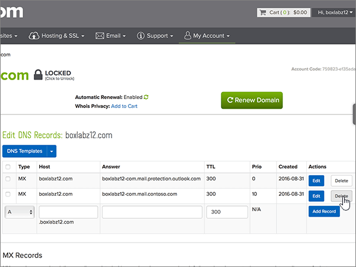
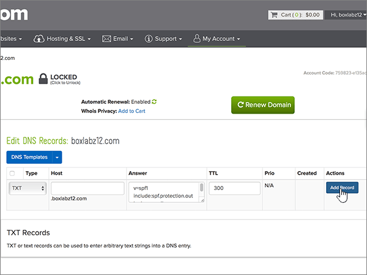

# DNS-records maken op name.com voor Microsoft

 **[Raadpleeg de veelgestelde vragen over domeinen](../setup/domains-faq.md)** als u niet kunt vinden wat u zoekt. 
  
Als name.com uw DNS-hostingprovider is, voert u de stappen in dit artikel uit om uw domein te verifiëren en DNS-records voor e-mail, Skype voor Bedrijven Online enzovoort in te stellen.
  
Nadat u deze records bij name.com hebt toegevoegd, wordt uw domein ingesteld voor gebruik met Microsoft-services.

  
> [!NOTE]
> Het duurt gewoonlijk ongeveer 15 minuten voordat DNS-wijzigingen van kracht worden. Het kan echter soms wat langer duren voordat een wijziging die u hebt aangebracht, is bijgewerkt via het DNS-systeem op internet. Als u na het toevoegen van de DNS-records problemen hebt met het ontvangen of verzenden van e-mail, raadpleegt u [Problemen oplossen nadat u uw domeinnaam of DNS-records hebt gewijzigd](../get-help-with-domains/find-and-fix-issues.md). 
  
## Een TXT-record toevoegen voor verificatie

Voordat u uw domein met Microsoft kunt gebruiken, moet worden gecontroleerd dat u de eigenaar bent van het domein. Als u zich bij uw account bij de domeinregistrar kunt aanmelden en de DNS-record kunt maken, is dit voor Microsoft bewezen.
  
> [!NOTE]
> Deze record wordt alleen gebruikt om te verifiëren dat u de eigenaar van uw domein bent. Dit heeft verder geen invloed. U kunt deze record later desgewenst verwijderen. 
  
1. Als u wilt beginnen, gaat u naar uw domeinenpagina bij name.com via [deze koppeling](https://www.name.com/account/domain). U wordt gevraagd u eerst aan te melden.
    
    
  
2. Selecteer **onder Mijn domeinen**de naam van het domein dat u wilt wijzigen.
    
    
  
3. Selecteer **DNS-records**in de kolom **Details** . 
    
    
  
4. Typ of kopieer en plak de waarden uit de volgende tabel in de vakken voor de nieuwe record.
    
    (Kies in de vervolgkeuzelijst de waarde **Type**). 
    
    |||||
    |:-----|:-----|:-----|:-----|
    |**Type**   |**Host**   |**Antwoord**   |**TTL**   |
    |TXT    |(Laat dit veld leeg.)    |MS=ms *XXXXXXXX*    **Opmerking:** Dit is een voorbeeld. Gebruik hier de specifieke waarde voor **Doel of adres waarnaar wordt verwezen** uit de tabel.           [Hoe kan ik dit vinden?](../get-help-with-domains/information-for-dns-records.md)          |Gebruik de standaardwaarde (300).    |
   
    
  
5. Selecteer **Record toevoegen**.
    
    
  
6. Wacht enkele minuten voordat u verder gaat, zodat de record die u zojuist hebt gemaakt via internet kan worden bijgewerkt.
    
Nu u de record hebt toegevoegd aan de site van uw domeinregistrar, gaat u terug naar Microsoft en vraagt u de record aan.
  
Wanneer in Microsoft de juiste TXT-record is gevonden, is uw domein gecontroleerd.
  
1. Ga in het beheercentrum naar **Instellingen** \> <a href="https://go.microsoft.com/fwlink/p/?linkid=834818" target="_blank">Domeinen</a>-pagina.
    
2. Kies op de pagina **Domeinen** de naam van het domein dat u verifieert. 
    
    
  
3. Kies **Start setup** op de pagina **Setup**.
    
    
  
4. Kies **Verifiëren** op de pagina **Domein verifiëren**.
    
    
  
> [!NOTE]
> Het duurt gewoonlijk ongeveer 15 minuten voordat DNS-wijzigingen van kracht worden. Het kan echter soms wat langer duren voordat een wijziging die u hebt aangebracht, is bijgewerkt via het DNS-systeem op internet. Als u na het toevoegen van de DNS-records problemen hebt met het ontvangen of verzenden van e-mail, raadpleegt u [Problemen oplossen nadat u uw domeinnaam of DNS-records hebt gewijzigd](../get-help-with-domains/find-and-fix-issues.md). 
  
## Voeg een MX-record toe zodat e-mail voor uw domein naar Microsoft wordt verzonden

1. Als u wilt beginnen, gaat u naar uw domeinenpagina bij name.com via [deze koppeling](https://www.name.com/account/domain). U wordt gevraagd u eerst aan te melden.
    
    
  
2. Selecteer **onder Mijn domeinen**de naam van het domein dat u wilt wijzigen.
    
    
  
3. Selecteer **DNS-records**in de kolom **Details** . 
    
    
  
4. Typ of kopieer en plak de waarden uit de volgende tabel in de vakken voor de nieuwe record.
    
    (Kies in de vervolgkeuzelijst de waarde **Type**). 
    
    |**Type**|**Host**|**Antwoord**|**TTL**|**Prio**|
    |:-----|:-----|:-----|:-----|:-----|
    |MX    |(Laat dit veld leeg.)    | *\<domain-key\>*.mail.protection.outlook.com    **Let op:** Haal uw *\<domain-key\>* van uw Microsoft-account.           [Hoe kan ik dit vinden?](../get-help-with-domains/information-for-dns-records.md)          |Gebruik de standaardwaarde (300).    |0    Zie [Wat is MX-prioriteit?](https://docs.microsoft.com/microsoft-365/admin/setup/domains-faq) voor meer informatie over prioriteit.   |
   
   
  
5. Selecteer **Record toevoegen**.
    
    
  
6. Als er andere MX-records zijn, verwijdert u deze met behulp van de volgende tweestapsprocedure:
    
    Selecteer **Verwijderen** voor elkaars MX-record in de kolom **Acties.** 
    
    
  
    Als u elke verwijdering wilt bevestigen, selecteert u **Opnieuw verwijderen** in de kolom **Acties.** 
    
    
  
    Herhaal deze tweestapsprocedure tot u alle overige MX-records hebt verwijderd.
    
## De CNAME-records toevoegen die zijn vereist voor Microsoft

1. Als u wilt beginnen, gaat u naar uw domeinenpagina bij name.com via [deze koppeling](https://www.name.com/account/domain). U wordt gevraagd u eerst aan te melden.
    
    
  
2. Selecteer **onder Mijn domeinen**de naam van het domein dat u wilt wijzigen.
    
    
  
3. Selecteer **DNS-records**in de kolom **Details** . 
    
    
  
4. Voeg de eerste CNAME-record toe.
    
    Typ of kopieer en plak de waarden uit de eerste rij van de volgende tabel in de velden voor de nieuwe record.
    
    (Kies in de vervolgkeuzelijst de waarde **Type**). 
    
    |**Type**|**Host**|**Antwoord**|**TTL**|
    |:-----|:-----|:-----|:-----|
    |CNAME    |autodiscover    |autodiscover.outlook.com    |Gebruik de standaardwaarde (300).    |
    |CNAME    |sip    |sipdir.online.lync.com    |Gebruik de standaardwaarde (300).    |
    |CNAME    |lyncdiscover    |webdir.online.lync.com    |Gebruik de standaardwaarde (300).    |
    |CNAME    |enterpriseregistration    |enterpriseregistration.windows.net    |Gebruik de standaardwaarde (300).    |
    |CNAME    |enterpriseenrollment    |enterpriseenrollment-s.manage.microsoft.com    |Gebruik de standaardwaarde (300).    |
   
   
  
5. Selecteer **Record toevoegen** om de eerste record toe te voegen. 
    
    
  
6. Voeg de tweede CNAME-record toe:
    
    Gebruik de waarden uit de tweede rij van de bovenstaande tabel en selecteer **Record toevoegen** om de tweede record toe te voegen. 
    
    Voeg de resterende records op dezelfde manier toe met behulp van de waarden uit de derde, vierde, vijfde en zesde rij van de tabel.
    
## Een TXT-record voor SPF toevoegen om spam tegen te gaan

> [!IMPORTANT]
> U kunt maximaal 1 TXT-record hebben voor SPF voor een domein. Als uw domein meer dan één SPF-record heeft, kan dit resulteren in e-mailfouten, evenals leverings- en spamclassificatieproblemen. Als u al een SPF-record voor uw domein hebt, hoeft u geen nieuwe te maken voor Microsoft. Voeg in plaats daarvan de vereiste Microsoft-waarden toe aan de huidige record, zodat u *één* SPF-record hebt die beide waardensets bevat. 
  
1. Als u wilt beginnen, gaat u naar uw domeinenpagina bij name.com via [deze koppeling](https://www.name.com/account/domain). U wordt gevraagd u eerst aan te melden.
    
    
  
2. Selecteer **onder Mijn domeinen**de naam van het domein dat u wilt wijzigen.

    
  
3. Selecteer **DNS-records**in de kolom **Details** . 
    
    
  
4. Typ of kopieer en plak de waarden uit de volgende tabel in de vakken voor de nieuwe record.
    
    (Kies in de vervolgkeuzelijst de waarde **Type**). 
    
    |**Type**|**Host**|**Antwoord**|**TTL**|
    |:-----|:-----|:-----|:-----|
    |TXT    |(Laat dit veld leeg.)    |v=spf1 include:spf.protection.outlook.com -all    **Opmerking:** het is raadzaam dit item te kopiëren en te plakken, zodat het spatiegebruik ongewijzigd blijft.           |Gebruik de standaardwaarde (300).    |
   
   
  
5. Selecteer **Record toevoegen**.
    
    
  
## De twee SRV-records toevoegen die zijn vereist voor Microsoft

1. Als u wilt beginnen, gaat u naar uw domeinenpagina bij name.com via [deze koppeling](https://www.name.com/account/domain). U wordt gevraagd u eerst aan te melden.
    
    
  
2. Selecteer **onder Mijn domeinen**de naam van het domein dat u wilt wijzigen.
    
    
  
3. Selecteer **DNS Records+** in de kolom **Details.** 
    
    
  
4. Voeg de eerste SRV-record toe:
    
    Typ of kopieer en plak de waarden uit de eerste rij van de volgende tabel in de vakken voor de nieuwe record.
    
    (Kies in de vervolgkeuzelijst de waarde **Type**). 
    
    |**Type**|**Service**|**Gewicht**|**TTL**|**Prio**|**Protocol**|**Poort**|**Doel**|
    |:-----|:-----|:-----|:-----|:-----|:-----|:-----|:-----|
    |SRV|sip|1|Gebruik de standaardwaarde (300).|100|tls|443|sipdir.online.lync.com   **Opmerking:** het is raadzaam dit item te kopiëren en te plakken, zodat het spatiegebruik ongewijzigd blijft.           |
    |SRV|sipfederationtls|1|Gebruik de standaardwaarde (300).|100|tcp|5061|sipfed.online.lync.com  **Opmerking:** het is raadzaam dit item te kopiëren en te plakken, zodat het spatiegebruik ongewijzigd blijft.           |
   
   
  
5. Selecteer **Record toevoegen**.

    
  
6. Voeg als volgt de tweede SRV-record toe:

Gebruik de waarden uit de volgende rij van de bovenstaande tabel en selecteer **Record toevoegen** om de tweede record toe te voegen.

>[!NOTE]
>Het duurt gewoonlijk ongeveer 15 minuten voordat DNS-wijzigingen van kracht worden. Het kan echter soms wat langer duren voordat een wijziging die u hebt aangebracht, is bijgewerkt via het DNS-systeem op internet. Als u na het toevoegen van de DNS-records problemen hebt met het ontvangen of verzenden van e-mail, raadpleegt u [Problemen oplossen nadat u uw domeinnaam of DNS-records hebt gewijzigd](../get-help-with-domains/find-and-fix-issues.md).
