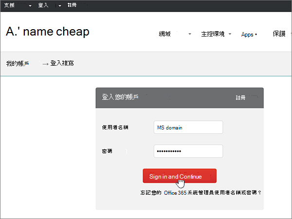
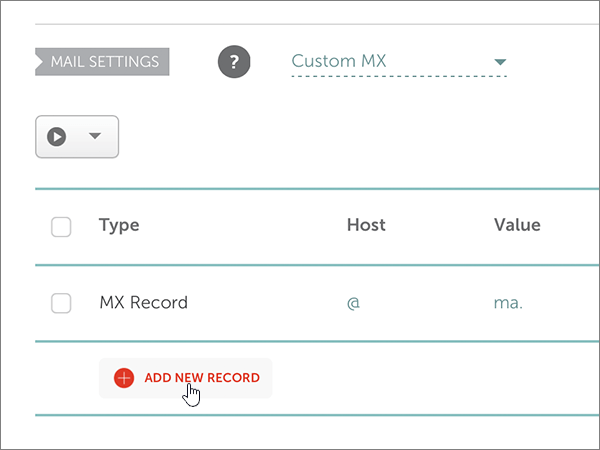
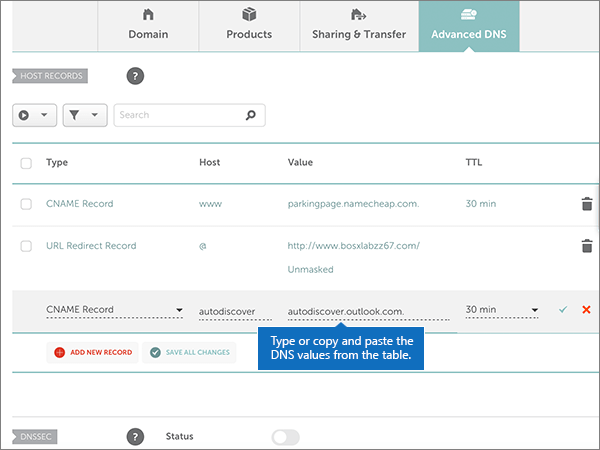

# DNS-records maken bij Namecheap voor Microsoft

 **[Raadpleeg de veelgestelde vragen over domeinen](../setup/domains-faq.yml)** als u niet kunt vinden wat u zoekt. 
  
Als Namecheap uw DNS-hostingprovider is, voert u de stappen in dit artikel uit om uw domein te verifiëren en DNS-records voor e-mail, Skype voor Bedrijven Online, enzovoort in te stellen.
  
Nadat u deze records bij Namecheap hebt toevoegen, is uw domein ingesteld voor gebruik met Microsoft-services.
  
> [!NOTE]
> Het duurt gewoonlijk ongeveer 15 minuten voordat DNS-wijzigingen van kracht worden. Het kan echter soms wat langer duren voordat een wijziging die u hebt aangebracht, is bijgewerkt via het DNS-systeem op internet. Als u na het toevoegen van de DNS-records problemen hebt met het ontvangen of verzenden van e-mail, raadpleegt u [Problemen oplossen nadat u uw domeinnaam of DNS-records hebt gewijzigd](../get-help-with-domains/find-and-fix-issues.md). 
  
## Een TXT-record toevoegen voor verificatie

Voordat u uw domein met Microsoft kunt gebruiken, moet worden gecontroleerd dat u de eigenaar bent van het domein. Als u zich bij uw account bij de domeinregistrar kunt aanmelden en de DNS-record kunt maken, is dit voor Microsoft bewezen.
  
> [!NOTE]
> Deze record wordt alleen gebruikt om te verifiëren dat u de eigenaar van uw domein bent. Dit heeft verder geen invloed. U kunt deze record later desgewenst verwijderen. 
  
Voer de onderstaande stappen uit:
  
1. Ga eerst naar de domeinenpagina bij Namecheap via [deze koppeling](https://www.namecheap.com/myaccount/login.aspx?ReturnUrl=%2f). U wordt gevraagd u aan te melden en verder te gaan.
    
    
  
2. Kies op **de landingspagina** onder **Account** de optie **Domeinlijst** in de vervolgkeuzelijst. 
    
    
  
3. Zoek op **de pagina Domain List** de naam van het domein dat u wilt bewerken en selecteer vervolgens **Beheren.**
    
    
  
4. Selecteer **Advanced DNS**.
    
    
  
5. Selecteer nieuwe record toevoegen in de sectie **HOST RECORDS.** 
    
    
  
6. Selecteer in de vervolgkeuzelijst **Type** de optie **TXT Record**.
    
    > [!NOTE]
    > De  vervolgkeuzekeuzegroep Type wordt automatisch weergegeven wanneer u **NIEUWE RECORD TOEVOEGEN selecteert.** 
  
    
  
7. Typ of kopieer en plak de waarden uit de volgende tabel in de vakken voor de nieuwe record.
    
    (Kies de **TTL-waarde** in de vervolgkeuzelijst.) 
    
    |**Type**|**Host**|**Waarde**|**TTL**|
    |:-----|:-----|:-----|:-----|
    |TXT    |@    |MS=ms *XXXXXXXX*   **Opmerking:** Dit is een voorbeeld. Gebruik hier de specifieke waarde voor **Doel of adres waarnaar wordt verwezen** uit de tabel.  [Hoe kan ik dit vinden?](../get-help-with-domains/information-for-dns-records.md)          |30 min    |
       
    
  
8. Selecteer het **besturingselement Wijzigingen opslaan** (vinkje). 
    
    
  
9. Wacht enkele minuten voordat u verder gaat, zodat de record die u zojuist hebt gemaakt via internet kan worden bijgewerkt.
    
Nu u de record hebt toegevoegd aan de site van uw domeinregistrar, gaat u terug naar Microsoft en vraagt u de record aan.
  
Wanneer in Microsoft de juiste TXT-record is gevonden, is uw domein gecontroleerd.
  
1. Ga in het beheercentrum naar **Instellingen** \> <a href="https://go.microsoft.com/fwlink/p/?linkid=834818" target="_blank">Domeinen</a>-pagina.
    
2. Kies op de pagina **Domeinen** de naam van het domein dat u verifieert. 
    
    
  
3. Kies **Start setup** op de pagina **Setup**.
    
    
  
4. Kies **Verifiëren** op de pagina **Domein verifiëren**.
    
    
  
> [!NOTE]
> Het duurt gewoonlijk ongeveer 15 minuten voordat DNS-wijzigingen van kracht worden. Het kan echter soms wat langer duren voordat een wijziging die u hebt aangebracht, is bijgewerkt via het DNS-systeem op internet. Als u na het toevoegen van de DNS-records problemen hebt met het ontvangen of verzenden van e-mail, raadpleegt u [Problemen oplossen nadat u uw domeinnaam of DNS-records hebt gewijzigd](../get-help-with-domains/find-and-fix-issues.md). 

  
## Voeg een MX-record toe zodat e-mail voor uw domein naar Microsoft wordt verzonden

Voer de onderstaande stappen uit:
  
1. Ga eerst naar de domeinenpagina bij Namecheap via [deze koppeling](https://www.namecheap.com/myaccount/login.aspx?ReturnUrl=%2f). U wordt gevraagd u aan te melden en verder te gaan.
    
    
  
2. Kies op **de landingspagina** onder **Account** de optie **Domeinlijst** in de vervolgkeuzelijst. 
    
    
  
3. Zoek op **de pagina Domain List** de naam van het domein dat u wilt bewerken en selecteer vervolgens **Beheren.**
    
    
  
4. Selecteer **Advanced DNS**.
    
    
  
5. In de sectie **MAIL SETTINGS** selecteert u **Custom MX** in de vervolgkeuzelijst **Email Forwarding**. 
    
    (Mogelijk moet u omlaag schuiven.)
    
    
  
6. Selecteer **Nieuwe record toevoegen.**
    
    
  
7. Typ of kopieer en plak de waarden uit de volgende tabel in de vakken voor de nieuwe record.
    
    (Het vak **Priority** is het naamloze vak rechts van het vak **Value**. Kies de **TTL-waarde** in de vervolgkeuzelijst.) 
    
    |**Type**|**Host**|**Value**|**Priority**|**TTL**|
    |:-----|:-----|:-----|:-----|:-----|
    |MX Record    |@    |\<*domain-key*\>.mail.protection.outlook.com.    **Deze waarde MOET eindigen op een punt (.)**   **Opmerking:** Haal uw  *\<domain-key\>*  uit uw Microsoft-account.  [Hoe kan ik dit vinden?](../get-help-with-domains/information-for-dns-records.md)          |0    Zie [Wat is MX-prioriteit?](../setup/domains-faq.yml) voor meer informatie over prioriteit.   |30 min    |
       
    
  
8. Selecteer het **besturingselement Wijzigingen opslaan** (vinkje). 
    
    
  
9. Als er andere MX-records zijn, verwijdert u deze met behulp van de volgende tweestapsprocedure:
    
    Selecteer eerst het **pictogram Verwijderen** (prullenbak) voor de record die u wilt verwijderen. 
    
    
  
    Selecteer vervolgens **Ja om** de verwijdering te bevestigen. 
    
    
  
    Verwijder alle MX-records, behalve die welke u eerder in deze procedure hebt toegevoegd.

  
## Voeg de zes CNAME-records toe die vereist zijn voor Microsoft

Voer de onderstaande stappen uit:
  
1. Ga eerst naar de domeinenpagina bij Namecheap via [deze koppeling](https://www.namecheap.com/myaccount/login.aspx?ReturnUrl=%2f). U wordt gevraagd u aan te melden en verder te gaan.
    
    
  
2. Kies op **de landingspagina** onder **Account** de optie **Domeinlijst** in de vervolgkeuzelijst. 
    
    
  
3. Zoek op **de pagina Domain List** de naam van het domein dat u wilt bewerken en selecteer vervolgens **Beheren.**
    
    
  
4. Selecteer **Advanced DNS**.
    
    
  
5. Selecteer nieuwe record toevoegen in de sectie **HOST RECORDS.** 
    
    
  
6. Selecteer in de vervolgkeuzelijst **Type** de optie **CNAME Record**.
    
    > [!NOTE]
    > De  vervolgkeuzekeuzegroep Type wordt automatisch weergegeven wanneer u **NIEUWE RECORD TOEVOEGEN selecteert.** 
  
    
  
7. Selecteer in de lege vakken voor de nieuwe record de optie **CNAME** voor het **recordtype** en typ of kopieer en plak de waarden uit de eerste rij in de volgende tabel.
    
    |**Type**|**Host**|**Waarde**|**TTL**|
    |:-----|:-----|:-----|:-----|
    |CNAME    |autodiscover    |autodiscover.outlook.com.    **Deze waarde MOET eindigen op een punt (.)**   |3600    |
    |CNAME    |sip    |sipdir.online.lync.com.    **Deze waarde MOET eindigen op een punt (.)**   |3600    |
    |CNAME    |lyncdiscover    |webdir.online.lync.com.    **Deze waarde MOET eindigen op een punt (.)**   |3600    |
    |CNAME    |enterpriseregistration    |enterpriseregistration.windows.net.    **Deze waarde MOET eindigen op een punt (.)**   |3600    |
    |CNAME    |enterpriseenrollment    |enterpriseenrollment-s.manage.microsoft.com.    **Deze waarde MOET eindigen op een punt (.)**   |3600    |
       
    
  
8. Selecteer het **besturingselement Wijzigingen opslaan** (vinkje). 
    
    
  
9. Voeg met de voorafgaande vier stappen en de waarden uit de andere vijf rijen in de tabel elk van de andere vijf CNAME-records toe.

  
## Een TXT-record voor SPF toevoegen om spam tegen te gaan

> [!IMPORTANT]
> U kunt maximaal 1 TXT-record hebben voor SPF voor een domein. Als uw domein meer dan één SPF-record heeft, kan dit resulteren in e-mailfouten, evenals leverings- en spamclassificatieproblemen. Als u al een SPF-record voor uw domein hebt, hoeft u geen nieuwe te maken voor Microsoft. Voeg in plaats daarvan de vereiste Microsoft-waarden  toe aan de huidige record, zodat u één SPF-record hebt met beide sets waarden. 

Voer de onderstaande stappen uit:
  
1. Ga eerst naar de domeinenpagina bij Namecheap via [deze koppeling](https://www.namecheap.com/myaccount/login.aspx?ReturnUrl=%2f). U wordt gevraagd u aan te melden en verder te gaan.
    
2. Kies op **de landingspagina** onder **Account** de optie **Domeinlijst** in de vervolgkeuzelijst. 
    
    
  
3. Zoek op **de pagina Domain List** de naam van het domein dat u wilt bewerken en selecteer vervolgens **Beheren.**
    
    
  
4. Selecteer **Advanced DNS**.
    
    
  
5. Selecteer nieuwe record toevoegen in de sectie **HOST RECORDS.** 
    
    
  
6. Selecteer in de vervolgkeuzelijst **Type** de optie **TXT Record**.
    
    > [!NOTE]
    > De  vervolgkeuzekeuzegroep Type wordt automatisch weergegeven wanneer u **NIEUWE RECORD TOEVOEGEN selecteert.** 
  
    
  
7. Typ of kopieer en plak de volgende waarden uit de volgende tabel in de vakken voor de nieuwe record.
    
    (Kies de **TTL-waarde** in de vervolgkeuzelijst.) 
    
    |**Type**|**Host**|**Waarde**|**TTL**|
    |:-----|:-----|:-----|:-----|
    |TXT    |@    |v=spf1 include:spf.protection.outlook.com -all    **Opmerking:** het is raadzaam dit item te kopiëren en te plakken, zodat het spatiegebruik ongewijzigd blijft.           |30 min    |
       
    
  
8. Selecteer het **besturingselement Wijzigingen opslaan** (vinkje). 
    
    
  
## De twee SRV-records toevoegen die zijn vereist voor Microsoft

1. Ga eerst naar de domeinenpagina bij Namecheap via [deze koppeling](https://www.namecheap.com/myaccount/login.aspx?ReturnUrl=%2f). U wordt gevraagd u aan te melden.
    
    
  
2. Kies op **de landingspagina** onder **Account** de optie **Domeinlijst** in de vervolgkeuzelijst. 
    
    
  
3. Zoek op **de pagina Domain List** de naam van het domein dat u wilt bewerken en selecteer vervolgens **Beheren.**
    
    
  
4. Selecteer **Advanced DNS**.
    
    
  
5. Selecteer nieuwe record toevoegen in de sectie **HOST RECORDS.** 
    
    
  
6. Selecteer in de vervolgkeuzelijst **Type** de optie **SRV Record**.
    
    > [!NOTE]
    > De  vervolgkeuzekeuzegroep Type wordt automatisch weergegeven wanneer u **NIEUWE RECORD TOEVOEGEN selecteert.** 
  
    
  
7. Typ of kopieer en plak de waarden uit de eerste rij in de volgende tabel in de lege vakken voor de nieuwe record.
    
    |**Service**|**Protocol**|**Prioriteit**|**Gewicht**|**Poort**|**Target**|**TTL**|
    |:-----|:-----|:-----|:-----|:-----|:-----|:-----|
    |_sip    |_tls    |100    |1    |443    |sipdir.online.lync.com.    **Deze waarde MOET eindigen op een punt (.)**   |30 min    |
    |_sipfederationtls    |_tcp    |100    |1    |5061    |sipfed.online.lync.com.    **Deze waarde MOET eindigen op een punt (.)**   |30 min    |
       
    
  
8. Selecteer het **besturingselement Wijzigingen opslaan** (vinkje). 
    
    
  
9. Met de vier voorgaande stappen en de waarden uit de tweede rij in de tabel, moet u de andere SRV-record toevoegen.
    
> [!NOTE]
> Het duurt gewoonlijk ongeveer 15 minuten voordat DNS-wijzigingen van kracht worden. Het kan echter soms wat langer duren voordat een wijziging die u hebt aangebracht, is bijgewerkt via het DNS-systeem op internet. Als u na het toevoegen van de DNS-records problemen hebt met het ontvangen of verzenden van e-mail, raadpleegt u [Problemen oplossen nadat u uw domeinnaam of DNS-records hebt gewijzigd](../get-help-with-domains/find-and-fix-issues.md). 
  

