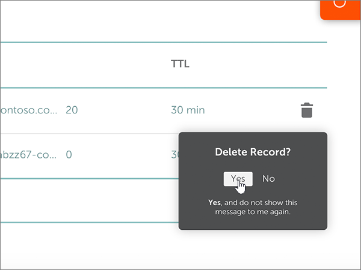

# DNS-records bij namecheap maken voor MicrosoftCreate DNS records at Namecheap for Microsoft

 **[Raadpleeg de veelgestelde vragen over domeinen](../setup/domains-faq.yml)** als u niet kunt vinden wat u zoekt.**[Check the Domains FAQ](../setup/domains-faq.yml)** if you don't find what you're looking for. 
  
Als Namecheap uw DNS-hostingprovider is, voert u de stappen in dit artikel uit om uw domein te verifiëren en DNS-records voor e-mail, Skype voor Bedrijven Online, enzovoort in te stellen.If Namecheap is your DNS hosting provider, follow the steps in this article to verify your domain and set up DNS records for email, Skype for Business Online, and so on.
  
Nadat u deze records bij namecheap hebt toegevoegd, is uw domein ingesteld voor gebruik met Microsoft-services.After you add these records at Namecheap, your domain will be set up to work with Microsoft services.
  
> [!NOTE]
> Het duurt gewoonlijk ongeveer 15 minuten voordat DNS-wijzigingen van kracht worden. Het kan echter soms wat langer duren voordat een wijziging die u hebt aangebracht, is bijgewerkt via het DNS-systeem op internet. Als u na het toevoegen van de DNS-records problemen hebt met het ontvangen of verzenden van e-mail, raadpleegt u [Problemen oplossen nadat u uw domeinnaam of DNS-records hebt gewijzigd](../get-help-with-domains/find-and-fix-issues.md).Typically it takes about 15 minutes for DNS changes to take effect. However, it can occasionally take longer for a change you've made to update across the Internet's DNS system. If you're having trouble with mail flow or other issues after adding DNS records, see [Troubleshoot issues after changing your domain name or DNS records](../get-help-with-domains/find-and-fix-issues.md). 
  
## Een TXT-record toevoegen voor verificatieAdd a TXT record for verification

Voordat u uw domein met Microsoft kunt gebruiken, moet worden gecontroleerd dat u de eigenaar bent van het domein. Als u zich bij uw account bij de domeinregistrar kunt aanmelden en de DNS-record kunt maken, is dit voor Microsoft bewezen.Before you use your domain with Microsoft, we have to make sure that you own it. Your ability to log in to your account at your domain registrar and create the DNS record proves to Microsoft that you own the domain.
  
> [!NOTE]
> Deze record wordt alleen gebruikt om te verifiëren dat u de eigenaar van uw domein bent. Dit heeft verder geen invloed. U kunt deze record later desgewenst verwijderen.This record is used only to verify that you own your domain; it doesn't affect anything else. You can delete it later, if you like. 
  
Voer de onderstaande stappen uit:Follow the steps below.
  
1. Ga eerst naar de domeinenpagina bij Namecheap via [deze koppeling](https://www.namecheap.com/myaccount/login.aspx?ReturnUrl=%2f). U wordt gevraagd u aan te melden en verder te gaan.To get started, go to your domains page at Namecheap by using [this link](https://www.namecheap.com/myaccount/login.aspx?ReturnUrl=%2f). You'll be prompted to Sign in and Continue.
    
    
  
2. Kies op de **openings** pagina onder **account** de optie **Domain List** in de vervolgkeuzelijst.On the **Landing** page, under **Account**, choose **Domain List** from the drop-down list. 
    
    
  
3. Zoek op de pagina **Domain List** de naam van het domein dat u wilt bewerken en selecteer vervolgens **Manage**.On the **Domain List** page, find the name of the domain that you want to edit, and then select **Manage**.
    
    
  
4. Selecteer **Advanced DNS**.Select **Advanced DNS**.
    
    
  
5. Selecteer in de sectie **host records** de optie **add new record**.In the **HOST RECORDS** section, select **ADD NEW RECORD**.
    
    
  
6. Selecteer in de vervolgkeuzelijst **Type** de optie **TXT Record**.In the **Type** drop-down, select **TXT Record**.
    
    > [!NOTE]
    > De vervolgkeuzelijst **type** wordt automatisch weergegeven wanneer u **nieuwe record toevoegen** selecteert.The **Type** drop-down automatically appears when you select **ADD NEW RECORD**. 
  
    
  
7. Typ of kopieer en plak de waarden uit de volgende tabel in de vakken voor de nieuwe record.In the boxes for the new record, type or copy and paste the values from the following table.
    
    (Kies de waarde **TTL** in de vervolgkeuzelijst.)(Choose the **TTL** value from the drop-down list.) 
    
    |**Type****Type**|**Host****Host**|**Waarde****Value**|**TTL****TTL**|
    |:-----|:-----|:-----|:-----|
    |TXTTXT    |@    |MS=ms *XXXXXXXX*MS=ms *XXXXXXXX*   **Opmerking:** Dit is een voorbeeld.**Note:** This is an example. Gebruik hier de specifieke waarde voor **Doel of adres waarnaar wordt verwezen** uit de tabel.Use your specific **Destination or Points to Address** value here, from the table.  [Hoe kan ik dit vinden?How do I find this?](../get-help-with-domains/information-for-dns-records.md)          |30 min30 min    |
       
    
  
8. Selecteer het besturingselement **wijzigingen opslaan** (vinkje).Select the **Save Changes** (check mark) control. 
    
    
  
9. Wacht enkele minuten voordat u verder gaat, zodat de record die u zojuist hebt gemaakt via internet kan worden bijgewerkt.Wait a few minutes before you continue, so that the record you just created can update across the Internet.
    
Nu u de record hebt toegevoegd aan de site van uw domeinregistrar, gaat u terug naar Microsoft en vraagt u de record aan.Now that you've added the record at your domain registrar's site, you'll go back to Microsoft and request the record.
  
Wanneer in Microsoft de juiste TXT-record is gevonden, is uw domein gecontroleerd.When Microsoft finds the correct TXT record, your domain is verified.
  
1. Ga in het beheercentrum naar **Instellingen** \> <a href="https://go.microsoft.com/fwlink/p/?linkid=834818" target="_blank">Domeinen</a>-pagina.In the admin center, go to the **Settings** \> <a href="https://go.microsoft.com/fwlink/p/?linkid=834818" target="_blank">Domains</a> page.
    
2. Kies op de pagina **Domeinen** de naam van het domein dat u verifieert.On the **Domains** page, select the domain that you are verifying. 
    
    
  
3. Kies **Start setup** op de pagina **Setup**.On the **Setup** page, select **Start setup**.
    
    
  
4. Kies **Verifiëren** op de pagina **Domein verifiëren**.On the **Verify domain** page, select **Verify**.
    
    
  
> [!NOTE]
> Het duurt gewoonlijk ongeveer 15 minuten voordat DNS-wijzigingen van kracht worden. Het kan echter soms wat langer duren voordat een wijziging die u hebt aangebracht, is bijgewerkt via het DNS-systeem op internet. Als u na het toevoegen van de DNS-records problemen hebt met het ontvangen of verzenden van e-mail, raadpleegt u [Problemen oplossen nadat u uw domeinnaam of DNS-records hebt gewijzigd](../get-help-with-domains/find-and-fix-issues.md).Typically it takes about 15 minutes for DNS changes to take effect. However, it can occasionally take longer for a change you've made to update across the Internet's DNS system. If you're having trouble with mail flow or other issues after adding DNS records, see [Troubleshoot issues after changing your domain name or DNS records](../get-help-with-domains/find-and-fix-issues.md). 

  
## Voeg een MX-record toe zodat e-mail voor uw domein naar Microsoft wordt verzondenAdd an MX record so email for your domain will come to Microsoft

Voer de onderstaande stappen uit:Follow the steps below.
  
1. Ga eerst naar de domeinenpagina bij Namecheap via [deze koppeling](https://www.namecheap.com/myaccount/login.aspx?ReturnUrl=%2f). U wordt gevraagd u aan te melden en verder te gaan.To get started, go to your domains page at Namecheap by using [this link](https://www.namecheap.com/myaccount/login.aspx?ReturnUrl=%2f). You'll be prompted to Sign in and Continue.
    
    
  
2. Kies op de **openings** pagina onder **account** de optie **Domain List** in de vervolgkeuzelijst.On the **Landing** page, under **Account**, choose **Domain List** from the drop-down list. 
    
    
  
3. Zoek op de pagina **Domain List** de naam van het domein dat u wilt bewerken en selecteer vervolgens **Manage**.On the **Domain List** page, find the name of the domain that you want to edit, and then select **Manage**.
    
    
  
4. Selecteer **Advanced DNS**.Select **Advanced DNS**.
    
    
  
5. In de sectie **MAIL SETTINGS** selecteert u **Custom MX** in de vervolgkeuzelijst **Email Forwarding**.In the **MAIL SETTINGS** section, select **Custom MX** from the **Email Forwarding** drop-down list. 
    
    (Mogelijk moet u omlaag schuiven.)(You may have to scroll down.)
    
    
  
6. Selecteer **add new record**.Select **Add New Record**.
    
    
  
7. Typ of kopieer en plak de waarden uit de volgende tabel in de vakken voor de nieuwe record.In the boxes for the new record, type or copy and paste the values, from the following table.
    
    (Het vak **Priority** is het naamloze vak rechts van het vak **Value**.(The **Priority** box is the unnamed box to the right of the **Value** box. Kies de waarde **TTL** in de vervolgkeuzelijst.)Choose the **TTL** value from the drop-down list.) 
    
    |**Type****Type**|**Host****Host**|**Value****Value**|**Priority****Priority**|**TTL****TTL**|
    |:-----|:-----|:-----|:-----|:-----|
    |MX RecordMX Record    |@    |\<*domain-key*\>. mail.protection.outlook.com.\<*domain-key*\>.mail.protection.outlook.com.    **Deze waarde MOET eindigen op een punt (.)****This value MUST end with a period (.)**   **Opmerking:** Neem uw  *\<domain-key\>*  van uw Microsoft-account.**Note:** Get your  *\<domain-key\>*  from your Microsoft account.  [Hoe kan ik dit vinden?How do I find this?](../get-help-with-domains/information-for-dns-records.md)          |00    Zie [Wat is MX-prioriteit?](https://docs.microsoft.com/microsoft-365/admin/setup/domains-faq) voor meer informatie over prioriteit.For more information about priority, see [What is MX priority?](https://docs.microsoft.com/microsoft-365/admin/setup/domains-faq)   |30 min30 min    |
       
    
  
8. Selecteer het besturingselement **wijzigingen opslaan** (vinkje).Select the **Save Changes** (check mark) control. 
    
    
  
9. Als er andere MX-records zijn, verwijdert u deze met behulp van de volgende tweestapsprocedure:If there are any other MX records, use the following two-step process to remove each of them:
    
    Selecteer eerst het **pictogram verwijderen** (Prullenbak) voor de record die u wilt verwijderen.First, select the **Delete icon** (trash can) for the record that you want to remove. 
    
    
  
    Klik vervolgens op **Ja** om het verwijderen te bevestigen.Second, select **Yes** to confirm the deletion. 
    
    
  
    Verwijder alle MX-records, behalve die welke u eerder in deze procedure hebt toegevoegd.Remove all MX records except for the one that you added earlier in this procedure.

  
## De zes CNAME-records toevoegen die vereist zijn voor MicrosoftAdd the six CNAME records that are required for Microsoft

Voer de onderstaande stappen uit:Follow the steps below.
  
1. Ga eerst naar de domeinenpagina bij Namecheap via [deze koppeling](https://www.namecheap.com/myaccount/login.aspx?ReturnUrl=%2f). U wordt gevraagd u aan te melden en verder te gaan.To get started, go to your domains page at Namecheap by using [this link](https://www.namecheap.com/myaccount/login.aspx?ReturnUrl=%2f). You'll be prompted to Sign in and Continue.
    
    
  
2. Kies op de **openings** pagina onder **account** de optie **Domain List** in de vervolgkeuzelijst.On the **Landing** page, under **Account**, choose **Domain List** from the drop-down list. 
    
    
  
3. Zoek op de pagina **Domain List** de naam van het domein dat u wilt bewerken en selecteer vervolgens **Manage**.On the **Domain List** page, find the name of the domain that you want to edit, and then select **Manage**.
    
    
  
4. Selecteer **Advanced DNS**.Select **Advanced DNS**.
    
    
  
5. Selecteer in de sectie **host records** de optie **add new record**.In the **HOST RECORDS** section, select **ADD NEW RECORD**.
    
    
  
6. Selecteer in de vervolgkeuzelijst **Type** de optie **CNAME Record**.In the **Type** drop-down, select **CNAME Record**.
    
    > [!NOTE]
    > De vervolgkeuzelijst **type** wordt automatisch weergegeven wanneer u **nieuwe record toevoegen** selecteert.The **Type** drop-down automatically appears when you select **ADD NEW RECORD**. 
  
    
  
7. Selecteer in de lege vakken voor de nieuwe record de optie **CNAME** voor het **recordtype** en typ of kopieer en plak de waarden uit de eerste rij in de volgende tabel.In the empty boxes for the new record, select **CNAME** for the **Record Type**, and then type or copy and paste the values from the first row in the following table.
    
    |**Type****Type**|**Host****Host**|**Waarde****Value**|**TTL****TTL**|
    |:-----|:-----|:-----|:-----|
    |CNAMECNAME    |autodiscoverautodiscover    |autodiscover.outlook.com.autodiscover.outlook.com.    **Deze waarde MOET eindigen op een punt (.)****This value MUST end with a period (.)**   |36003600    |
    |CNAMECNAME    |sipsip    |sipdir.online.lync.com.sipdir.online.lync.com.    **Deze waarde MOET eindigen op een punt (.)****This value MUST end with a period (.)**   |36003600    |
    |CNAMECNAME    |lyncdiscoverlyncdiscover    |webdir.online.lync.com.webdir.online.lync.com.    **Deze waarde MOET eindigen op een punt (.)****This value MUST end with a period (.)**   |36003600    |
    |CNAMECNAME    |enterpriseregistrationenterpriseregistration    |enterpriseregistration.windows.net.enterpriseregistration.windows.net.    **Deze waarde MOET eindigen op een punt (.)****This value MUST end with a period (.)**   |36003600    |
    |CNAMECNAME    |enterpriseenrollmententerpriseenrollment    |enterpriseenrollment-s.manage.microsoft.com.enterpriseenrollment-s.manage.microsoft.com.    **Deze waarde MOET eindigen op een punt (.)****This value MUST end with a period (.)**   |36003600    |
       
    
  
8. Selecteer het besturingselement **wijzigingen opslaan** (vinkje).Select the **Save Changes** (check mark) control. 
    
    
  
9. Met de voorgaande vier stappen en de waarden uit de andere vijf rijen in de tabel voegt u de andere vijf CNAME-records toe.Using the preceding four steps and the values from the other five rows in the table, add each of the other five CNAME records.

  
## Een TXT-record voor SPF toevoegen om spam tegen te gaanAdd a TXT record for SPF to help prevent email spam

> [!IMPORTANT]
> U kunt maximaal 1 TXT-record hebben voor SPF voor een domein.You cannot have more than one TXT record for SPF for a domain. Als uw domein meer dan één SPF-record heeft, kan dit resulteren in e-mailfouten, evenals leverings- en spamclassificatieproblemen.If your domain has more than one SPF record, you'll get email errors, as well as delivery and spam classification issues. Als u al een SPF-record voor uw domein hebt, hoeft u geen nieuwe te maken voor Microsoft.If you already have an SPF record for your domain, don't create a new one for Microsoft. In plaats daarvan voegt u de vereiste Microsoft-waarden toe aan de huidige record, zodat u  *één*  SPF-record hebt die beide sets met waarden bevat.Instead, add the required Microsoft values to the current record so that you have a  *single*  SPF record that includes both sets of values. 

Voer de onderstaande stappen uit:Follow the steps below.
  
1. Ga eerst naar de domeinenpagina bij Namecheap via [deze koppeling](https://www.namecheap.com/myaccount/login.aspx?ReturnUrl=%2f). U wordt gevraagd u aan te melden en verder te gaan.To get started, go to your domains page at Namecheap by using [this link](https://www.namecheap.com/myaccount/login.aspx?ReturnUrl=%2f). You'll be prompted to Sign in and Continue.
    
2. Kies op de **openings** pagina onder **account** de optie **Domain List** in de vervolgkeuzelijst.On the **Landing** page, under **Account**, choose **Domain List** from the drop-down list. 
    
    
  
3. Zoek op de pagina **Domain List** de naam van het domein dat u wilt bewerken en selecteer vervolgens **Manage**.On the **Domain List** page, find the name of the domain that you want to edit and then select **Manage**.
    
    
  
4. Selecteer **Advanced DNS**.Select **Advanced DNS**.
    
    
  
5. Selecteer in de sectie **host records** de optie **add new record**.In the **HOST RECORDS** section, select **ADD NEW RECORD**.
    
    
  
6. Selecteer in de vervolgkeuzelijst **Type** de optie **TXT Record**.In the **Type** drop-down, select **TXT Record**.
    
    > [!NOTE]
    > De vervolgkeuzelijst **type** wordt automatisch weergegeven wanneer u **nieuwe record toevoegen** selecteert.The **Type** drop-down automatically appears when you select **ADD NEW RECORD**. 
  
    
  
7. Typ of kopieer en plak de volgende waarden uit de volgende tabel in de vakken voor de nieuwe record.In the boxes for the new record, type or copy and paste the following values from the following table.
    
    (Kies de waarde **TTL** in de vervolgkeuzelijst.)(Choose the **TTL** value from the drop-down list.) 
    
    |**Type****Type**|**Host****Host**|**Waarde****Value**|**TTL****TTL**|
    |:-----|:-----|:-----|:-----|
    |TXTTXT    |@    |v=spf1 include:spf.protection.outlook.com -allv=spf1 include:spf.protection.outlook.com -all    **Opmerking:** het is raadzaam dit item te kopiëren en te plakken, zodat het spatiegebruik ongewijzigd blijft.**Note:** We recommend copying and pasting this entry, so that all of the spacing stays correct.           |30 min30 min    |
       
    
  
8. Selecteer het besturingselement **wijzigingen opslaan** (vinkje).Select the **Save Changes** (check mark) control. 
    
    
  
## De twee SRV-records toevoegen die zijn vereist voor MicrosoftAdd the two SRV records that are required for Microsoft

1. Ga eerst naar de domeinenpagina bij Namecheap via [deze koppeling](https://www.namecheap.com/myaccount/login.aspx?ReturnUrl=%2f). U wordt gevraagd u aan te melden.To get started, go to your domains page at Namecheap by using [this link](https://www.namecheap.com/myaccount/login.aspx?ReturnUrl=%2f). You'll be prompted to sign in.
    
    
  
2. Kies op de **openings** pagina onder **account** de optie **Domain List** in de vervolgkeuzelijst.On the **Landing** page, under **Account**, choose **Domain List** from the drop-down list. 
    
    
  
3. Zoek op de pagina **Domain List** de naam van het domein dat u wilt bewerken en selecteer vervolgens **Manage**.On the **Domain List** page, find the name of the domain that you want to edit and then select **Manage**.
    
    
  
4. Selecteer **Advanced DNS**.Select **Advanced DNS**.
    
    
  
5. Selecteer in de sectie **host records** de optie **add new record**.In the **HOST RECORDS** section, select **ADD NEW RECORD**.
    
    
  
6. Selecteer in de vervolgkeuzelijst **Type** de optie **SRV Record**.In the **Type** drop-down, select **SRV Record**.
    
    > [!NOTE]
    > De vervolgkeuzelijst **type** wordt automatisch weergegeven wanneer u **nieuwe record toevoegen** selecteert.The **Type** drop-down automatically appears when you select **ADD NEW RECORD**. 
  
    
  
7. Typ of kopieer en plak de waarden uit de eerste rij in de volgende tabel in de lege vakken voor de nieuwe record.In the empty boxes for the new records, type or copy and paste the values from the first row in the following table.
    
    |**Service****Service**|**Protocol****Protocol**|**Prioriteit****Priority**|**Gewicht****Weight**|**Poort****Port**|**Target****Target**|**TTL****TTL**|
    |:-----|:-----|:-----|:-----|:-----|:-----|:-----|
    |_sip_sip    |_tls_tls    |100100    |11    |443443    |sipdir.online.lync.com.sipdir.online.lync.com.    **Deze waarde MOET eindigen op een punt (.)****This value MUST end with a period (.)**   |30 min30 min    |
    |_sipfederationtls_sipfederationtls    |_tcp_tcp    |100100    |11    |50615061    |sipfed.online.lync.com.sipfed.online.lync.com.    **Deze waarde MOET eindigen op een punt (.)****This value MUST end with a period (.)**   |30 min30 min    |
       
    
  
8. Selecteer het besturingselement **wijzigingen opslaan** (vinkje).Select the **Save Changes** (check mark) control. 
    
    
  
9. Met de vier voorgaande stappen en de waarden uit de tweede rij in de tabel, moet u de andere SRV-record toevoegen.Using the preceding four steps and the values from the second row in the table, add the other SRV record.
    
> [!NOTE]
> Het duurt gewoonlijk ongeveer 15 minuten voordat DNS-wijzigingen van kracht worden. Het kan echter soms wat langer duren voordat een wijziging die u hebt aangebracht, is bijgewerkt via het DNS-systeem op internet. Als u na het toevoegen van de DNS-records problemen hebt met het ontvangen of verzenden van e-mail, raadpleegt u [Problemen oplossen nadat u uw domeinnaam of DNS-records hebt gewijzigd](../get-help-with-domains/find-and-fix-issues.md).Typically it takes about 15 minutes for DNS changes to take effect. However, it can occasionally take longer for a change you've made to update across the Internet's DNS system. If you're having trouble with mail flow or other issues after adding DNS records, see [Troubleshoot issues after changing your domain name or DNS records](../get-help-with-domains/find-and-fix-issues.md). 
  

  
