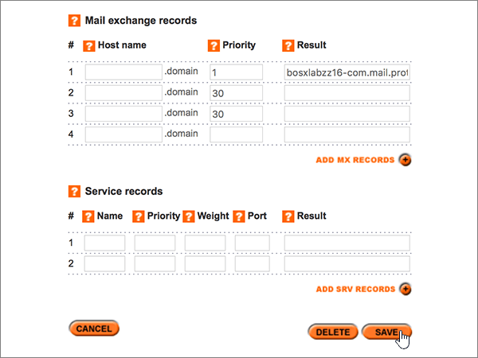

# DNS-records maken op Names.co.uk voor Microsoft

 **[Raadpleeg de veelgestelde vragen over domeinen](../setup/domains-faq.md)** als u niet kunt vinden wat u zoekt. 
  
Als Names.co.uk uw DNS-hostingprovider is, voert u de stappen in dit artikel uit om uw domein te verifiëren en DNS-records voor e-mail, Skype voor Bedrijven Online enzovoort in te stellen.
    
Nadat u deze records hebt toegevoegd aan Names.co.uk, wordt uw domein ingesteld voor gebruik met Microsoft-services.
  

  
> [!NOTE]
>  Het duurt gewoonlijk ongeveer 15 minuten voordat DNS-wijzigingen van kracht worden. Het kan echter soms wat langer duren voordat een wijziging die u hebt aangebracht, is bijgewerkt via het DNS-systeem op internet. Als u na het toevoegen van de DNS-records problemen hebt met het ontvangen of verzenden van e-mail, raadpleegt u [Problemen oplossen nadat u uw domeinnaam of DNS-records hebt gewijzigd](../get-help-with-domains/find-and-fix-issues.md). 
  
## Een TXT-record toevoegen voor verificatie

Voordat u uw domein met Microsoft kunt gebruiken, moet worden gecontroleerd dat u de eigenaar bent van het domein. Als u zich bij uw account bij de domeinregistrar kunt aanmelden en de DNS-record kunt maken, is dit voor Microsoft bewezen.
  
> [!NOTE]
> Deze record wordt alleen gebruikt om te verifiëren dat u de eigenaar van uw domein bent. Dit heeft verder geen invloed. U kunt deze record later desgewenst verwijderen. 
  
1. Als u wilt beginnen, gaat u naar uw domeinenpagina bij Names.co.uk via [deze koppeling](https://account.names.co.uk/dashboard#/). U wordt gevraagd u eerst aan te melden.
    
    
  
2. Zoek op de pagina **Dashboard** de naam van het domein dat u bijwerkt, en kies vervolgens **DNS-instellingen** in de vervolgkeuzelijst. 
    
    (Mogelijk moet u omlaag schuiven.)
    
    
  
3. Typ of kopieer en plak op de pagina **Add/Modify DNS Zone**, in de sectie **A, CNAME, AAAA, TXT and NS records**, de waarden uit de volgende tabel in de vakken voor de nieuwe record. 
    
    (Kies in de vervolgkeuzelijst de waarde **Type**). 
    
    (Als u een rij moet toevoegen, selecteert u **A/CNAME RECORDS toevoegen (+)**.)
    
    (Mogelijk moet u omlaag schuiven.)
        
    |**Hostnaam**|**Type**|**Resultaat**|
    |:-----|:-----|:-----|
    |(Laat dit veld leeg.)    |TXT    |MS=ms *XXXXXXXX*    **Opmerking:** Dit is een voorbeeld. Gebruik hier de specifieke waarde voor **Doel of adres waarnaar wordt verwezen** uit de tabel.           [Hoe kan ik dit vinden?](../get-help-with-domains/information-for-dns-records.md)    |
       
    
  
4. Kies **Opslaan**.
    
    (Mogelijk moet u omlaag schuiven.)
    
    
  
5. Wacht enkele minuten voordat u verder gaat, zodat de record die u zojuist hebt gemaakt via internet kan worden bijgewerkt.
    
Nu u de record hebt toegevoegd aan de site van uw domeinregistrar, gaat u terug naar Microsoft en vraagt u de record aan.
  
Wanneer in Microsoft de juiste TXT-record is gevonden, is uw domein gecontroleerd.
  
1. Ga in het beheercentrum naar **Instellingen** \> <a href="https://go.microsoft.com/fwlink/p/?linkid=834818" target="_blank">Domeinen</a>-pagina.
    
2. Kies op de pagina **Domeinen** de naam van het domein dat u verifieert. 
    
    
  
3. Kies **Start setup** op de pagina **Setup**.
    
    
  
4. Kies **Verifiëren** op de pagina **Domein verifiëren**.
    
    
  
> [!NOTE]
>  Het duurt gewoonlijk ongeveer 15 minuten voordat DNS-wijzigingen van kracht worden. Het kan echter soms wat langer duren voordat een wijziging die u hebt aangebracht, is bijgewerkt via het DNS-systeem op internet. Als u na het toevoegen van de DNS-records problemen hebt met het ontvangen of verzenden van e-mail, raadpleegt u [Problemen oplossen nadat u uw domeinnaam of DNS-records hebt gewijzigd](../get-help-with-domains/find-and-fix-issues.md). 
  
## Voeg een MX-record toe zodat e-mail voor uw domein naar Microsoft wordt verzonden

1. Als u wilt beginnen, gaat u naar uw domeinenpagina bij Names.co.uk via [deze koppeling](https://account.names.co.uk/dashboard#/). U wordt gevraagd u eerst aan te melden.
    
    
  
2. Zoek op de pagina **Dashboard** de naam van het domein dat u bijwerkt, en kies vervolgens **DNS-instellingen** in de vervolgkeuzelijst. 
    
    (Mogelijk moet u omlaag schuiven.)
    
    
  
3. Typ of kopieer en plak op de pagina **Add/Modify DNS Zone**, in de sectie **Mail Exchange records**, de waarden uit de volgende tabel in de vakken voor de nieuwe record. 
    
    (Mogelijk moet u omlaag schuiven.)
    
    |**Hostnaam**|**Priority**|**Resultaat**|
    |:-----|:-----|:-----|
    |(Laat dit veld leeg.)    |1    Zie [Wat is MX-prioriteit?](https://docs.microsoft.com/microsoft-365/admin/setup/domains-faq) voor meer informatie over prioriteit.   | *\<domeinsleutel\>*  .mail.protection.outlook.com    > [!NOTE]> Uw * \<domeinsleutel\> * ophalen van uw Microsoft-account.           [Hoe kan ik dit vinden?](../get-help-with-domains/information-for-dns-records.md)          |
       
    
  
4. Kies **Opslaan**.
    
    (Mogelijk moet u omlaag schuiven.)
    
    
  
5. Als er in de sectie **Mail Exchange records** andere MX-records worden vermeld, verwijdert u elke record door deze te selecteren en vervolgens op het toetsenbord op de toets **Delete** te drukken. 
    
    
  
6. Kies **Opslaan**.
    
    (Mogelijk moet u omlaag schuiven.)
    
    
  
## Voeg de zes CNAME-records toe die nodig zijn voor Microsoft

1. Als u wilt beginnen, gaat u naar uw domeinenpagina bij Names.co.uk via [deze koppeling](https://account.names.co.uk/dashboard#/). U wordt gevraagd u eerst aan te melden.
    
    
  
2. Zoek op de pagina **Dashboard** de naam van het domein dat u bijwerkt, en kies vervolgens **DNS-instellingen** in de vervolgkeuzelijst. 
    
    (Mogelijk moet u omlaag schuiven.)
    
    
  
3. Typ of kopieer en plak op de pagina **Add/Modify DNS Zone**, in de sectie **A, CNAME, AAAA, TXT and NS records**, de waarden uit de volgende tabel in de vakken voor de nieuwe record. 
    
    (Kies in de vervolgkeuzelijst de waarde **Type**). 
    
    (Als u een rij moet toevoegen, selecteert u **A/CNAME RECORDS toevoegen (+)**.)
    
    (Mogelijk moet u omlaag schuiven.)
    
    |**Host Name**|**Type**|**Result**|
    |:-----|:-----|:-----|
    |autodiscover    |CNAME    |autodiscover.outlook.com    |
    |sip    |CNAME    |sipdir.online.lync.com    |
    |lyncdiscover    |CNAME    |webdir.online.lync.com    |
    |enterpriseregistration    |CNAME    |enterpriseregistration.windows.net    |
    |enterpriseenrollment    |CNAME    |enterpriseenrollment-s.manage.microsoft.com    |
       
    
  
4. Kies **Opslaan**.
    
    
  
## Een TXT-record voor SPF toevoegen om spam tegen te gaan

> [!IMPORTANT]
> U kunt maximaal 1 TXT-record hebben voor SPF voor een domein. Als uw domein meer dan één SPF-record heeft, kan dit resulteren in e-mailfouten, evenals leverings- en spamclassificatieproblemen. Als u al een SPF-record voor uw domein hebt, hoeft u geen nieuwe te maken voor Microsoft. Voeg in plaats daarvan de vereiste Microsoft-waarden toe aan de huidige record, zodat u *één* SPF-record hebt die beide waardensets bevat.
  
1. Als u wilt beginnen, gaat u naar uw domeinenpagina bij Names.co.uk via [deze koppeling](https://account.names.co.uk/dashboard#/). U wordt gevraagd u eerst aan te melden.
    
    
  
2. Zoek op de pagina **Dashboard** de naam van het domein dat u bijwerkt, en kies vervolgens **DNS-instellingen** in de vervolgkeuzelijst. 
    
    (Mogelijk moet u omlaag schuiven.)
    
    
  
3. Selecteer op de pagina **DNS-zones op account** in de kolom **Domeinnaam** de naam van het domein dat u bijwerkt. 
    
    
  
4. Typ of kopieer en plak op de pagina **Add/Modify DNS Zone**, in de sectie **A-, CNAME-, AAAA-, TXT- en NS-records**, de waarden uit de volgende tabel in de vakken voor de nieuwe record. 
    
    (Kies in de vervolgkeuzelijst de waarde **Type**). 
    
    (Als u een rij moet toevoegen, selecteert u **A/CNAME RECORDS toevoegen (+)**.)
    
    (Mogelijk moet u omlaag schuiven.)
    
    |**Hostnaam**|**Type**|**Resultaat**|
    |:-----|:-----|:-----|
    |(Laat dit veld leeg.)    |TXT    |v=spf1 include:spf.protection.outlook.com -all    **Opmerking:** het is raadzaam dit item te kopiëren en te plakken, zodat het spatiegebruik ongewijzigd blijft.           |
       
    
  
5. Kies **Opslaan**.
    
    (Mogelijk moet u omlaag schuiven.)
    
    
  
## De twee SRV-records toevoegen die zijn vereist voor Microsoft

1. Als u wilt beginnen, gaat u naar uw domeinenpagina bij Names.co.uk via [deze koppeling](https://account.names.co.uk/dashboard#/). U wordt gevraagd u eerst aan te melden.
    
    
  
2. Zoek op de pagina **Dashboard** de naam van het domein dat u bijwerkt, en kies vervolgens **DNS-instellingen** in de vervolgkeuzelijst. 
    
    (Mogelijk moet u omlaag schuiven.)
    
    
  
3. Typ of kopieer en plak op de pagina **Add/Modify DNS Zone**, in de sectie **Service records**, de waarden uit de volgende tabel in de vakken voor de nieuwe record. 
    
    (Mogelijk moet u omlaag schuiven.)
    
    |**Name**|**Prioriteit**|**Gewicht**|**Poort**|**Result**|
    |:-----|:-----|:-----|:-----|:-----|
    |_sip._tls    |100    |1    |443    |sipdir.online.lync.com    |
    |_sipfederationtls._tcp    |100    |1    |5061    |sipfed.online.lync.com    |
       
    
  
4. Kies **Opslaan**.
    
    (Mogelijk moet u omlaag schuiven.)
    
    
  
> [!NOTE]
>  Het duurt gewoonlijk ongeveer 15 minuten voordat DNS-wijzigingen van kracht worden. Het kan echter soms wat langer duren voordat een wijziging die u hebt aangebracht, is bijgewerkt via het DNS-systeem op internet. Als u na het toevoegen van de DNS-records problemen hebt met het ontvangen of verzenden van e-mail, raadpleegt u [Problemen oplossen nadat u uw domeinnaam of DNS-records hebt gewijzigd](../get-help-with-domains/find-and-fix-issues.md). 
  
