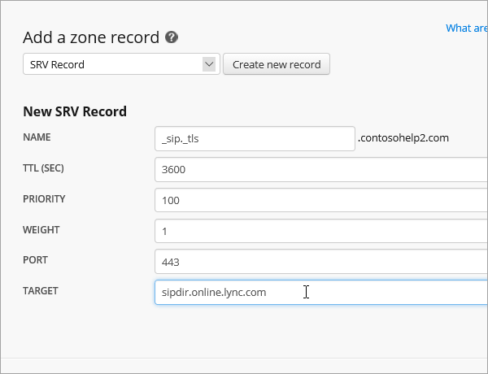

# DNS-records maken bij Netregistry voor Office 365

[Raadpleeg de veelgestelde vragen over domeinen](../setup/domains-faq.md) als u niet kunt vinden wat u zoekt. 
  
Als Netregistry uw DNS-hostingprovider is, voert u de stappen in dit artikel uit om uw domein te verifiëren en DNS-records voor e-mail, Skype voor Bedrijven Online, enzovoort in te stellen.
  
Dit zijn de belangrijkste records om toe te voegen.
  
- [Een TXT-record toevoegen voor verificatie](#add-a-txt-record-for-verification)
    
- [Voeg een MX-record toe zodat e-mail voor uw domein bij Office 365 terechtkomt](#add-an-mx-record-so-email-for-your-domain-will-come-to-office-365)

- [De CNAME-records toevoegen die voor Office 365 vereist zijn](#add-the-cname-records-that-are-required-for-office-365)
    
- [Een TXT-record voor SPF toevoegen om spam tegen te gaan](#add-a-txt-record-for-spf-to-help-prevent-email-spam)
    
- [Voeg de vier SRV-records toe die voor Office 365 vereist zijn.](#add-the-two-srv-records-that-are-required-for-office-365)
    
Nadat u deze records hebt toegevoegd bij Netregistry, wordt uw domein ingesteld voor gebruik met Office 365-services.
  
Zie [Een openbare website gebruiken met Office 365](https://support.office.com/article/a8178510-501d-4bd8-9921-b04f2e9517a5.aspx) voor informatie over webhosting en DNS voor websites met Office 365.
  
> [!NOTE]
> Het duurt gewoonlijk ongeveer 15 minuten voordat DNS-wijzigingen van kracht worden. Het kan echter soms wat langer duren voordat een wijziging die u hebt aangebracht, is bijgewerkt via het DNS-systeem op internet. Als u na het toevoegen van de DNS-records problemen hebt met het ontvangen of verzenden van e-mail, raadpleegt u [Problemen oplossen nadat u uw domeinnaam of DNS-records hebt gewijzigd](../get-help-with-domains/find-and-fix-issues.md). 
  
## Een TXT-record toevoegen voor verificatie

Voordat u uw domein met Office 365 kunt gaan gebruiken, moet worden gecontroleerd dat u de eigenaar bent van het domein. Als u zich bij uw account bij de domeinregistrar kunt aanmelden en de DNS-record kunt maken, is dit voor Office 365 bewezen.
  
> [!NOTE]
> Deze record wordt alleen gebruikt om te verifiëren dat u de eigenaar van uw domein bent. Dit heeft verder geen invloed. U kunt deze record later desgewenst verwijderen. 
  
1. Ga naar uw domeinpagina van Netregistry via [deze koppeling](https://theconsole.netregistry.com.au/). U wordt gevraagd u aan te melden.
    
    
  
2. Selecteer **Manage** (beheren) naast het domein dat u wilt beheren.
    
    
  
3. Selecteer **Zone Manager**.
    
    
  
4. Kies **onder Een zonerecord toevoegen**de optie **TXT-record** in de lijst en selecteer **Vervolgens Nieuwe record maken**.
    
    
  
    > [!NOTE]
    > U moet aanhalingstekens gebruiken voor en na de vermelding in het vak TXT. 
  
    Typ of kopieer en plak de waarden uit de volgende tabel in het formulier **New TXT Record** (nieuwe TXT-record). 
    
    |**Naam**|**TTL (SEC)**|**TXT (Verwijst naar adres of waarde)**|
    |:-----|:-----|:-----|
    |(laat leeg)    |3600 (seconden)    |"MS=msXXXXXXXX"    **Opmerking:** Dit is een voorbeeld. Gebruik hier de specifieke waarde voor **Doel of adres waarnaar wordt verwezen** uit de tabel in Office 365. [Hoe kan ik dit vinden?](../get-help-with-domains/information-for-dns-records.md)  |
       
    
  
6. Selecteer **Record toevoegen**.
    
Nu u de record hebt toegevoegd aan de site van uw domeinregistrar, gaat u terug naar Office 365 en vraagt u of Office 365 naar de record wil zoeken.
  
Wanneer in Office 365 de juiste TXT-record is gevonden, is uw domein gecontroleerd.
  
1. Ga in het beheercentrum naar de pagina \> <a href="https://go.microsoft.com/fwlink/p/?linkid=834818" target="_blank">Instellingendomeinen.</a> **Settings**
    
2. Selecteer **op** de pagina Domeinen het domein dat u verifieert. 
    
    
  
3. Selecteer **op** de pagina Setup de optie **Installatie starten**.
    
    
  
4. Selecteer **op** de pagina Domein verifiëren de optie **Verifiëren**.
    
    
  
> [!NOTE]
>  Het duurt gewoonlijk ongeveer 15 minuten voordat DNS-wijzigingen van kracht worden. Het kan echter soms wat langer duren voordat een wijziging die u hebt aangebracht, is bijgewerkt via het DNS-systeem op internet. Als u na het toevoegen van de DNS-records problemen hebt met het ontvangen of verzenden van e-mail, raadpleegt u [Problemen oplossen nadat u uw domeinnaam of DNS-records hebt gewijzigd](../get-help-with-domains/find-and-fix-issues.md). 
  
## Voeg een MX-record toe zodat e-mail voor uw domein bij Office 365 terechtkomt

1. Ga naar uw domeinpagina van Netregistry via [deze koppeling](https://theconsole.netregistry.com.au/). U wordt gevraagd u aan te melden.
    
    
  
2. Selecteer **Manage** (beheren) naast het domein dat u wilt beheren.
    
    
  
3. Selecteer **Zone Manager**.
    
    
  
4. Verwijder **onder Huidige zonerecords**de standaardMX-records door **Verwijderen** naast elke MX-record in de lijst te selecteren. 
    
    
  
5. Kies **mx-record** in de lijst **onder Een zonerecord toevoegen**en selecteer Vervolgens Nieuwe record **maken**.
    
    
  
6. Typ of kopieer en plak de waarden uit de volgende tabel in het formulier **Nieuwe MX-record.** 
    
    |**Naam**|**TTL (SEC)**|**Exchange (Adres- of waardeaanspraken)**|**Is de host volledig gekwalificeerd?**|**Voorkeur (prioriteit)**|
    |:-----|:-----|:-----|:-----|:-----|
    |(laat leeg)    |3600 (seconden)    | *\<domeinsleutel\>*  .mail.protection.outlook.com    **Let op:** Haal uw * \<domeinsleutel\> * op uit uw Office 365-account.  [Hoe kan ik dit vinden?](../get-help-with-domains/information-for-dns-records.md)      |(schakel het selectievakje in)    |10    Zie Wat is MX-prioriteit? voor meer informatie over prioriteit.       |
       
    
  
7. Selecteer **Record toevoegen**.
    
    
  
## De CNAME-records toevoegen die voor Office 365 vereist zijn

1. Ga naar uw domeinpagina van Netregistry via [deze koppeling](https://theconsole.netregistry.com.au/). U wordt gevraagd u aan te melden.
    
    
  
2. Selecteer **Manage** (beheren) naast het domein dat u wilt beheren.
    
    
  
3. Selecteer **Zone Manager**.
    
    
  
4. Kies **onder Een zonerecord toevoegen**de optie **CNAME Record** in de lijst en selecteer Vervolgens Nieuwe record **maken**.
    
    
  
5. Typ of kopieer en plak de waarden uit de volgende tabel in de vakken voor de nieuwe record.
    
    |**Name**|**Type**|**TTL**|**HOST (Adreswaarde of adreswaarde)**|
    |:-----|:-----|:-----|:-----|
    |autodiscover    |CNAME    |3600 (seconden)    |autodiscover.outlook.com    |
    |sip    |CNAME    |3600 (seconden)    |sipdir.online.lync.com    |
    |lyncdiscover    |CNAME    |3600 (seconden)    |webdir.online.lync.com    |
    |enterpriseregistration    |CNAME    |3600 (seconden)    |enterpriseregistration.windows.net    |
    |enterpriseenrollment    |CNAME    |3600 (seconden)    |enterpriseenrollment-s.manage.microsoft.com    |
       
    
      
6. Selecteer **Record toevoegen**.
    
    
  
7. Herhaal de vorige stappen om de vijf andere CNAME-records te maken.
    
    Typ of kopieer en plak voor elke record de waarden uit de volgende rij van de bovenstaande tabel in de velden voor die record.
    
## Een TXT-record voor SPF toevoegen om spam tegen te gaan

> [!IMPORTANT]
> U kunt maximaal 1 TXT-record hebben voor SPF voor een domein. Als uw domein meer dan één SPF-record heeft, kan dit resulteren in e-mailfouten, evenals leverings- en spamclassificatieproblemen. Als u al een SPF-record voor uw domein hebt, hoeft u geen nieuwe voor Office 365 te maken. In plaats daarvan voegt u de vereiste Office 365-waarden toe aan de huidige record, zodat u beschikt over  *één*  SPF-record waarin beide sets waarden zijn opgenomen.
  
1. Ga naar uw domeinpagina van Netregistry via [deze koppeling](https://theconsole.netregistry.com.au/). U wordt gevraagd u aan te melden.
    
    
  
2. Selecteer **Manage** (beheren) naast het domein dat u wilt beheren.
    
    
  
3. Selecteer **Zone Manager**.
    
    
  
4. Kies **onder Een zonerecord toevoegen**de optie **TXT-record** in de lijst en selecteer **Vervolgens Nieuwe record maken**.
    
    
  
5. Typ of kopieer en plak de waarden uit de volgende tabel in de vakken voor de nieuwe record. 
    
    > [!NOTE]
    > U moet aanhalingstekens gebruiken voor en na de vermelding in het vak TXT. 
  
    |**Name**|**Type**|**TTL**|**TXT-gegevens (doel)**|
    |:-----|:-----|:-----|:-----|
    |(laat leeg)    |TXT    |3600 (seconden)    |"v=spf1 include:spf.protection.outlook.com -all"    **Opmerking:** het is raadzaam dit item te kopiëren en te plakken, zodat het spatiegebruik ongewijzigd blijft.           |
   
    
  
6. Selecteer **Record toevoegen**.
    
    
  
## Voeg de vier SRV-records toe die voor Office 365 vereist zijn.

1. Ga naar uw domeinpagina van Netregistry via [deze koppeling](https://theconsole.netregistry.com.au/). U wordt gevraagd u aan te melden.
    
    
  
2. Selecteer Naast het domein dat u wilt beheren de optie **Beheren**.
    
    
  
3. Selecteer **Zone Manager**.
    
    
  
4. Kies **onder Een zonerecord toevoegen**de optie **SRV-record** in de lijst en selecteer **Vervolgens Nieuwe record maken**.
    
    
  
5. Typ of kopieer en plak de waarden uit de volgende tabel in de vakken voor de nieuwe record.
    
    > [!NOTE]
    > Het veld Naam is een combinatie van de service (bijvoorbeeld _sip) en protocol (bijvoorbeeld _tls). 
  
    |**Type**|**Naam**|**TTL (SEC)**|**Priority**|**Weight**|**Port**|**Target**|
    |:-----|:-----|:-----|:-----|:-----|:-----|:-----|
    |SRV (service)    |_sip._tls    |3600 (seconden)    |100    |1    |443    |sipdir.online.lync.com    |
    |SRV (service)    |_sipfederationtls._tcp    |3600 (seconden)    |100    |1    |5061    |sipfed.online.lync.com    |
       
    
  
6. Selecteer **Record toevoegen**.
    
    
  
7. Herhaal de vorige stappen om de andere SRV-record te maken.
    
    Typ of kopieer en plak de waarden uit de tweede rij van de bovenstaande tabel in de vakken voor de tweede record.
    
> [!NOTE]
> Het duurt gewoonlijk ongeveer 15 minuten voordat DNS-wijzigingen van kracht worden. Het kan echter soms wat langer duren voordat een wijziging die u hebt aangebracht, is bijgewerkt via het DNS-systeem op internet. Als u na het toevoegen van de DNS-records problemen hebt met het ontvangen of verzenden van e-mail, raadpleegt u [Problemen oplossen nadat u uw domeinnaam of DNS-records hebt gewijzigd](../get-help-with-domains/find-and-fix-issues.md). 
  

