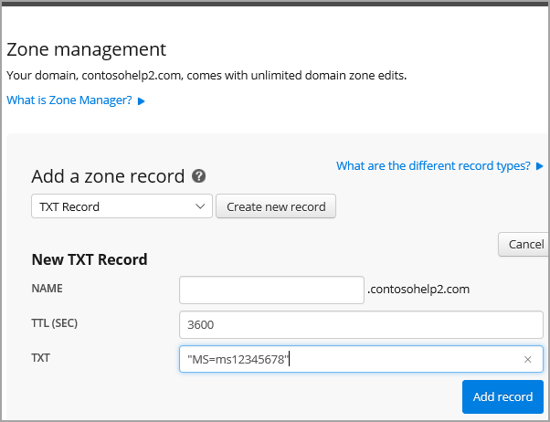

# DNS-records maken bij Netregistry voor Office 365Create DNS records at Netregistry for Office 365

[Raadpleeg de veelgestelde vragen over domeinen](../setup/domains-faq.md) als u niet kunt vinden wat u zoekt.[Check the Domains FAQ](../setup/domains-faq.md) if you don't find what you're looking for. 
  
Als Netregistry uw DNS-hostingprovider is, voert u de stappen in dit artikel uit om uw domein te verifiëren en DNS-records voor e-mail, Skype voor Bedrijven Online, enzovoort in te stellen.If Netregistry is your DNS hosting provider, follow the steps in this article to verify your domain and set up DNS records for email, Skype for Business Online, and so on.
  
Dit zijn de belangrijkste records om toe te voegen.These are the main records to add.
  
- [Een TXT-record toevoegen voor verificatieAdd a TXT record for verification](#add-a-txt-record-for-verification)
    
- [Voeg een MX-record toe zodat e-mail voor uw domein bij Office 365 terechtkomtAdd an MX record so email for your domain will come to Office 365](#add-an-mx-record-so-email-for-your-domain-will-come-to-office-365)

- [De CNAME-records toevoegen die voor Office 365 vereist zijnAdd the CNAME records that are required for Office 365](#add-the-cname-records-that-are-required-for-office-365)
    
- [Een TXT-record voor SPF toevoegen om spam tegen te gaanAdd a TXT record for SPF to help prevent email spam](#add-a-txt-record-for-spf-to-help-prevent-email-spam)
    
- [Voeg de vier SRV-records toe die voor Office 365 vereist zijn.Add the two SRV records that are required for Office 365](#add-the-two-srv-records-that-are-required-for-office-365)
    
Nadat u deze records hebt toegevoegd bij Netregistry, wordt uw domein ingesteld voor gebruik met Office 365-services.After you add these records at Netregistry, your domain will be set up to work with Office 365 services.
  
Zie [Een openbare website gebruiken met Office 365](https://support.office.com/article/a8178510-501d-4bd8-9921-b04f2e9517a5.aspx) voor informatie over webhosting en DNS voor websites met Office 365.To learn about webhosting and DNS for websites with Office 365, see [Use a public website with Office 365](https://support.office.com/article/a8178510-501d-4bd8-9921-b04f2e9517a5.aspx).
  
> [!NOTE]
> Het duurt gewoonlijk ongeveer 15 minuten voordat DNS-wijzigingen van kracht worden. Het kan echter soms wat langer duren voordat een wijziging die u hebt aangebracht, is bijgewerkt via het DNS-systeem op internet. Als u na het toevoegen van de DNS-records problemen hebt met het ontvangen of verzenden van e-mail, raadpleegt u [Problemen oplossen nadat u uw domeinnaam of DNS-records hebt gewijzigd](../get-help-with-domains/find-and-fix-issues.md).Typically it takes about 15 minutes for DNS changes to take effect. However, it can occasionally take longer for a change you've made to update across the Internet's DNS system. If you're having trouble with mail flow or other issues after adding DNS records, see [Troubleshoot issues after changing your domain name or DNS records](../get-help-with-domains/find-and-fix-issues.md). 
  
## Een TXT-record toevoegen voor verificatieAdd a TXT record for verification

Voordat u uw domein met Office 365 kunt gaan gebruiken, moet worden gecontroleerd dat u de eigenaar bent van het domein. Als u zich bij uw account bij de domeinregistrar kunt aanmelden en de DNS-record kunt maken, is dit voor Office 365 bewezen.Before you use your domain with Office 365, we have to make sure that you own it. Your ability to log in to your account at your domain registrar and create the DNS record proves to Office 365 that you own the domain.
  
> [!NOTE]
> Deze record wordt alleen gebruikt om te verifiëren dat u de eigenaar van uw domein bent. Dit heeft verder geen invloed. U kunt deze record later desgewenst verwijderen.This record is used only to verify that you own your domain; it doesn't affect anything else. You can delete it later, if you like. 
  
1. Ga naar uw domeinpagina van Netregistry via [deze koppeling](https://theconsole.netregistry.com.au/). U wordt gevraagd u aan te melden.To get started, go to your domains page in Netregistry by using [this link](https://theconsole.netregistry.com.au/). You'll be prompted to log in.
    
    
  
2. Selecteer **Manage** (beheren) naast het domein dat u wilt beheren.Next to the domain you want to manage, select **Manage**.
    
    
  
3. Selecteer **Zone Manager**.Select **Zone Manager**.
    
    
  
4. Kies **onder Een zonerecord toevoegen**de optie **TXT-record** in de lijst en selecteer **Vervolgens Nieuwe record maken**.Under **Add a zone record**, choose **TXT Record** from the list, and then select **Create new record**.
    
    
  
    > [!NOTE]
    > U moet aanhalingstekens gebruiken voor en na de vermelding in het vak TXT.You must use quotation marks before and after the entry in the TXT box. 
  
    Typ of kopieer en plak de waarden uit de volgende tabel in het formulier **New TXT Record** (nieuwe TXT-record).In the **New TXT Record** form, type or copy and paste the values from the following table. 
    
    |**Naam****Name**|**TTL (SEC)****TTL (SEC)**|**TXT (Verwijst naar adres of waarde)****TXT (Points to address or value)**|
    |:-----|:-----|:-----|
    |(laat leeg)(leave blank)    |3600 (seconden)3600 (seconds)    |"MS=msXXXXXXXX""MS=msXXXXXXXX"    **Opmerking:** Dit is een voorbeeld.**Note:** This is an example. Gebruik hier de specifieke waarde voor **Doel of adres waarnaar wordt verwezen** uit de tabel in Office 365.Use your specific **Destination or Points to Address** value here, from the table in Office 365. [Hoe kan ik dit vinden?How do I find this?](../get-help-with-domains/information-for-dns-records.md)  |
       
    
  
6. Selecteer **Record toevoegen**.Select **Add record**.
    
Nu u de record hebt toegevoegd aan de site van uw domeinregistrar, gaat u terug naar Office 365 en vraagt u of Office 365 naar de record wil zoeken.Now that you've added the record at your domain registrar's site, you'll go back to Office 365 and request Office 365 to look for the record.
  
Wanneer in Office 365 de juiste TXT-record is gevonden, is uw domein gecontroleerd.When Office 365 finds the correct TXT record, your domain is verified.
  
1. Ga in het beheercentrum naar **Instellingen** \> <a href="https://go.microsoft.com/fwlink/p/?linkid=834818" target="_blank">Domeinen</a>-pagina.In the admin center, go to the **Settings** \> <a href="https://go.microsoft.com/fwlink/p/?linkid=834818" target="_blank">Domains</a> page.
    
2. Kies op de pagina **Domeinen** de naam van het domein dat u verifieert.On the **Domains** page, select the domain that you are verifying. 
    
    
  
3. Kies **Start setup** op de pagina **Setup**.On the **Setup** page, select **Start setup**.
    
    
  
4. Kies **Verifiëren** op de pagina **Domein verifiëren**.On the **Verify domain** page, select **Verify**.
    
    
  
> [!NOTE]
>  Het duurt gewoonlijk ongeveer 15 minuten voordat DNS-wijzigingen van kracht worden. Het kan echter soms wat langer duren voordat een wijziging die u hebt aangebracht, is bijgewerkt via het DNS-systeem op internet. Als u na het toevoegen van de DNS-records problemen hebt met het ontvangen of verzenden van e-mail, raadpleegt u [Problemen oplossen nadat u uw domeinnaam of DNS-records hebt gewijzigd](../get-help-with-domains/find-and-fix-issues.md).Typically it takes about 15 minutes for DNS changes to take effect. However, it can occasionally take longer for a change you've made to update across the Internet's DNS system. If you're having trouble with mail flow or other issues after adding DNS records, see [Troubleshoot issues after changing your domain name or DNS records](../get-help-with-domains/find-and-fix-issues.md). 
  
## Een MX-record toevoegen zodat e-mail voor uw domein bij Office 365 terechtkomtAdd an MX record so email for your domain will come to Office 365

1. Ga naar uw domeinpagina van Netregistry via [deze koppeling](https://theconsole.netregistry.com.au/). U wordt gevraagd u aan te melden.To get started, go to your domains page in Netregistry by using [this link](https://theconsole.netregistry.com.au/). You'll be prompted to log in.
    
    
  
2. Selecteer **Manage** (beheren) naast het domein dat u wilt beheren.Next to the domain you want to manage, select **Manage**.
    
    
  
3. Selecteer **Zone Manager**.Select **Zone Manager**.
    
    
  
4. Verwijder **onder Huidige zonerecords**de standaardMX-records door **Verwijderen** naast elke MX-record in de lijst te selecteren.Under **Current zone records**, remove the default MX records by selecting **Remove** next to each MX record in the list. 
    
    
  
5. Kies **mx-record** in de lijst **onder Een zonerecord toevoegen**en selecteer Vervolgens Nieuwe record **maken**.Under **Add a zone record**, choose **MX Record** from the list, and then select **Create new record**.
    
    
  
6. Typ of kopieer en plak de waarden uit de volgende tabel in het formulier **Nieuwe MX-record.**In the **New MX Record** form, type or copy and paste the values from the following table. 
    
    |**Naam****Name**|**TTL (SEC)****TTL (SEC)**|**Exchange (Adres- of waardeaanspraken)****Exchange (Points to address or value)**|**Is de host volledig gekwalificeerd?****Is host fully qualified?**|**Voorkeur (prioriteit)****Preference (Priority)**|
    |:-----|:-----|:-----|:-----|:-----|
    |(laat leeg)(leave blank)    |3600 (seconden)3600 (seconds)    | *\<domeinsleutel\>*  .mail.protection.outlook.com*\<domain-key\>*  .mail.protection.outlook.com    **Let op:** Haal uw \* \<domeinsleutel\> \* op uit uw Office 365-account.**Note:** Get your  *\<domain-key\>*  from your Office 365 account.  [Hoe kan ik dit vinden?How do I find this?](../get-help-with-domains/information-for-dns-records.md)      |(schakel het selectievakje in)(select the checkbox)    |1010    Zie Wat is MX-prioriteit? voor meer informatie over prioriteit.For more information about priority, see What is MX priority?    |
       
    
  
7. Selecteer **Record toevoegen**.Select **Add Record**.
    
    
  
## De CNAME-records toevoegen die voor Office 365 vereist zijnAdd the CNAME records that are required for Office 365

1. Ga naar uw domeinpagina van Netregistry via [deze koppeling](https://theconsole.netregistry.com.au/). U wordt gevraagd u aan te melden.To get started, go to your domains page in Netregistry by using [this link](https://theconsole.netregistry.com.au/). You'll be prompted to log in.
    
    
  
2. Selecteer **Manage** (beheren) naast het domein dat u wilt beheren.Next to the domain you want to manage, select **Manage**.
    
    
  
3. Selecteer **Zone Manager**.Select **Zone Manager**.
    
    
  
4. Kies **onder Een zonerecord toevoegen**de optie **CNAME Record** in de lijst en selecteer Vervolgens Nieuwe record **maken**.Under  **Add a zone record**, choose **CNAME Record** from the list, and then select **Create new record**.
    
    
  
5. Typ of kopieer en plak de waarden uit de volgende tabel in de vakken voor de nieuwe record.In the boxes for the new record, type or copy and paste the values from the following table.
    
    |**Name****Name**|**Type****Type**|**TTL****TTL**|**HOST (Adreswaarde of adreswaarde)****HOST (Points to or address value)**|
    |:-----|:-----|:-----|:-----|
    |autodiscoverautodiscover    |CNAMECNAME    |3600 (seconden)3600 (seconds)    |autodiscover.outlook.comautodiscover.outlook.com    |
    |sipsip    |CNAMECNAME    |3600 (seconden)3600 (seconds)    |sipdir.online.lync.comsipdir.online.lync.com    |
    |lyncdiscoverlyncdiscover    |CNAMECNAME    |3600 (seconden)3600 (seconds)    |webdir.online.lync.comwebdir.online.lync.com    |
    |enterpriseregistrationenterpriseregistration    |CNAMECNAME    |3600 (seconden)3600 (seconds)    |enterpriseregistration.windows.netenterpriseregistration.windows.net    |
    |enterpriseenrollmententerpriseenrollment    |CNAMECNAME    |3600 (seconden)3600 (seconds)    |enterpriseenrollment-s.manage.microsoft.comenterpriseenrollment-s.manage.microsoft.com    |
       
    
      
6. Selecteer **Record toevoegen**.Select **Add record**.
    
    
  
7. Herhaal de vorige stappen om de vijf andere CNAME-records te maken.Repeat the previous steps to create the other five CNAME records.
    
    Typ of kopieer en plak voor elke record de waarden uit de volgende rij van de bovenstaande tabel in de velden voor die record.For each record, type or copy and paste the values from the next row of the table above into the boxes for that record.
    
## Een TXT-record voor SPF toevoegen om spam tegen te gaanAdd a TXT record for SPF to help prevent email spam

> [!IMPORTANT]
> U kunt maximaal 1 TXT-record hebben voor SPF voor een domein.You cannot have more than one TXT record for SPF for a domain. Als uw domein meer dan één SPF-record heeft, kan dit resulteren in e-mailfouten, evenals leverings- en spamclassificatieproblemen.If your domain has more than one SPF record, you'll get email errors, as well as delivery and spam classification issues. Als u al een SPF-record voor uw domein hebt, hoeft u geen nieuwe voor Office 365 te maken.If you already have an SPF record for your domain, don't create a new one for Office 365. In plaats daarvan voegt u de vereiste Office 365-waarden toe aan de huidige record, zodat u beschikt over  *één*  SPF-record waarin beide sets waarden zijn opgenomen.Instead, add the required Office 365 values to the current record so that you have a  *single*  SPF record that includes both sets of values.
  
1. Ga naar uw domeinpagina van Netregistry via [deze koppeling](https://theconsole.netregistry.com.au/). U wordt gevraagd u aan te melden.To get started, go to your domains page in Netregistry by using [this link](https://theconsole.netregistry.com.au/). You'll be prompted to log in.
    
    
  
2. Selecteer **Manage** (beheren) naast het domein dat u wilt beheren.Next to the domain you want to manage, select **Manage**.
    
    
  
3. Selecteer **Zone Manager**.Select **Zone Manager**.
    
    
  
4. Kies **onder Een zonerecord toevoegen**de optie **TXT-record** in de lijst en selecteer **Vervolgens Nieuwe record maken**.Under **Add a zone record**, choose **TXT Record** from the list, and then select **Create new record**.
    
    
  
5. Typ of kopieer en plak de waarden uit de volgende tabel in de vakken voor de nieuwe record.In the boxes for the new record, type or copy and paste the values from the following table. 
    
    > [!NOTE]
    > U moet aanhalingstekens gebruiken voor en na de vermelding in het vak TXT.You must use quotation marks before and after the entry in the TXT box. 
  
    |**Name****Name**|**Type****Type**|**TTL****TTL**|**TXT-gegevens (doel)****TXT Data (Target)**|
    |:-----|:-----|:-----|:-----|
    |(laat leeg)(leave blank)    |TXTTXT    |3600 (seconden)3600 (seconds)    |"v=spf1 include:spf.protection.outlook.com -all""v=spf1 include:spf.protection.outlook.com -all"    **Opmerking:** het is raadzaam dit item te kopiëren en te plakken, zodat het spatiegebruik ongewijzigd blijft.**Note:** We recommend copying and pasting this entry, so that all of the spacing stays correct.           |
   
    
  
6. Selecteer **Record toevoegen**.Select **Add Record**.
    
    
  
## De twee SRV-records toevoegen die voor Office 365 vereist zijnAdd the two SRV records that are required for Office 365

1. Ga naar uw domeinpagina van Netregistry via [deze koppeling](https://theconsole.netregistry.com.au/). U wordt gevraagd u aan te melden.To get started, go to your domains page in Netregistry by using [this link](https://theconsole.netregistry.com.au/). You'll be prompted to log in.
    
    
  
2. Selecteer Naast het domein dat u wilt beheren de optie **Beheren**.Next to the domain you want to manage, select  **Manage**.
    
    
  
3. Selecteer **Zone Manager**.Select **Zone Manager**.
    
    
  
4. Kies **onder Een zonerecord toevoegen**de optie **SRV-record** in de lijst en selecteer **Vervolgens Nieuwe record maken**.Under  **Add a zone record**, choose **SRV Record** from the list, and then select **Create new record**.
    
    
  
5. Typ of kopieer en plak de waarden uit de volgende tabel in de vakken voor de nieuwe record.In the boxes for the new record, type or copy and paste the values from the following table.
    
    > [!NOTE]
    > Het veld Naam is een combinatie van de service (bijvoorbeeld _sip) en protocol (bijvoorbeeld _tls).The Name field is a combination of the service (for example, _sip) and protocol (for example, _tls). 
  
    |**Type****Type**|**Naam****Name**|**TTL (SEC)****TTL (SEC)**|**Prioriteit****Priority**|**Gewicht****Weight**|**Poort****Port**|**Target****Target**|
    |:-----|:-----|:-----|:-----|:-----|:-----|:-----|
    |SRV (service)SRV (service)    |_sip._tls_sip._tls    |3600 (seconden)3600 (seconds)    |100100    |11    |443443    |sipdir.online.lync.comsipdir.online.lync.com    |
    |SRV (service)SRV (service)    |_sipfederationtls._tcp_sipfederationtls._tcp    |3600 (seconden)3600 (seconds)    |100100    |11    |50615061    |sipfed.online.lync.comsipfed.online.lync.com    |
       
    
  
6. Selecteer **Record toevoegen**.Select **Add Record**.
    
    
  
7. Herhaal de vorige stappen om de andere SRV-record te maken.Repeat the previous steps to create the other SRV record.
    
    Typ of kopieer en plak de waarden uit de tweede rij van de bovenstaande tabel in de vakken voor de tweede record.Type or copy and paste the values from the second row of the table above into the boxes for the second record.
    
> [!NOTE]
> Het duurt gewoonlijk ongeveer 15 minuten voordat DNS-wijzigingen van kracht worden. Het kan echter soms wat langer duren voordat een wijziging die u hebt aangebracht, is bijgewerkt via het DNS-systeem op internet. Als u na het toevoegen van de DNS-records problemen hebt met het ontvangen of verzenden van e-mail, raadpleegt u [Problemen oplossen nadat u uw domeinnaam of DNS-records hebt gewijzigd](../get-help-with-domains/find-and-fix-issues.md).Typically it takes about 15 minutes for DNS changes to take effect. However, it can occasionally take longer for a change you've made to update across the Internet's DNS system. If you're having trouble with mail flow or other issues after adding DNS records, see [Troubleshoot issues after changing your domain name or DNS records](../get-help-with-domains/find-and-fix-issues.md). 
  

