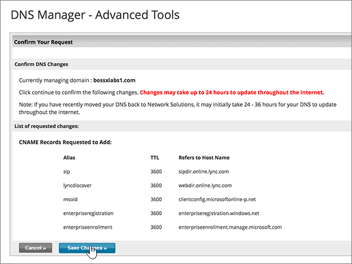

# DNS-records maken bij Network Solutions for MicrosoftCreate DNS records at Network Solutions for Microsoft

 **[Raadpleeg de veelgestelde vragen over domeinen](../setup/domains-faq.md)** als u niet kunt vinden wat u zoekt.**[Check the Domains FAQ](../setup/domains-faq.md)** if you don't find what you're looking for. 
  
Als Network Solutions uw DNS-hostingprovider is, voert u de stappen in dit artikel uit om uw domein te verifiëren en DNS-records voor e-mail, Skype voor Bedrijven Online, enzovoort in te stellen.If Network Solutions is your DNS hosting provider, follow the steps in this article to verify your domain and set up DNS records for email, Skype for Business Online, and so on.
  
Dit zijn de belangrijkste records om toe te voegen.These are the main records to add. Volg onderstaande stappen of [bekijk de video](https://support.microsoft.com/office/c49698c2-6991-47fb-b5ac-18e49a505099).Follow the steps below or [watch the video](https://support.microsoft.com/office/c49698c2-6991-47fb-b5ac-18e49a505099). 
  
- [Een TXT-record toevoegen voor verificatieAdd a TXT record for verification](#add-a-txt-record-for-verification)
    
- [Voeg een MX-record toe zodat e-mail voor uw domein naar Microsoft wordt verzondenAdd an MX record so email for your domain will come to Microsoft](#add-an-mx-record-so-email-for-your-domain-will-come-to-microsoft)
    
- [De CNAME-records toevoegen die zijn vereist voor MicrosoftAdd the CNAME records that are required for Microsoft](#add-the-cname-records-that-are-required-for-microsoft)
    
- [Een TXT-record voor SPF toevoegen om spam tegen te gaanAdd a TXT record for SPF to help prevent email spam](#add-a-txt-record-for-spf-to-help-prevent-email-spam)
    
- [De twee SRV-records toevoegen die zijn vereist voor MicrosoftAdd the two SRV records that are required for Microsoft](#add-the-two-srv-records-that-are-required-for-microsoft)
    
Nadat u deze records hebt toegevoegd bij Network Solutions, wordt uw domein ingesteld om te werken met Microsoft-services.After you add these records at Network Solutions, your domain will be set up to work with Microsoft services.
  

  
> [!NOTE]
>  Het duurt gewoonlijk ongeveer 15 minuten voordat DNS-wijzigingen van kracht worden. Het kan echter soms wat langer duren voordat een wijziging die u hebt aangebracht, is bijgewerkt via het DNS-systeem op internet. Als u na het toevoegen van de DNS-records problemen hebt met het ontvangen of verzenden van e-mail, raadpleegt u [Problemen oplossen nadat u uw domeinnaam of DNS-records hebt gewijzigd](../get-help-with-domains/find-and-fix-issues.md).Typically it takes about 15 minutes for DNS changes to take effect. However, it can occasionally take longer for a change you've made to update across the Internet's DNS system. If you're having trouble with mail flow or other issues after adding DNS records, see [Troubleshoot issues after changing your domain name or DNS records](../get-help-with-domains/find-and-fix-issues.md). 
  
## Een TXT-record toevoegen voor verificatieAdd a TXT record for verification

Voordat u uw domein met Microsoft kunt gebruiken, moet worden gecontroleerd dat u de eigenaar bent van het domein. Als u zich bij uw account bij de domeinregistrar kunt aanmelden en de DNS-record kunt maken, is dit voor Microsoft bewezen.Before you use your domain with Microsoft, we have to make sure that you own it. Your ability to log in to your account at your domain registrar and create the DNS record proves to Microsoft that you own the domain.
  
> [!NOTE]
> Deze record wordt alleen gebruikt om te verifiëren dat u de eigenaar van uw domein bent. Dit heeft verder geen invloed. U kunt deze record later desgewenst verwijderen.This record is used only to verify that you own your domain; it doesn't affect anything else. You can delete it later, if you like. 
  
Volg onderstaande stappen of [bekijk de video (start op 0:47)](https://support.microsoft.com/office/c49698c2-6991-47fb-b5ac-18e49a505099).Follow the steps below or [watch the video (start at 0:47)](https://support.microsoft.com/office/c49698c2-6991-47fb-b5ac-18e49a505099).
  
1. Als u wilt beginnen, gaat u [via deze koppeling](https://www.networksolutions.com/manage-it) naar uw pagina met domeinen bij Network Solutions.To get started, go to your domains page at Network Solutions by using [this link](https://www.networksolutions.com/manage-it). U wordt gevraagd u aan te melden.You'll be prompted to log in.
    
    > [!IMPORTANT]
    > Voordat u de **knop Aanmelden** selecteert, kiest u Eerst **Mijn domeinnamen beheren** in de vervolgkeuzelijst Aanmelden **bij:**Before you select the **Login** button, first choose **Manage My Domain Names** in the **Log In to:** drop-down list. 
  
    
  
2. Schakel het selectievakje in naast de naam van het domein dat u wilt wijzigen.Select the check box next to the name of the domain that you are modifying.
    
    
  
3. Selecteer **DNS bewerken**.Select **Edit DNS**.
    
    
  
4. Selecteer **Geavanceerde DNS-records beheren**.Select **Manage Advanced DNS Records**.
    
    (Mogelijk moet u omlaag schuiven.)(You may have to scroll down.)
    
    
  
5. Schuif omlaag naar de sectie **Tekst (TXT Records)** en selecteer **TXT-records bewerken**.Scroll down to the **Text (TXT Records)** section, and then select **Edit TXT Records**.
    
    
  
6. Typ of kopieer en plak de waarden uit de volgende tabel in de vakken voor de nieuwe record.In the boxes for the new record, type or copy and paste the values in the following table.
    
    |**Host****Host**|**TTL****TTL**|**Tekst****Text**|
    |:-----|:-----|:-----|
    |@    (In het systeem wordt deze waarde gewijzigd in **@ (None)** wanneer u de record opslaat.)(The system will change this value to **@ (None)** when you save the record.)    |36003600    |MS=ms *XXXXXXXX*MS=ms *XXXXXXXX*    **Opmerking:** Dit is een voorbeeld.**Note:** This is an example. Gebruik hier de specifieke waarde voor **Doel of adres waarnaar wordt verwezen** uit de tabel.Use your specific **Destination or Points to Address** value here, from the table.  [Hoe kan ik dit vinden?How do I find this?](../get-help-with-domains/information-for-dns-records.md)   |
       
    
  
7. Selecteer **Doorgaan**.Select **Continue**.
    
    
  
8. Selecteer **Wijzigingen opslaan**.Select **Save Changes**.
    
    
  
9. Wacht enkele minuten voordat u verder gaat, zodat de record die u zojuist hebt gemaakt via internet kan worden bijgewerkt.Wait a few minutes before you continue, so that the record you just created can update across the Internet.
    
Nu u de record hebt toegevoegd aan de site van uw domeinregistrar, gaat u terug naar Microsoft en vraagt u de record aan.Now that you've added the record at your domain registrar's site, you'll go back to Microsoft and request the record.
  
Wanneer in Microsoft de juiste TXT-record is gevonden, is uw domein gecontroleerd.When Microsoft finds the correct TXT record, your domain is verified.

1. Ga in het beheercentrum naar **Instellingen** \> <a href="https://go.microsoft.com/fwlink/p/?linkid=834818" target="_blank">Domeinen</a>-pagina.In the admin center, go to the **Settings** \> <a href="https://go.microsoft.com/fwlink/p/?linkid=834818" target="_blank">Domains</a> page.
    
2. Kies op de pagina **Domeinen** de naam van het domein dat u verifieert.On the **Domains** page, select the domain that you are verifying. 
    
    
  
3. Kies **Start setup** op de pagina **Setup**.On the **Setup** page, select **Start setup**.
    
    
  
4. Kies **Verifiëren** op de pagina **Domein verifiëren**.On the **Verify domain** page, select **Verify**.
    
    
  
> [!NOTE]
>  Het duurt gewoonlijk ongeveer 15 minuten voordat DNS-wijzigingen van kracht worden. Het kan echter soms wat langer duren voordat een wijziging die u hebt aangebracht, is bijgewerkt via het DNS-systeem op internet. Als u na het toevoegen van de DNS-records problemen hebt met het ontvangen of verzenden van e-mail, raadpleegt u [Problemen oplossen nadat u uw domeinnaam of DNS-records hebt gewijzigd](../get-help-with-domains/find-and-fix-issues.md).Typically it takes about 15 minutes for DNS changes to take effect. However, it can occasionally take longer for a change you've made to update across the Internet's DNS system. If you're having trouble with mail flow or other issues after adding DNS records, see [Troubleshoot issues after changing your domain name or DNS records](../get-help-with-domains/find-and-fix-issues.md). 
  
## Voeg een MX-record toe zodat e-mail voor uw domein naar Microsoft wordt verzondenAdd an MX record so email for your domain will come to Microsoft

Volg onderstaande stappen of [bekijk de video (start op 3:51)](https://support.microsoft.com/office/c49698c2-6991-47fb-b5ac-18e49a505099).Follow the steps below or [watch the video (start at 3:51)](https://support.microsoft.com/office/c49698c2-6991-47fb-b5ac-18e49a505099).
  
1. Als u wilt beginnen, gaat u [via deze koppeling](https://www.networksolutions.com/manage-it) naar uw pagina met domeinen bij Network Solutions.To get started, go to your domains page at Network Solutions by using [this link](https://www.networksolutions.com/manage-it). U wordt gevraagd u aan te melden.You'll be prompted to log in.
    
    > [!IMPORTANT]
    > Voordat u de **knop Aanmelden** selecteert, kiest u Eerst **Mijn domeinnamen beheren** in de vervolgkeuzelijst Aanmelden **bij:**Before you select the **Login** button, first choose **Manage My Domain Names** in the **Log In to:** drop-down list. 
  
    
  
2. Schakel het selectievakje in naast de naam van het domein dat u wilt wijzigen.Select the check box next to the name of the domain that you are modifying.
    
    
  
3. Selecteer **DNS bewerken**.Select **Edit DNS**.
    
    
  
4. Selecteer **Geavanceerde DNS-records beheren**.Select **Manage Advanced DNS Records**.
    
    (Mogelijk moet u omlaag schuiven.)(You may have to scroll down.)
    
    
  
5. Schuif omlaag naar de sectie **E-mailservers (MX Records)** en selecteer **MX-records bewerken**.Scroll down to the **Mail Servers (MX Records)** section, and then select **Edit MX Records**.
    
    
  
6. Typ of kopieer en plak de waarden uit de volgende tabel in de vakken voor de nieuwe record.In the boxes for the new record, type or copy and paste the values from the following table.
    
    |**Prioriteit****Priority**|**TTL****TTL**|**Mail Server****Mail Server**|
    |:-----|:-----|:-----|
    |1010    Zie [Wat is MX-prioriteit?](https://docs.microsoft.com/microsoft-365/admin/setup/domains-faq) voor meer informatie over prioriteit.   For more information about priority, see [What is MX priority?](https://docs.microsoft.com/microsoft-365/admin/setup/domains-faq)   |36003600    | *\<domain-key\>* mail.protection.outlook.com.*\<domain-key\>*  .mail.protection.outlook.com.    **Deze waarde MOET eindigen op een punt (.)****This value MUST end with a period (.)**   **Let op:** Haal je *\<domain-key\>* van je Microsoft-account.**Note:** Get your  *\<domain-key\>*  from your Microsoft account. [Hoe kan ik dit vinden?How do I find this?](../get-help-with-domains/information-for-dns-records.md)          |
       
    
  
7. Selecteer **Doorgaan**.Select **Continue**.
    
    
  
8. Selecteer **Wijzigingen opslaan**.Select **Save Changes**.
    
    
  
9. Als er andere MX-records zijn, verwijdert u deze allemaal door voor elke record **Delete** te selecteren.If there are any other MX records, delete all of them by selecting **Delete** for each record. 
    
    
  
10. Wanneer ze allemaal zijn geselecteerd, selecteert u **Doorgaan**.When they are all selected, select **Continue**.
    
    
  
11. Selecteer **Wijzigingen opslaan**.Select **Save Changes**.
    
    
  
## De CNAME-records toevoegen die zijn vereist voor MicrosoftAdd the CNAME records that are required for Microsoft

Volg onderstaande stappen of [bekijk de video (start op 4:43)](https://support.microsoft.com/office/c49698c2-6991-47fb-b5ac-18e49a505099).Follow the steps below or [watch the video (start at 4:43)](https://support.microsoft.com/office/c49698c2-6991-47fb-b5ac-18e49a505099).
  
1. Als u wilt beginnen, gaat u [via deze koppeling](https://www.networksolutions.com/manage-it) naar uw pagina met domeinen bij Network Solutions.To get started, go to your domains page at Network Solutions by using [this link](https://www.networksolutions.com/manage-it). U wordt gevraagd u aan te melden.You'll be prompted to log in.
    
    > [!IMPORTANT]
    > Voordat u de **knop Aanmelden** selecteert, kiest u Eerst **Mijn domeinnamen beheren** in de vervolgkeuzelijst Aanmelden **bij:**Before you select the **Login** button, first choose **Manage My Domain Names** in the **Log In to:** drop-down list. 
  
    
  
2. Schakel het selectievakje in naast de naam van het domein dat u wilt wijzigen.Select the check box next to the name of the domain that you are modifying.
    
    
  
3. Selecteer **DNS bewerken**.Select **Edit DNS**.
    
    
  
4. Selecteer **Geavanceerde DNS-records beheren**.Select **Manage Advanced DNS Records**.
    
    (Mogelijk moet u omlaag schuiven.)(You may have to scroll down.)
    
    
  
5. Schuif omlaag naar de sectie **Host Aliases (CNAME Records)** en selecteer **CNAME Records bewerken**.Scroll down to the **Host Aliases (CNAME Records)** section, and then select **Edit CNAME Records**.
    
    
  
6. Typ of kopieer en plak de waarden uit de volgende tabel in de vakken voor de vier nieuwe records.In the boxes for the four new records, type or copy and paste the values from the following table.
    
    |**Alias****Alias**|**TTL****TTL**|**Refers to Host Name****Refers to Host Name**|**Other Host          (selecteer het keuzerondje **Other Host**)****Other Host          (select the **Other Host** option button)**|
    |:-----|:-----|:-----|:-----|
    |autodiscoverautodiscover    |36003600    |(Geen instelling)(No setting)    |autodiscover.outlook.com.autodiscover.outlook.com.    **Deze waarde MOET eindigen op een punt (.)****This value MUST end with a period (.)**   |
    |sipsip    |36003600    |(Geen instelling)(No setting)    |sipdir.online.lync.com.sipdir.online.lync.com.    **Deze waarde MOET eindigen op een punt (.)****This value MUST end with a period (.)**   |
    |lyncdiscoverlyncdiscover    |36003600    |(Geen instelling)(No setting)    |webdir.online.lync.com.webdir.online.lync.com.    **Deze waarde MOET eindigen op een punt (.)****This value MUST end with a period (.)**   |
    |enterpriseregistrationenterpriseregistration    |36003600    |(Geen instelling)(No setting)    |enterpriseregistration.windows.netenterpriseregistration.windows.net    **Deze waarde MOET eindigen op een punt (.)****This value MUST end with a period (.)**   |
    |enterpriseenrollmententerpriseenrollment    |36003600    |(Geen instelling)(No setting)    |enterpriseenrollment-s.manage.microsoft.comenterpriseenrollment-s.manage.microsoft.com    **Deze waarde MOET eindigen op een punt (.)****This value MUST end with a period (.)**   |
    
    
  
7. Wanneer u alle CNAME-records hebt toegevoegd die u nodig hebt, selecteert u **Doorgaan**.When you have added all of the CNAME records that you need, select **Continue**.
    
    
  
8. Selecteer **Wijzigingen opslaan**.Select **Save Changes**.
    
    
  
## Een TXT-record voor SPF toevoegen om spam tegen te gaanAdd a TXT record for SPF to help prevent email spam

> [!IMPORTANT]
> U kunt maximaal 1 TXT-record hebben voor SPF voor een domein.You cannot have more than one TXT record for SPF for a domain. Als uw domein meer dan één SPF-record heeft, kan dit resulteren in e-mailfouten, evenals leverings- en spamclassificatieproblemen.If your domain has more than one SPF record, you'll get email errors, as well as delivery and spam classification issues. Als u al een SPF-record voor uw domein hebt, hoeft u geen nieuwe te maken voor Microsoft.If you already have an SPF record for your domain, don't create a new one for Microsoft. Voeg in plaats daarvan de vereiste Microsoft-waarden toe aan de huidige record, zodat u *één* SPF-record hebt die beide waardensets bevat.Instead, add the required Microsoft values to the current record so that you have a  *single*  SPF record that includes both sets of values. 
  
Volg onderstaande stappen of [bekijk de video (start op 5:35)](https://support.microsoft.com/office/c49698c2-6991-47fb-b5ac-18e49a505099).Follow the steps below or [watch the video (start at 5:35)](https://support.microsoft.com/office/c49698c2-6991-47fb-b5ac-18e49a505099).
  
1. Als u wilt beginnen, gaat u [via deze koppeling](https://www.networksolutions.com/manage-it) naar uw pagina met domeinen bij Network Solutions.To get started, go to your domains page at Network Solutions by using [this link](https://www.networksolutions.com/manage-it). U wordt gevraagd u aan te melden.You'll be prompted to log in.
    
    > [!IMPORTANT]
    > Voordat u de **knop Aanmelden** selecteert, kiest u Eerst **Mijn domeinnamen beheren** in de vervolgkeuzelijst Aanmelden **bij:**Before you select the **Login** button, first choose **Manage My Domain Names** in the **Log In to:** drop-down list. 
  
    
  
2. Schakel het selectievakje in naast de naam van het domein dat u wilt wijzigen.Select the check box next to the name of the domain that you are modifying.
    
    
  
3. Selecteer **DNS bewerken**.Select **Edit DNS**.
    
    
  
4. Selecteer **Geavanceerde DNS-records beheren**.Select **Manage Advanced DNS Records**.
    
    (Mogelijk moet u omlaag schuiven.)(You may have to scroll down.)
    
    
  
5. Schuif omlaag naar de sectie **Tekst (TXT Records)** en selecteer **TXT-records bewerken**.Scroll down to the **Text (TXT Records)** section, and then select **Edit TXT Records**.
    
    
  
6. Typ of kopieer en plak de volgende waarden in de vakken voor de nieuwe record.In the boxes for the new record, type or copy and paste the following values.
    
    |**Host****Host**|**TTL****TTL**|**Tekst****Text**|
    |:-----|:-----|:-----|
    |@    (In het systeem wordt deze waarde gewijzigd in **@ (None)** wanneer u de record opslaat.)(The system will change this value to **@ (None)** when you save the record.)    |36003600    |v=spf1 include:spf.protection.outlook.com -allv=spf1 include:spf.protection.outlook.com -all    **Opmerking:** het is raadzaam dit item te kopiëren en te plakken, zodat het spatiegebruik ongewijzigd blijft.**Note:** We recommend copying and pasting this entry, so that all of the spacing stays correct. |
       
    
  
7. Selecteer **Doorgaan**.Select **Continue**.
    
    
  
8. Selecteer **Wijzigingen opslaan**.Select **Save Changes**.
    
    
  
## De twee SRV-records toevoegen die zijn vereist voor MicrosoftAdd the two SRV records that are required for Microsoft

Volg onderstaande stappen of [bekijk de video (start op 6:18)](https://support.microsoft.com/office/c49698c2-6991-47fb-b5ac-18e49a505099).Follow the steps below or [watch the video (start at 6:18)](https://support.microsoft.com/office/c49698c2-6991-47fb-b5ac-18e49a505099).
  
1. Als u wilt beginnen, gaat u [via deze koppeling](https://www.networksolutions.com/manage-it) naar uw pagina met domeinen bij Network Solutions. U wordt gevraagd u aan te melden.To get started, go to your domains page at Network Solutions by using [this link](https://www.networksolutions.com/manage-it). You'll be prompted to log in.
    
    > [!IMPORTANT]
    > Voordat u de **knop Aanmelden** selecteert, kiest u Eerst **Mijn domeinnamen beheren** in de vervolgkeuzelijst Aanmelden **bij:**Before you select the **Login** button, first choose **Manage My Domain Names** in the **Log In to:** drop-down list. 
  
    
  
2. Schakel het selectievakje in naast de naam van het domein dat u wilt wijzigen.Select the check box next to the name of the domain that you are modifying.
    
    
  
3. Selecteer **DNS bewerken**.Select **Edit DNS**.
    
    
  
4. Selecteer **Geavanceerde DNS-records beheren**.Select **Manage Advanced DNS Records**.
    
    (Mogelijk moet u omlaag schuiven.)(You may have to scroll down.)
    
    
  
5. Schuif omlaag naar de sectie **Service (SRV Records)** en selecteer **SRV-records bewerken**.Scroll down to the **Service (SRV Records)** section, and then select **Edit SRV Records**.
    
    
  
6. Typ of kopieer en plak de waarden uit de volgende tabel in de vakken voor de twee nieuwe records.In the boxes for the two new records, type or copy and paste the values from the following table.
    
    (Kies in de vervolgkeuzelijsten de waarden **Service** en **Protocol**.)(Choose the **Service** and **Protocol** values from the drop-down lists.) 
    
    |**Service****Service**|**Protocol****Protocol**|**TTL****TTL**|**Prioriteit****Priority**|**Gewicht****Weight**|**Poort****Port**|**Target****Target**|
    |:-----|:-----|:-----|:-----|:-----|:-----|:-----|
    |_sip_sip    |_tls_tls    |36003600    |100100    |11    |443443    |sipdir.online.lync.com.sipdir.online.lync.com.    **Deze waarde MOET eindigen op een punt (.)****This value MUST end with a period (.)**   |
    |_sipfederationtls_sipfederationtls    |_tcp_tcp    |36003600    |100100    |11    |50615061    |sipfed.online.lync.com.sipfed.online.lync.com.    **Deze waarde MOET eindigen op een punt (.)****This value MUST end with a period (.)**   |
       
    
  
7. Selecteer **Doorgaan**.Select **Continue**.
    
    
  
8. Selecteer **Wijzigingen opslaan**.Select **Save Changes**.
    
    
  
> [!NOTE]
>  Het duurt gewoonlijk ongeveer 15 minuten voordat DNS-wijzigingen van kracht worden. Het kan echter soms wat langer duren voordat een wijziging die u hebt aangebracht, is bijgewerkt via het DNS-systeem op internet. Als u na het toevoegen van de DNS-records problemen hebt met het ontvangen of verzenden van e-mail, raadpleegt u [Problemen oplossen nadat u uw domeinnaam of DNS-records hebt gewijzigd](../get-help-with-domains/find-and-fix-issues.md).Typically it takes about 15 minutes for DNS changes to take effect. However, it can occasionally take longer for a change you've made to update across the Internet's DNS system. If you're having trouble with mail flow or other issues after adding DNS records, see [Troubleshoot issues after changing your domain name or DNS records](../get-help-with-domains/find-and-fix-issues.md). 
  
