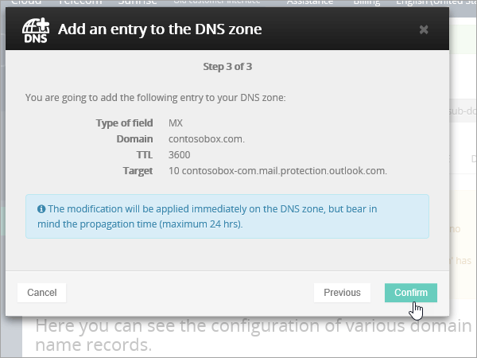

# DNS-records bij OVH maken voor MicrosoftCreate DNS records at OVH for Microsoft

[Raadpleeg de veelgestelde vragen over domeinen](../setup/domains-faq.yml) als u niet kunt vinden wat u zoekt.[Check the Domains FAQ](../setup/domains-faq.yml) if you don't find what you're looking for. 
  
Als OVH uw DNS-hostingprovider is, voert u de stappen in dit artikel uit om uw domein te verifiëren en DNS-records voor e-mail, Skype voor Bedrijven Online, enzovoort in te stellen.If OVH is your DNS hosting provider, follow the steps in this article to verify your domain and set up DNS records for email, Skype for Business Online, and so on.
  
Dit zijn de belangrijkste records om toe te voegen.These are the main records to add. 
  
- [DNS-records bij OVH maken voor MicrosoftCreate DNS records at OVH for Microsoft](#create-dns-records-at-ovh-for-microsoft)
    
- [Voeg een MX-record toe zodat e-mail voor uw domein naar Microsoft wordt verzondenAdd an MX record so email for your domain will come to Microsoft](#add-an-mx-record-so-email-for-your-domain-will-come-to-microsoft)
    
- [De CNAME-records toevoegen die zijn vereist voor MicrosoftAdd the CNAME records that are required for Microsoft](#add-the-cname-records-that-are-required-for-microsoft)
    
- [Een TXT-record voor SPF toevoegen om spam tegen te gaanAdd a TXT record for SPF to help prevent email spam](#add-a-txt-record-for-spf-to-help-prevent-email-spam)
    
- [De twee SRV-records toevoegen die zijn vereist voor MicrosoftAdd the two SRV records that are required for Microsoft](#add-the-two-srv-records-that-are-required-for-microsoft)
    
Nadat u deze records bij OVH hebt toegevoegd, is uw domein ingesteld voor gebruik met Microsoft-services.After you add these records at OVH, your domain will be set up to work with Microsoft services.

  
> [!NOTE]
>  Het duurt gewoonlijk ongeveer 15 minuten voordat DNS-wijzigingen van kracht worden. Het kan echter soms wat langer duren voordat een wijziging die u hebt aangebracht, is bijgewerkt via het DNS-systeem op internet. Als u na het toevoegen van de DNS-records problemen hebt met het ontvangen of verzenden van e-mail, raadpleegt u [Problemen oplossen nadat u uw domeinnaam of DNS-records hebt gewijzigd](../get-help-with-domains/find-and-fix-issues.md).Typically it takes about 15 minutes for DNS changes to take effect. However, it can occasionally take longer for a change you've made to update across the Internet's DNS system. If you're having trouble with mail flow or other issues after adding DNS records, see [Troubleshoot issues after changing your domain name or DNS records](../get-help-with-domains/find-and-fix-issues.md). 
  
## Een TXT-record toevoegen voor verificatieAdd a TXT record for verification

Voordat u uw domein met Microsoft kunt gebruiken, moet worden gecontroleerd dat u de eigenaar bent van het domein. Als u zich bij uw account bij de domeinregistrar kunt aanmelden en de DNS-record kunt maken, is dit voor Microsoft bewezen.Before you use your domain with Microsoft, we have to make sure that you own it. Your ability to log in to your account at your domain registrar and create the DNS record proves to Microsoft that you own the domain.
  
> [!NOTE]
> Deze record wordt alleen gebruikt om te verifiëren dat u de eigenaar van uw domein bent. Dit heeft verder geen invloed. U kunt deze record later desgewenst verwijderen.This record is used only to verify that you own your domain; it doesn't affect anything else. You can delete it later, if you like. 
  
1. Als u wilt beginnen, gaat u naar uw domeinenpagina in OVH via [deze koppeling](https://www.ovh.com/manager/). U wordt gevraagd u aan te melden.To get started, go to your domains page in OVH by using [this link](https://www.ovh.com/manager/). You'll be prompted to log in.
    
    
  
2. Selecteer onder **domeinen** de naam van het domein dat u wilt bewerken.Under **Domains**, select the name of the domain that you want edit.
    
    
  
3. Selecteer **DNS zone**.Select **DNS zone**.
    
    
  
4. Selecteer **item toevoegen**.Select **Add an entry**.
    
    
  
5. Selecteer **txt**Select **TXT**
    
    
  
6. Typ of kopieer en plak de waarden uit de volgende tabel in de vakken voor de nieuwe record.In the boxes for the new record, type or copy and paste the values from the following table. Als u een TTL-waarde wilt toewijzen, kiest u **aangepast** in de vervolgkeuzelijst en typt u de waarde in het tekstvak.To assign a TTL value, choose **Personalized** from the drop-down list, and then type the value in the text box. 
    
    |**Recordtype****Record type**|**Subdomein****Sub-domain**|**TTL****TTL**|**Waarde****Value**|
    |:-----|:-----|:-----|:-----|
    |TXTTXT    |(laat leeg)(leave blank)    |3600 (seconden)3600 (seconds)    |MS=msxxxxxxxxMS=msxxxxxxxx    **Opmerking:** Dit is een voorbeeld.**Note:** This is an example. Gebruik hier de specifieke waarde voor **Doel of adres waarnaar wordt verwezen** uit de tabel.Use your specific **Destination or Points to Address** value here, from the table.           [Hoe kan ik dit vinden?How do I find this?](../get-help-with-domains/information-for-dns-records.md)          |
   
7. Selecteer **bevestigen**.Select **Confirm**. 
    
    
  
8. Wacht enkele minuten voordat u verder gaat, zodat de record die u zojuist hebt gemaakt via internet kan worden bijgewerkt.Wait a few minutes before you continue, so that the record you just created can update across the Internet.
    
Nu u de record hebt toegevoegd aan de site van uw domeinregistrar, gaat u terug naar Microsoft en vraagt u de record aan.Now that you've added the record at your domain registrar's site, you'll go back to Microsoft and request the record.
  
Wanneer in Microsoft de juiste TXT-record is gevonden, is uw domein gecontroleerd.When Microsoft finds the correct TXT record, your domain is verified.
  
1. Ga in het beheercentrum naar **Instellingen** \> <a href="https://go.microsoft.com/fwlink/p/?linkid=834818" target="_blank">Domeinen</a>-pagina.In the admin center, go to the **Settings** \> <a href="https://go.microsoft.com/fwlink/p/?linkid=834818" target="_blank">Domains</a> page.
    
2. Kies op de pagina **Domeinen** de naam van het domein dat u verifieert.On the **Domains** page, select the domain that you are verifying. 
    
    
  
3. Kies **Start setup** op de pagina **Setup**.On the **Setup** page, select **Start setup**.
    
    
  
4. Kies **Verifiëren** op de pagina **Domein verifiëren**.On the **Verify domain** page, select **Verify**.
    
    
  
> [!NOTE]
>  Het duurt gewoonlijk ongeveer 15 minuten voordat DNS-wijzigingen van kracht worden. Het kan echter soms wat langer duren voordat een wijziging die u hebt aangebracht, is bijgewerkt via het DNS-systeem op internet. Als u na het toevoegen van de DNS-records problemen hebt met het ontvangen of verzenden van e-mail, raadpleegt u [Problemen oplossen nadat u uw domeinnaam of DNS-records hebt gewijzigd](../get-help-with-domains/find-and-fix-issues.md).Typically it takes about 15 minutes for DNS changes to take effect. However, it can occasionally take longer for a change you've made to update across the Internet's DNS system. If you're having trouble with mail flow or other issues after adding DNS records, see [Troubleshoot issues after changing your domain name or DNS records](../get-help-with-domains/find-and-fix-issues.md). 
  
## Voeg een MX-record toe zodat e-mail voor uw domein naar Microsoft wordt verzondenAdd an MX record so email for your domain will come to Microsoft

1. Als u wilt beginnen, gaat u naar uw domeinenpagina in OVH via [deze koppeling](https://www.ovh.com/manager/). U wordt gevraagd u aan te melden.To get started, go to your domains page in OVH by using [this link](https://www.ovh.com/manager/). You'll be prompted to log in.
    
    
  
2. Selecteer onder **domeinen** de naam van het domein dat u wilt bewerken.Under **Domains**, select the name of the domain that you want edit.
    
    
  
3. Selecteer **DNS zone**.Select **DNS zone**.
    
    
  
4. Selecteer **item toevoegen**.Select **Add an entry**.
    
    
  
5. Selecteer **MX**.Select **MX**.
    
    
  
6. Typ of kopieer en plak de waarden uit de volgende tabel in de vakken voor de nieuwe record.In the boxes for the new record, type or copy and paste the values from the following table. Als u een TTL-waarde wilt toewijzen, kiest u **aangepast** in de vervolgkeuzelijst en typt u de waarde in het tekstvak.To assign a TTL value, choose **Personalized** from the drop-down list, and then type the value in the text box. 
    
    > [!NOTE]
    > Standaard wordt in OVH de relatieve notatie gebruikt voor het doel, waarmee de domeinnaam wordt toegevoegd aan het einde van de doelrecord.By default OVH uses relative notation for the target, which adds the domain name to the end of the target record. Als u in plaats daarvan absolute notatie wilt gebruiken, voegt u een punt toe aan de doelrecord, zoals wordt weergegeven in de onderstaande tabel.To use absolute notation instead, add a dot to the target record as shown in the table below. 
  
    |**Recordtype****Record type**|**Subdomein****Sub-domain**|**TTL****TTL**|**Prioriteit****Priority**|**Doel****Target**|
    |:-----|:-----|:-----|:-----|:-----|
    |MXMX    |(laat leeg)(leave blank)    |3600 (seconden)3600 (seconds)    |1010    Zie [Wat is MX-prioriteit?](https://docs.microsoft.com/microsoft-365/admin/setup/domains-faq) voor meer informatie over prioriteit.   For more information about priority, see [What is MX priority?](https://docs.microsoft.com/microsoft-365/admin/setup/domains-faq)   |\<domain-key\>. mail.protection.outlook.com.\<domain-key\>.mail.protection.outlook.com.    **Opmerking:** Neem uw  *\<domain-key\>*  van uw Microsoft-account.**Note:** Get your  *\<domain-key\>*  from your Microsoft account.  [Hoe kan ik dit vinden?How do I find this?](../get-help-with-domains/information-for-dns-records.md)  |
   
    
  
7. Selecteer **Volgende**.Select **Next**.
    
    
  
8. Selecteer **bevestigen**.Select **Confirm**.
    
    
  
9. Als er andere MX-records zijn, verwijdert u deze in op de pagina **DNS-zone**.If there are any other MX records, delete them all in the list on the **DNS zone** page. Selecteer elke record en selecteer vervolgens in de kolom **acties** het pictogram Prullenbak-kan **verwijderen** .Select each record and then, in the **Actions** column, select the trash-can **Delete** icon. 
    
    
  
10. Selecteer **bevestigen**.Select **Confirm**.
    
## De CNAME-records toevoegen die zijn vereist voor MicrosoftAdd the CNAME records that are required for Microsoft

1. Als u wilt beginnen, gaat u naar uw domeinenpagina in OVH via [deze koppeling](https://www.ovh.com/manager/). U wordt gevraagd u aan te melden.To get started, go to your domains page in OVH by using [this link](https://www.ovh.com/manager/). You'll be prompted to log in.
    
    
  
2. Selecteer onder **domeinen** de naam van het domein dat u wilt bewerken.Under **Domains**, select the name of the domain that you want edit.
    
    
  
3. Selecteer **DNS zone**.Select **DNS zone**.
    
    
  
4. Selecteer **item toevoegen**.Select **Add an entry**.
    
    
  
5. Selecteer **CNAME**.Select **CNAME**.
    
    
  
6. Maak de eerste CNAME-record.Create the first CNAME record.
    
    Typ of kopieer en plak de waarden uit de eerste rij van de volgende tabel in de vakken voor de nieuwe record.In the boxes for the new record, type or copy and paste the values from the first row of the following table. Als u een TTL-waarde wilt toewijzen, kiest u **aangepast** in de vervolgkeuzelijst en typt u de waarde in het tekstvak.To assign a TTL value, choose **Personalized** from the drop-down list, and then type the value in the text box. 
    
    |**Recordtype****Record type**|**Subdomein****Sub-domain**|**Doel****Target**|**TTL****TTL**|
    |:-----|:-----|:-----|:-----|
    |CNAMECNAME    |autodiscoverautodiscover    |autodiscover.outlook.com.autodiscover.outlook.com.    |3600 seconden3600 seconds    |
    |CNAMECNAME    |sipsip    |sipdir.online.lync.com.sipdir.online.lync.com.    |3600 seconden3600 seconds    |
    |CNAMECNAME    |lyncdiscoverlyncdiscover    |webdir.online.lync.com.webdir.online.lync.com.    |3600 seconden3600 seconds    |
    |CNAMECNAME    |enterpriseregistrationenterpriseregistration    |enterpriseregistration.windows.net.enterpriseregistration.windows.net.    |3600 seconden3600 seconds    |
    |CNAMECNAME    |enterpriseenrollmententerpriseenrollment    |enterpriseenrollment-s.manage.microsoft.com.enterpriseenrollment-s.manage.microsoft.com.    |3600 seconden3600 seconds    |
   
    
  
7. Selecteer **Volgende**.Select **Next**.
    
    
  
8. Selecteer **bevestigen**.Select **Confirm**.
    
9. Herhaal de vorige stappen om de vijf andere CNAME-records te maken.Repeat the previous steps to create the other five CNAME records.
    
    Typ of kopieer en plak voor elke record de waarden uit de volgende rij van de bovenstaande tabel in de velden voor die record.For each record, type or copy and paste the values from the next row of the table above into the boxes for that record.
    
## Een TXT-record voor SPF toevoegen om spam tegen te gaanAdd a TXT record for SPF to help prevent email spam

> [!IMPORTANT]
> U kunt maximaal 1 TXT-record hebben voor SPF voor een domein.You cannot have more than one TXT record for SPF for a domain. Als uw domein meer dan één SPF-record heeft, kan dit resulteren in e-mailfouten, evenals leverings- en spamclassificatieproblemen.If your domain has more than one SPF record, you'll get email errors, as well as delivery and spam classification issues. Als u al een SPF-record voor uw domein hebt, hoeft u geen nieuwe te maken voor Microsoft.If you already have an SPF record for your domain, don't create a new one for Microsoft. In plaats daarvan voegt u de vereiste Microsoft-waarden toe aan de huidige record, zodat u  *één*  SPF-record hebt die beide sets met waarden bevat.Instead, add the required Microsoft values to the current record so that you have a  *single*  SPF record that includes both sets of values. 
  
1. Als u wilt beginnen, gaat u naar uw domeinenpagina in OVH via [deze koppeling](https://www.ovh.com/manager/). U wordt gevraagd u aan te melden.To get started, go to your domains page in OVH by using [this link](https://www.ovh.com/manager/). You'll be prompted to log in.
    
    
  
2. Selecteer onder **domeinen** de naam van het domein dat u wilt bewerken.Under **Domains**, select the name of the domain that you want edit.
    
    
  
3. Selecteer **DNS zone**.Select **DNS zone**.
    
    
  
4. Selecteer **item toevoegen**.Select **Add an entry**.
    
    
  
5. Selecteer **txt**.Select **TXT**.
    
6. Typ of kopieer en plak de volgende waarden in de vakken voor de nieuwe record.In the boxes for the new record, type or copy and paste the following values.
    
    |**Recordtype****Record type**|**Subdomein****Sub-domain**|**TTL****TTL**|**TXT-waarde****TXT Value**|
    |:-----|:-----|:-----|:-----|
    |TXTTXT    |(laat leeg)(leave blank)    |3600 (seconden)3600 (seconds)    |v=spf1 include:spf.protection.outlook.com -allv=spf1 include:spf.protection.outlook.com -all    **Opmerking:** het is raadzaam dit item te kopiëren en te plakken, zodat het spatiegebruik ongewijzigd blijft.**Note:** We recommend copying and pasting this entry, so that all of the spacing stays correct.           |
   
    
  
7. Selecteer **Volgende**.Select **Next**.
    
    
  
8. Selecteer **bevestigen**.Select **Confirm**.
    
    
  
## De twee SRV-records toevoegen die zijn vereist voor MicrosoftAdd the two SRV records that are required for Microsoft

1. Als u wilt beginnen, gaat u naar uw domeinenpagina in OVH via [deze koppeling](https://www.ovh.com/manager/). U wordt gevraagd u aan te melden.To get started, go to your domains page in OVH by using [this link](https://www.ovh.com/manager/). You'll be prompted to log in.
    
    
  
2. Selecteer onder **domeinen** de naam van het domein dat u wilt bewerken.Under **Domains**, select the name of the domain that you want edit.
    
    
  
3. Selecteer **DNS zone**.Select **DNS zone**.
    
    
  
4. Selecteer **item toevoegen**.Select **Add an entry**.
    
    
  
5. Selecteer **SRV**.Select **SRV**.
    
    
  
6. Maak de eerste SRV-record.Create the first SRV record.
    
    Typ of kopieer en plak de waarden uit de eerste rij van de volgende tabel in de vakken voor de nieuwe record.In the boxes for the new record, type or copy and paste the values from the first row of the following table. Als u een TTL-waarde wilt toewijzen, kiest u **aangepast** in de vervolgkeuzelijst en typt u de waarde in het tekstvak.To assign a TTL value, choose **Personalized** from the drop-down list, and then type the value in the text box. 
    
    |**Recordtype****Record type**|**Subdomein****Sub-domain**|**Prioriteit****Priority**|**Gewicht****Weight**|**Poort****Port**|**TTL****TTL**|**Doel****Target**|
    |:-----|:-----|:-----|:-----|:-----|:-----|:-----|
    |SRV (service)SRV (Service)    |_sip _sip._tls_sip._tls    |100100    |11    |443443    |3600 (seconden)3600 (seconds)    |sipdir.online.lync.com.sipdir.online.lync.com.    |
    |SRV (service)SRV (Service)    |_sipfederationtls _sipfederationtls._tcp_sipfederationtls._tcp    |100100    |11    |50615061    |3600 (seconden)3600 (seconds)    |sipfed.online.lync.com.sipfed.online.lync.com.    |
       
    
  
7. Selecteer **Volgende**.Select **Next**.
    
    
  
8. Selecteer **bevestigen**.Select **Confirm**.
    
9. Herhaal de vorige stappen om de andere SRV-record te maken. Typ of kopieer en plak de waarden uit de tweede rij van de bovenstaande tabel in de vakken voor de tweede record.Repeat the previous steps to create the other SRV record. Type or copy and paste the values from the second row of the table above into the boxes for the second record.
    
> [!NOTE]
>  Het duurt gewoonlijk ongeveer 15 minuten voordat DNS-wijzigingen van kracht worden. Het kan echter soms wat langer duren voordat een wijziging die u hebt aangebracht, is bijgewerkt via het DNS-systeem op internet. Als u na het toevoegen van de DNS-records problemen hebt met het ontvangen of verzenden van e-mail, raadpleegt u [Problemen oplossen nadat u uw domeinnaam of DNS-records hebt gewijzigd](../get-help-with-domains/find-and-fix-issues.md).Typically it takes about 15 minutes for DNS changes to take effect. However, it can occasionally take longer for a change you've made to update across the Internet's DNS system. If you're having trouble with mail flow or other issues after adding DNS records, see [Troubleshoot issues after changing your domain name or DNS records](../get-help-with-domains/find-and-fix-issues.md). 
  
