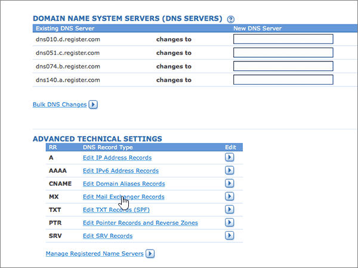

# DNS-records bij Register.com maken voor Office 365Create DNS records at Register.com for Office 365

 **[Raadpleeg de veelgestelde vragen over domeinen](../setup/domains-faq.md)** als u niet kunt vinden wat u zoekt.**[Check the Domains FAQ](../setup/domains-faq.md)** if you don't find what you're looking for. 
  
Als Register.com uw DNS-hostingprovider is, voert u de stappen in dit artikel uit om uw domein te verifiëren en DNS-records voor e-mail, Skype voor Bedrijven Online, enzovoort in te stellen.If Register.com is your DNS hosting provider, follow the steps in this article to verify your domain and set up DNS records for email, Skype for Business Online, and so on.
  
Dit zijn de belangrijkste records om toe te voegen.These are the main records to add. Volg onderstaande stappen of [bekijk de video](https://support.office.com/article/Video-Create-DNS-records-at-Register-com-for-Office-365-7448dd9e-c0e7-4d5e-a7e9-f0e4715433c4?ui=en-US&amp;rs=en-US&amp;ad=US).Follow the steps below or [watch the video](https://support.office.com/article/Video-Create-DNS-records-at-Register-com-for-Office-365-7448dd9e-c0e7-4d5e-a7e9-f0e4715433c4?ui=en-US&amp;rs=en-US&amp;ad=US).
  
- [Een TXT-record toevoegen op Register.com om te bevestigen dat u eigenaar van het domein bentAdd a TXT record at Register.com to verify that you own the domain](#add-a-txt-record-at-registercom-to-verify-that-you-own-the-domain)
    
- [Voeg een MX-record toe zodat e-mail voor uw domein bij Office 365 terechtkomtAdd an MX record so email for your domain will come to Office 365](#add-an-mx-record-so-email-for-your-domain-will-come-to-office-365)
    
- [De CNAME-records toevoegen die voor Office 365 vereist zijnAdd the CNAME records that are required for Office 365](#add-the-cname-records-that-are-required-for-office-365)
    
- [Een TXT-record voor SPF toevoegen om spam tegen te gaanAdd a TXT record for SPF to help prevent email spam](#add-a-txt-record-for-spf-to-help-prevent-email-spam)

- [Voeg de vier SRV-records toe die voor Office 365 vereist zijn.Add the two SRV records that are required for Office 365](#add-the-two-srv-records-that-are-required-for-office-365)
    
Nadat u deze records bij Register.com hebt toegevoegd, is uw domein ingesteld voor gebruik met Office 365-services.After you add these records at Register.com, your domain will be set up to work with Office 365 services.
  
Zie [Een openbare website gebruiken met Office 365](https://support.office.com/article/choose-a-public-website-3325d50e-d131-403c-a278-7f3296fe33a9) voor informatie over webhosting en DNS voor websites met Office 365.To learn about webhosting and DNS for websites with Office 365, see [Use a public website with Office 365](https://support.office.com/article/choose-a-public-website-3325d50e-d131-403c-a278-7f3296fe33a9).
  
> [!NOTE]
> Het duurt meestal ongeveer 15 minuten voordat DNS-wijzigingen van kracht worden. Het kan echter soms wat langer duren voordat een wijziging die u hebt aangebracht, is bijgewerkt via het DNS-systeem op internet. Als u na het toevoegen van DNS-records problemen hebt met het ontvangen of verzenden van e-mail, raadpleegt u [Problemen opsporen en oplossen nadat u uw domein of DNS-records hebt toegevoegd in Office 365](../get-help-with-domains/find-and-fix-issues.md).Typically it takes about 15 minutes for DNS changes to take effect. However, it can occasionally take longer for a change you've made to update across the Internet's DNS system. If you're having trouble with mail flow or other issues after adding DNS records, see [Find and fix issues after adding your domain or DNS records in Office 365](../get-help-with-domains/find-and-fix-issues.md). 
  
## Een TXT-record toevoegen op Register.com om te bevestigen dat u eigenaar van het domein bentAdd a TXT record at Register.com to verify that you own the domain

Voordat u uw domein met Office 365 kunt gaan gebruiken, moet worden gecontroleerd dat u de eigenaar bent van het domein. Als u zich bij uw account bij de domeinregistrar kunt aanmelden en de DNS-record kunt maken, is dit voor Office 365 bewezen.Before you use your domain with Office 365, we have to make sure that you own it. Your ability to log in to your account at your domain registrar and create the DNS record proves to Office 365 that you own the domain.
  
> [!NOTE]
> Deze record wordt alleen gebruikt om te verifiëren dat u de eigenaar van uw domein bent. Dit heeft verder geen invloed. U kunt deze record later desgewenst verwijderen.This record is used only to verify that you own your domain; it doesn't affect anything else. You can delete it later, if you like. 
  
Volg onderstaande stappen of [bekijk de video (start op 0:44)](https://support.office.com/article/Video-Create-DNS-records-at-Register-com-for-Office-365-7448dd9e-c0e7-4d5e-a7e9-f0e4715433c4?ui=en-US&amp;rs=en-US&amp;ad=US).Follow the steps below or [watch the video (start at 0:44)](https://support.office.com/article/Video-Create-DNS-records-at-Register-com-for-Office-365-7448dd9e-c0e7-4d5e-a7e9-f0e4715433c4?ui=en-US&amp;rs=en-US&amp;ad=US).
  
1. Als u wilt beginnen, gaat u [via deze koppeling](https://www.register.com/myaccount/) naar uw pagina met domeinen bij Register.com.To get started, go to your domains page at Register.com by using [this link](https://www.register.com/myaccount/). U wordt gevraagd u aan te melden.You'll be prompted to sign in.
    
2. Selecteer **Domeinen**.Select **Domains**.
    
3. Selecteer **Beheren**.Select **Manage**.
    
4. Zoek de rij met de naam van het domein dat u wilt wijzigen. en selecteer vervolgens in die rij **Beheren**.Find the row that contains the name of the domain that you want to modify; and then, in that row, select **Manage**.
    
5. Schuif omlaag naar de sectie **Geavanceerde technische instellingen** en selecteer Vervolgens **TXT Records (SPF) bewerken.**Scroll down to the **Advanced Technical Settings** section, and then select **Edit TXT Records (SPF)**.
    
6. Typ of kopieer en plak de waarden uit de volgende tabel in de vakken voor de nieuwe record.In the boxes for the new record, type or copy and paste the values from the following table.
    
    |||
    |:-----|:-----|
    |**Host Name****Host Name**   |**TXT Record****TXT Record**   |
    |@    |MS=ms *XXXXXXXX*MS=ms *XXXXXXXX*    **Opmerking:** Dit is een voorbeeld.**Note:** This is an example. Gebruik hier de specifieke waarde voor **Doel of adres waarnaar wordt verwezen** uit de tabel in Office 365.Use your specific **Destination or Points to Address** value here, from the table in Office 365. [Hoe kan ik dit vinden?How do I find this?](../get-help-with-domains/information-for-dns-records.md)          |
   
7. Selecteer **Doorgaan**.Select **Continue**.
    
8. Selecteer op de volgende pagina **opnieuw doorgaan** om uw wijzigingen te bevestigen.On the next page, select **Continue** again to confirm your changes. 
    
9. Wacht enkele minuten voordat u verder gaat, zodat de record die u zojuist hebt gemaakt via internet kan worden bijgewerkt.Wait a few minutes before you continue, so that the record you just created can update across the Internet.
    
Nu u de record hebt toegevoegd aan de site van uw domeinregistrar, gaat u terug naar Office 365 en vraagt u of Office 365 naar de record wil zoeken.Now that you've added the record at your domain registrar's site, you'll go back to Office 365 and request Office 365 to look for the record.
  
Wanneer in Office 365 de juiste TXT-record is gevonden, is uw domein gecontroleerd.When Office 365 finds the correct TXT record, your domain is verified.
  
1. Ga in het beheercentrum naar de pagina \> <a href="https://go.microsoft.com/fwlink/p/?linkid=834818" target="_blank">Instellingendomeinen.</a> **Settings**In the admin center, go to the **Settings** \> <a href="https://go.microsoft.com/fwlink/p/?linkid=834818" target="_blank">Domains</a> page.
    
2. Selecteer **op** de pagina Domeinen het domein dat u verifieert.On the **Domains** page, select the domain that you are verifying. 
    
3. Selecteer **op** de pagina Setup de optie **Installatie starten**.On the **Setup** page, select **Start setup**.
    
4. Selecteer **op** de pagina Domein verifiëren de optie **Verifiëren**.On the **Verify domain** page, select **Verify**.
    
> [!NOTE]
> Het duurt meestal ongeveer 15 minuten voordat DNS-wijzigingen van kracht worden. Het kan echter soms wat langer duren voordat een wijziging die u hebt aangebracht, is bijgewerkt via het DNS-systeem op internet. Als u na het toevoegen van DNS-records problemen hebt met het ontvangen of verzenden van e-mail, raadpleegt u [Problemen opsporen en oplossen nadat u uw domein of DNS-records hebt toegevoegd in Office 365](../get-help-with-domains/find-and-fix-issues.md).Typically it takes about 15 minutes for DNS changes to take effect. However, it can occasionally take longer for a change you've made to update across the Internet's DNS system. If you're having trouble with mail flow or other issues after adding DNS records, see [Find and fix issues after adding your domain or DNS records in Office 365](../get-help-with-domains/find-and-fix-issues.md). 
  
## Een MX-record toevoegen zodat e-mail voor uw domein bij Office 365 terechtkomtAdd an MX record so email for your domain will come to Office 365

Volg onderstaande stappen of [bekijk de video (start op 3:32)](https://support.office.com/article/Video-Create-DNS-records-at-Register-com-for-Office-365-7448dd9e-c0e7-4d5e-a7e9-f0e4715433c4?ui=en-US&amp;rs=en-US&amp;ad=US).Follow the steps below or [watch the video (start at 3:32)](https://support.office.com/article/Video-Create-DNS-records-at-Register-com-for-Office-365-7448dd9e-c0e7-4d5e-a7e9-f0e4715433c4?ui=en-US&amp;rs=en-US&amp;ad=US).
  
1. Als u wilt beginnen, gaat u [via deze koppeling](https://www.register.com/myaccount/) naar uw pagina met domeinen bij Register.com.To get started, go to your domains page at Register.com by using [this link](https://www.register.com/myaccount/). U wordt gevraagd u aan te melden.You'll be prompted to sign in.
    
2. Selecteer **Domeinen**.Select **Domains**.
    
3. Selecteer **Beheren**.Select **Manage**.
    
4. Zoek de rij met de naam van het domein dat u wilt wijzigen. en selecteer vervolgens in die rij **Beheren**.Find the row that contains the name of the domain that you want to modify; and then, in that row, select **Manage**.
    
5. Schuif naar de sectie **Geavanceerde technische instellingen** en selecteer Vervolgens Records voor Mail **Exchanger bewerken**.Scroll to the **Advanced Technical Settings** section, and then select **Edit Mail Exchanger Records**.
    
    
  
6. Typ of kopieer en plak de waarden uit de volgende tabel in de vakken voor de nieuwe record.In the boxes for the new record, type or copy and paste the values from the following table.
    
    (Kies de **waarde Prioriteit** in de vervolgkeuzelijst.)(Choose the **Priority** value from the drop-down list.) 
    
    |\*\*\*\*Hostnaam\*\*\*\*\*\*\*\*Host Name\*\*\*\*|\*\*\*\*Priority\*\*\*\*\*\*\*\*Priority\*\*\*\*|\*\*\*\*Mail Server\*\*\*\*\*\*\*\*Mail Server\*\*\*\*|
    |:-----|:-----|:-----|
    |@    |HighHigh    Zie [Wat is MX-prioriteit?](https://support.office.com/article/2784cc4d-95be-443d-b5f7-bb5dd867ba83.aspx) voor meer informatie over prioriteit.   For more information about priority, see [What is MX priority?](https://support.office.com/article/2784cc4d-95be-443d-b5f7-bb5dd867ba83.aspx)   | *\<domeinsleutel\>*  .mail.protection.outlook.com*\<domain-key\>*  .mail.protection.outlook.com      **Let op:** Haal \<uw domeinsleutel\> op uit uw Office 365-account. *domain-key***Note:** Get your \<*domain-key*\> from your Office 365 account.   [Hoe kan ik dit vinden?How do I find this?](../get-help-with-domains/information-for-dns-records.md)          |
   
    
  
7. Als er al andere MX-records staan vermeld, selecteert u elk van deze records om ze te verwijderen.If there were any other MX records already listed, select each of those records to be deleted.
    
    
  
8. Selecteer **Doorgaan**.Select **Continue**.
    
    
  
9. Selecteer op de volgende pagina **Opnieuw doorgaan** om uw wijzigingen te bevestigen en op te slaan.On the next page, select **Continue** again to confirm and save your changes. 
    
    
  
## De CNAME-records toevoegen die voor Office 365 vereist zijnAdd the CNAME records that are required for Office 365

Volg onderstaande stappen of [bekijk de video (start op 4:23)](https://support.office.com/article/Video-Create-DNS-records-at-Register-com-for-Office-365-7448dd9e-c0e7-4d5e-a7e9-f0e4715433c4?ui=en-US&amp;rs=en-US&amp;ad=US).Follow the steps below or [watch the video (start at 4:23)](https://support.office.com/article/Video-Create-DNS-records-at-Register-com-for-Office-365-7448dd9e-c0e7-4d5e-a7e9-f0e4715433c4?ui=en-US&amp;rs=en-US&amp;ad=US).
  
1. Als u wilt beginnen, gaat u [via deze koppeling](https://www.register.com/myaccount/) naar uw pagina met domeinen bij Register.com.To get started, go to your domains page at Register.com by using [this link](https://www.register.com/myaccount/). U wordt gevraagd u aan te melden.You'll be prompted to sign in.
    
2. Selecteer **Domeinen**.Select **Domains**.
    
3. Selecteer **Beheren**.Select **Manage**.
    
4. Zoek de rij met de naam van het domein dat u wilt wijzigen. en selecteer vervolgens in die rij **Beheren**.Find the row that contains the name of the domain that you want to modify; and then, in that row, select **Manage**.
    
5. Schuif naar de sectie **Geavanceerde technische instellingen** en selecteer Vervolgens **Domeinaliasrecords bewerken**.Scroll to the **Advanced Technical Settings** section, and then select **Edit Domain Aliases Records**.
    
    
  
6. Selecteer **Meer domeinaliassen toevoegen**.Select **Add more domain aliases**.
    
    
  
7. De vereiste CNAME-records toevoegen.Add the required CNAME records.
    
    Typ of kopieer en plak de waarden uit de eerste rij in de volgende tabel in de velden voor de nieuwe record.In the boxes for the new record, type or copy and paste the values from the first row of the following table.
    
    |\*\*\*\*Eerste veld (zonder label)\*\*\*\*\*\*\*\*First field (unlabeled)\*\*\*\*|\*\*\*\*Verwijst naar\*\*\*\*\*\*\*\*Points to\*\*\*\*|
    |:-----|:-----|
    |autodiscoverautodiscover    |autodiscover.outlook.comautodiscover.outlook.com       |
    |sipsip    |sipdir.online.lync.comsipdir.online.lync.com       |
    |lyncdiscoverlyncdiscover    |webdir.online.lync.comwebdir.online.lync.com      |
    |enterpriseregistrationenterpriseregistration    |enterpriseregistration.windows.netenterpriseregistration.windows.net       |
    |enterpriseenrollmententerpriseenrollment    |enterpriseenrollment-s.manage.microsoft.comenterpriseenrollment-s.manage.microsoft.com       |
   
     
  
8. Wanneer u alle CNAME-records hebt toegevoegd die u nodig hebt, selecteert u **Doorgaan**.When you have added all of the CNAME records that you need, select **Continue**.
    
    
  
9. Selecteer op de volgende pagina **Opnieuw doorgaan** om uw wijzigingen te bevestigen en op te slaan.On the next page, select **Continue** again to confirm and save your changes. 
    
    
  
## Een TXT-record voor SPF toevoegen om spam tegen te gaanAdd a TXT record for SPF to help prevent email spam

> [!IMPORTANT]
> U kunt maximaal 1 TXT-record hebben voor SPF voor een domein.You cannot have more than one TXT record for SPF for a domain. Als uw domein meer dan één SPF-record heeft, kan dit resulteren in e-mailfouten, evenals leverings- en spamclassificatieproblemen.If your domain has more than one SPF record, you'll get email errors, as well as delivery and spam classification issues. Als u al een SPF-record voor uw domein hebt, hoeft u geen nieuwe voor Office 365 te maken.If you already have an SPF record for your domain, don't create a new one for Office 365. In plaats daarvan voegt u de vereiste Office 365-waarden toe aan de huidige record, zodat u beschikt over één SPF-record waarin beide sets waarden zijn opgenomen.Instead, add the required Office 365 values to the current record so that you have a single SPF record that includes both sets of values.  
  
Volg onderstaande stappen of [bekijk de video (start op 5:12)](https://support.office.com/article/Video-Create-DNS-records-at-Register-com-for-Office-365-7448dd9e-c0e7-4d5e-a7e9-f0e4715433c4?ui=en-US&amp;rs=en-US&amp;ad=US).Follow the steps below or [watch the video (start at 5:12)](https://support.office.com/article/Video-Create-DNS-records-at-Register-com-for-Office-365-7448dd9e-c0e7-4d5e-a7e9-f0e4715433c4?ui=en-US&amp;rs=en-US&amp;ad=US).
  
1. Als u wilt beginnen, gaat u [via deze koppeling](https://www.register.com/myaccount/) naar uw pagina met domeinen bij Register.com.To get started, go to your domains page at Register.com by using [this link](https://www.register.com/myaccount/). U wordt gevraagd u aan te melden.You'll be prompted to sign in.
    
2. Selecteer **Domeinen**.Select **Domains**.
    
3. Selecteer **Beheren**.Select **Manage**.
    
4. Zoek de rij met de naam van het domein dat u wilt wijzigen. en selecteer vervolgens in die rij **Beheren**.Find the row that contains the name of the domain that you want to modify; and then, in that row, select **Manage**.
    
5. Schuif naar de sectie **Geavanceerde technische instellingen** en selecteer Vervolgens **TXT Records (SPF) bewerken.**Scroll to the **Advanced Technical Settings** section, and then select **Edit TXT Records (SPF)**.
    
    
  
6. Typ of kopieer en plak de waarden uit de volgende tabel in de vakken voor de nieuwe record.In the boxes for the new record, type or copy and paste the values from the following table.
    
    |\*\*\*\*Host Name\*\*\*\*\*\*\*\*Host Name\*\*\*\*|\*\*\*\*TXT Record\*\*\*\*\*\*\*\*TXT Record\*\*\*\*|
    |:-----|:-----|
    |@    |v=spf1 include:spf.protection.outlook.com -allv=spf1 include:spf.protection.outlook.com -all    **Opmerking:** het is raadzaam dit item te kopiëren en te plakken, zodat het spatiegebruik ongewijzigd blijft.**Note:** We recommend copying and pasting this entry, so that all of the spacing stays correct.  |
   
     
  
7. Selecteer **Doorgaan**.Select **Continue**.
    
    
  
8. Selecteer op de volgende pagina **Opnieuw doorgaan** om uw wijzigingen te bevestigen en op te slaan.On the next page, select **Continue** again to confirm and save your changes. 
    
    
  
## Voeg de vier SRV-records toe die voor Office 365 vereist zijn.Add the two SRV records that are required for Office 365

Volg onderstaande stappen of [bekijk de video (start op 5:55)](https://support.office.com/article/Video-Create-DNS-records-at-Register-com-for-Office-365-7448dd9e-c0e7-4d5e-a7e9-f0e4715433c4?ui=en-US&amp;rs=en-US&amp;ad=US).Follow the steps below or [watch the video (start at 5:55)](https://support.office.com/article/Video-Create-DNS-records-at-Register-com-for-Office-365-7448dd9e-c0e7-4d5e-a7e9-f0e4715433c4?ui=en-US&amp;rs=en-US&amp;ad=US).
  
1. Als u wilt beginnen, gaat u [via deze koppeling](https://www.register.com/myaccount/) naar uw pagina met domeinen bij Register.com. U wordt gevraagd u aan te melden.To get started, go to your domains page at Register.com by using [this link](https://www.register.com/myaccount/). You'll be prompted to sign in.
    
2. Selecteer **Domeinen**.Select **Domains**.
    
3. Selecteer **Beheren**.Select **Manage**.
    
4. Zoek de rij met de naam van het domein dat u wilt wijzigen. en selecteer vervolgens in die rij **Beheren**.Find the row that contains the name of the domain that you want to modify; and then, in that row, select **Manage**.
    
5. Schuif naar de sectie **Geavanceerde technische instellingen** en selecteer Vervolgens **SRV-records bewerken**.Scroll to the **Advanced Technical Settings** section, and then select **Edit SRV Records**.
    
    
  
6. Voeg als volgt de eerste van de twee SRV-records toe:Add the first of the two SRV records:
    
    Typ of kopieer en plak de waarden uit de eerste rij van de volgende tabel in de vakken voor de nieuwe record.In the boxes for the new record, type or copy and paste the values from the first row of the following table.
    
    (Kies de **waarde Prioriteit** in de vervolgkeuzelijst.)(Choose the **Priority** value from the drop-down list.) 
    
    |\*\*\*\*Service\*\*\*\*\*\*\*\*Service\*\*\*\*|\*\*\*\*Proto\*\*\*\*\*\*\*\*Proto\*\*\*\*|\*\*\*\*Name\*\*\*\*\*\*\*\*Name\*\*\*\*|\*\*\*\*Priority\*\*\*\*\*\*\*\*Priority\*\*\*\*|\*\*\*\*Gewicht\*\*\*\*\*\*\*\*Weight\*\*\*\*|\*\*\*\*Port\*\*\*\*\*\*\*\*Port\*\*\*\*|\*\*\*\*Target\*\*\*\*\*\*\*\*Target\*\*\*\*|
    |:-----|:-----|:-----|:-----|:-----|:-----|:-----|
    |_sip_sip    |_tls_tls    |@    |HighHigh    |11    |443443    |sipdir.online.lync.comsipdir.online.lync.com       |
    |_sipfederationtls_sipfederationtls    |_tcp_tcp    |@    |HighHigh    |11    |50615061    |sipfed.online.lync.comsipfed.online.lync.com       |
   
    
  
7. Selecteer **Meer SRV-records toevoegen**.Select **Add more SRV records**.
    
    
  
8. Voeg als volgt de tweede SRV-record toe:Add the second SRV record:
    
    Typ of kopieer en plak de waarden uit de tweede rij van de bovenstaande tabel in de velden van de tweede record.Type or copy and paste the values from the second row of the table above into the boxes for the second record.
    
9. Wanneer u beide SRV-records hebt toegevoegd, selecteert u **Doorgaan**.When you have added both of the SRV records, select **Continue**.
    
    
  
10. Selecteer op de volgende pagina **Opnieuw doorgaan** om uw wijzigingen te bevestigen en op te slaan.On the next page, select **Continue** again to confirm and save your changes. 
    
    
  
> [!NOTE]
> Het duurt meestal ongeveer 15 minuten voordat DNS-wijzigingen van kracht worden. Het kan echter soms wat langer duren voordat een wijziging die u hebt aangebracht, is bijgewerkt via het DNS-systeem op internet. Als u na het toevoegen van DNS-records problemen hebt met het ontvangen of verzenden van e-mail, raadpleegt u [Problemen opsporen en oplossen nadat u uw domein of DNS-records hebt toegevoegd in Office 365](../get-help-with-domains/find-and-fix-issues.md).Typically it takes about 15 minutes for DNS changes to take effect. However, it can occasionally take longer for a change you've made to update across the Internet's DNS system. If you're having trouble with mail flow or other issues after adding DNS records, see [Find and fix issues after adding your domain or DNS records in Office 365](../get-help-with-domains/find-and-fix-issues.md). 
  
