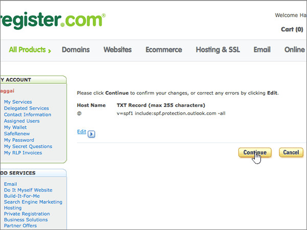

# DNS-records maken bij Register.com voor Microsoft

 **[Raadpleeg de veelgestelde vragen over domeinen](../setup/domains-faq.md)** als u niet kunt vinden wat u zoekt. 
  
Als Register.com uw DNS-hostingprovider is, voert u de stappen in dit artikel uit om uw domein te verifiëren en DNS-records voor e-mail, Skype voor Bedrijven Online, enzovoort in te stellen.
  
Dit zijn de belangrijkste records om toe te voegen. Volg onderstaande stappen of [bekijk de video](https://support.microsoft.com/office/7448dd9e-c0e7-4d5e-a7e9-f0e4715433c4).
  
- [Een TXT-record toevoegen op Register.com om te bevestigen dat u eigenaar van het domein bent](#add-a-txt-record-at-registercom-to-verify-that-you-own-the-domain)
    
- [Voeg een MX-record toe zodat e-mail voor uw domein naar Microsoft wordt verzonden](#add-an-mx-record-so-email-for-your-domain-will-come-to-microsoft)
    
- [De CNAME-records toevoegen die zijn vereist voor Microsoft](#add-the-cname-records-that-are-required-for-microsoft)
    
- [Een TXT-record voor SPF toevoegen om spam tegen te gaan](#add-a-txt-record-for-spf-to-help-prevent-email-spam)

- [De twee SRV-records toevoegen die zijn vereist voor Microsoft](#add-the-two-srv-records-that-are-required-for-microsoft)
    
Nadat u deze records hebt toegevoegd op Register.com, wordt uw domein ingesteld om te werken met Microsoft-services.
  

  
> [!NOTE]
> Typically it takes about 15 minutes for DNS changes to take effect. However, it can occasionally take longer for a change you've made to update across the Internet's DNS system. If you're having trouble with mail flow or other issues after adding DNS records, see [Find and fix issues after adding your domain or DNS records](../get-help-with-domains/find-and-fix-issues.md). 
  
## Een TXT-record toevoegen op Register.com om te bevestigen dat u eigenaar van het domein bent

Before you use your domain with Microsoft, we have to make sure that you own it. Your ability to log in to your account at your domain registrar and create the DNS record proves to Microsoft that you own the domain.
  
> [!NOTE]
> This record is used only to verify that you own your domain; it doesn't affect anything else. You can delete it later, if you like. 
  
Volg onderstaande stappen of [bekijk de video (start op 0:44)](https://support.microsoft.com/office/7448dd9e-c0e7-4d5e-a7e9-f0e4715433c4).
  
1. Als u wilt beginnen, gaat u [via deze koppeling](https://www.register.com/myaccount/) naar uw pagina met domeinen bij Register.com. U wordt gevraagd u aan te melden.
    
2. Selecteer **Domeinen**.
    
3. Selecteer **Beheren**.
    
4. Zoek de rij met de naam van het domein dat u wilt wijzigen. en selecteer vervolgens in die rij **Beheren**.
    
5. Schuif omlaag naar de sectie **Geavanceerde technische instellingen** en selecteer **TXT-records bewerken (SPF)**.
    
6. Typ of kopieer en plak de waarden uit de volgende tabel in de vakken voor de nieuwe record.
    
    |||
    |:-----|:-----|
    |**Host Name**   |**TXT Record**   |
    |@    |MS=ms *XXXXXXXX*    **Opmerking:** Dit is een voorbeeld. Gebruik hier de specifieke waarde voor **Doel of adres waarnaar wordt verwezen** uit de tabel. [Hoe kan ik dit vinden?](../get-help-with-domains/information-for-dns-records.md)          |
   
7. Selecteer **Doorgaan**.
    
8. Selecteer op de volgende pagina **Opnieuw Doorgaan** om uw wijzigingen te bevestigen. 
    
9. Wacht enkele minuten voordat u verder gaat, zodat de record die u zojuist hebt gemaakt via internet kan worden bijgewerkt.
    
Nu u de record hebt toegevoegd aan de site van uw domeinregistrar, gaat u terug naar Microsoft en vraagt u de record aan.
  
Wanneer in Microsoft de juiste TXT-record is gevonden, is uw domein gecontroleerd.
  
1. Ga in het beheercentrum naar **Instellingen** \> <a href="https://go.microsoft.com/fwlink/p/?linkid=834818" target="_blank">Domeinen</a>-pagina.
    
2. Kies op de pagina **Domeinen** de naam van het domein dat u verifieert. 
    
3. Kies **Start setup** op de pagina **Setup**.
    
4. Kies **Verifiëren** op de pagina **Domein verifiëren**.
    
> [!NOTE]
> Typically it takes about 15 minutes for DNS changes to take effect. However, it can occasionally take longer for a change you've made to update across the Internet's DNS system. If you're having trouble with mail flow or other issues after adding DNS records, see [Find and fix issues after adding your domain or DNS records](../get-help-with-domains/find-and-fix-issues.md). 
  
## Voeg een MX-record toe zodat e-mail voor uw domein naar Microsoft wordt verzonden

Volg onderstaande stappen of [bekijk de video (start op 3:32)](https://support.microsoft.com/office/7448dd9e-c0e7-4d5e-a7e9-f0e4715433c4).
  
1. Als u wilt beginnen, gaat u [via deze koppeling](https://www.register.com/myaccount/) naar uw pagina met domeinen bij Register.com. U wordt gevraagd u aan te melden.
    
2. Selecteer **Domeinen**.
    
3. Selecteer **Beheren**.
    
4. Zoek de rij met de naam van het domein dat u wilt wijzigen. en selecteer vervolgens in die rij **Beheren**.
    
5. Schuif naar de sectie **Geavanceerde technische instellingen** en selecteer **E-mailuitwisselingsrecords bewerken**.
    
    
  
6. Typ of kopieer en plak de waarden uit de volgende tabel in de vakken voor de nieuwe record.
    
    (Kies de **prioriteitswaarde** in de vervolgkeuzelijst.) 
    
    |****Hostnaam****|****Priority****|****Mail Server****|
    |:-----|:-----|:-----|
    |@    |High    Zie [Wat is MX-prioriteit?](https://docs.microsoft.com/microsoft-365/admin/setup/domains-faq) voor meer informatie over prioriteit.      | *\<domain-key\>*,,Mail.protection.outlook.com      **Let op:** Haal je \<*domain-key*\> van je Microsoft-account.   [Hoe kan ik dit vinden?](../get-help-with-domains/information-for-dns-records.md)          |
   
    
  
7. Als er al andere MX-records staan vermeld, selecteert u elk van deze records om ze te verwijderen.
    
    
  
8. Selecteer **Doorgaan**.
    
    
  
9. Selecteer op de volgende pagina **Opnieuw Doorgaan** om de wijzigingen te bevestigen en op te slaan. 
    
    
  
## De CNAME-records toevoegen die zijn vereist voor Microsoft

Volg onderstaande stappen of [bekijk de video (start op 4:23)](https://support.microsoft.com/office/7448dd9e-c0e7-4d5e-a7e9-f0e4715433c4).
  
1. Als u wilt beginnen, gaat u [via deze koppeling](https://www.register.com/myaccount/) naar uw pagina met domeinen bij Register.com. U wordt gevraagd u aan te melden.
    
2. Selecteer **Domeinen**.
    
3. Selecteer **Beheren**.
    
4. Zoek de rij met de naam van het domein dat u wilt wijzigen. en selecteer vervolgens in die rij **Beheren**.
    
5. Schuif naar de sectie **Geavanceerde technische instellingen** en selecteer **Domeinaliassenrecords bewerken**.
    
    
  
6. Selecteer **Meer domeinaliassen toevoegen**.
    
    
  
7. De vereiste CNAME-records toevoegen.
    
    Typ of kopieer en plak de waarden uit de eerste rij in de volgende tabel in de velden voor de nieuwe record.
    
    |****Eerste veld (zonder label)****|****Verwijst naar****|
    |:-----|:-----|
    |autodiscover    |autodiscover.outlook.com       |
    |sip    |sipdir.online.lync.com       |
    |lyncdiscover    |webdir.online.lync.com      |
    |enterpriseregistration    |enterpriseregistration.windows.net       |
    |enterpriseenrollment    |enterpriseenrollment-s.manage.microsoft.com       |
   
     
  
8. Wanneer u alle CNAME-records hebt toegevoegd die u nodig hebt, selecteert u **Doorgaan**.
    
    
  
9. Selecteer op de volgende pagina **Opnieuw Doorgaan** om de wijzigingen te bevestigen en op te slaan. 
    
    
  
## Een TXT-record voor SPF toevoegen om spam tegen te gaan

> [!IMPORTANT]
> U kunt maximaal 1 TXT-record hebben voor SPF voor een domein. Als uw domein meer dan één SPF-record heeft, kan dit resulteren in e-mailfouten, evenals leverings- en spamclassificatieproblemen. Als u al een SPF-record voor uw domein hebt, hoeft u geen nieuwe te maken voor Microsoft. In plaats hiervan voegt u de vereiste Microsoft-waarden toe aan de huidige record, zodat u beschikt over één SPF-record waarin beide sets waarden zijn opgenomen.  
  
Volg onderstaande stappen of [bekijk de video (start op 5:12)](https://support.microsoft.com/office/7448dd9e-c0e7-4d5e-a7e9-f0e4715433c4).
  
1. Als u wilt beginnen, gaat u [via deze koppeling](https://www.register.com/myaccount/) naar uw pagina met domeinen bij Register.com. U wordt gevraagd u aan te melden.
    
2. Selecteer **Domeinen**.
    
3. Selecteer **Beheren**.
    
4. Zoek de rij met de naam van het domein dat u wilt wijzigen. en selecteer vervolgens in die rij **Beheren**.
    
5. Schuif naar de sectie **Geavanceerde technische instellingen** en selecteer **TXT-records bewerken (SPF)**.
    
    
  
6. Typ of kopieer en plak de waarden uit de volgende tabel in de vakken voor de nieuwe record.
    
    |****Host Name****|****TXT Record****|
    |:-----|:-----|
    |@    |v=spf1 include:spf.protection.outlook.com -all    **Opmerking:** het is raadzaam dit item te kopiëren en te plakken, zodat het spatiegebruik ongewijzigd blijft.  |
   
     
  
7. Selecteer **Doorgaan**.
    
    
  
8. Selecteer op de volgende pagina **Opnieuw Doorgaan** om de wijzigingen te bevestigen en op te slaan. 
    
    
  
## De twee SRV-records toevoegen die zijn vereist voor Microsoft

Volg onderstaande stappen of [bekijk de video (start op 5:55)](https://support.microsoft.com/office/7448dd9e-c0e7-4d5e-a7e9-f0e4715433c4).
  
1. To get started, go to your domains page at Register.com by using [this link](https://www.register.com/myaccount/). You'll be prompted to sign in.
    
2. Selecteer **Domeinen**.
    
3. Selecteer **Beheren**.
    
4. Zoek de rij met de naam van het domein dat u wilt wijzigen. en selecteer vervolgens in die rij **Beheren**.
    
5. Schuif naar de sectie **Geavanceerde technische instellingen** en selecteer **SRV-records bewerken**.
    
    
  
6. Voeg als volgt de eerste van de twee SRV-records toe:
    
    Typ of kopieer en plak de waarden uit de eerste rij van de volgende tabel in de vakken voor de nieuwe record.
    
    (Kies de **prioriteitswaarde** in de vervolgkeuzelijst.) 
    
    |****Service****|****Proto****|****Name****|****Priority****|****Gewicht****|****Port****|****Target****|
    |:-----|:-----|:-----|:-----|:-----|:-----|:-----|
    |_sip    |_tls    |@    |High    |1    |443    |sipdir.online.lync.com       |
    |_sipfederationtls    |_tcp    |@    |High    |1    |5061    |sipfed.online.lync.com       |
   
    
  
7. Selecteer **Meer SRV-records toevoegen**.
    
    
  
8. Voeg als volgt de tweede SRV-record toe:
    
    Typ of kopieer en plak de waarden uit de tweede rij van de bovenstaande tabel in de velden van de tweede record.
    
9. Wanneer u beide SRV-records hebt toegevoegd, selecteert u **Doorgaan**.
    
    
  
10. Selecteer op de volgende pagina **Opnieuw Doorgaan** om de wijzigingen te bevestigen en op te slaan. 
    
    
  
> [!NOTE]
> Typically it takes about 15 minutes for DNS changes to take effect. However, it can occasionally take longer for a change you've made to update across the Internet's DNS system. If you're having trouble with mail flow or other issues after adding DNS records, see [Find and fix issues after adding your domain or DNS records](../get-help-with-domains/find-and-fix-issues.md). 
  
