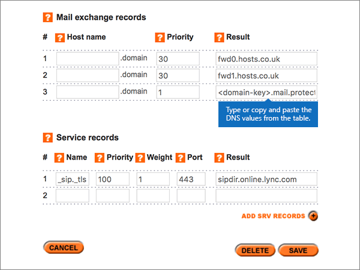

# DNS-records bij Register365 maken voor MicrosoftCreate DNS records at Register365 for Microsoft

 **[Raadpleeg de veelgestelde vragen over domeinen](../setup/domains-faq.md)** als u niet kunt vinden wat u zoekt.**[Check the Domains FAQ](../setup/domains-faq.md)** if you don't find what you're looking for. 
  
Als Register365 uw DNS-hostingprovider is, voert u de stappen in dit artikel uit om uw domein te verifiëren en DNS-records voor e-mail, Skype voor Bedrijven Online, enzovoort in te stellen.If Register365 is your DNS hosting provider, follow the steps in this article to verify your domain and set up DNS records for email, Skype for Business Online, and so on. 
  
Dit zijn de belangrijkste records om toe te voegen.These are the main records to add.  
  
- [Een TXT-record toevoegen voor verificatieAdd a TXT record for verification](#add-a-txt-record-for-verification)
    
- [Voeg een MX-record toe zodat e-mail voor uw domein naar Microsoft wordt verzondenAdd an MX record so email for your domain will come to Microsoft](#add-an-mx-record-so-email-for-your-domain-will-come-to-microsoft)
    
- [De zes CNAME-records toevoegen die vereist zijn voor MicrosoftAdd the six CNAME records that are required for Microsoft](#add-the-six-cname-records-that-are-required-for-microsoft)
    
- [Een TXT-record voor SPF toevoegen om spam tegen te gaanAdd a TXT record for SPF to help prevent email spam](#add-a-txt-record-for-spf-to-help-prevent-email-spam)
    
- [De twee SRV-records toevoegen die zijn vereist voor MicrosoftAdd the two SRV records that are required for Microsoft](#add-the-two-srv-records-that-are-required-for-microsoft)
    
Nadat u deze records bij Microsoft hebt toegevoegd, is uw domein ingesteld voor gebruik met Microsoft-services.After you add these records at Microsoft, your domain will be set up to work with Microsoft services.
  
> [!NOTE]
>  Het duurt gewoonlijk ongeveer 15 minuten voordat DNS-wijzigingen van kracht worden. Het kan echter soms wat langer duren voordat een wijziging die u hebt aangebracht, is bijgewerkt via het DNS-systeem op internet. Als u na het toevoegen van de DNS-records problemen hebt met het ontvangen of verzenden van e-mail, raadpleegt u [Problemen oplossen nadat u uw domeinnaam of DNS-records hebt gewijzigd](../get-help-with-domains/find-and-fix-issues.md).Typically it takes about 15 minutes for DNS changes to take effect. However, it can occasionally take longer for a change you've made to update across the Internet's DNS system. If you're having trouble with mail flow or other issues after adding DNS records, see [Troubleshoot issues after changing your domain name or DNS records](../get-help-with-domains/find-and-fix-issues.md). 
  
## Een TXT-record toevoegen voor verificatieAdd a TXT record for verification

Voordat u uw domein met Microsoft kunt gebruiken, moet worden gecontroleerd dat u de eigenaar bent van het domein. Als u zich bij uw account bij de domeinregistrar kunt aanmelden en de DNS-record kunt maken, is dit voor Microsoft bewezen.Before you use your domain with Microsoft, we have to make sure that you own it. Your ability to log in to your account at your domain registrar and create the DNS record proves to Microsoft that you own the domain.
  
> [!NOTE]
> Deze record wordt alleen gebruikt om te verifiëren dat u de eigenaar van uw domein bent. Dit heeft verder geen invloed. U kunt deze record later desgewenst verwijderen.This record is used only to verify that you own your domain; it doesn't affect anything else. You can delete it later, if you like. 
  
1. U gaat eerst naar uw domeinenpagina bij Register365 via [deze koppeling](https://admin.register365.com/dns/). U wordt gevraagd u eerst aan te melden.To get started, go to your domains page at Register365 by using [this link](https://admin.register365.com/dns/). You'll be prompted to log in first.
    
    
  
2. Zoek op de pagina **Dashboard** de naam van het domein dat u bijwerkt, en kies vervolgens **DNS Settings** in de vervolgkeuzelijst.On the **Dashboard** page, find the name of the domain that you're updating, and then choose **DNS Settings** from the drop-down list. 
    
    (Mogelijk moet u omlaag schuiven.)(You may have to scroll down.)
    
    
  
3. Typ of kopieer en plak op de pagina **Add/Modify DNS Zone**, in de sectie **A-, CNAME-, AAAA-, TXT- en NS-records**, de waarden uit de volgende tabel in de vakken voor de nieuwe record.On the **Add/Modify DNS Zone** page, in the **A, CNAME, AAAA, TXT and NS records** section, in the boxes for the new record, type or copy and paste the values from the following table. 
    
    (Kies in de vervolgkeuzelijst de waarde **Type**).(Choose the **Type** value from the drop-down list.) 
    
    (Als u een rij wilt toevoegen, selecteert u **add a/CNAME-records (+)**.)(If you need to add a row, select **ADD A/CNAME RECORDS (+)**.)
    
    (Mogelijk moet u omlaag schuiven.)(You may have to scroll down.)
    
    |**Hostnaam****Host name**|**Type****Type**|**Result****Result**|
    |:-----|:-----|:-----|
    |(Laat dit veld leeg.)(Leave this field empty.)    |TXTTXT    |MS=ms *XXXXXXXX*MS=ms *XXXXXXXX*    **Opmerking:** Dit is een voorbeeld.**Note:** This is an example. Gebruik hier de specifieke waarde voor **Doel of adres waarnaar wordt verwezen** uit de tabel.Use your specific **Destination or Points to Address** value here, from the table.           [Hoe kan ik dit vinden?How do I find this?](../get-help-with-domains/information-for-dns-records.md)          |
   
    
  
4. Kies **Opslaan**.Select **Save**.
    
    (Mogelijk moet u omlaag schuiven.)(You may have to scroll down.)
    
    
  
5. Wacht enkele minuten voordat u verder gaat, zodat de record die u zojuist hebt gemaakt via internet kan worden bijgewerkt.Wait a few minutes before you continue, so that the record you just created can update across the Internet.
    
Nu u de record hebt toegevoegd aan de site van uw domeinregistrar, gaat u terug naar Microsoft en vraagt u de record aan.Now that you've added the record at your domain registrar's site, you'll go back to Microsoft and request the record.
  
Wanneer in Microsoft de juiste TXT-record is gevonden, is uw domein gecontroleerd.When Microsoft finds the correct TXT record, your domain is verified.
  
1. Ga in het beheercentrum naar **Instellingen** \> <a href="https://go.microsoft.com/fwlink/p/?linkid=834818" target="_blank">Domeinen</a>-pagina.In the admin center, go to the **Settings** \> <a href="https://go.microsoft.com/fwlink/p/?linkid=834818" target="_blank">Domains</a> page.
    
2. Kies op de pagina **Domeinen** de naam van het domein dat u verifieert.On the **Domains** page, select the domain that you are verifying. 
    
    
  
3. Kies **Start setup** op de pagina **Setup**.On the **Setup** page, select **Start setup**.
    
    
  
4. Kies **Verifiëren** op de pagina **Domein verifiëren**.On the **Verify domain** page, select **Verify**.
    
    
  
> [!NOTE]
>  Het duurt gewoonlijk ongeveer 15 minuten voordat DNS-wijzigingen van kracht worden. Het kan echter soms wat langer duren voordat een wijziging die u hebt aangebracht, is bijgewerkt via het DNS-systeem op internet. Als u na het toevoegen van de DNS-records problemen hebt met het ontvangen of verzenden van e-mail, raadpleegt u [Problemen oplossen nadat u uw domeinnaam of DNS-records hebt gewijzigd](../get-help-with-domains/find-and-fix-issues.md).Typically it takes about 15 minutes for DNS changes to take effect. However, it can occasionally take longer for a change you've made to update across the Internet's DNS system. If you're having trouble with mail flow or other issues after adding DNS records, see [Troubleshoot issues after changing your domain name or DNS records](../get-help-with-domains/find-and-fix-issues.md). 
  
## Voeg een MX-record toe zodat e-mail voor uw domein naar Microsoft wordt verzondenAdd an MX record so email for your domain will come to Microsoft

1. U gaat eerst naar uw domeinenpagina bij Register365 via [deze koppeling](https://admin.register365.com/dns/). U wordt gevraagd u eerst aan te melden.To get started, go to your domains page at Register365 by using [this link](https://admin.register365.com/dns/). You'll be prompted to log in first.
    
    
  
2. Zoek op de pagina **Dashboard** de naam van het domein dat u bijwerkt, en kies vervolgens **DNS Settings** in de vervolgkeuzelijst.On the **Dashboard** page, find the name of the domain that you're updating, and then choose **DNS Settings** from the drop-down list. 
    
    (Mogelijk moet u omlaag schuiven.)(You may have to scroll down.)
    
    
  
3. Typ of kopieer en plak op de pagina **Add/Modify DNS Zone**, in de sectie **Mail Exchange records**, de waarden uit de volgende tabel in de vakken voor de nieuwe record.On the **Add/Modify DNS Zone** page, in the **Mail exchange records** section, in the boxes for the new record, type or copy and paste the values from the following table. 
    
    (Mogelijk moet u omlaag schuiven.)(You may have to scroll down.)
    
    |**Hostnaam****Host name**|**Priority****Priority**|**Result****Result**|
    |:-----|:-----|:-----|
    |(Laat dit veld leeg.)(Leave this field empty.)    |11    Zie [Wat is MX-prioriteit?](https://docs.microsoft.com/microsoft-365/admin/setup/domains-faq) voor meer informatie over prioriteit.For more information about priority, see [What is MX priority?](https://docs.microsoft.com/microsoft-365/admin/setup/domains-faq)   | *\<domain-key\>*  .mail.protection.outlook.com*\<domain-key\>*  .mail.protection.outlook.com    **Opmerking:** Neem uw  *\<domain-key\>*  van uw Microsoft-account.**Note:** Get your  *\<domain-key\>*  from your Microsoft account.  [Hoe kan ik dit vinden?How do I find this?](../get-help-with-domains/information-for-dns-records.md)     |
   
    
  
4. Kies **Opslaan**.Select **Save**.
    
    (Mogelijk moet u omlaag schuiven.)(You may have to scroll down.)
    
    
  
5. Als er in de sectie **Mail exchange records** andere MX-records worden vermeld, verwijdert u elke record door deze te selecteren en vervolgens op het toetsenbord op de toets **Delete** te drukken.If there are any other MX records in the **Mail exchange records** section, delete each one by selecting it and then pressing the **Delete** key on your keyboard. 
    
    
  
6. Kies **Opslaan**.Select **Save**.
    
    (Mogelijk moet u omlaag schuiven.)(You may have to scroll down.)
    
    
  
## De zes CNAME-records toevoegen die vereist zijn voor MicrosoftAdd the six CNAME records that are required for Microsoft

1. U gaat eerst naar uw domeinenpagina bij Register365 via [deze koppeling](https://admin.register365.com/dns/). U wordt gevraagd u eerst aan te melden.To get started, go to your domains page at Register365 by using [this link](https://admin.register365.com/dns/). You'll be prompted to log in first.
    
    
  
2. Zoek op de pagina **Dashboard** de naam van het domein dat u bijwerkt, en kies vervolgens **DNS Settings** in de vervolgkeuzelijst.On the **Dashboard** page, find the name of the domain that you're updating, and then choose **DNS Settings** from the drop-down list. 
    
    (Mogelijk moet u omlaag schuiven.)(You may have to scroll down.)
    
    
  
3. Typ of kopieer en plak op de pagina **Add/Modify DNS Zone** in de sectie **A-, CNAME, AAAA, TXT and NS Records** de waarden uit de volgende tabel in de vakken voor de nieuwe records.On the **Add/Modify DNS Zone** page, in the **A, CNAME, AAAA, TXT and NS records** section, in the boxes for the new records, type or copy and paste the values from the following table. 
    
    (Kies in de vervolgkeuzelijst de waarde **Type**).(Choose the **Type** value from the drop-down list.) 
    
    (Als u een rij wilt toevoegen, selecteert u **add a/CNAME-records (+)**.)(If you need to add a row, select **ADD A/CNAME RECORDS (+)**.)
    
    (Mogelijk moet u omlaag schuiven.)(You may have to scroll down.)
    
    |\*\*\*\*Host Name\*\*\*\*\*\*\*\*Host name\*\*\*\*|\*\*\*\*Type\*\*\*\*\*\*\*\*Type\*\*\*\*|\*\*\*\*Result\*\*\*\*\*\*\*\*Result\*\*\*\*|
    |:-----|:-----|:-----|
    |autodiscoverautodiscover    |CNAMECNAME    |autodiscover.outlook.comautodiscover.outlook.com    |
    |sipsip    |CNAMECNAME    |sipdir.online.lync.comsipdir.online.lync.com    |
    |lyncdiscoverlyncdiscover    |CNAMECNAME    |webdir.online.lync.comwebdir.online.lync.com    |
    |enterpriseregistrationenterpriseregistration    |CNAMECNAME    |enterpriseregistration.windows.netenterpriseregistration.windows.net    |
    |enterpriseenrollmententerpriseenrollment    |CNAMECNAME    |enterpriseenrollment-s.manage.microsoft.comenterpriseenrollment-s.manage.microsoft.com    |
   
    
  
4. Kies **Opslaan**.Select **Save**.
    
    
  
## Een TXT-record voor SPF toevoegen om spam tegen te gaanAdd a TXT record for SPF to help prevent email spam

> [!IMPORTANT]
> U kunt maximaal 1 TXT-record hebben voor SPF voor een domein.You cannot have more than one TXT record for SPF for a domain. Als uw domein meer dan één SPF-record heeft, kan dit resulteren in e-mailfouten, evenals leverings- en spamclassificatieproblemen.If your domain has more than one SPF record, you'll get email errors, as well as delivery and spam classification issues. Als u al een SPF-record voor uw domein hebt, hoeft u geen nieuwe te maken voor Microsoft.If you already have an SPF record for your domain, don't create a new one for Microsoft. In plaats daarvan voegt u de vereiste Microsoft-waarden toe aan de huidige record, zodat u  *één*  SPF-record hebt die beide sets met waarden bevat.Instead, add the required Microsoft values to the current record so that you have a  *single*  SPF record that includes both sets of values. 
  
1. U gaat eerst naar uw domeinenpagina bij Register365 via [deze koppeling](https://admin.register365.com/dns/). U wordt gevraagd u eerst aan te melden.To get started, go to your domains page at Register365 by using [this link](https://admin.register365.com/dns/). You'll be prompted to log in first.
    
    
  
2. Zoek op de pagina **Dashboard** de naam van het domein dat u bijwerkt, en kies vervolgens **DNS Settings** in de vervolgkeuzelijst.On the **Dashboard** page, find the name of the domain that you're updating, and then choose **DNS Settings** from the drop-down list. 
    
    (Mogelijk moet u omlaag schuiven.)(You may have to scroll down.)
    
    
  
3. Typ of kopieer en plak op de pagina **Add/Modify DNS Zone**, in de sectie **A-, CNAME-, AAAA-, TXT- en NS-records**, de waarden uit de volgende tabel in de vakken voor de nieuwe record.On the **Add/Modify DNS Zone** page, in the **A, CNAME, AAAA, TXT and NS records** section, in the boxes for the new record, type or copy and paste the values from the following table. 
    
    (Kies in de vervolgkeuzelijst de waarde **Type**).(Choose the **Type** value from the drop-down list.) 
    
    (Als u een rij wilt toevoegen, selecteert u **add a/CNAME-records (+)**.)(If you need to add a row, select **ADD A/CNAME RECORDS (+)**.)
    
    (Mogelijk moet u omlaag schuiven.)(You may have to scroll down.)
    
    |**Hostnaam****Host name**|**Type****Type**|**Result****Result**|
    |:-----|:-----|:-----|
    |(Laat dit veld leeg.)(Leave this field empty.)    |TXTTXT    |v=spf1 include:spf.protection.outlook.com -allv=spf1 include:spf.protection.outlook.com -all   **Opmerking:** het is raadzaam dit item te kopiëren en te plakken, zodat het spatiegebruik ongewijzigd blijft.**Note:** We recommend copying and pasting this entry, so that all of the spacing stays correct.           |
   
    
  
4. Kies **Opslaan**.Select **Save**.
    
    (Mogelijk moet u omlaag schuiven.)(You may have to scroll down.)
    
    
  
## De twee SRV-records toevoegen die zijn vereist voor MicrosoftAdd the two SRV records that are required for Microsoft

1. U gaat eerst naar uw domeinenpagina bij Register365 via [deze koppeling](https://admin.register365.com/dns/). U wordt gevraagd u eerst aan te melden.To get started, go to your domains page at Register365 by using [this link](https://admin.register365.com/dns/). You'll be prompted to log in first.
    
    
  
2. Zoek op de pagina **Dashboard** de naam van het domein dat u bijwerkt, en kies vervolgens **DNS Settings** in de vervolgkeuzelijst.On the **Dashboard** page, find the name of the domain that you're updating, and then choose **DNS Settings** from the drop-down list. 
    
    (Mogelijk moet u omlaag schuiven.)(You may have to scroll down.)
    
    
  
3. Typ of kopieer en plak op de pagina **Add/Modify DNS Zone** in de sectie **Service records** de waarden uit de volgende tabel in de vakken voor de nieuwe records.On the **Add/Modify DNS Zone** page, in the **Service records** section, in the boxes for the new records, type or copy and paste the values from the following table. 
    
    (Mogelijk moet u omlaag schuiven.)(You may have to scroll down.)
    
    |**Name****Name**|**Prioriteit****Priority**|**Gewicht****Weight**|**Poort****Port**|**Result****Result**|
    |:-----|:-----|:-----|:-----|:-----|
    |_sip _sip._tls_sip._tls    |100100    |11    |443443    |sipdir.online.lync.comsipdir.online.lync.com    |
    |_sipfederationtls _sipfederationtls._tcp_sipfederationtls._tcp    |100100    |11    |50615061    |sipfed.online.lync.comsipfed.online.lync.com    |
   
    
  
4. Kies **Opslaan**.Select **Save**.
    
    (Mogelijk moet u omlaag schuiven.)(You may have to scroll down.)
    
    
  
> [!NOTE]
>  Het duurt gewoonlijk ongeveer 15 minuten voordat DNS-wijzigingen van kracht worden. Het kan echter soms wat langer duren voordat een wijziging die u hebt aangebracht, is bijgewerkt via het DNS-systeem op internet. Als u na het toevoegen van de DNS-records problemen hebt met het ontvangen of verzenden van e-mail, raadpleegt u [Problemen oplossen nadat u uw domeinnaam of DNS-records hebt gewijzigd](../get-help-with-domains/find-and-fix-issues.md).Typically it takes about 15 minutes for DNS changes to take effect. However, it can occasionally take longer for a change you've made to update across the Internet's DNS system. If you're having trouble with mail flow or other issues after adding DNS records, see [Troubleshoot issues after changing your domain name or DNS records](../get-help-with-domains/find-and-fix-issues.md). 
  
