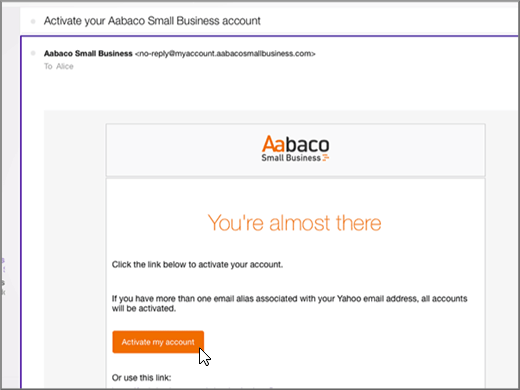

# DNS-records bij Yahoo!Create DNS records at Yahoo! Professionals en kleine bedrijven voor MicrosoftSmall Business for Microsoft

 **[Raadpleeg de veelgestelde vragen over domeinen](../setup/domains-faq.md)** als u niet kunt vinden wat u zoekt.**[Check the Domains FAQ](../setup/domains-faq.md)** if you don't find what you're looking for. 
  
Als Yahoo! Small Business uw DNS-hostingprovider was, dan is dit voortaan Aabaco Small Business.If Yahoo! Small Business has been your DNS hosting provider, you should be aware that your provider is now Aabaco Small Business.
  
Volg de stappen in dit artikel om een account te maken bij Aabaco, waar u DNS-wijzigingen kunt aanbrengen en uw domein of domeinen kunt verlengen.Follow the steps in this article to create an account at Aabaco, where you can make DNS changes and renew your domain or domains.
  
U dient een Aabaco-account te maken voordat u [DNS-records kunt maken](../get-help-with-domains/create-dns-records-at-any-dns-hosting-provider.md).You must create your Aabaco account before you can [create DNS records](../get-help-with-domains/create-dns-records-at-any-dns-hosting-provider.md).

  
## Een Aabaco Small Business-account makenCreate an Aabaco Small Business account

1. Als u aan de slag wilt gaan, gaat u naar uw domeinen pagina bij Aabaco via [deze koppeling](https://www.luminate.com/services/)en selecteert u **instellen uw Aabaco account voor kleine bedrijven**.To get started, go to your domains page at Aabaco by using [this link](https://www.luminate.com/services/), and select **Setup your Aabaco Small Business account**.
    
    
  
2. Geef uw Yahoo!Provide your Yahoo! **E-mailadres en Yahoo**van kleine bedrijven en selecteer **ik geen robot**.Small Business **Email/Yahoo ID**, and then select **I'm not a robot**.
    
    
  
3. Selecteer **aan de slag**.Select **Get started**.
    
    
  
4. Meld u aan bij uw Yahoo! Small Business-e-mailaccount en open de nieuwe e-mail vanuit Aabaco Small Business.Sign in to your Yahoo! Small Business email account and open the new email from Aabaco Small Business.
    
    > [!NOTE]
    > Verstuur het bericht zo nodig opnieuw door de koppeling **resend the email** (de e-mail opnieuw versturen) te kiezen op de pagina **You've got mail** (U hebt e-mail).Resend the message, if necessary, by choosing the **resend the email link** on the **You've got mail** page. 
  
    
  
5. Selecteer e-mailadres **bevestigen**in het Aabaco **om door te gaan** met het instellen van e-mailberichten.In the Aabaco **Confirm your email address to continue setup** email message, select **Confirm email**.
    
    
  
6. Op de pagina **Choose your password** (Wachtwoord kiezen) typt of kopieert en plakt u het wachtwoord dat u voor uw Aabaco-account wilt gebruiken.On the **Choose your password** page, type or copy and paste the password that you want to use for your Aabaco account. 
    
    > [!NOTE]
    > U kunt hetzelfde wachtwoord gebruiken dat u voor uw Yahoo! Small Business-account hebt gebruikt.You can use the same password that you used with your Yahoo! Small Business account. 
  
    
  
7. Selecteer **Ik ga akkoord met de voorwaarden**en selecteer vervolgens **wachtwoord maken**.Select **I agree to the terms and conditions**, and then select **Create password**.
    
    
  
8. Meld u aan bij uw Yahoo! Small Business-e-mailaccount en open de nieuwe e-mail vanuit Aabaco Small Business.Sign in to your Yahoo! Small Business email account, and then open the new email from Aabaco Small Business.
    
    > [!NOTE]
    > Verstuur het bericht zo nodig opnieuw door de koppeling **resend the email** (de e-mail opnieuw versturen) te kiezen op de pagina **You're almost done!** (U bent bijna klaar).Resend the message, if necessary, by choosing the **resend the email link** on the **You're almost done!** page. 
  
    
  
9. Selecteer in het Aabaco het e-mailbericht is **bijna** de optie **Mijn account activeren**.In the Aabaco **You're almost there** email message, select **Activate my account**.
    
    
  
10. Meld u aan bij uw Aabaco Small Business-account.Sign in to your Aabaco Small Business account.
    
    
  
Nu u een Aabaco-account hebt gemaakt, kunt u [DNS-records maken op Aabaco Small Business voor Microsoft](../get-help-with-domains/create-dns-records-at-any-dns-hosting-provider.md).Now that you have created your Aabaco account, you can [Create DNS records at Aabaco Small Business for Microsoft](../get-help-with-domains/create-dns-records-at-any-dns-hosting-provider.md).
  
