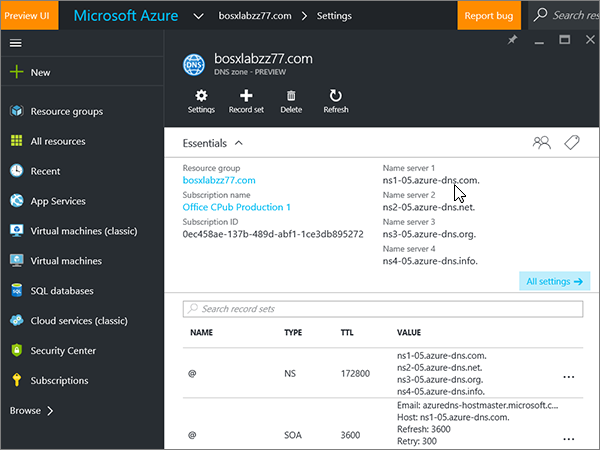

# DNS-records maken voor Azure DNS-zones

 **[Raadpleeg de veelgestelde vragen over domeinen](../setup/domains-faq.md)** als u niet kunt vinden wat u zoekt. 
  
Als Azure uw DNS-hostingprovider is, voert u de stappen in dit artikel uit om uw domein te verifiëren en DNS-records in te stellen voor e-mail, Skype voor Bedrijven Online, enzovoort.
  
Dit zijn de belangrijkste records om toe te voegen. 
  
- [De naamserverrecords (NS-records) van uw domein wijzigen](#change-your-domains-nameserver-ns-records)
    
- [Een TXT-record toevoegen voor verificatie](#add-a-txt-record-for-verification)

- [Voeg een MX-record toe zodat e-mail voor uw domein bij Office 365 terechtkomt](#add-an-mx-record-so-email-for-your-domain-will-come-to-office-365)
    
- [Voeg de vier CNAME-records toe die voor Office 365 vereist zijn.](#add-the-four-cname-records-that-are-required-for-office-365)
    
- [Een TXT-record voor SPF toevoegen om spam tegen te gaan](#add-a-txt-record-for-spf-to-help-prevent-email-spam)
    
- [Voeg de vier SRV-records toe die voor Office 365 vereist zijn.](#add-the-two-srv-records-that-are-required-for-office-365)
    
Nadat u deze records hebt toegevoegd aan Azure, wordt uw domein ingesteld voor gebruik met Office 365-services.
  
> [!NOTE]
> Het duurt gewoonlijk ongeveer 15 minuten voordat DNS-wijzigingen van kracht worden. Het kan echter soms wat langer duren voordat een wijziging die u hebt aangebracht, is bijgewerkt via het DNS-systeem op internet. Als u na het toevoegen van de DNS-records problemen hebt met het ontvangen of verzenden van e-mail, raadpleegt u [Problemen oplossen nadat u uw domeinnaam of DNS-records hebt gewijzigd](../get-help-with-domains/find-and-fix-issues.md). 
  
## De naamserverrecords (NS-records) van uw domein wijzigen

> [!IMPORTANT]
> U moet deze procedure uitvoeren bij de domeinregistrar waar u uw domein hebt gekocht en geregistreerd. 
  
Toen u zich hebt aangemeld voor Azure, hebt u een brongroep gemaakt binnen een DNS-zone en vervolgens uw domeinnaam toegewezen aan die brongroep. Die domeinnaam is geregistreerd bij een externe domeinregistrar; Azure biedt geen domeinregistratieservices aan.
  
Als u DNS-records voor uw domein in Office 365 wilt verifiëren en maken, moet u eerst de naamservers bij uw domeinregistrar wijzigen, zodat ze de Azure-naamservers gebruiken die aan uw brongroep zijn toegewezen.
  
Als u de naamservers van het domein zelf wilt wijzigen op de website van de domeinregistrar, voert u de volgende stappen uit:
  
1. Zoek het gedeelte op de website van de domeinregistrar waarop u de naamservers voor uw domein kunt wijzigen.
    
2. Maak twee naamserverrecords door de waarden in de volgende tabel te gebruiken of bewerk de bestaande naamserverrecords zodat ze overeenkomen met deze waarden: Hieronder wordt een voorbeeld van azure toegewezen naamservers weergegeven.
    

**Voornaamserver:** Gebruik de naamserverwaarde die is toegewezen door Azure.  
**Tweede naamserver:** Gebruik de naamserverwaarde die is toegewezen door Azure.  

  
> [!TIP]
> U moet ten minste twee naamserverrecords gebruiken. Als er andere naamservers op de website van uw domeinregistrar staan, moet u deze verwijderen. 
  
3. Sla uw wijzigingen op.
    
> [!NOTE]
> Het kan enige uren duren voordat de updates van uw naamserverrecords via het DNS-systeem op internet zijn doorgevoerd. Vervolgens worden uw e-mail voor Office 365 en andere services ingesteld voor gebruik met uw domein. 
  
## Een TXT-record toevoegen voor verificatie

Voordat u uw domein met Office 365 kunt gaan gebruiken, moet worden gecontroleerd dat u de eigenaar bent van het domein. Als u zich bij uw account bij de domeinregistrar kunt aanmelden en de DNS-record kunt maken, is dit voor Office 365 bewezen.
  
> [!NOTE]
> Deze record wordt alleen gebruikt om te verifiëren dat u de eigenaar van uw domein bent. Dit heeft verder geen invloed. U kunt deze record later desgewenst verwijderen. 
  
1. Ga naar de pagina domeinen bij Azure via [deze koppeling](https://portal.azure.com )om aan de slag te gaan. U wordt gevraagd u eerst aan te melden.
    
    
  
2. Typ met de **zoekbalk** op de **pagina Dashboard** **DNS-zones**in . Selecteer in de weergave resultaten **DNS-zones** onder het gedeelte **Services.** Zodra u bent omgeleid, selecteert u het domein dat u wilt bijwerken.
    
    
  
3. Selecteer **+ Recordset op**de pagina **Instellingen** voor uw domein in het gebied van de **DNS-zone.**
    
    
  
4. Selecteer in het gebied **Recordset toevoegen** in de vakken voor de nieuwe recordset de waarden uit de volgende tabel. 
    
    (Kies de waarden **type** en **TTL** in de vervolgkeuzelijsten.) 
    
    |**Naam**|**Type**|**TTL**|**TTL-eenheid**|**Value**|
    |:-----|:-----|:-----|:-----|:-----|
    |@    |TXT    |1    |Uur    |MS=ms *XXXXXXXX*    **Opmerking:** Dit is een voorbeeld. Gebruik hier de specifieke waarde voor **Doel of adres waarnaar wordt verwezen** uit de tabel in Office 365.           [Hoe kan ik dit vinden?](../get-help-with-domains/information-for-dns-records.md)          |
   
    
  
5. Selecteer **OK**.
  
6. Wacht enkele minuten voordat u verder gaat, zodat de record die u zojuist hebt gemaakt via internet kan worden bijgewerkt.
    
Nu u de record hebt toegevoegd aan de site van uw domeinregistrar, gaat u terug naar Office 365 en vraagt u of Office 365 naar de record wil zoeken.
  
Wanneer in Office 365 de juiste TXT-record is gevonden, is uw domein gecontroleerd.
  
1. Ga in het beheercentrum naar de pagina \> <a href="https://go.microsoft.com/fwlink/p/?linkid=834818" target="_blank">Instellingendomeinen.</a> **Settings**
    
2. Selecteer op de pagina **Domeinen** het domein dat u verifieert. 
    
    
  
3. Selecteer op de pagina **Setup** de optie **Startsetup**.
    
    
  
4. Selecteer op de pagina **Domein verifiëren** de optie **Verifiëren**.
    
    
  
> [!NOTE]
>  Het duurt gewoonlijk ongeveer 15 minuten voordat DNS-wijzigingen van kracht worden. Het kan echter soms wat langer duren voordat een wijziging die u hebt aangebracht, is bijgewerkt via het DNS-systeem op internet. Als u na het toevoegen van de DNS-records problemen hebt met het ontvangen of verzenden van e-mail, raadpleegt u [Problemen oplossen nadat u uw domeinnaam of DNS-records hebt gewijzigd](../get-help-with-domains/find-and-fix-issues.md). 
  
## Voeg een MX-record toe zodat e-mail voor uw domein bij Office 365 terechtkomt

1. Ga naar de pagina domeinen bij Azure via [deze koppeling](https://portal.azure.com )om aan de slag te gaan. U wordt gevraagd u eerst aan te melden.
    
    
  
2. Selecteer op de pagina **Dashboard** in het gebied **Alle resources** het domein dat u wilt bijwerken. 
    
    
  
3. Selecteer **+ Recordset op**de pagina **Instellingen** voor uw domein in het gebied van de **DNS-zone.**
    
    
  
4. Selecteer in het gebied **Recordset toevoegen** in de vakken voor de nieuwe recordset de waarden uit de volgende tabel. 
    
    (Kies de waarden **type** en **TTL** in de vervolgkeuzelijsten.) 
    
    |**Naam**|**Type**|**TTL**|**TTL-eenheid**|**Preference**|**Postuitwisseling**|
    |:-----|:-----|:-----|:-----|:-----|:-----|
    |@    |MX    |1    |Uur    |10    Zie [Wat is MX-prioriteit?](https://support.office.com/article/2784cc4d-95be-443d-b5f7-bb5dd867ba83.aspx) voor meer informatie over prioriteit.      | *\<domeinsleutel\>*  .mail.protection.outlook.com    **Let op:** Haal uw * \<domeinsleutel\> * uit uw Office 365-account.   [Hoe kan ik dit vinden?](../get-help-with-domains/information-for-dns-records.md)  
   
    
  
5. Selecteer **OK**.
    
    
  
6. Als er andere MX-records in de sectie **MX Records** staan, moet u deze verwijderen. 
    
    Selecteer eerst in het **DNS-zonegebied** de **MX Record-set**.
    
    
  
    Selecteer vervolgens de MX-record die u wilt verwijderen.
    
    
  
7. Selecteer het **menu Context (...)** en kies **Verwijderen.**
    
    
  
8. Kies **Opslaan**.
    
    
  
## Voeg de vier CNAME-records toe die voor Office 365 vereist zijn.

1. Ga naar de pagina domeinen bij Azure via [deze koppeling](https://portal.azure.com )om aan de slag te gaan. U wordt gevraagd u eerst aan te melden.
    
    
  
2. Selecteer op de pagina **Dashboard** in het gebied **Alle resources** het domein dat u wilt bijwerken. 
    
    
  
3. Selecteer **+ Recordset op**de pagina **Instellingen** voor uw domein in het gebied van de **DNS-zone.**
    
    
  
4. Voeg de eerste van de vier CNAME-records toe.
    
    Typ of kopieer en plak de waarden uit de eerste rij in de volgende tabel in het gebied **Recordset toevoegen** in de vakken voor de nieuwe recordset en kopieer en plak de waarden uit de eerste rij. 
    
    (Kies de waarden **type** en **TTL** in de vervolgkeuzelijsten.) 
    
    |**Naam**|**Type**|**TTL**|**TTL-eenheid**|**Alias**|
    |:-----|:-----|:-----|:-----|:-----|
    |autodiscover    |CNAME    |1    |Uur    |autodiscover.outlook.com    |
    |sip    |CNAME    |1    |Uur    |sipdir.online.lync.com    |
    |lyncdiscover    |CNAME    |1    |Uur    |webdir.online.lync.com    |
    
   
    
  
5. Selecteer **OK**.
    
    
  
6. Voeg de andere drie CNAME-records toe.
    
    Selecteer **+ Recordset in**het gebied VAN DE **DNS-zone.** Maak vervolgens in de lege recordset een record met behulp van de waarden uit de volgende rij in de tabel en selecteer **opnieuw OK** om die record te voltooien. 
    
    Herhaal deze procedure totdat u alle vier CNAME-records hebt gemaakt.
    
7.  (Optioneel) Voeg 2 CNAME-records toe voor MDM.

> [!IMPORTANT]
> Als u Mobile Device Management (MDM) voor Office 365 hebt, moet u twee extra CNAME-records maken. Volg de stappen die u hebt gevolgd voor de andere vier CNAME-records, maar gebruik de waarden uit de volgende tabel. (Als u geen MDM hebt, u deze stap overslaan.) 
  
|**Naam**|**Type**|**TTL**|**TTL-eenheid**|**Alias**|
|:-----|:-----|:-----|:-----|:-----|
|enterpriseregistration    |CNAME    |1    |Uur    |enterpriseregistration.windows.net    |
|enterpriseenrollment    |CNAME    |1    |Uur    |enterpriseenrollment-s.manage.microsoft.com    |
   
## Een TXT-record voor SPF toevoegen om spam tegen te gaan

> [!IMPORTANT]
> U kunt maximaal 1 TXT-record hebben voor SPF voor een domein. Als uw domein meer dan één SPF-record heeft, kan dit resulteren in e-mailfouten, evenals leverings- en spamclassificatieproblemen. Als u al een SPF-record voor uw domein hebt, hoeft u geen nieuwe voor Office 365 te maken. In plaats daarvan voegt u de vereiste Office 365-waarden toe aan de huidige record, zodat u beschikt over  *één*  SPF-record waarin beide sets waarden zijn opgenomen. 
  
1. Ga naar de pagina domeinen bij Azure via [deze koppeling](https://portal.azure.com )om aan de slag te gaan. U wordt gevraagd u eerst aan te melden.
    
    
  
2. Selecteer op de pagina **Dashboard** in het gebied **Alle resources** het domein dat u wilt bijwerken. 
    
    
  
3. Selecteer in het **dns-zonegebied** de **TXT-recordset**.
    
    
  
4. Selecteer in het eigenschappenvak **Recordset** in de vakken voor de nieuwe recordset de waarden uit de volgende tabel. 
    
    (Kies de waarden **type** en **TTL** in de vervolgkeuzelijsten.) 
    
    |**Naam**|**Type**|**TTL**|**TTL-eenheid**|**Value**|
    |:-----|:-----|:-----|:-----|:-----|
    |@    |TXT    |1    |Uur    |v=spf1 include:spf.protection.outlook.com -all    **Opmerking:** het is raadzaam dit item te kopiëren en te plakken, zodat het spatiegebruik ongewijzigd blijft.           

    
  
5. Kies **Opslaan**.
    
    
  
## Voeg de vier SRV-records toe die voor Office 365 vereist zijn.

1. Ga naar de pagina domeinen bij Azure via [deze koppeling](https://portal.azure.com )om aan de slag te gaan. U wordt gevraagd u eerst aan te melden.
    
    
  
2. Selecteer op de pagina **Dashboard** in het gebied **Alle resources** het domein dat u wilt bijwerken. 
    
    
  
3. Selecteer **+ Recordset op**de pagina **Instellingen** voor uw domein in het gebied van de **DNS-zone.**
    
    
  
4. Voeg de eerste van de twee SRV-records toe.
    
    Selecteer in het gebied **Recordset toevoegen** in de vakken voor de nieuwe recordset de waarden van de eerste rij in de volgende tabel. 
    
    (Kies de waarden **type** en **TTL** in de vervolgkeuzelijsten.) 
    
    |**Naam**|**Type**|**TTL**|**TTL-eenheid**|**Priority**|**Weight**|**Port**|**Target**|
    |:-----|:-----|:-----|:-----|:-----|:-----|:-----|:-----|
    |_sip._tls    |SRV    |1    |Uur    |100    |1    |443    |sipdir.online.lync.com    |
    |_sipfederationtls._tcp    |SRV    |1    |Uur    |100    |1    |5061    |sipfed.online.lync.com    

    
  
5. Selecteer **OK**.
    
    
  
6. Voeg de andere SRV-record toe.
    
    Typ of kopieer en plak de waarden uit de tweede rij van de tabel in de vakken voor de nieuwe record.
    
> [!NOTE]
> Het duurt gewoonlijk ongeveer 15 minuten voordat DNS-wijzigingen van kracht worden. Het kan echter soms wat langer duren voordat een wijziging die u hebt aangebracht, is bijgewerkt via het DNS-systeem op internet. Als u na het toevoegen van de DNS-records problemen hebt met het ontvangen of verzenden van e-mail, raadpleegt u [Problemen oplossen nadat u uw domeinnaam of DNS-records hebt gewijzigd](../get-help-with-domains/find-and-fix-issues.md). 
  
