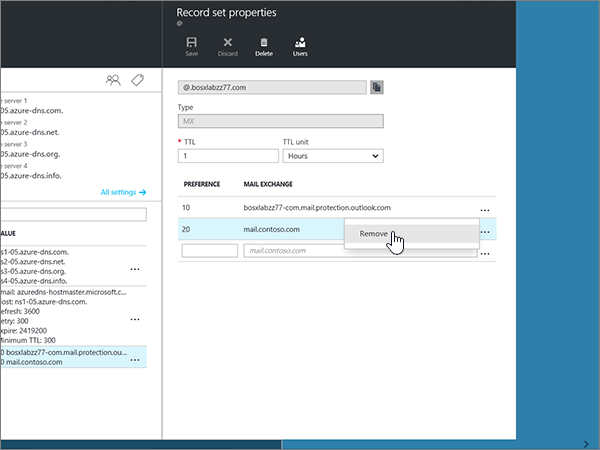

# DNS-records voor Azure DNS-zones maken

 **[Raadpleeg de veelgestelde vragen over domeinen](../setup/domains-faq.yml)** als u niet kunt vinden wat u zoekt. 
  
Als Azure uw DNS-hosting provider is, voert u de stappen in dit artikel uit om uw domein te verifiëren en DNS-records in te stellen voor e-mail, Skype voor bedrijven online, enzovoort.
  
Dit zijn de belangrijkste records om toe te voegen. 
  
- [De naamserverrecords (NS-records) van uw domein wijzigen](#change-your-domains-nameserver-ns-records)
    
- [Een TXT-record toevoegen voor verificatie](#add-a-txt-record-for-verification)

- [Voeg een MX-record toe zodat e-mail voor uw domein naar Microsoft wordt verzonden](#add-an-mx-record-so-email-for-your-domain-will-come-to-microsoft)
    
- [De vier CNAME-records toevoegen die vereist zijn voor Microsoft](#add-the-four-cname-records-that-are-required-for-microsoft)
    
- [Een TXT-record voor SPF toevoegen om spam tegen te gaan](#add-a-txt-record-for-spf-to-help-prevent-email-spam)
    
- [De twee SRV-records toevoegen die zijn vereist voor Microsoft](#add-the-two-srv-records-that-are-required-for-microsoft)
    
Nadat u deze records bij Azure hebt toegevoegd, is uw domein ingesteld voor gebruik met Microsoft-services.
  
> [!NOTE]
> Het duurt gewoonlijk ongeveer 15 minuten voordat DNS-wijzigingen van kracht worden. Het kan echter soms wat langer duren voordat een wijziging die u hebt aangebracht, is bijgewerkt via het DNS-systeem op internet. Als u na het toevoegen van de DNS-records problemen hebt met het ontvangen of verzenden van e-mail, raadpleegt u [Problemen oplossen nadat u uw domeinnaam of DNS-records hebt gewijzigd](../get-help-with-domains/find-and-fix-issues.md). 
  
## De naamserverrecords (NS-records) van uw domein wijzigen

> [!IMPORTANT]
> U moet deze procedure uitvoeren bij de domeinregistrar waar u uw domein hebt gekocht en geregistreerd. 
  
Toen u zich registreerde voor Azure, hebt u een resourcegroep gemaakt in een DNS-zone en hebt u vervolgens uw domeinnaam aan die resourcegroep toegewezen. Deze domeinnaam is geregistreerd bij een externe domeinregistratie; Azure biedt geen Domain Registration Services.
  
Als u DNS-records voor uw domein wilt controleren en maken in Microsoft, moet u eerst de naamservers van uw domeinregistratie wijzigen, zodat ze de Azure naamservers gebruiken die aan de resourcegroep is toegewezen.
  
Als u de naamservers van het domein zelf wilt wijzigen op de website van de domeinregistrar, voert u de volgende stappen uit:
  
1. Zoek het gedeelte op de website van de domeinregistrar waarop u de naamservers voor uw domein kunt wijzigen.
    
2. Maak twee naamserverrecords door de waarden in de volgende tabel te gebruiken of bewerk de bestaande naamserverrecords zodat ze overeenkomen met deze waarden: Hieronder ziet u een voorbeeld van de aan Azure toegewezen naamservers.
    

**Eerste naamserver:** Gebruik de waarde van name server die is toegewezen door Azure.  
**Tweede naamserver:** Gebruik de waarde van name server die is toegewezen door Azure.  

  
> [!TIP]
> U dient ten minste twee naamserver records te gebruiken. Als er andere naamservers worden weergegeven op de website van uw domeinregistratie, moet u deze verwijderen. 
  
3. Sla uw wijzigingen op.
    
> [!NOTE]
> Het kan enige uren duren voordat de updates van uw naamserverrecords via het DNS-systeem op internet zijn doorgevoerd. Vervolgens zijn uw Microsoft-e-mail en andere services allemaal ingesteld voor gebruik met uw domein. 
  
## Een TXT-record toevoegen voor verificatie

Voordat u uw domein met Microsoft kunt gebruiken, moet worden gecontroleerd dat u de eigenaar bent van het domein. Als u zich bij uw account bij de domeinregistrar kunt aanmelden en de DNS-record kunt maken, is dit voor Microsoft bewezen.
  
> [!NOTE]
> Deze record wordt alleen gebruikt om te verifiëren dat u de eigenaar van uw domein bent. Dit heeft verder geen invloed. U kunt deze record later desgewenst verwijderen. 
  
1. Als u wilt beginnen, gaat u naar uw domeinen pagina bij Azure met [deze koppeling](https://portal.azure.com ). U wordt gevraagd u eerst aan te melden.
    
    
  
2. Gebruik de **zoekbalk** op de **Dashboard** -pagina en typ **DNS zones**. Selecteer in de weergave resultaten de optie **DNS zones** onder het onderdeel **Services** . Als u het domein hebt doorgestuurd, selecteert u het domein dat u wilt bijwerken.
    
    
  
3. Selecteer op de pagina **instellingen** voor uw domein in het gebied **DNS-zone** de optie **+ record set**.
    
    
  
4. Selecteer in het gebied **Add Record set** de waarden uit de volgende tabel in de vakken voor de nieuwe recordset. 
    
    (Kies in de vervolgkeuzelijsten de waarden **type** en **TTL** .) 
    
    |**Naam**|**Type**|**TTL**|**TTL-eenheid**|**Value**|
    |:-----|:-----|:-----|:-----|:-----|
    |@    |TXT    |1    |Uren    |MS=ms *XXXXXXXX*    **Opmerking:** Dit is een voorbeeld. Gebruik hier de specifieke waarde voor **Doel of adres waarnaar wordt verwezen** uit de tabel.           [Hoe kan ik dit vinden?](../get-help-with-domains/information-for-dns-records.md)          |
   
    
  
5. Selecteer **OK**.
  
6. Wacht enkele minuten voordat u verder gaat, zodat de record die u zojuist hebt gemaakt via internet kan worden bijgewerkt.
    
Nu u de record hebt toegevoegd aan de site van uw domeinregistrar, gaat u terug naar Microsoft en vraagt u de record aan.
  
Wanneer in Microsoft de juiste TXT-record is gevonden, is uw domein gecontroleerd.
  
1. Ga in het beheercentrum naar **Instellingen** \> <a href="https://go.microsoft.com/fwlink/p/?linkid=834818" target="_blank">Domeinen</a>-pagina.
    
2. Kies op de pagina **Domeinen** de naam van het domein dat u verifieert. 
    
    
  
3. Kies **Start setup** op de pagina **Setup**.
    
    
  
4. Kies **Verifiëren** op de pagina **Domein verifiëren**.
    
    
  
> [!NOTE]
>  Het duurt gewoonlijk ongeveer 15 minuten voordat DNS-wijzigingen van kracht worden. Het kan echter soms wat langer duren voordat een wijziging die u hebt aangebracht, is bijgewerkt via het DNS-systeem op internet. Als u na het toevoegen van de DNS-records problemen hebt met het ontvangen of verzenden van e-mail, raadpleegt u [Problemen oplossen nadat u uw domeinnaam of DNS-records hebt gewijzigd](../get-help-with-domains/find-and-fix-issues.md). 
  
## Voeg een MX-record toe zodat e-mail voor uw domein naar Microsoft wordt verzonden

1. Als u wilt beginnen, gaat u naar uw domeinen pagina bij Azure met [deze koppeling](https://portal.azure.com ). U wordt gevraagd u eerst aan te melden.
    
    
  
2. Selecteer op de pagina **Dashboard** , in het gebied **all resources** , het domein dat u wilt bijwerken. 
    
    
  
3. Selecteer op de pagina **instellingen** voor uw domein in het gebied **DNS-zone** de optie **+ record set**.
    
    
  
4. Selecteer in het gebied **Add Record set** de waarden uit de volgende tabel in de vakken voor de nieuwe recordset. 
    
    (Kies in de vervolgkeuzelijsten de waarden **type** en **TTL** .) 
    
    |**Naam**|**Type**|**TTL**|**TTL-eenheid**|**Preference**|**E-mail uitwisselen**|
    |:-----|:-----|:-----|:-----|:-----|:-----|
    |@    |MX    |1    |Uren    |10    Zie [Wat is MX-prioriteit?](https://docs.microsoft.com/microsoft-365/admin/setup/domains-faq) voor meer informatie over prioriteit.   | *\<domain-key\>*  .mail.protection.outlook.com    **Opmerking:** Neem uw  *\<domain-key\>*  van uw Microsoft-account.   [Hoe kan ik dit vinden?](../get-help-with-domains/information-for-dns-records.md)  
   
    
  
5. Selecteer **OK**.
    
    
  
6. Als er andere MX-records worden vermeld in de sectie **MX records** , moet u deze verwijderen. 
    
    Selecteer eerst de **MX-recordset** in het gebied **DNS zone** .
    
    
  
    Vervolgens selecteert u de MX-record die u wilt verwijderen.
    
    
  
7. Selecteer het **context menu (...)** en kies vervolgens **verwijderen**.
    
    
  
8. Kies **Opslaan**.
    
    
  
## De vier CNAME-records toevoegen die vereist zijn voor Microsoft

1. Als u wilt beginnen, gaat u naar uw domeinen pagina bij Azure met [deze koppeling](https://portal.azure.com ). U wordt gevraagd u eerst aan te melden.
    
    
  
2. Selecteer op de pagina **Dashboard** , in het gebied **all resources** , het domein dat u wilt bijwerken. 
    
    
  
3. Selecteer op de pagina **instellingen** voor uw domein in het gebied **DNS-zone** de optie **+ record set**.
    
    
  
4. Voeg de eerste van de vier CNAME-records toe.
    
    Typ of kopieer en plak de waarden uit de eerste rij van de volgende tabel in het gebied **Add Record set** in de vakken voor de nieuwe recordset. 
    
    (Kies in de vervolgkeuzelijsten de waarden **type** en **TTL** .) 
    
    |**Naam**|**Type**|**TTL**|**TTL-eenheid**|**Alias**|
    |:-----|:-----|:-----|:-----|:-----|
    |autodiscover    |CNAME    |1    |Uren    |autodiscover.outlook.com    |
    |sip    |CNAME    |1    |Uren    |sipdir.online.lync.com    |
    |lyncdiscover    |CNAME    |1    |Uren    |webdir.online.lync.com    |
    
   
    
  
5. Selecteer **OK**.
    
    
  
6. Voeg de andere drie CNAME-records toe.
    
    Selecteer in het gebied **DNS zone** de optie **+ record set**. Maak vervolgens een record met behulp van de waarden uit de volgende rij in de tabel en selecteer **OK** om de record te voltooien. 
    
    Herhaal deze procedure totdat u alle vier CNAME-records hebt gemaakt.
    
7.  Option Twee CNAME-records voor MDM toevoegen.

> [!IMPORTANT]
> Als u over MDM (Mobile Device Management) voor Microsoft beschikt, moet u twee extra CNAME-records maken. Volg de stappen die u hebt gevolgd voor de andere vier CNAME-records, maar gebruik de waarden uit de volgende tabel. (Als u geen MDM hebt, kunt u deze stap overslaan.) 
  
|**Naam**|**Type**|**TTL**|**TTL-eenheid**|**Alias**|
|:-----|:-----|:-----|:-----|:-----|
|enterpriseregistration    |CNAME    |1    |Uren    |enterpriseregistration.windows.net    |
|enterpriseenrollment    |CNAME    |1    |Uren    |enterpriseenrollment-s.manage.microsoft.com    |
   
## Een TXT-record voor SPF toevoegen om spam tegen te gaan

> [!IMPORTANT]
> U kunt maximaal 1 TXT-record hebben voor SPF voor een domein. Als uw domein meer dan één SPF-record heeft, kan dit resulteren in e-mailfouten, evenals leverings- en spamclassificatieproblemen. Als u al een SPF-record voor uw domein hebt, hoeft u geen nieuwe te maken voor Microsoft. In plaats daarvan voegt u de vereiste Microsoft-waarden toe aan de huidige record, zodat u  *één*  SPF-record hebt die beide sets met waarden bevat. 
  
1. Als u wilt beginnen, gaat u naar uw domeinen pagina bij Azure met [deze koppeling](https://portal.azure.com ). U wordt gevraagd u eerst aan te melden.
    
    
  
2. Selecteer op de pagina **Dashboard** , in het gebied **all resources** , het domein dat u wilt bijwerken. 
    
    
  
3. Selecteer in het gebied **DNS zone** de **txt recordset**.
    
    
  
4. Selecteer in het gebied **eigenschappenset** van de record de waarden uit de volgende tabel in de vakken voor de nieuwe record set. 
    
    (Kies in de vervolgkeuzelijsten de waarden **type** en **TTL** .) 
    
    |**Naam**|**Type**|**TTL**|**TTL-eenheid**|**Value**|
    |:-----|:-----|:-----|:-----|:-----|
    |@    |TXT    |1    |Uren    |v=spf1 include:spf.protection.outlook.com -all    **Opmerking:** het is raadzaam dit item te kopiëren en te plakken, zodat het spatiegebruik ongewijzigd blijft.           

    
  
5. Kies **Opslaan**.
    
    
  
## De twee SRV-records toevoegen die zijn vereist voor Microsoft

1. Als u wilt beginnen, gaat u naar uw domeinen pagina bij Azure met [deze koppeling](https://portal.azure.com ). U wordt gevraagd u eerst aan te melden.
    
    
  
2. Selecteer op de pagina **Dashboard** , in het gebied **all resources** , het domein dat u wilt bijwerken. 
    
    
  
3. Selecteer op de pagina **instellingen** voor uw domein in het gebied **DNS-zone** de optie **+ record set**.
    
    
  
4. Voeg de eerste van de twee SRV-records toe.
    
    Selecteer in het gebied **Add Record set** de waarden uit de eerste rij in de volgende tabel in de vakken voor de nieuwe recordset. 
    
    (Kies in de vervolgkeuzelijsten de waarden **type** en **TTL** .) 
    
    |**Naam**|**Type**|**TTL**|**TTL-eenheid**|**Prioriteit**|**Gewicht**|**Poort**|**Target**|
    |:-----|:-----|:-----|:-----|:-----|:-----|:-----|:-----|
    |_sip _sip._tls    |SRV    |1    |Uren    |100    |1    |443    |sipdir.online.lync.com    |
    |_sipfederationtls _sipfederationtls._tcp    |SRV    |1    |Uren    |100    |1    |5061    |sipfed.online.lync.com    

    
  
5. Selecteer **OK**.
    
    
  
6. Voeg de andere SRV-record toe.
    
    Typ of kopieer en plak de waarden uit de tweede rij van de tabel in de vakken voor de nieuwe record.
    
> [!NOTE]
> Het duurt gewoonlijk ongeveer 15 minuten voordat DNS-wijzigingen van kracht worden. Het kan echter soms wat langer duren voordat een wijziging die u hebt aangebracht, is bijgewerkt via het DNS-systeem op internet. Als u na het toevoegen van de DNS-records problemen hebt met het ontvangen of verzenden van e-mail, raadpleegt u [Problemen oplossen nadat u uw domeinnaam of DNS-records hebt gewijzigd](../get-help-with-domains/find-and-fix-issues.md). 
  
