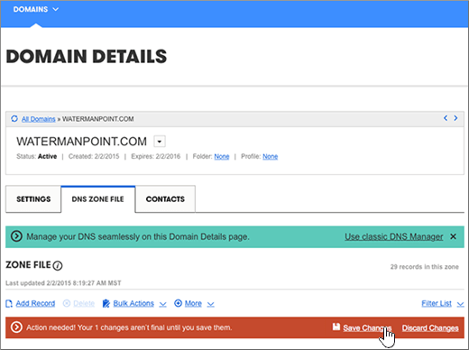

# DNS-records maken wanneer uw domein wordt beheerd door Google (eNom)

 **[Raadpleeg de veelgestelde vragen over domeinen](../setup/domains-faq.yml)** als u niet kunt vinden wat u zoekt. 
  
Als u uw e-mailaccounts wilt migreren naar Microsoft, moet u een DNS-record maken bij uw domeinregistratie.
  
Als u uw domein via Google hebt aangeschaft toen u zich aanmeldt voor uw **Google-Apps voor werk** , worden uw DNS-records beheerd door Google maar geregistreerd bij eNom. 
  
U kunt toegang krijgen tot eNom en DNS maken, via de pagina Google **Domains** . Voer gewoon de stappen in dit artikel uit. 
  
## De DNS-record maken

1. Selecteer **Aanmelden** in de [Google admin-console](https://www.google.com/work/apps/business).
    
    
  
2. Voer uw domeinnaam in en selecteer vervolgens **Go**.
    
    
  
3. Selecteer onder aan de pagina **meer besturingselementen**.
    
    
  
4. Selecteer **Domeinen**.
    
    
  
5. Selecteer **domeinen toevoegen/verwijderen** op de pagina **domeinen** .
    
    
  
6. Selecteer op de pagina **domeinen** de optie **Geavanceerde DNS-instellingen**.
    
    > [!NOTE]
    > Als u geen domeinnaam via Google hebt aangeschaft terwijl u zich registreerde voor uw account bij **Google Apps for Work**, hebt u geen **Geavanceerde DNS-instellingen** op uw pagina **Domeinen**. U moet dan rechtstreeks naar de website van uw domeinhost gaan voor toegang tot uw DNS-instellingen, en vervolgens deze en de volgende stappen uitvoeren. Zie [uw G suite-Domeininstellingen](https://support.google.com/a/answer/54693?hl=en) raadplegen voor meer informatie. 
  
    
  
7. Selecteer op de pagina **Geavanceerde DNS-instellingen** de optie **Aanmelden bij de DNS-console**. Noteer de **aanmeldingsnaam** en het **wachtwoord**. U hebt deze nodig in de volgende stap. 
    
    
  
8. Meld u op de pagina **Geavanceerde DNS-instellingen** aan bij **Domeinbeheer** van Google met de **aanmeldingsnaam** en het **wachtwoord**. 
    
    
  
9. Selecteer op de pagina domain_name _ de optie **bewerken** ***in de sectie _* host records** .
    
    
  
10. Selecteer in de sectie **host records** de optie **Add New**.
    
    
  
11. Typ of kopieer en plak de waarden uit de volgende tabel in de vakken voor de nieuwe record.
    
    |**HOST**|**TXT VALUE**|**RECORD TYPE**|
    |:-----|:-----|:-----|
    |@    ||TXT    |

    > [!NOTE]
    > Dit is een voorbeeld. Gebruik hier de specifieke waarde voor **Doel of adres waarnaar wordt verwezen** uit de tabel. 
  
    [Hoe kan ik dit vinden?](../get-help-with-domains/information-for-dns-records.md)
  
12. Kies **Opslaan**.
    
    
  
13. Selecteer **Save Changes**.
    
    
  
> [!NOTE]
>  Het duurt gewoonlijk ongeveer 15 minuten voordat DNS-wijzigingen van kracht worden. Het kan echter soms wat langer duren voordat een wijziging die u hebt aangebracht, is bijgewerkt via het DNS-systeem op internet. Als u na het toevoegen van de DNS-records problemen hebt met het ontvangen of verzenden van e-mail, raadpleegt u [Problemen oplossen nadat u uw domeinnaam of DNS-records hebt gewijzigd](../get-help-with-domains/find-and-fix-issues.md). 
  
