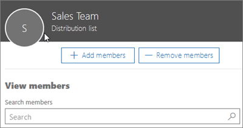

# Een gebruiker of contactpersoon toevoegen aan een Office 365-distributiegroepAdd a user or contact to an Office 365 distribution group

Als beheerder van een Office 365-organisatie moet u mogelijk een van uw gebruikers of contactpersonen toevoegen aan een distributiegroep (zie Distributiegroepen maken [in Office 365](../setup/create-distribution-lists.md).) U bijvoorbeeld werknemers of externe partners of leveranciers toevoegen aan een e-maildistributiegroep.As the admin of an Office 365 organization, you may need to add one of your users or contacts to a distribution group (see [Create distribution groups in Office 365](../setup/create-distribution-lists.md).) For example, you can add employees or external partners or vendors to an email distribution group.
  
## Een gebruiker of contactpersoon toevoegen aan een distributiegroepAdd a user or contact to a distribution group

::: moniker range="o365-worldwide"

> [!NOTE]
> Als u het nieuwe Microsoft 365-beheercentrum niet gebruikt, kunt u dit inschakelen door de wisselknop **Probeer het nieuwe beheercentrum** bovenaan de startpagina te selecteren.If you're not using the new Microsoft 365 admin center, you can turn it on by selecting the **Try the new admin center** toggle located at the top of the Home page.

1. Ga in het beheercentrum naar de pagina \> <a href="https://go.microsoft.com/fwlink/p/?linkid=2052855" target="_blank">Groepengroepen.</a> **Groups**In the admin center, go to the **Groups** \> <a href="https://go.microsoft.com/fwlink/p/?linkid=2052855" target="_blank">Groups</a> page.

2. Selecteer op de pagina **Groepen** de naam van de groep waaraan u een contactpersoon wilt toevoegen.On the **Groups** page, select the name of the group you want to add a contact to.

3. Selecteer op het tabblad **Leden** de optie **Alle weergeven en leden beheren**.On the **Members** tab, select **View all and manage members**.

4. Selecteer op de pagina **Leden weergeven** de optie **Leden toevoegen**en selecteer de gebruiker of contactpersoon die u aan de distributiegroep wilt toevoegen.On the **View Members** page, select **Add members**, and select the user or contact you want to add to the distribution group. 
    
    
  
5. Selecteer **Opslaan** en **sluit.**Select **Save** and then **Close**.

::: moniker-end

::: moniker range="o365-germany"

1. Ga in het beheercentrum naar de pagina \> <a href="https://go.microsoft.com/fwlink/p/?linkid=2052855" target="_blank">Groepengroepen.</a> **Groups**In the admin center, go to the **Groups** \> <a href="https://go.microsoft.com/fwlink/p/?linkid=2052855" target="_blank">Groups</a> page.
    
2. Selecteer op de pagina **Groepen** de groep waaraan u een contactpersoon wilt toevoegen.On the **Groups** page, select the group you want to add a contact to.
    
3. Selecteer **bewerken**in de sectie **Leden.**In the **Members** section, select **Edit**.
  
4. Selecteer op de pagina **Leden weergeven** de optie **Leden toevoegen**en selecteer de gebruiker of contactpersoon die u aan de distributiegroep wilt toevoegen.On the **View Members** page, select **Add members**, and select the user or contact you want to add to the distribution group. 
    
    
  
5. Selecteer **Opslaan** en **sluit.**Select **Save** and then **Close**.
    
Als u de [contactpersoon](../misc/contacts.md) nog niet hebt gemaakt, doet u dit eerst, zoals in deze video wordt weergegeven.If you haven't created the [contact](../misc/contacts.md) yet, do that first as shown in this video. 

::: moniker-end

::: moniker range="o365-21vianet"

1. Ga in het beheercentrum naar de pagina \> <a href="https://go.microsoft.com/fwlink/p/?linkid=2052855" target="_blank">Groepengroepen.</a> **Groups**In the admin center, go to the **Groups** \> <a href="https://go.microsoft.com/fwlink/p/?linkid=2052855" target="_blank">Groups</a> page.
    
2. Selecteer op de pagina **Groepen** de groep waaraan u een contactpersoon wilt toevoegen.On the **Groups** page, select the group you want to add a contact to.
    
3. Selecteer **bewerken**in de sectie **Leden.**In the **Members** section, select **Edit**.
  
4. Selecteer op de pagina **Leden weergeven** de optie **Leden toevoegen**en selecteer de gebruiker of contactpersoon die u aan de distributiegroep wilt toevoegen.On the **View Members** page, select **Add members**, and select the user or contact you want to add to the distribution group. 
    
    
  
5. Selecteer **Opslaan** en **sluit.**Select **Save** and then **Close**.
    
Als u de [contactpersoon](../misc/contacts.md) nog niet hebt gemaakt, doet u dit eerst, zoals in deze video wordt weergegeven.If you haven't created the [contact](../misc/contacts.md) yet, do that first as shown in this video. 

::: moniker-end

  

  
> [!VIDEO https://www.microsoft.com/videoplayer/embed/ed4e6095-9a6a-4d3d-999d-698c39bb7ec8?autoplay=false]
  
Meer informatie over het verzenden van [e-mail als distributiegroep in Office 365](../manage/send-email-as-distribution-list.md).Learn how to [send email as a distribution group in Office 365](../manage/send-email-as-distribution-list.md).
  

