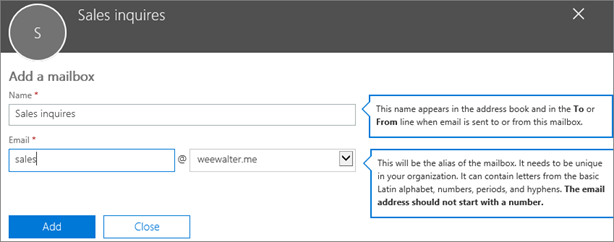

# Een gedeeld postvak makenCreate a shared mailbox 

> [!NOTE]
> Als uw organisatie gebruikmaakt van een hybride Exchange-omgeving, moet u het on-premises Exchange-beheercentrum (EAC) gebruiken om gedeelde postvakken te maken en te beheren.If your organization uses a hybrid Exchange environment, you should use the on-premises Exchange admin center (EAC) to create and manage shared mailboxes. [Gedeelde postvakken maken in het Exchange-beheercentrum](https://docs.microsoft.com/Exchange/collaboration/shared-mailboxes/create-shared-mailboxes?view=exchserver-2019.)See [Create shared mailboxes in the Exchange admin center](https://docs.microsoft.com/Exchange/collaboration/shared-mailboxes/create-shared-mailboxes?view=exchserver-2019.)  
> Zie [Groepen vergelijken](../create-groups/compare-groups.md) als u niet zeker weet of u een gedeeld postvak of een Microsoft 365-groep voor Outlook moet maken.If you're not sure if you should create a shared mailbox or a Microsoft 365 group for Outlook, see [Compare groups](../create-groups/compare-groups.md) for some guidance. Momenteel is het niet mogelijk een gedeeld postvak te migreren naar een Microsoft 365-groep.Note that currently, it's not possible to migrate a shared mailbox to a Microsoft 365 group. Als dit iets is dat u zou willen, laat ons dat dan weten door [hier te stemmen](https://go.microsoft.com/fwlink/?linkid=871518).If this is something you want, let us know by [voting here](https://go.microsoft.com/fwlink/?linkid=871518).

It's easy to create shared mailboxes so a group of people can monitor and send email from a common email addresses, like info@contoso.com.It's easy to create shared mailboxes so a group of people can monitor and send email from a common email addresses, like info@contoso.com. When a person in the group replies to a message sent to the shared mailbox, the email appears to be from the shared mailbox, not from the individual user.When a person in the group replies to a message sent to the shared mailbox, the email appears to be from the shared mailbox, not from the individual user.

Gedeelde postvakken hebben een gedeelde agenda.Shared mailboxes include a shared calendar. Veel kleine bedrijven vinden de gedeelde agenda handig omdat iedereen hier zijn afspraken kan invoeren.A lot of small businesses like to use the shared calendar as a place for everyone to enter their appointments. Als u bijvoorbeeld drie mensen hebt die klantbezoeken doen, kunnen zij allemaal de gedeelde agenda gebruiken om hun afspraken in te voeren.For example, if you have 3 people who do customer visits, all can use the shared calendar to enter the appointments. Dit is een handige manier om iedereen op de hoogte te houden van waar mensen zich bevinden.This is an easy way to keep everyone informed where people are.

Lees eerst [Meer informatie over gedeelde postvakken](about-shared-mailboxes.md) voordat u een gedeeld postvak maakt.Before creating a shared mailbox, be sure to read [About shared mailboxes](about-shared-mailboxes.md) for more information.

## Een gedeeld postvak maken en leden toevoegenCreate a shared mailbox and add members
  
1. Meld u aan met een globaal beheerdersaccount of Exchange-beheerder-account.Sign in with a global admin account or Exchange admin account. Als het u het bericht ‘**U bent niet gemachtigd om deze pagina weer te geven of deze handeling uit te voeren**’ krijgt, dan bent u geen beheerder.If you get the message "**You don't have permission to access this page or perform this action**," then you aren't an admin. 

::: moniker range="o365-worldwide"

2. Ga in het beheercentrum naar de pagina **Groepen** \> <a href="https://go.microsoft.com/fwlink/p/?linkid=2066847" target="_blank">Gedeelde postvakken</a>.In the admin center, go to the **Groups** \> <a href="https://go.microsoft.com/fwlink/p/?linkid=2066847" target="_blank">Shared mailboxes</a> page.

::: moniker-end

::: moniker range="o365-germany"

2. Ga in het [beheercentrum](https://go.microsoft.com/fwlink/p/?linkid=848041) naar de pagina **Groepen** \> **Gedeelde postvakken**.In the [admin center](https://go.microsoft.com/fwlink/p/?linkid=848041), go to the **Groups** \> **Shared mailboxes** page.

::: moniker-end

::: moniker range="o365-21vianet"

2. Ga in het [beheercentrum](https://go.microsoft.com/fwlink/p/?linkid=850627) naar de pagina **Groepen** \> **Gedeelde postvakken**.In the [admin center](https://go.microsoft.com/fwlink/p/?linkid=850627), go to the **Groups** \> **Shared mailboxes** page.

::: moniker-end
    
3. Selecteer op de pagina **Gedeelde postvakken**, **+Een postvak toevoegen**.On the **Shared mailboxes** page, select **+ Add a mailbox**. Voer een naam in voor het gedeelde postvak.Enter a name for the shared mailbox. De wizard kiest vervolgens het e-mailadres, dat u echter kunt bewerken.Then the wizard chooses the email address, but you can edit it.
    
    
  
4. Kies **Toevoegen**.Select **Add**. Het kan enkele minuten duren voordat u leden kunt toevoegen.It may take a few minutes before you can add members.

5. Selecteer onder **Volgende stappen**, **Leden toevoegen aan dit postvak**.Under **Next steps**, select **Add members to this mailbox**. Leden zijn degenen die de inkomende e-mail voor dit gedeelde postvak en de uitgaande antwoorden kunnen weergeven.Members are the people who will be able to view the incoming mail to this shared mailbox, and the outgoing replies.

   

6. Selecteer de knop **+Leden toevoegen**.Select the **+Add members** button. Schakel het selectievakje in naast de personen die dit gedeelde postvak mogen gebruiken en selecteer **Opslaan**.Put a check mark next to the people who you want to use this shared mailbox, and select **Save**.

   

7. Selecteer **Sluiten**.Select **Close**.

U hebt een gedeeld postvak en een gedeelde agenda.You have a shared mailbox and it includes a shared calendar. Ga nu naar de volgende stap: Aanmelding voor het account van het gedeelde postvak blokkeren.Now go on to the next step: block sign-in for the shared mailbox account.

## Aanmelding voor het account van het gedeelde postvak blokkerenBlock sign-in for the shared mailbox account

Elk gedeeld postvak heeft een bijbehorend gebruikersaccount.Every shared mailbox has a corresponding user account. Is het u opgevallen dat u niet werd gevraagd een wachtwoord in te voeren toen u het gedeelde postvak maakte?Notice how you weren't asked to provide a password when you created the shared mailbox? Het account heeft een wachtwoord, maar dat wordt gegenereerd door het systeem (onbekend).The account has a password, but it's system-generated (unknown). Het is niet de bedoeling het account te gebruiken om u aan te melden in het gedeelde postvak.You aren't supposed to use the account to log in to the shared mailbox.

En als de beheerder het wachtwoord van het gebruikersaccount van het gedeelde postvak opnieuw instelt?But what if an admin simply resets the password of the shared mailbox user account? Of wat als een hacker zich toegang verschaft tot de referenties van het account van het gedeelde postvak?Or what if an attacker gains access to the shared mailbox account credentials? Hiermee zou het gebruikersaccount zich aan kunnen melden bij het gedeelde postvak en e-mail verzenden.This would allow the user account to log in to the shared mailbox and send email. Om dit te voorkomen, moet u de aanmelding voor het account die behoort bij het gedeelde postvak blokkeren.To prevent this, you need to block sign-in for the account that's associated with the shared mailbox.

::: moniker range="o365-worldwide"

1. Ga in het beheercentrum naar de pagina **Gebruikers** \> <a href="https://go.microsoft.com/fwlink/p/?linkid=834822" target="_blank">Actieve gebruikers</a>.In the admin center, go to the **Users** \> <a href="https://go.microsoft.com/fwlink/p/?linkid=834822" target="_blank">Active users</a> page.

2. Zoek het account voor het gedeelde postvak in de lijst met gebruikersaccounts (verander het filter bijvoorbeeld in **Gebruikers zonder licentie**).In the list of user accounts, find the account for the shared mailbox (for example, change the filter to **Unlicensed users**).

3. Selecteer de gebruiker om het eigenschappenvenster te openen en selecteer dan het pictogram **Deze gebruiker blokkeren** .Select the user to open their properties pane, and then select the **Block this user** icon .

   **Opmerking**: Als het account al wordt geblokkeerd, wordt er bovenaan **Geblokkeerd** weergegeven en staat er in het pictogram **De blokkering van deze gebruiker opheffen**.**Note**: If the account is already blocked, **Sign in blocked** will appear at the top and the icon will read **Unblock this user**.

4. Selecteer in het venster **Deze gebruiker blokkeren?**, **Voorkomen dat de gebruiker zich aanmeldt** en selecteer dan **Wijzigingen opslaan**.In the **Block this user?** pane, select **Block the user from signing in**, and then select **Save changes**.

::: moniker-end

::: moniker range="o365-germany"

1. Ga in het beheercentrum naar de pagina **Gebruikers** \> <a href="https://go.microsoft.com/fwlink/p/?linkid=847686" target="_blank">Actieve gebruikers</a>.In the admin center, go to the **Users** \> <a href="https://go.microsoft.com/fwlink/p/?linkid=847686" target="_blank">Active users</a> page.

2. Zoek het account voor het gedeelde postvak in de lijst met gebruikersaccounts (verander de weergave bijvoorbeeld in **Gebruikers zonder licentie**) en selecteer dan het account.In the list of user accounts, find the account for the shared mailbox (for example, change the view to **Unlicensed users**) and then select the account.

3. Selecteer in het eigenschappendeelvenster **Aanmelding blokkeren**.In the properties flyout, select **Block sign-in**.

    **Opmerking:** Als het account al is geblokkeerd, staat er op de knop **Blokkering opheffen**.**Note:** If the account was already blocked, the button would say **Unblock sign-in**.

4. Controleer in het deelvenster **Aanmeldstatus bewerken** dat Voorkomen dat de gebruiker zich aanmeldt is geselecteerd, selecteer **Opslaan** en vervolgens **Sluiten**.In the **Edit sign-in status** flyout, verify that Block the user from signing in is selected, select **Save** and then **Close**.

::: moniker-end

::: moniker range="o365-21vianet"

1. Ga in het beheercentrum naar de pagina **Gebruikers** \> <a href="https://go.microsoft.com/fwlink/p/?linkid=850628" target="_blank">Actieve gebruikers</a>.In the admin center, go to the **Users** \> <a href="https://go.microsoft.com/fwlink/p/?linkid=850628" target="_blank">Active users</a> page.

2. Zoek het account voor het gedeelde postvak in de lijst met gebruikersaccounts (verander de weergave bijvoorbeeld in **Gebruikers zonder licentie**) en selecteer dan het account.In the list of user accounts, find the account for the shared mailbox (for example, change the view to **Unlicensed users**) and then select the account.

3. Selecteer in het eigenschappendeelvenster **Aanmelding blokkeren**.In the properties flyout, select **Block sign-in**.

    **Opmerking:** Als het account al is geblokkeerd, staat er op de knop **Blokkering opheffen**.**Note:** If the account was already blocked, the button would say **Unblock sign-in**.

4. Controleer in het deelvenster **Aanmeldstatus bewerken** dat Voorkomen dat de gebruiker zich aanmeldt is geselecteerd, selecteer **Opslaan** en vervolgens **Sluiten**.In the **Edit sign-in status** flyout, verify that Block the user from signing in is selected, select **Save** and then **Close**.
::: moniker-end

Zie [Gebruikersaccounts blokkeren met Office 365 PowerShell](https://docs.microsoft.com/office365/enterprise/powershell/block-user-accounts-with-office-365-powershell) voor meer informatie over het blokkeren van accounts met Azure AD PowerShell (met inbegrip van meerdere accounts tegelijk).For instructions on how to block sign-in for accounts using Azure AD PowerShell (including many accounts at the same time), see [Block user accounts with Office 365 PowerShell](https://docs.microsoft.com/office365/enterprise/powershell/block-user-accounts-with-office-365-powershell).

## Het gedeelde postvak toevoegen aan OutlookAdd the shared mailbox to Outlook

Als u automatisch toewijzen voor uw bedrijf hebt ingeschakeld (iets wat de meeste mensen doen), wordt het gedeelde postvak automatisch weergegeven in de Outlook-app van uw gebruikers nadat ze Outlook hebben gesloten en opnieuw gestart.If you have automapping enabled in your business (by default, most people do), the shared mailbox will appear in your user's Outlook app automatically after they close and restart Outlook. 

Automatisch toewijzen wordt ingesteld in het postvak van de gebruiker, niet het gedeelde postvak.  Automapping is set on the user's mailbox, not the shared mailbox. Dit betekent dat als u probeert een beveiligingsgroep te gebruiken om te beheren wie toegang heeft tot het gedeelde postvak, automatisch toewijzen niet werkt.This means if you try to use a security group to manage who has access to the shared mailbox, automapping won't work. Als u dus gebruik wilt maken van automatisch toewijzen, moet u de machtigingen expliciet toewijzen.So, if you want automapping, you have to assign permissions explicitly. Standaard is automatisch toewijzen ingeschakeld.Automapping is on by default. Zie [Automatisch toewijzen verwijderen van een gedeeld postvak](https://docs.microsoft.com/office365/troubleshoot/administration/remove-automapping-for-shared-mailbox) voor informatie over het uitschakelen.To learn how to turn it off, see [Remove automapping for a shared mailbox](https://docs.microsoft.com/office365/troubleshoot/administration/remove-automapping-for-shared-mailbox).

Zie voor meer informatie over gedeelde postvakken maken in Outlook:To learn more about shared mailboxes in Outlook, see:

- <a href="https://support.office.com/article/d94a8e9e-21f1-4240-808b-de9c9c088afd.aspx" target="_blank">Een gedeeld postvak openen en gebruiken in Outlook</a><a href="https://support.office.com/article/d94a8e9e-21f1-4240-808b-de9c9c088afd.aspx" target="_blank">Open and use a shared mailbox in Outlook</a>

- <a href="https://support.office.com/article/98b5a90d-4e38-415d-a030-f09a4cd28207.aspx" target="_blank">Een gedeeld postvak toevoegen aan de webversie van Outlook</a><a href="https://support.office.com/article/98b5a90d-4e38-415d-a030-f09a4cd28207.aspx" target="_blank">Add a shared mailbox to Outlook on the web</a>

- <a href="https://support.office.com/article/f866242c-81b2-472e-8776-6c49c5473c9f" target="_blank">Een gedeeld postvak toevoegen aan Outlook Mobile</a><a href="https://support.office.com/article/f866242c-81b2-472e-8776-6c49c5473c9f" target="_blank">Add a shared mailbox to Outlook mobile</a>

- <a href="https://support.office.com/article/6ecc39c5-5577-4a1d-b18c-bbdc92972cb2.aspx" target="_blank">Een gedeelde map of gedeeld postvak openen in Outlook voor Mac</a><a href="https://support.office.com/article/6ecc39c5-5577-4a1d-b18c-bbdc92972cb2.aspx" target="_blank">Open a shared folder or mailbox in Outlook for Mac</a>

- <a href="https://support.office.com/article/b0963400-2a51-4c64-afc7-b816d737d164.aspx" target="_blank">Regels toevoegen aan een gedeeld postvak</a><a href="https://support.office.com/article/b0963400-2a51-4c64-afc7-b816d737d164.aspx" target="_blank">Add rules to a shared mailbox</a>

## Een gedeeld postvak gebruiken op een mobiel apparaat (telefoon of tablet)Use a shared mailbox on a mobile device (phone or tablet)

U kunt op twee manieren toegang krijgen tot een gedeeld postvak op een mobiel apparaat:You can access a shared mailbox on a mobile device in two ways:
- Voeg het gedeelde postvak toe aan de <a href="https://apps.apple.com/us/app/microsoft-outlook/id951937596" target="_blank">app Outlook voor iOS</a> of de <a href="https://play.google.com/store/apps/details?id=com.microsoft.office.outlook&hl=en_US" target="_blank">mobiele app voor Outlook voor Android</a>.Add the shared mailbox in the <a href="https://apps.apple.com/us/app/microsoft-outlook/id951937596" target="_blank">Outlook for iOS app</a> or the <a href="https://play.google.com/store/apps/details?id=com.microsoft.office.outlook&hl=en_US" target="_blank">Outlook for Android mobile app</a>. 
    
    Zie <a href="https://support.office.com/article/f866242c-81b2-472e-8776-6c49c5473c9f" target="_blank">Een gedeeld postvak toevoegen aan Outlook Mobile</a> voor instructies.For instructions, see <a href="https://support.office.com/article/f866242c-81b2-472e-8776-6c49c5473c9f" target="_blank">Add a shared mailbox to Outlook mobile</a>.

- Open uw browser, meld u aan en ga dan naar de webversie van Outlook.Open your browser, sign in, and then go to Outlook on the web. Vanuit de webversie van Outlook hebt u toegang tot het gedeelde postvak.From Outlook on the web you'll be able to access the shared mailbox.

    Zie <a href="https://support.office.com/article/98b5a90d-4e38-415d-a030-f09a4cd28207.aspx" target="_blank">Een gedeeld postvak toevoegen aan de webversie van Outlook</a> voor instructies.For instructions, see <a href="https://support.office.com/article/98b5a90d-4e38-415d-a030-f09a4cd28207.aspx" target="_blank">Add a shared mailbox to Outlook on the web</a>.

## De gedeelde agenda gebruikenUse the shared calendar

Wanneer u een gedeeld postvak maakt, maakt u automatisch een gedeelde agenda.When you created the shared mailbox, you automatically created a shared calendar. We gebruiken liever de agenda van het gedeelde Postvak dan een SharePoint-agenda voor het bijhouden van afspraken en waar personen zijn.We like the shared mailbox calendar rather than a SharePoint calendar for keeping track of appointments and where people are. Een gedeelde agenda is geïntegreerd met Outlook en is veel eenvoudiger te gebruiken dan een SharePoint-agenda.A shared calendar is integrated with Outlook and it's much easier to use than a SharePoint calendar.

1. In de Outlook-app gaat u naar de agendaweergave en selecteert u het gedeelde postvak.In the Outlook app, go to calendar view, and select the shared mailbox.

2. Wanneer u afspraken invoert, zijn deze zichtbaar voor alle gebruikers die lid zijn van het gedeelde postvak. When you enter appointments, everyone who is a member of the shared mailbox will be able to see them.

3. Een lid van het gedeelde postvak kan afspraken in de agenda aanmaken, weergeven en beheren, net zoals ze dat doen voor persoonlijke afspraken.Any member of the shared mailbox can create, view, and manage appointments on the calendar, just like they would their personal appointments. Iedereen die lid is van het gedeelde postvak kan de wijzigingen zien in de gedeelde agenda.Everyone who is a member of shared mailbox can see their changes to the shared calendar.

## Verwante artikelenRelated articles

[Meer over gedeelde postvakkenAbout shared mailboxes](about-shared-mailboxes.md)

[Een gedeeld postvak configurerenConfigure a shared mailbox](configure-a-shared-mailbox.md)

[Een gebruikerspostvak converteren naar een gedeeld postvakConvert a user mailbox to a shared mailbox](convert-user-mailbox-to-shared-mailbox.md)

[Een licentie uit een gedeeld postvak verwijderenRemove a license from a shared mailbox](remove-license-from-shared-mailbox.md)

[Problemen oplossen met gedeelde postvakkenResolve issues with shared mailboxes](resolve-issues-with-shared-mailboxes.md)

