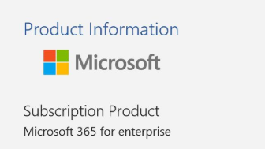

# <a name="determine-if-centralized-deployment-of-add-ins-works-for-your-organization"></a>Bepalen of gecentraliseerde implementatie van invoegtoepassingen werkt voor uw organisatie

Gecentraliseerde implementatie is de aanbevolen en meest functierijke manier voor de meeste klanten om Office-invoegtoepassingen te implementeren voor gebruikers en groepen binnen uw organisatie. Als u een beheerder bent, gebruikt u deze richtlijnen om te bepalen of uw tenant en gebruikers voldoen aan de vereisten, zodat u gecentraliseerde implementatie gebruiken.
Gecentraliseerde implementatie ondersteunt drie desktopplatforms Windows, Mac en Online Office-apps. Gecentraliseerde implementatie ondersteunt ook iOS en Android (alleen outlook-mobiele invoegtoepassingen).
Het kan maximaal 24 uur duren voordat een invoegtoepassing aan alle gebruikers wordt weergegeven.
  
## <a name="requirements"></a>Vereisten

Voor gecentraliseerde implementatie van invoegtoepassingen moet de gebruikers Microsoft 365 Apps voor bedrijven gebruiken (en zijn aangemeld bij Office met hun organisatie-ID) en beschikken over Exchange Online- en actieve Exchange Online-postvakken. Uw abonnementsmap moet zich bevinden of worden gefedereerd naar Azure Active Directory.
U hieronder specifieke vereisten voor Office en Exchange bekijken of de [gecentraliseerde implementatiecompatibiliteitscontrole](https://docs.microsoft.com/office365/admin/manage/centralized-deployment-of-add-ins?view=o365-worldwide#office-365-centralized-deployment-compatibility-checker)gebruiken.

Gecentraliseerde implementatie biedt geen ondersteuning voor het volgende:
  
- Invoegtoepassingen die zijn gericht op Word, Excel of PowerPoint in Office 2013 
- Een on-premises adreslijstservice
- Invoegtoepassing voor een Exchange On-Prem-postvak
- Implementatie van invoegtoepassingen op SharePoint  
- Teams-apps
- Implementatie van COM- (Component Object Model) of VSTO-invoegtoepassingen (Visual Studio Tools for Office)
- Implementaties van Microsoft 365 die geen Exchange bevatten, zoals Microsoft 365 Apps voor bedrijven

### <a name="office-requirements"></a>Office-vereisten

- Voor Word-, Excel- en PowerPoint-invoegtoepassingen moeten uw gebruikers een van de volgende opties gebruiken:
  - Op een Windows-apparaat, versie 1704 of hoger van Microsoft 365 Apps voor bedrijven.
  - Op een Mac, versie 15.34 of hoger.

- Voor Outlook moeten uw gebruikers een van de volgende opties gebruiken: 
  - Versie 1701 of later van Microsoft 365 Apps voor bedrijven.
  - Versie 1808 of hoger van Office Professional Plus 2019 of Office Standard 2019.
  - Versie 16.0.4494.1000 of hoger van Office Professional Plus 2016 (MSI) of Office Standard 2016 (MSI)\*
  - Versie 15.0.4937.1000 of hoger van Office Professional Plus 2013 (MSI) of Office Standard 2013 (MSI)\*
  - Versie 16.0.9318.1000 of hoger van Office 2016 voor Mac 
- Versie 2.75.0 of hoger van Outlook mobile voor iOS 
- Versie 2.2.145 of hoger van Outlook mobile voor Android 
    
    *MSI-versies van Outlook tonen door beheerders geïnstalleerde invoegtoepassingen op het juiste Outlook-lint, niet in de sectie Mijn invoegtoepassingen.
    

#### <a name="find-out-if-microsoft-365-apps-for-enterprise-is-installed"></a>Ontdek of Microsoft 365 Apps for Enterprise is geïnstalleerd

Als u Microsoft 365 Apps voor bedrijven wilt gebruiken, moet een gebruiker een Microsoft 365-account hebben en moet een licentie zijn toegewezen. Zie [Overzicht van Microsoft 365-apps voor bedrijven voor](https://go.microsoft.com/fwlink/p/?linkid=846328)meer informatie.

De eenvoudigste manier om te detecteren of een gebruiker Microsoft 365 Apps for enterprise heeft geïnstalleerd en onlangs heeft gebruikt, is door het Microsoft Office Activations-rapport te gebruiken, dat beschikbaar is in het Microsoft 365-beheercentrum. Het rapport bevat een lijst met alle gebruikers die Microsoft 365 Apps voor bedrijven hebben geactiveerd in de afgelopen 7 dagen, 30 dagen, 90 dagen of 180 dagen. Voor gecentraliseerde implementatiedoeleinden zijn de bureaubladactiveringen voor Windows of Mac de belangrijke kolommen in het rapport. U kunt het rapport exporteren naar Excel. Zie [Microsoft 365-rapporten in het beheercentrum - Microsoft Office-activeringen voor](../activity-reports/microsoft-office-activations.md)meer informatie over het rapport .
  
Als u het rapport Activeringen niet wilt gebruiken, u een gebruiker vragen een Office-toepassing zoals Word op zijn of haar computer te openen en **vervolgens Bestandsaccount** \> **Account**kiezen. Zie onder **Productgegevens** **Abonnementsproduct** en **Microsoft 365 voor bedrijven,** zoals in de volgende afbeelding wordt weergegeven.


  
Zie Tips voor [probleemoplossing voor Microsoft 365-apps voor bedrijven voor](https://go.microsoft.com/fwlink/p/?linkid=846339)hulp bij Microsoft 365 Apps voor bedrijven.


### <a name="exchange-online-requirements"></a>Vereisten voor Exchange Online

Microsoft Exchange slaat de invoegtoepassingsmanifesten op in de tenant van uw organisatie. De beheerder die invoegtoepassingen implementeert en de gebruikers die deze invoegtoepassingen ontvangen, moeten zich op een versie van Exchange Online hebben geplaatst die OAuth-verificatie ondersteunt.
  
Check with your organization's Exchange admin to find out which configuration is in use. OAuth connectivity per user can be verified by using the [Test-OAuthConnectivity](https://go.microsoft.com/fwlink/p/?linkid=846351) PowerShell cmdlet. 


### <a name="centralized-deployment-compatibility-checker"></a>Gecentraliseerde implementatiecompatibiliteitscontrole

Met de gecentraliseerde implementatiecompatibiliteitscontrole u controleren of de gebruikers op uw tenant zijn ingesteld om gecentraliseerde implementatie voor Word, Excel en PowerPoint te gebruiken. De compatibiliteitscontrole is niet vereist voor ondersteuning voor Outlook. Download [hier](https://aka.ms/officeaddindeploymentorgcompatibilitychecker) de compatibiliteitscontrole.
  
#### <a name="run-the-compatibility-checker"></a>De compatibiliteitscontrole uitvoeren
  
1. Start een verhoogd PowerShell.exe-venster.
    
2. Voer de volgende opdracht uit:

```powershell
Import-Module O365CompatibilityChecker
```
    
3. Voer de opdracht **Aanroepen-CompatabilityCheck** uit:

```powershell
Invoke-CompatibilityCheck
```
   die u vraagt om *_TenantDomain_* (bijvoorbeeld *TailspinToysIncorporated.onmicrosoft. </span> com)* en *_TenantAdmin-referenties_* (gebruik uw globale beheerdersreferenties) en vraagt vervolgens toestemming.
    
> [!NOTE]
> Afhankelijk van het aantal gebruikers in uw tenant, kan het afronden van de controle minuten of uren in beslag nemen. 
  
Als het hulpprogramma is uitgevoerd, wordt een uitvoerbestand gegenereerd in een CSV-indeling (door komma's gescheiden). Het bestand wordt standaard opgeslagen in **C:\windows\system32.** Het uitvoerbestand bevat de volgende gegevens:
  
- Gebruikersnaam
    
- Gebruikers-id (e-mailadres van de gebruiker)
    
- Geschikt voor Gecentraliseerde implementatie (als de overige items waar zijn)
    
- Office-abonnement - Het office-abonnement waarvoor ze een licentie hebben
    
- Office geactiveerd (als Office is geactiveerd)
    
- Ondersteund postvak (als er een OAuth-postvak wordt gebruikt)


  
## <a name="user-and-group-assignments"></a>Toewijzingen van gebruikers en groepen

De functie Gecentraliseerde implementatie ondersteunt momenteel de meeste groepen die worden ondersteund door Azure Active Directory, waaronder Microsoft 365-groepen, distributielijsten en beveiligingsgroepen.
  
> [!NOTE]
> Niet door e-mail ingeschakelde beveiligingsgroepen worden momenteel niet ondersteund. 
  
Gecentraliseerde implementatie ondersteunt toewijzingen aan individuele gebruikers, groepen en iedereen in de tenant. Gecentraliseerde implementatie ondersteunt gebruikers in groepen op het hoogste niveau of groepen zonder bovenliggende groepen, maar niet gebruikers in geneste groepen of groepen die bovenliggende groepen hebben.
   
Take a look at the following example where Sandra, Sheila, and the Sales Department group are assigned to an add-in. Because the West Coast Sales Department is a nested group, Bert and Fred aren't assigned to an add-in.
  


   
### <a name="find-out-if-a-group-contains-nested-groups"></a>Controleren of een groep geneste groepen bevat

De gemakkelijkste manier om te controleren of een groep geneste groepen bevat, is het visitekaartje van de groep in Outlook te bekijken. Als u de groepsnaam invoert in het veld **Aan** van een e-mail en vervolgens de groepsnaam selecteert wanneer deze is opgelost, wordt u weergegeven of deze gebruikers of geneste groepen bevat. In het onderstaande voorbeeld toont het tabblad **Leden** van het Outlook-visitekaartje voor de Testgroep geen gebruikers en slechts twee subgroepen. 
  

  
You can do the opposite query by resolving the group to see if it's a member of any group. In the example below, you can see under the **Membership** tab of the Outlook contact card that Sub Group 1 is a member of the Test Group. 
  

  
Alternately, you can use the Azure Active Directory Graph API to run queries to find the list of groups within a group. For more information, see [Operations on groups | Graph API reference](https://go.microsoft.com/fwlink/p/?linkid=846342).
  
### <a name="contacting-microsoft-for-support"></a>Contact opnemen met Microsoft voor ondersteuning

Als u of uw gebruikers problemen ondervinden bij het laden van de invoegtoepassing tijdens het gebruik van Office-apps voor het web (Word, Excel, enz.), die centraal zijn geïmplementeerd, moet u mogelijk contact opnemen met microsoft-ondersteuning[(lees hoe).](../contact-support-for-business-products.md) Geef de volgende informatie over uw Microsoft 365-omgeving op in het ondersteuningsticket.
  
|**Platform**|**Foutopsporingsgegevens**|
|:-----|:-----|
|Office  <br/> | Charles/Fiddler-logboeken  <br/>  Tenant-ID ( [meer informatie over hoe](https://docs.microsoft.com/onedrive/find-your-office-365-tenant-id.aspx))  <br/>  CorrelatieID. Bekijk de bron van een van de kantoorpagina's en zoek naar de waarde Correlatie-id en stuur deze naar ondersteuning:  <br/>`<input name=" **wdCorrelationId**" type="hidden" value=" **{BC17079E-505F-3000-C177-26A8E27EB623}**">`  <br/>  `<input name="user_id" type="hidden" value="1003bffd96933623"></form>`  <br/> |
|Uitgebreide clients (Windows, Mac)  <br/> | Charles/Fiddler-logboeken  <br/>  Nummers van de client-app maken (bij voorkeur als screenshot van **Bestand/account)**  <br/> |
   

