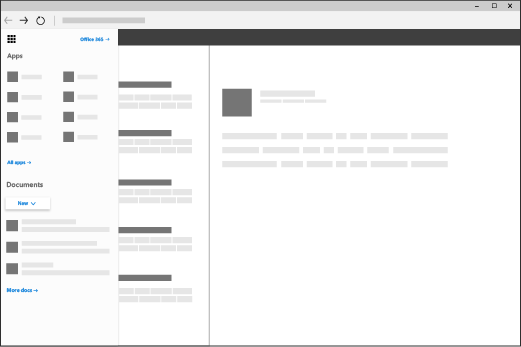

# Aangepaste tegels toevoegen aan het startprogramma voor apps

::: moniker range="o365-21vianet"

> [!NOTE]
> Het beheercentrum wordt gewijzigd. Als de informatie die hier wordt weergegeven, niet overeenkomt met wat u gewend bent, raadpleegt u [Over het nieuwe Microsoft 365-beheercentrum](https://docs.microsoft.com/microsoft-365/admin/microsoft-365-admin-center-preview?view=o365-21vianet).

::: moniker-end

In Microsoft 365 u snel en eenvoudig naar uw e-mail, agenda's, documenten en apps gaan met behulp van de app-launcher[(meer informatie).](https://support.microsoft.com/office/79f12104-6fed-442f-96a0-eb089a3f476a) Dit zijn apps die u krijgt met Microsoft 365 en aangepaste apps die u toevoegt vanuit de [SharePoint Store](https://support.microsoft.com/office/dd98e50e-d3db-4ecb-9bb7-82b189822d43) of [Azure AD.](https://msdn.microsoft.com/office/office365/howto/connect-your-app-to-o365-app-launcher)
  
U kunt aan het startprogramma voor apps uw eigen aangepaste tegels toevoegen die verwijzen naar SharePoint-sites, externe sites, oude apps en meer. De aangepaste tegel verschijnt onder **Alle** apps in het startprogramma voor apps, maar u kunt de tegel vastmaken aan de **Start**-apps en uw gebruikers instructies geven dit ook te doen. Hierdoor kunt u eenvoudig sites, apps en resources vinden die relevant zijn bij het uitvoeren van uw taken. In het onderstaande voorbeeld wordt een aangepaste tegel gebruikt met de naam 'Contoso Portal' voor toegang tot de SharePoint-intranetsite van een organisatie. 
  

  
## Een aangepaste tegel toevoegen aan het startprogramma voor apps

1. Ga in het beheercentrum naar **de**  >  **instellingeninstellingen voor organisatie en** kies het tabblad **Organisatieprofiel.**
    
2. Kies op het tabblad **Organisatieprofiel** de optie **Tegels voor aangepaste app-startprogramma's**.
  
3. Selecteer **Een aangepaste tegel toevoegen**. 
  
4. Typ in het vak **Tegelnaam** een naam voor de nieuwe tegel. Deze naam wordt weergegeven in de tegel. 
    
5. Voer een **URL van de website** voor de tegel in. Dit is de locatie waar u wilt dat uw gebruikers naartoe gaan wanneer ze de tegel op het startprogramma voor apps selecteren. Https gebruiken in de URL. TIP: Als u een tegel maakt voor een SharePoint-site, navigeert u naar die site, kopieert u de URL en plakt u deze hier. De URL van uw standaardteamsite ziet er als volgt uit:`https://<company_name>.sharepoint.com` 
  
6. Voer een **URL van de afbeelding** voor de tegel in. De afbeelding wordt weergegeven op de pagina Mijn apps en het startprogramma voor apps. TIP: De afbeelding moet 60x60 pixels hebben en beschikbaar zijn voor iedereen in uw organisatie zonder verificatie.

7. Voer een **Beschrijving** in voor de tegel. Dit zie je wanneer u de tegel op de pagina Mijn apps selecteert en **App-details**selecteert. 
  
8. Selecteer **Wijzigingen opslaan** om de aangepaste tegel te maken. 
    
U en uw gebruikers zien nu de aangepaste tegel in het startprogramma voor apps op het tabblad **Alle**. 
  
## De tegel promoten bij app-launcher

1. Selecteer het pictogram voor het startprogramma voor apps en selecteer het **pictogram Alle apps**. 
    
2. Zoek de nieuwe tegel voor uw app, selecteer de ellips en kies **Vastmaken aan het startprogramma**.
  
    > [!NOTE]
    > Als u de aangepaste tegel niet ziet die in de vorige stappen is gemaakt, controleer dan of er een Exchange Online-postvak aan u is toegewezen en of u zich ten minste één keer bij uw postvak hebt aangemeld. Deze stappen zijn vereist voor aangepaste tegels in Microsoft 365. 
  
> [!IMPORTANT]
> Zowel u als uw gebruikers moeten deze stappen uitvoeren om aangepaste tegels te promoveren van de pagina Mijn apps naar het startprogramma voor apps. 
  
## Edit or delete a custom tile

1. Ga in het beheercentrum naar het profiel van de organisatie van **instellingen**  >  **Org Settings**  >  **instellingen.** </a>
    
2. Selecteer **bewerken**op de pagina **Organisatieprofiel** naast **Aangepaste tegels toevoegen voor uw organisatie.**

3. Werk de **Tegelnaam**, **URL**, **Beschrijving** of **Afbeeldings-URL** voor de aangepaste tegel bij (zie [Een aangepaste tegel toevoegen aan het startprogramma voor apps](#add-a-custom-tile-to-the-app-launcher)).
    
4. Selecteer **Update** \> **Sluiten bijwerken**. 
    
Als u een aangepaste tegel wilt verwijderen, selecteert u in het venster **Aangepaste tegels** de tegel en selecteert u **Tegel**verwijderen verwijderen  >  **Delete**. 
  
## En nu?

Naast het toevoegen van tegels aan het startprogramma voor apps, u tegels voor app-startprogramma's toevoegen aan de navigatiebalk[(meer informatie).](https://support.microsoft.com/office/eb34a21b-52fa-4fbf-a8d5-146132242985) Zie Het [Microsoft 365-thema aanpassen](../setup/customize-your-organization-theme.md)als u het uiterlijk van Microsoft 365 wilt aanpassen aan het merk van uw organisatie.
  

