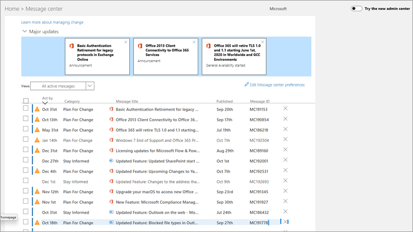

# Berichten in het berichtencentrum beheren

Message center posts are important announcements about new and changed features. This article provides more information about the things you can do with messages to help with change management in your organization.
  
## Een bericht lezen

Als u naar het berichtencentrum wilt gaan, gaat u naar het [beheercentrum](https://go.microsoft.com/fwlink/p/?linkid=2024339)en selecteert u **Health**  >  **Gezondheidsberichtcentrum**. 

Selecteer een berichttitel om het bericht te openen in het leesvenster. Elk bericht bevat een overzicht van de wijziging, een overzicht van hoe de wijziging van invloed kan zijn op u, informatie over hoe u uw organisatie voorbereiden op de wijziging en (in de meeste gevallen) een aanvullende informatiekoppeling waar u meer informatie vinden. De aanvullende informatie blijft beschikbaar, zelfs nadat een bericht is verlopen.

## Filteren en sorteren

::: moniker range="o365-worldwide"

Gebruik het vervolgkeuzemenu **Filter** om een gefilterde weergave van berichten te selecteren.

U een kolomkop selecteren om berichten in oplopende of aflopende volgorde te sorteren. In dit diagram zijn de berichten bijvoorbeeld gesorteerd op de datum **Actie nemen vóór**.

::: moniker-end

::: moniker range="o365-germany"

Gebruik het vervolgkeuzemenu **Weergaven** om een gefilterde weergave van berichten te selecteren. 
 
U een kolomkop selecteren om berichten in oplopende of aflopende volgorde te sorteren. In deze illustratie worden de berichten bijvoorbeeld gesorteerd op datum **van de wet.**

::: moniker-end

::: moniker range="o365-21vianet"

Gebruik het vervolgkeuzemenu **Weergaven** om een gefilterde weergave van berichten te selecteren. 
 
U een kolomkop selecteren om berichten in oplopende of aflopende volgorde te sorteren. In deze illustratie worden de berichten bijvoorbeeld gesorteerd op datum **van de wet.**

::: moniker-end

## Feedback geven op een bericht

In het berichtencentrum u een bericht selecteren om details te bekijken.

Als u feedback wilt geven over het bericht, selecteert u het pictogram **Vind ik leuk** of niet **leuk** en geeft u feedback in het tekstvak dat wordt weergegeven. Geef geen persoonlijke informatie. U optioneel **selecteren Het is OK om contact met mij op te nemen over deze feedback** en vervolgens Te selecteren **Verzenden**.

## Een bericht delen

Ziet u een bericht waarvoor iemand anders actie moet ondernemen? U kunt de inhoud van het bericht per e-mail delen met elke gebruiker:
  
1. Selecteer het bericht om het bericht te openen en selecteer **Vervolgens Delen**.
  
2. Als u het bericht wilt delen, voert u maximaal twee e-mailadressen in die door een dubbele punt zijn gescheiden. U e-mailadressen naar het individu verzenden en groeperen. Optioneel u ervoor kiezen om een kopie van het bericht per e-mail te ontvangen (het bericht gaat naar uw primaire e-mailadres) of een persoonlijk bericht toe te voegen om ontvangers meer context te bieden.
  
3. Selecteer **Delen** om de e-mail te verzenden.
    
## Koppeling ophalen

Wilt u zorgen dat een andere beheerder op de hoogte is van een wijziging en hierop actie onderneemt? U kunt een koppeling genereren om het bericht te delen via e-mail of een chatprogramma, zodat de gebruiker rechtstreeks verbinding krijgt met dat bericht. De persoon met wie u de koppeling deelt, moet een beheerder zijn in Microsoft 365 voor uw organisatie of deze heeft geen toegang tot het gekoppelde bericht.

::: moniker range="o365-worldwide"

1. Selecteer het bericht om het bericht te openen.

2. Selecteer het pictogram **Koppeling Kopiëren naar Klembord** (koppeling).

3. Zorg dat de webpagina toegang heeft tot het klembord. Er wordt een directe koppeling naar het Klembord gekopieerd.

4. Gebruik Ctrl+V of klik met de rechtermuisknop en selecteer **Plakken** om de koppeling in te voegen.

::: moniker-end

::: moniker range="o365-germany"

1. Selecteer het bericht om het bericht te openen.

2. Kies **Meer** \> **Een koppeling ophalen** op de actiebalk.

3. Zorg dat de webpagina toegang heeft tot het klembord. Er wordt een directe koppeling naar het Klembord gekopieerd.

4. Gebruik Ctrl+V of klik met de rechtermuisknop en selecteer **Plakken** om de koppeling in te voegen.

::: moniker-end

::: moniker range="o365-21vianet"

1. Selecteer het bericht om het bericht te openen.

2. Kies **Meer** \> **Een koppeling ophalen** op de actiebalk.

3. Zorg dat de webpagina toegang heeft tot het klembord. Er wordt een directe koppeling naar het Klembord gekopieerd.

4. Gebruik Ctrl+V of klik met de rechtermuisknop en selecteer **Plakken** om de koppeling in te voegen.

::: moniker-end

## Status Gelezen en Ongelezen

Een ongelezen bericht in het berichtencentrum wordt vetgedrukt weergegeven. Wanneer u een bericht opent, wordt het gemarkeerd als gelezen. U een bericht markeren als ongelezen.

::: moniker range="o365-worldwide"

1. Selecteer op de hoofdpagina van het berichtencentrum een bericht.

2. Selecteer boven aan het bericht het pictogram **Markeren als ongelezen** (envelop).
  
::: moniker-end

::: moniker range="o365-germany"

1. Selecteer het bericht om het bericht te openen.

2. Selecteer **Meer** \> **Markeren als ongelezen**.

3. Sluit het bericht.

::: moniker-end

::: moniker range="o365-21vianet"

1. Selecteer het bericht om het bericht te openen.

2. Selecteer **Meer** \> **Markeren als ongelezen**.

3. Sluit het bericht.

::: moniker-end

## Archiveren en herstellen

Als u een bericht ziet dat niet op u betrekking heeft, of als u er al op hebt gereageerd, u het bericht archiveren om het bericht te verwijderen uit de weergave Berichtencentrum. De weergave die u in het Berichtencentrum ziet, is specifiek voor uw gebruikersaccount, zodat het archiveren vanuit uw weergave geen invloed heeft op andere beheerders.

::: moniker range="o365-worldwide"

- Selecteer op de hoofdpagina van het berichtencentrum een bericht en selecteer **Vervolgens Archief** boven de lijst met berichten.

- Open het bericht en selecteer **Vervolgens Archief** onder aan het bericht.

Wilt u een gearchiveerd bericht terugkrijgen? Geen probleem.
  
1. Selecteer het tabblad **Gearchiveerde berichten** boven aan het berichtencentrum. Er verschijnt een lijst met gearchiveerde berichten. 

2. Selecteer het bericht, selecteer **Herstellen**en het bericht wordt hersteld naar actieve berichten.

::: moniker-end

::: moniker range="o365-germany"

Er zijn twee manieren om een bericht te archiveren.
  
- Selecteer de X die rechts van de bericht-id wordt weergegeven. Het bericht wordt verwijderd uit uw lijst. Of:

- Open het bericht en selecteer **Archief** boven aan het bericht.

Wilt u een genegeerd bericht weer terughalen? Geen probleem.
  
1. Selecteer het filter **Gearchiveerde berichten** in het vervolgkeuzemenu **Weergaven.** Er verschijnt een lijst met gearchiveerde berichten.

2. Selecteer Rechts van de bericht-id **herstellen** en het bericht wordt hersteld naar actieve berichten.

::: moniker-end

::: moniker range="o365-21vianet"

Er zijn twee manieren om een bericht te archiveren.
  
- Selecteer de X die rechts van de bericht-id wordt weergegeven. Het bericht wordt verwijderd uit uw lijst. Of:

- Open het bericht en selecteer **Archief** boven aan het bericht.

Wilt u een gearchiveerd bericht terugkrijgen? Geen probleem.
  
1. Selecteer het filter **Gearchiveerde berichten** in het vervolgkeuzemenu **Weergaven.** Er verschijnt een lijst met gearchiveerde berichten.

2. Selecteer Rechts van de bericht-id **herstellen** en het bericht wordt hersteld naar actieve berichten.

::: moniker-end

Zie [Berichtencentrum in Microsoft 365](message-center.md)voor een overzicht van Berichtencentrum. Of zie [Taalvertaling voor berichten in het berichtencentrum voor](language-translation-for-message-center-posts.md)het instellen van uw taalvoorkeuren voor het inschakelen van machinevertaling voor berichten in het berichtencentrum. Als u een alternatieve manier wilt programmeren om realtime bedrijfsstatusinformatie en Berichtencentrumcommunicatie te krijgen, raadpleegt u [microsoft 365 Service Communications API Overview](https://go.microsoft.com/fwlink/p/?linkid=848507).
  
