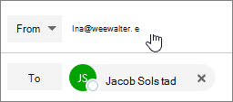

# E-mail als een distributielijst verzenden in Office 365Send email as a distribution list in Office 365

In Office 365 kunt u e-mail als een distributielijst verzenden. Wanneer een persoon die lid is van de distributielijst reageert op een bericht dat is verzonden naar de distributielijst, lijkt het alsof het e-mailbericht afkomstig is van de distributielijst en niet van de afzonderlijke gebruiker. In dit onderwerp leest u hoe u dit kunt doen.In Office 365, you can send email as a distribution list. When a person who is a member of the distribution list replies to a message sent to the distribution list, the email appears to be from the distribution list, not from the individual user. This topic shows you how to do this.
  
## E-mail verzenden als distributielijstSend email as a distribution list

Voordat u deze stappen uitvoert, moet u ervoor zorgen dat u bent toegevoegd aan een Office 365-distributielijst en dat u Verzenden als toestemming hebt gekregen.Before you perform these steps, make sure you've been added to an Office 365 distribution list and you've have been granted Send as permission on it.
  
 **Beheerders:** zorg ervoor dat u de stappen hebt gevolgd in de [Office 365-gebruiker of contactpersoon voor een lijst toevoegen](../email/add-user-or-contact-to-distribution-list.md) en leden toestaan e-mail te verzenden als onderwerpen in de Office [365-groep](../create-groups/allow-members-to-send-as-or-send-on-behalf-of-group.md#allow-members-to-send-email-as-a-group) en de juiste personen aan de distributielijst hebt toegevoegd.**Admins**: Make sure you've followed the steps in the [Add an Office 365 user or contact to a list](../email/add-user-or-contact-to-distribution-list.md) and [Allow members to send email as an Office 365 Group](../create-groups/allow-members-to-send-as-or-send-on-behalf-of-group.md#allow-members-to-send-email-as-a-group) topics, and added the correct people to the distribution list.
  
1. Open de webversie van Outlook en ga naar uw postvak.Open Outlook on the web and go to your inbox. 
    
2. Open een bericht dat naar de distributielijst is verzonden.Open a message that was sent to the distribution list. 
    
3. Selecteer **Beantwoorden**.Select **Reply**. 
    
4. Selecteer onder aan het bericht **Meer** \> **weergeven van**.At the bottom of the message, select **More** \> **Show from**.  
  
5. Klik met de rechtermuisknop op `Ina@weewalter.me` het Van-adres - zoals - en kies **Verwijderen**.Right-click on the From address - such as `Ina@weewalter.me` - and choose **Remove**.  
  
6. Vervolgens typt u het adres van de distributielijst, zoals support@contoso.com, en verstuurt u het bericht.Then type the distribution list address such as support@contoso.com, and send the message. De volgende keer dat u vanuit de distributielijst antwoordt, wordt het adres als optie weergegeven in de lijst **Van.**The next time you reply from the distribution list, its address will appear as an option in the **From** list. 
  

