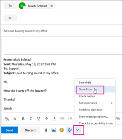
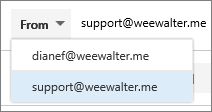

# E-mail verzenden als distributielijst

In Microsoft 365 kunt u e-mail verzenden als distributielijst. Wanneer een persoon die lid is van de distributielijst reageert op een bericht dat is verzonden naar de distributielijst, lijkt het alsof het e-mailbericht afkomstig is van de distributielijst en niet van de afzonderlijke gebruiker. In dit onderwerp leest u hoe u dit kunt doen.
  
## Voordat u begint

Voordat u deze stappen uit te voeren, zorg ervoor dat u bent toegevoegd aan een Microsoft 365 distributielijst en u hebt gekregen Verzenden als machtiging.
  
 **Beheerders:** Zorg ervoor dat u de stappen hebt gevolgd in de gebruiker [of contactpersoon](../email/add-user-or-contact-to-distribution-list.md) van een Microsoft 365 toevoegen aan een lijst en Toestaan dat leden e-mail verzenden als een [Microsoft 365 Groepsonderwerpen](../../solutions/allow-members-to-send-as-or-send-on-behalf-of-group.md#allow-members-to-send-email-as-a-group) en de juiste personen aan de distributielijst hebben toegevoegd.
  
## Webversie van Outlook

1. Open de webversie van Outlook en ga naar uw postvak. 
    
2. Open een bericht dat naar de distributielijst is verzonden. 
    
3. Selecteer **Beantwoorden.** 
    
4. Selecteer onder aan het bericht **De** optie \> **Meer tonen van**.  
  
5. Klik met de rechtermuisknop op het Van-adres , zoals `Ina@weewalter.me` - en kies **Verwijderen.**  
  
6. Vervolgens typt u het adres van de distributielijst, zoals support@contoso.com, en verstuurt u het bericht. De volgende keer dat u vanuit de distributielijst antwoordt, wordt het adres weergegeven als een optie in de **lijst Van.** 

## Outlook

1. Open Outlook bureaubladclient.

2. Een nieuw e-mailbericht opstellen. Klik op **het veld Van** en selecteer Ander **e-mailadres.** Als u het veld Van niet ziet, gaat u naar **Opties** en **selecteert** u Van in de sectie Velden tonen.

3. Selecteer het **adres van de distributielijst** in de algemene adreslijst.

4. Verzend de e-mail.

## Verwante inhoud

[Een beveiligingsgroep maken, bewerken](../email/create-edit-or-delete-a-security-group.md) of verwijderen in de Microsoft 365-beheercentrum (artikel)\
[E-mailsamenwerking](../email/email-collaboration.md) (artikel)\
[Een gebruiker of contactpersoon toevoegen aan een distributiegroep](../email/add-user-or-contact-to-distribution-list.md) (artikel)