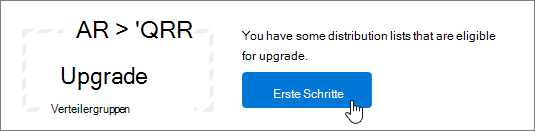
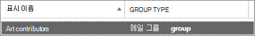

# <a name="upgrade-distribution-lists-to-microsoft-365-groups-in-outlook"></a>Distributielijsten upgraden naar Microsoft 365 groepen in Outlook

U kunt distributielijsten upgraden naar Microsoft 365 Groepen in Outlook. Dit is een geweldige manier om de distributielijsten van uw organisatie te voorzien van alle functies en functionaliteit van Microsoft 365 Groepen. [Waarom u uw distributielijsten moet upgraden naar groepen in Outlook](https://support.microsoft.com/office/7fb3d880-593b-4909-aafa-950dd50ce188)

U kunt distributielijsten een voor een of allemaal tegelijk upgraden.

## <a name="upgrade-one-or-many-distribution-list-groups-to-microsoft-365-groups-in-outlook"></a>Een of meer distributielijstgroepen upgraden naar Microsoft 365 groepen in Outlook

U moet een globale beheerder of beheerder Exchange om een distributielijstgroep te upgraden. Als u wilt upgraden Microsoft 365 groepen, moet de distributielijstgroep een eigenaar met een postvak hebben.

### <a name="use-the-new-eac-to-upgrade-one-or-many-distribution-list-groups-to-microsoft-365-groups-in-outlook"></a>Gebruik de nieuwe EAC om een of meer distributielijstgroepen te upgraden naar Microsoft 365 Groepen in Outlook

1. Ga naar het nieuwe [Exchange beheercentrum](https://admin.exchange.microsoft.com)en ga naar  \> **Geadresseerdengroepen.**

2. Selecteer de distributielijstgroep (ook wel **een** distributiegroep genoemd) die u wilt upgraden naar Microsoft 365 groep op de **pagina** Groepen.

3. Selecteer de **distributiegroep Upgrade op** de werkbalk.

4. Klik in het dialoogvenster **Klaar om te upgraden?** op **Upgrade**. Het proces begint onmiddellijk. Afhankelijk van de grootte en het aantal distributielijstgroepen dat u aan het upgraden bent, kan het proces minuten of uren duren.

> [!NOTE]
> Een banner bovenaan geeft aan dat de upgrade is uitgevoerd, bijvoorbeeld *distributiegroep(en) is bijgewerkt. Het duurt 5 minuten om de wijzigingen weer te geven. Filter op Microsoft 365 groepen om de bijgewerkte distrubtiegroepen(s) te zien.*

### <a name="use-the-classic-eac-to-upgrade-one-or-many-distribution-list-groups-to-microsoft-365-groups-in-outlook"></a>Gebruik de klassieke EAC om een of meer distributielijstgroepen te upgraden naar Microsoft 365 groepen in Outlook

1. Ga naar het klassieke <a href="https://go.microsoft.com/fwlink/p/?linkid=2059104" target="_blank">Exchange beheercentrum</a>.

2. Ga in het Exchange beheercentrum naar **Geadresseerdengroepen.** \> <br/>U ziet een melding waarin wordt aangegeven dat u distributielijsten (ook wel distributiegroepen **genoemd)** hebt die in aanmerking komen voor een upgrade naar Microsoft 365 Groepen.<br/> 

3. Selecteer een of meer distributielijsten (ook wel een **distributiegroep** genoemd) op de **pagina Groepen.**<br/>

4. Selecteer het upgradepictogram.<br/>

5. Selecteer ja in het dialoogvenster Informatie **om** de upgrade te bevestigen. Het proces begint onmiddellijk. Afhankelijk van de grootte en het aantal DL's dat u aan het upgraden bent, kan het proces minuten of uren duren.<br/>Als de distributielijst niet kan worden geüpgraded, wordt er een dialoogvenster geopend waarin dit wordt aangegeven. Zie [Welke distributielijsten kunnen niet worden bijgewerkt?](#which-distribution-lists-cant-be-upgraded).

6. Als u meerdere distributielijsten bij wilt werken, gebruikt u de vervolgkeuzelijst om te filteren welke distributielijsten zijn bijgewerkt. Als de lijst niet is voltooid, wacht  u nog even en selecteert u Vernieuwen om te zien wat er is bijgewerkt.<br/>Er wordt niet gemeld wanneer het upgradeproces is voltooid voor alle distributielijsten die u hebt geselecteerd. U kunt dit zien door te bekijken wat wordt weergegeven onder **Beschikbaar voor upgrade** of **Upgraded DLs** (Geüpgradede distributielijsten).

7. Als u een DL voor upgrade hebt geselecteerd, maar deze nog steeds op de pagina wordt weergegeven als Beschikbaar om te upgraden, is de upgrade mislukt. Zie [Wat u moet doen als de upgrade niet werkt](#what-to-do-if-the-upgrade-doesnt-work).

> [!NOTE]
> Als u samenvattings-e-mails van de groep ontvangt, wordt er soms onderaan vermeld dat u distributielijsten waarvan u eigenaar bent, kunt upgraden. Zie [Have a group conversation in Outlook](https://support.microsoft.com/office/a0482e24-a769-4e39-a5ba-a7c56e828b22) (Een groepsgesprek hebben in Outlook) voor meer informatie over samenvattings-e-mails.

## <a name="what-to-do-if-the-upgrade-doesnt-work"></a>Wat u moet doen als de upgrade niet werkt

Distributielijsten die niet kunnen worden geüpgraded, blijven ongewijzigd.

Als een of meer **in aanmerking komende** distributielijsten niet kunnen worden geüpgraded, opent u een [ondersteuningsticket](../../business-video/get-help-support.md). Het probleem moet worden geëscaleerd naar het team Groups Engineering zodat zij kunnen uitzoeken wat het probleem is.

Het is mogelijk dat de distributielijst niet is bijgewerkt vanwege een servicestoring, maar onwaarschijnlijk. U kunt ook even wachten en vervolgens opnieuw proberen de distributielijst te upgraden.

## <a name="how-to-use-powershell-to-upgrade-several-distribution-lists-at-the-same-time"></a>PowerShell gebruiken om diverse distributielijsten tegelijkertijd te upgraden

Als u een ervaren PowerShell-gebruiker bent, wilt u misschien PowerShell in plaats van de gebruikersinterface gebruiken. We hebben een set cmdlets die u helpen bij het upgraden van distributielijsten. Zie hieronder.

### <a name="upgrade-a-single-dl"></a>Eén DL upgraden

Voer de volgende opdracht uit om één DL bij te upgraden:

```PowerShell
Upgrade-DistributionGroup -DlIdentities \<Dl SMTP address\>
```

Als u bijvoorbeeld een upgrade wilt uitvoeren van een DL met SMTP-adres dl1@contoso.com, voer dan de volgende opdracht uit:

```PowerShell
Upgrade-DistributionGroup -DlIdentities dl1@contoso.com
```

> [!NOTE]
> U kunt ook één distributielijst upgraden naar een Microsoft 365 groep met de [PowerShell-cmdlet New-UnifiedGroup](/powershell/module/exchange/new-unifiedgroup)

### <a name="upgrade-multiple-dls-in-a-batch"></a>Meerdere DL's in een batch upgraden

U kunt ook meerdere DL's als batch doorgeven en samen upgraden:

```PowerShell
Upgrade-DistributionGroup -DlIdentities \<DL SMTP address1\>, \< DL SMTP address2\>,
\< DL SMTP address3\>, \< DL SMTP address 4\>
```

Als u bijvoorbeeld vijf DL's wilt upgraden met SMTP-adres `dl1@contoso.com` en de volgende opdracht wilt `dl2@contoso.com` `dl3@contoso.com` `dl4@contoso.com` `dl5@contoso.com` uitvoeren:

`Upgrade-DistributionGroup -DlIdentities dl1@contoso.com, dl2@contoso.com, dl3@contoso.com, dl4@contoso.com, dl5@contoso.com`

### <a name="upgrade-all-eligible-dls"></a>Alle in aanmerking komende DL's upgraden

Er zijn twee manieren waarop u alle in aanmerking komende DL's kunt upgraden.

> [!NOTE]
> De Upgrade-DistributionGroup-cmdlet ontvangt geen gegevens uit de pijplijn, om deze reden is het vereist dat de operator 'foreach-object' wordt gebruikt om deze uit {} te voeren.

1. Haal de in aanmerking komende DL's in de tenant op en upgrade ze met de opdracht Upgrade:

```PowerShell
Get-EligibleDistributionGroupForMigration | Foreach-Object{
    Upgrade-DistributionGroup -DlIdentities $_.PrimarySMTPAddress
}
```

2. De lijst met alle DL's en alleen de in aanmerking komende DL's upgraden:

```PowerShell
Get-DistributionGroup| Foreach-Object{
    Upgrade-DistributionGroup -DlIdentities $_.PrimarySMTPAddress
}
```

## <a name="faq-about-upgrading-distribution-lists-to-microsoft-365-groups-in-outlook"></a>Veelgestelde vragen over het upgraden van distributielijsten Microsoft 365 groepen in Outlook

### <a name="which-distribution-lists-cant-be-upgraded"></a>Welke distributielijsten kunnen niet worden bijgewerkt?

U kunt alleen in de cloud beheerde, eenvoudige, niet-geneste distributielijsten upgraden. In de onderstaande tabel worden distributielijsten weergegeven die **NIET kunnen** worden bijgewerkt.

|**Eigenschap**|**Komt in aanmerking?**|
|:-----|:-----|
|On-premises beheerde distributielijst.  <br/> |Nee  <br/> |
|Geneste distributielijsten De distributielijst heeft onderliggende groepen of is lid van een andere groep.  <br/> |Nee  <br/> |
|Distributielijsten met leden **RecipientTypeDetails** andere dan **UserMailbox**, **SharedMailbox**, **TeamMailbox**, **MailUser**  <br/> |Nee  <br/> |
|Distributielijst met meer dan 100 eigenaren  <br/> |Nee  <br/> |
|Distributielijst met alleen leden, maar geen eigenaar  <br/> |Nee  <br/> |
|Distributielijst met aliassen met speciale tekens  <br/> |Nee  <br/> |
|Als de distributielijst als een doorstuuradres voor Gedeeld postvak is geconfigureerd  <br/> |Nee  <br/> |
|Als de DL deel uitmaakt van **Sender Restriction** in een andere DL.  <br/> |Nee  <br/> |
|Beveiligingsgroepen  <br/> |Nee  <br/> |
|Dynamische distributielijsten  <br/> |Nee  <br/> |
|Distributielijsten die zijn geconverteerd **naar RoomLists**  <br/> |Nee  <br/> |
|Distributielijsten **waarin MemberJoinRestriction** en/of **MemberDepartRestriction** is **gesloten**  <br/> |Nee  <br/> |

### <a name="check-which-dls-are-eligible-for-upgrade"></a>Controleren welke DL's in aanmerking komen voor een upgrade

Als u wilt controleren of een DL al dan niet in aanmerking komt, kunt u de onderstaande opdracht uitvoeren:

`Get-DistributionGroup \<DL SMTP address\> | Get-EligibleDistributionGroupForMigration`

Als u wilt controleren welke DL's in aanmerking komen voor een upgrade, voer dan de volgende opdracht uit:

`Get-EligibleDistributionGroupForMigration`

### <a name="who-can-run-the-upgrade-scripts"></a>Wie kan de upgradescripts uitvoeren?

Personen met globale beheerders- of Exchange beheerdersrechten.

### <a name="why-is-the-contact-card-still-showing-a-distribution-list-what-should-i-do-to-prevent-an-upgraded-distribution-list-from-showing-up-in-my-auto-suggest-list"></a>Waarom wordt op het visitekaartje nog steeds een distributielijst weergegeven? Wat moet ik doen om te voorkomen dat een bijgewerkte distributielijst wordt weergegeven in mijn lijst met auto-voorstellen?

- Voor Outlook: Wanneer iemand een e-mail probeert te verzenden in Outlook door de naam van de Microsoft 365-groep te typen na de migratie, wordt de geadresseerde opgelost als de distributielijst in plaats van de groep. Het visitekaartje van de geadresseerde wordt het visitekaartje van de distributielijsten. Dit wordt veroorzaakt door de cache met geadresseerden of de cache met bijnamen in Outlook. De e-mail wordt naar de groep verzonden, maar kan verwarring veroorzaken bij de afzender.<br/>U kunt de stappen in dit artikel, Informatie over de lijst [Outlook automatisch](/outlook/troubleshoot/contacts/information-about-the-outlook-autocomplete-list) aanvullen, uitvoeren om de cache opnieuw in te stellen, waardoor dit probleem wordt opgelost.

- Voor Outlook op internet: in het geval van Outlook op internet, blijft de ontvanger van de distributielijst nog steeds in de cache. U kunt de stappen in Voorgestelde naam of [e-mailadres](https://support.microsoft.com/office/9E1419D9-E88F-445B-B07F-F558B8A37C58) verwijderen uit de lijst Automatisch voltooien volgen om de cache te vernieuwen om het groepscontactkaart te zien.

### <a name="do-new-group-members-get-a-welcome-email-in-their-inbox"></a>Krijgen nieuwe groepsleden een welkomstbericht in hun postvak IN?

Nee. De instelling voor het inschakelen van welkomstberichten is standaard ingesteld op onwaar. Deze instelling geldt voor zowel bestaande als nieuwe groepsleden die kunnen deelnemen nadat de migratie is voltooid. Als de groepseigenaar later gastgebruikers toestaat, ontvangen gastgebruikers geen welkomstbericht in hun postvak IN. Gastleden kunnen het werken met de groep voortzetten.

### <a name="what-if-one-or-some-of-the-dls-are-not-upgraded"></a>Wat gebeurt er als een of meer van de DL's niet worden bijgewerkt?

Er zijn enkele gevallen waarin DL wel in aanmerking komt, maar niet kan worden bijgewerkt. De DL wordt niet bijgewerkt en blijft een DL.

- Waar de beheerder **groepsbeleid** voor e-mailadres heeft toegepast voor de groepen in een organisatie en ze proberen DL's te upgraden die niet voldoen aan de criteria, wordt de DL niet bijgewerkt

- DLs met **MemberJoinRestriction** **of MemberDepartRestriction set** to **Closed**, could not be upgraded

### <a name="what-happens-to-the-dl-if-the-upgrade-from-eac-fails"></a>Wat gebeurt er met de distributielijst als de upgrade vanuit het Exchange-beheercentrum mislukt?

De upgrade vindt alleen plaats als de oproep naar de server wordt verzonden. Als de upgrade mislukt, worden de distributielijsten niet gewijzigd. Ze blijven op dezelfde manier werken.

## <a name="related-content"></a>Verwante onderwerpen

[Groepen vergelijken](../create-groups/compare-groups.md) (artikel)\
[Uitleg over Microsoft 365 groepen aan uw gebruikers](../create-groups/explain-groups-knowledge-worker.md) (artikel)\
[Leden toevoegen of verwijderen uit Microsoft 365 groepen met behulp van het beheercentrum](../create-groups/add-or-remove-members-from-groups.md)