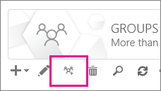

# <a name="upgrade-distribution-lists-to-microsoft-365-groups-in-outlook"></a>Distributielijsten upgraden naar Microsoft 365-groepen in Outlook

U distributielijsten upgraden naar Microsoft 365-groepen met Outlook. Dit is een geweldige manier om de distributielijsten van uw organisatie alle functies en functionaliteit van Microsoft 365-groepen te geven. [Waarom u een upgrade voor uw distributielijsten moet uitvoeren naar groepen in Outlook](https://support.microsoft.com/en-us/office/why-you-should-upgrade-your-distribution-lists-to-groups-in-outlook-7fb3d880-593b-4909-aafa-950dd50ce188)

U kunt distributielijsten een voor een of allemaal tegelijk upgraden.

## <a name="upgrade-one-or-many-distribution-lists-to-microsoft-365-groups-in-outlook"></a>Een of meer distributielijsten upgraden naar Microsoft 365-groepen in Outlook

U moet een globale beheerder of Exchange-beheerder zijn om een distributielijst te upgraden. Als u wilt upgraden naar Microsoft 365-groepen, moet een distributiegroep een eigenaar met een postvak hebben. 

1. Ga naar het <a href="https://go.microsoft.com/fwlink/p/?linkid=2059104" target="_blank">Exchange-beheercentrum</a>.

2. Ga in het Exchange-beheercentrum naar \> **Ontvangersgroepen**. **Recipients**<br/>U ziet een bericht waarin wordt aangegeven dat u distributielijsten (ook **wel distributiegroepen** genoemd) hebt die in aanmerking komen om te worden geüpgraded naar Microsoft 365-groepen.<br/> 

3. Selecteer een of meer distributielijsten (ook wel een **distributiegroep** genoemd) op de pagina **groepen**.<br/>

4. Selecteer het upgradepictogram.<br/>

5. Selecteer in het dialoogvenster Informatie **ja** om de upgrade te bevestigen. Het proces begint onmiddellijk. Afhankelijk van de grootte en het aantal DLs dat u aan het upgraden bent, kan het proces minuten of uren duren.<br/>Als de distributielijst niet kan worden geüpgraded, wordt er een dialoogvenster geopend waarin dit wordt aangegeven. Zie [Welke distributielijsten niet kunnen worden geüpgraded?](#which-distribution-lists-cannot-be-upgraded).

6. Als u meerdere distributielijsten upgradet, gebruikt u de vervolgkeuzelijst om te filteren welke distributielijsten zijn bijgewerkt. Als de lijst niet is voltooid, wacht u nog even en selecteert u **Vernieuwen** om te zien wat is bijgewerkt.<br/>Er wordt niet gemeld wanneer het upgradeproces is voltooid voor alle distributielijsten die u hebt geselecteerd. U kunt dit zien door te bekijken wat wordt weergegeven onder **Beschikbaar voor upgrade** of **Upgraded DLs** (Geüpgradede distributielijsten).

7. Als u een distributielijst voor upgraden hebt geselecteerd maar deze nog steeds wordt weergegeven op de pagina als Beschikbaar voor upgrade, is het upgraden van de distributielijst mislukt. Zie [Wat u moet doen als de upgrade niet werkt](#what-to-do-if-the-upgrade-doesnt-work).

> [!NOTE]
> Als u samenvattings-e-mails van de groep ontvangt, wordt er soms onderaan vermeld dat u distributielijsten waarvan u eigenaar bent, kunt upgraden. Zie [Have a group conversation in Outlook](https://support.microsoft.com/en-us/office/have-a-group-conversation-in-outlook-a0482e24-a769-4e39-a5ba-a7c56e828b22) (Een groepsgesprek hebben in Outlook) voor meer informatie over samenvattings-e-mails.


## <a name="what-to-do-if-the-upgrade-doesnt-work"></a>Wat u moet doen als de upgrade niet werkt

Distributielijsten die niet kunnen worden geüpgraded, blijven ongewijzigd.

Als een of meer **in aanmerking komende** distributielijsten niet kunnen worden geüpgraded, opent u een [ondersteuningsticket](../contact-support-for-business-products.md). Het probleem moet worden geëscaleerd naar het team Groups Engineering zodat zij kunnen uitzoeken wat het probleem is.

Het is mogelijk dat de distributielijst niet is geüpgraded vanwege een serviceonderbreking, maar dit is tamelijk onwaarschijnlijk. U kunt ook even wachten en vervolgens opnieuw proberen de distributielijst te upgraden.

## <a name="how-to-use-powershell-to-upgrade-several-distribution-lists-at-the-same-time"></a>PowerShell gebruiken om diverse distributielijsten tegelijkertijd te upgraden

Als u een ervaren PowerShell-gebruiker bent, wilt u misschien PowerShell in plaats van de gebruikersinterface gebruiken. We hebben een set cmdlets waarmee u distributielijsten upgraden. Zie hieronder.

### <a name="upgrade-a-single-dl"></a>Een enkele DL upgraden

Als u een enkele DL wilt upgraden, voert u de volgende opdracht uit:

`Upgrade-DistributionGroup -DlIdentities \<Dl SMTP address\>`

Als u bijvoorbeeld een DLs wilt upgraden met SMTP-adres dl1@contoso.com, voert u de volgende opdracht uit:

`Upgrade-DistributionGroup -DlIdentities dl1@contoso.com`

> [!NOTE]
> U ook een enkele distributielijst upgraden naar een Microsoft 365-groep met de [nieuw-UnifiedGroup](https://go.microsoft.com/fwlink/?LinkID=786379) PowerShell-cmdlet

### <a name="upgrade-multiple-dls-in-a-batch"></a>Meerdere DLs in een batch upgraden

U ook meerdere DLs als batch doorgeven en deze samen upgraden:

```
Upgrade-DistributionGroup -DlIdentities \<DL SMTP address1\>, \< DL SMTP address2\>,

\< DL SMTP address3\>, \< DL SMTP address 4\>
```

Als u bijvoorbeeld vijf DLs wilt upgraden met `dl1@contoso.com` `dl2@contoso.com`SMTP-adres `dl3@contoso.com` `dl4@contoso.com` en `dl5@contoso.com`de volgende opdracht wilt uitvoeren:

`Upgrade-DistributionGroup -DlIdentities dl1@contoso.com, dl2@contoso.com, dl3@contoso.com, dl4@contoso.com, dl5@contoso.com`

### <a name="upgrade-all-eligible-dls"></a>Alle in aanmerking komende DLs bijwerken

Er zijn twee manieren waarop u alle in aanmerking komende DLs upgraden.

> [!NOTE]
> De cmdlet Upgrade-DistributionGroup ontvangt geen gegevens uit de pijplijn, daarom is het vereist{}om de operator 'foreach-object' te gebruiken om succesvol uit te voeren.

1. Download de in aanmerking komende DLs in de tenant en upgrade ze met de upgradeopdracht:

```
Get-EligibleDistributionGroupForMigration | Foreach-Object{
    Upgrade-DistributionGroup -DlIdentities $_.PrimarySMTPAddress
}
```

2. Download de lijst met alle DLs en upgrade alleen de in aanmerking komende DLs:

```
Get-DistributionGroup| Foreach-Object{
    Upgrade-DistributionGroup -DlIdentities $_.PrimarySMTPAddress
}
```

## <a name="faq-about-upgrading-distribution-lists-to-microsoft-365-groups-in-outlook"></a>Veelgestelde vragen over het upgraden van distributielijsten naar Microsoft 365-groepen in Outlook

### <a name="which-distribution-lists-cannot-be-upgraded"></a>Welke distributielijsten kunnen niet worden bijgewerkt?

U kunt alleen in de cloud beheerde, eenvoudige, niet-geneste distributielijsten upgraden. In de onderstaande tabel vindt u distributielijsten die **niet kunnen** worden bijgewerkt.

|**Eigenschap**|**Komt in aanmerking?**|
|:-----|:-----|
|On-premises beheerde distributielijst.  <br/> |Nee  <br/> |
|Geneste distributielijsten De distributielijst heeft onderliggende groepen of is lid van een andere groep.  <br/> |Nee  <br/> |
|Distributielijsten met ander lid **RecipientTypeDetails** dan **UserMailbox**, **SharedMailbox**, **TeamMailbox**, **MailUser**  <br/> |Nee  <br/> |
|Distributielijst met meer dan 100 eigenaren  <br/> |Nee  <br/> |
|Distributielijst met alleen leden, maar geen eigenaar  <br/> |Nee  <br/> |
|Distributielijst met een alias met speciale tekens  <br/> |Nee  <br/> |
|Als de distributielijst als een doorstuuradres voor Gedeeld postvak is geconfigureerd  <br/> |Nee  <br/> |
|Als de DL deel uitmaakt van **verzendbeperking** in een andere DL.  <br/> |Nee  <br/> |
|Beveiligingsgroepen  <br/> |Nee  <br/> |
|Dynamische distributielijsten  <br/> |Nee  <br/> |
|Distributielijsten die zijn geconverteerd naar **RoomLists**  <br/> |Nee  <br/> |
|Distributielijsten waarbij **MemberJoinRestriction** en/of **MemberDepartRestriction** is **gesloten**  <br/> |Nee  <br/> |

### <a name="how-do-i-check-which-dls-are-eligible-for-upgrade"></a>Hoe controleer ik welke DLs in aanmerking komen voor een upgrade?

Als u wilt controleren of een DL in aanmerking komt of niet, u de onderstaande opdracht uitvoeren:

`Get-DistributionGroup \<DL SMTP address\> | Get-EligibleDistributionGroupForMigration`

Als u wilt controleren welke DLs in aanmerking komen voor een upgrade, voert u de volgende opdracht uit:

`Get-EligibleDistributionGroupForMigration`

### <a name="who-can-run-the-upgrade-scripts"></a>Wie kan de upgradescripts uitvoeren?

Mensen met globale beheerders- of Exchange-beheerdersrechten.

### <a name="why-is-the-contact-card-still-showing-a-distribution-list-what-should-i-do-to-prevent-a-upgraded-distribution-list-from-showing-up-in-my-auto-suggest-list"></a>Waarom wordt op het visitekaartje nog steeds een distributielijst weergegeven? Wat moet ik doen om te voorkomen dat een geüpgradede distributielijst wordt weergegeven in mijn lijst met automatische suggesties?

- Voor Outlook: wanneer iemand een e-mail probeert te verzenden in Outlook door de microsoft 365-groepsnaam na migratie te typen, wordt de ontvanger opgelost als de distributielijst in plaats van de groep. Het visitekaartje van de geadresseerde wordt het visitekaartje van de distributielijsten. Dit wordt veroorzaakt door de cache met geadresseerden of de cache met bijnamen in Outlook. De e-mail wordt met succes naar de groep verzonden, maar kan verwarring veroorzaken bij de afzender.<br/>U kunt aan de hand van de stappen in het onderwerp [Informatie over de lijst AutoAanvullen in Outlook](https://go.microsoft.com/fwlink/?LinkID=798736) de cache opnieuw instellen om het probleem op te lossen.

- Voor de webversie van Outlook: in het geval van de webversie van Outlook blijft de ontvanger van de distributielijst nog steeds in de cache. U de stappen in [Voorgestelde naam of e-mailadres verwijderen uit de lijst automatisch aanvullen](https://support.office.com/article/9E1419D9-E88F-445B-B07F-F558B8A37C58.aspx) volgen om de cache te vernieuwen om het groepsvisitekaartje te bekijken.

### <a name="do-new-group-members-get-a-welcome-email-in-their-inbox"></a>Krijgen nieuwe groepsleden een welkomstbericht in hun postvak IN?

Nee. De instelling voor het inschakelen van welkomstberichten is standaard ingesteld op onwaar. Deze instelling geldt voor zowel bestaande als nieuwe groepsleden die kunnen deelnemen nadat de migratie is voltooid. Als de groepseigenaar later gastgebruikers toestaat, ontvangen gastgebruikers geen welkomstbericht in hun postvak IN. Gastleden kunnen het werken met de groep voortzetten.

### <a name="what-if-one-or-some-of-the-dls-are-not-upgraded"></a>Wat gebeurt er als een of een van de DLs niet worden geüpgraded?

Er zijn enkele gevallen waarin hoewel DL in aanmerking komt, maar niet kon worden opgewaardeerd. De DL krijgt geen upgrade en blijft als een DL.

- Wanneer de beheerder **groepse-mailadresbeleid** heeft toegepast voor de groepen in een organisatie en ze proberen DLs te upgraden die niet aan de criteria voldoen, wordt de DL niet geüpgraded

- DLs met **lidjoinbeperking** of **liddepartrestriction** ingesteld op **gesloten,** kunnen niet worden geüpgraded

### <a name="what-happens-to-the-dl-if-the-upgrade-from-eac-fails"></a>Wat gebeurt er met de distributielijst als de upgrade vanuit het Exchange-beheercentrum mislukt?

De upgrade vindt alleen plaats als de oproep naar de server wordt verzonden. Als de upgrade mislukt, worden de distributielijsten niet gewijzigd. Ze blijven op dezelfde manier werken.


