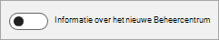

# Over het nieuwe Microsoft 365-beheercentrumAbout the new Microsoft 365 admin center

::: moniker range="o365-worldwide"

Het nieuwe Microsoft 365-beheercentrum is gebouwd voor IT-teams als een vereenvoudigde manier om uw Microsoft 365-services te beheren.The new Microsoft 365 admin center is built for IT teams as a simplified way to manage your Microsoft 365 services. Het beheercentrum biedt een op maat gemaakte ervaring op basis van de unieke behoeften van uw rol of organisatie, verbetert de efficiëntie voor dagelijkse taken en biedt bruikbare inzichten die u helpen gegevensgestuurde beslissingen te nemen om uw gebruikers een betere ervaring te bieden.The admin center provides a tailored experience based on the unique needs of your role or organization, improves efficiency for everyday tasks, and provides actionable insights that help you make data-driven decisions to deliver a better experience for your users.

Het Microsoft 365-beheercentrum is het gemeenschappelijke toegangspunt voor alle Microsoft [https://admin.microsoft.com](https://go.microsoft.com/fwlink/?linkid=2024339)365-beheerders en is toegankelijk op .The Microsoft 365 admin center is the common entry point for all Microsoft 365 admins and can be accessed at [https://admin.microsoft.com](https://go.microsoft.com/fwlink/?linkid=2024339). Gespecialiseerde werkruimten, zoals beveiliging of apparaatbeheer, zorgen voor meer gedetailleerde controle.Specialist workspaces, like Security or Device management, allow for more granular control. Zie Hoe het zit [met de specifieke typen IT-rollen en andere werkruimten zoals Beveiliging, Apparaatbeheer of Exchange?](#what-about-the-specific-types-of-it-roles-and-other-workspaces-like-security-device-management-or-exchange)For more information about how the admin centers will work together, see [What about the specific types of IT roles and other workspaces like Security, Device Management, or Exchange?](#what-about-the-specific-types-of-it-roles-and-other-workspaces-like-security-device-management-or-exchange) later in this article.

::: moniker-end

::: moniker range="o365-21vianet"

Het nieuwe Microsoft 365-beheercentrum, dat momenteel in preview is, is gebouwd voor IT-teams als een vereenvoudigde manier om uw Microsoft 365-services te beheren.The new Microsoft 365 admin center, which is currently in preview, is built for IT teams as a simplified way to manage your Microsoft 365 services. Het beheercentrum biedt een op maat gemaakte ervaring op basis van de unieke behoeften van uw rol of organisatie, verbetert de efficiëntie voor dagelijkse taken en biedt bruikbare inzichten die u helpen gegevensgestuurde beslissingen te nemen om uw gebruikers een betere ervaring te bieden.The admin center provides a tailored experience based on the unique needs of your role or organization, improves efficiency for everyday tasks, and provides actionable insights that help you make data-driven decisions to deliver a better experience for your users.

Het Microsoft 365-beheercentrum is het gemeenschappelijke toegangspunt voor alle Microsoft 365-beheerders en is toegankelijk door in te loggen op [https://portal.partner.microsoftonline.cn/AdminPortal/Home#/homepage](https://go.microsoft.com/fwlink/p/?linkid=850627).The Microsoft 365 admin center is the common entry point for all Microsoft 365 admins and can be accessed by logging in at [https://portal.partner.microsoftonline.cn/AdminPortal/Home#/homepage](https://go.microsoft.com/fwlink/p/?linkid=850627). Bovendien zorgen gespecialiseerde werkruimten, zoals Azure Active Directory en Exchange, voor meer gedetailleerde controle.Additionally, specialist workspaces, like Azure Active Directory and Exchange, allow for more granular control. U hebt toegang tot de specialistische werkruimten vanuit het navigatiedeelvenster in het Microsoft 365-beheercentrum.You can access the specialist workspaces from the navigation pane in the Microsoft 365 admin center.

::: moniker-end

::: moniker range="o365-worldwide"

Als er nieuwe functies beschikbaar komen in het Microsoft 365-beheercentrum, u zich aanmelden voor het nieuwe beheercentrum en uw feedback delen met Microsoft, zodat we de beheerervaring kunnen blijven verbeteren.As new features become available in the Microsoft 365 admin center, you'll be able to opt in to the new admin center and share your feedback with Microsoft so that we can continue to improve the admin experience. Als u zich aanbiedt, heeft dit geen gevolgen voor uw gebruikers en u op elk gewenst moment terugschakelen naar het oude beheercentrum.If you opt in, there will be no impact to your users, and you can switch back to the old admin center at any time.
[Nieuw in het nieuwe Microsoft 365-beheercentrum](whats-new-in-preview.md).[What's new in the NEW Microsoft 365 admin center](whats-new-in-preview.md).
  
> [!NOTE]
> Gerichte releasebeheerders hebben eerst toegang tot nieuwe functies.Targeted release admins will have first access to new features. Nieuwe functies worden vervolgens uitgerold naar alle beheerders.New features will then roll out to all admins. Dit betekent dat u het nieuwe beheercentrum mogelijk niet ziet of dat het er anders uitziet dan wat in Help-artikelen wordt beschreven.This means that you may not see the new admin center, or it may look different than what is described in help articles. Zie Deelnemen aan het nieuwe beheercentrum hieronder als een van de eersten die nieuwe functies ziet.To be among the first to see new features, see Participate in the new admin center, below. 
    
## Deelnemen aan het nieuwe beheercentrumParticipate in the new admin center
We willen graag dat je deelneemt aan het nieuwe Microsoft 365-beheercentrum, zodat je je voorbereiden op verandering en ons feedback geven.We would love for you to participate in the new Microsoft 365 admin center so you can prepare for change and give us feedback.

### Gerichte release inschakelenTurn on Targeted release

1. Meld u aan bij [admin.microsoft.com,](https://admin.microsoft.com)ga naar het navigatiedeelvenster en selecteer Het **profiel Instellingenorganisatie** **Settings** \> .Sign in at [admin.microsoft.com](https://admin.microsoft.com), go to the navigation pane and select **Settings** \> **Organization profile**.

1. Meld u aan bij [portal.partner.microsoftonline.cn,](https://go.microsoft.com/fwlink/p/?linkid=513813)ga naar het navigatiedeelvenster en selecteer Het **profiel Instellingenorganisatie** **Settings** \> .Sign in at [portal.partner.microsoftonline.cn](https://go.microsoft.com/fwlink/p/?linkid=513813), go to the navigation pane and select **Settings** \> **Organization profile**.

2. Ga naar de **betaalkaart Voor vrijen** en selecteer **Bewerken**.Go to the **Release preferences** card, and then select **Edit**. 
    
3. Selecteer **Gerichte release voor iedereen** of **Gerichte release voor geselecteerde gebruikers.**Select either **Targeted release for everyone** or **Targeted release for selected users**. Als u Gerichte release voor geselecteerde gebruikers kiest, moet u ervoor zorgen dat u uw beheerdersaccount (en andere beheerders in uw organisatie die willen deelnemen) toevoegt aan de lijst met geselecteerde gebruikers.If you choose Targeted release for selected users, make sure that you add your admin account (and any other admins in your org who want to participate) to the list of selected users.
    
### Overschakelen naar het nieuwe beheercentrum en weer terugSwitch to the new admin center and back again

- Wanneer het nieuwe Microsoft 365-beheercentrum voor u beschikbaar is, u zich aanmelden door de schakel **van het nieuwe beheercentrum** boven aan de startpagina uit te schakelen.When the new Microsoft 365 admin center is available to you, you can opt in by selecting the **Try the new admin center** toggle located at the top of the Home page. Als u zich afmeldt bij het beheercentrum, onthouden we uw selectie en meldt u zich weer aan bij het nieuwe beheercentrum.If you sign out of the admin center, we'll remember your selection and you'll sign back in to the new admin center.    
  
- Schakel terug naar het oude beheercentrum vanaf de startpagina door de schakel in te schakelen naar **Uit**.Switch back to the old admin center from the Home page by turning the toggle to **Off**.   

Terwijl u in het nieuwe beheercentrum bent, u Microsoft feedback geven over uw ervaring door **feedback geven** direct naast de knop Hulp nodig te **selecteren?**While in the new admin center, you can give Microsoft feedback about your experience by selecting **Give feedback** right next to the **Need help?** button at the bottom of every page. Vertel ons wat je leuk vindt en wat we beter kunnen doen.Tell us what you like and what we could do better. Bovendien u pop-upenquêtes krijgen van tijd tot tijd vragen over uw algemene vertoningen of een bepaalde ervaring die onlangs is vrijgegeven.In addition, you may get pop-up surveys from time-to-time asking about your overall impressions or a particular experience that's newly released. U ook feedback geven aan het einde van dit artikel door te selecteren **Was deze informatie nuttig?**You can also give feedback at the end of this article by selecting **Was this information helpful?**
  
Als u een early adopter wilt zijn in het nieuwe beheercentrum, moet u gerichte release inschakelen en vervolgens u, wanneer het nieuwe beheercentrum beschikbaar is, overschakelen om het te controleren en feedback te geven.If you want to be an early adopter in the new admin center, you'll need to turn on Targeted release, and then when the new admin center is available you can switch to it to check it out and provide feedback.
  
> [!NOTE]
> Toegang tot het nieuwe beheercentrum wordt uitgerold naar alle Microsoft 365-beheerders.Access to the new admin center will be rolled out to all Microsoft 365 admins. Beheerders die zich in de groep Gerichte release in hun organisatie bevinden, krijgen eerst het nieuwe beheercentrum.Admins who are in the Targeted release group in their organization will get the new admin center first. Wordt in Gerichte versie garandeert niet u zult de schakelaar onmiddellijk zien, maar u zult het eerder dan die in Standaardversie krijgen.Being in Targeted release does not guarantee you will see the toggle immediately, but you will get it sooner than those in Standard release. 
  
::: moniker-end

::: moniker range="o365-21vianet"

### Overschakelen naar het nieuwe beheercentrum en weer terugSwitch to the new admin center and back again

Terwijl het nieuwe beheercentrum in preview is, u heen en weer schakelen tussen het nieuwe beheercentrum en het oude beheercentrum met behulp van de schakelaar boven aan de startpagina van het beheercentrum.While the new admin center is in preview, you can switch back and forth between the new admin center and the old admin center by using the toggle located at the top of the admin center Home page. Het nieuwe beheercentrum is volledig functioneel en heeft alle mogelijkheden van het oude beheercentrum.The new admin center is fully functional and has all the capabilities of the old admin center.

Als u het nieuwe beheercentrum wilt proberen, schakelt u de schakelaar om <b>het voorbeeld uit</b>te proberen .To try the new admin center, turn the toggle to <b>Try the preview</b>. Op de toggle wordt voorbeeld weergegeven <b>op</b>.The toggle will then show <b>Preview on</b>. De volgende keer dat u zich aanmeldt bij het beheercentrum, onthouden we uw selectie en melden we ons aan bij het nieuwe beheercentrum.Next time you sign in to the admin center, we'll remember your selection and sign you in to the new admin center.

Als u terug wilt gaan naar het oude beheercentrum, schakelt u de schakelaar van <b>Voorbeeld in op</b> de uitpositie.To go back to using the old admin center, turn the toggle from <b>Preview on</b> to the off position. De volgende keer dat u zich aanmeldt bij het beheercentrum, melden we ons aan bij het oude beheercentrum.Next time you sign in to the admin center, we'll sign you in to the old admin center.

::: moniker-end

::: moniker range="o365-worldwide"

## Veelgestelde vragenFrequently asked questions

Zie je je vragen hier niet beantwoord?Don't see your questions answered here? Ga naar de **sectie Feedback** onderaan deze pagina en stel je vraag.Go to the **Feedback** section at the bottom of this page and ask your question. 
  
## Kan ik alles doen in het nieuwe beheercentrum dat ik kan doen in het oude beheercentrum?Can I do everything in the new admin center that I can do in the old admin center?

Ja.Yes. Het nieuwe beheercentrum is volledig functioneel en heeft alle mogelijkheden van het oude beheercentrum.The new admin center is fully functional and has all the capabilities of the old admin center.
  
## Welke Microsoft 365-abonnementen zijn beschikbaar voor proefversie of aankoop?Which Microsoft 365 plans are available to trial or buy?

Microsoft 365 is een complete, intelligente oplossing die Office 365, Windows 10 en Enterprise Mobility + Security bevat waarmee iedereen creatief kan zijn en veilig kan samenwerken.Microsoft 365 is a complete, intelligent solution that includes Office 365, Windows 10, and Enterprise Mobility + Security that empowers everyone to be creative and work together, securely. De volgende Microsoft 365-abonnementen zijn beschikbaar in het beheercentrum om nu te proberen of te kopen:The following Microsoft 365 subscriptions are available in the admin center for you to try or buy now:
  
- Microsoft 365 voor bedrijvenMicrosoft 365 for business
- Microsoft 365 Enterprise E3Microsoft 365 Enterprise E3
- Microsoft 365 Enterprise E5Microsoft 365 Enterprise E5
    
Zie [Een Microsoft 365-abonnement uitproberen of kopen](../commerce/try-or-buy-microsoft-365.md)voor meer informatie.For more information, see [Try or buy a Microsoft 365 subscription](../commerce/try-or-buy-microsoft-365.md).

## Ik vond een bug of ik wil een functie verbetering verzoek.I found a bug or I want to request a feature enhancement. Hoe laat ik microsoft weten?How do I let Microsoft know?

Wij horen graag van u!We love to hear from you! Door bugs te melden en feedback te delen, kunnen we het Microsoft 365-beheercentrum beter maken.Reporting bugs and sharing feedback helps us make the Microsoft 365 admin center better. Als u feedback wilt geven, selecteert u de knop **Feedback** onder aan de pagina en gebruikt u het formulier om ons uw gedachten te sturen.To give feedback, select the **Feedback** button on the bottom of the page and use the form to send us your thoughts. Schakel het selectievakje in en bevestig uw e-mailadres als u wilt dat iemand van het Microsoft 365-beheercentrumteam uw opmerkingen opvolgt.Select the checkbox and confirm your email address if you want someone from the Microsoft 365 admin center team to follow up on your comments. We kunnen niet beloven om elk stukje feedback op te volgen, maar we gaan het proberen!We can't promise to follow up on every piece of feedback, but we're going to try! 
  
U ook feedback geven van buiten het beheercentrum op ons UserVoice-forum.You can also give feedback from outside of the admin center on our UserVoice forum. U deze pagina gebruiken om functiesuggesties te doen waarop andere forumgebruikers kunnen stemmen: [UserVoice-forum voor het nieuwe beheercentrum.](https://go.microsoft.com/fwlink/?linkid=2024994)You can use this page to make feature suggestions that can be voted on by other forum users: [UserVoice forum for the new admin center](https://go.microsoft.com/fwlink/?linkid=2024994).

## Hoe zit het met de specifieke soorten IT-rollen en andere werkruimten zoals Beveiliging, Apparaatbeheer of Exchange?What about the specific types of IT roles and other workspaces like Security, Device Management, or Exchange?

Het Microsoft 365-beheercentrum is het gemeenschappelijke toegangspunt voor alle teams en rollen die Microsoft 365 beheren.The Microsoft 365 admin center is the common entry point for all teams and roles managing Microsoft 365. De ervaring, informatie en besturingselementen zijn afgestemd en aanpasbaar voor elke beheerder en rol.The experience, information, and controls are tailored and customizable for each admin and role. Bovendien zorgen gespecialiseerde werkruimten voor diepe, gedetailleerde controle.Additionally, specialist workspaces allow for deep, granular control. Deze gespecialiseerde werkruimten omvatten &amp; SharePoint, Teams Skype, Exchange, Beveiliging, Compliance, Apparaatbeheer en Azure Active Directory.These specialist workspaces include SharePoint, Teams &amp; Skype, Exchange, Security, Compliance, Device Management, and Azure Active Directory. U vindt de specialistische werkruimten in het navigatiedeelvenster in [https://admin.microsoft.com](https://go.microsoft.com/fwlink/?linkid=2024339)het Microsoft 365-beheercentrum op .You can find the specialist workspaces from the navigation pane in the Microsoft 365 admin center at [https://admin.microsoft.com](https://go.microsoft.com/fwlink/?linkid=2024339).
  
Het bijwerken van alle beheercentra om een coherente ervaring te hebben zal een tijdje duren, maar u meer te weten komen over de beheercentra die we al zijn begonnen met make-over:Updating all of the admin centers to have a coherent experience will take awhile, but you can learn more about the admin centers we've already started to makeover:
  
- [Aan de slag met het nieuwe SharePoint-beheercentrumGet started with the new SharePoint Admin Center](https://go.microsoft.com/fwlink/?linkid=2024186)
    
- [Teams beheren tijdens de overgang &amp; naar het nieuwe Microsoft Teams Skype voor Bedrijven-beheercentrumManage Teams during the transition to the new Microsoft Teams &amp; Skype for Business Admin Center](https://go.microsoft.com/fwlink/?linkid=2024308)
    
- [Overzicht van Microsoft 365-apparaatbeheerOverview of Microsoft 365 Device Management](https://go.microsoft.com/fwlink/?linkid=2006262)
    
- [Maak kennis met het Microsoft 365 Security and Compliance CenterIntroducing the Microsoft 365 Security and Compliance Center](https://go.microsoft.com/fwlink/?linkid=2025413)

::: moniker-end