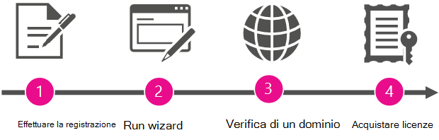

# De beheerder worden en Office 365 aanschaffen voor uw organisatieBecome the admin and purchase Office 365 for your organization

Microsoft maakt het eenvoudig voor personen in uw organisatie om zich te registreren en hulpprogramma's voor productiviteit en services te gebruiken zonder te hoeven wachten op formele implementatie door uw IT-afdeling.Microsoft makes it simple for people in your organization to sign up and use productivity tools and services without waiting for formal deployment by your IT department.
  
Uw organisatie kan personen verder laten gaan met het gebruik van deze services zoals ze zijn. Maar als personen Skype-vergaderingen als een van deze services gebruiken, kunt u een beheerder toewijzen om een upgrade uit te voeren en een completere vergaderoplossing te krijgen met Skype voor Bedrijven en Office-toepassingen, het opslaan en delen van bestanden en meer.Your organization can let people continue to use these services "as is." But if people signed up for Skype Meetings as one of those services, you can assign an admin to upgrade and get a more complete meeting solution with Skype for Business and Office applications, file storage and sharing, and more.
  
## Waarom de beheerder worden en Office 365 aanschaffen voor uw organisatie?Why become the admin and buy Office 365 for your organization?

Wanneer medewerkers zich registreren voor Skype-vergaderingen met hun werkaccount, kunnen zij de service niet beheren. Bovendien krijgen ze alleen de meest basale functies: ze kunnen een onbeperkt aantal vergaderingen hebben, maar alleen met tien of minder deelnemers (na 60 dagen is het maximum aantal deelnemers drie personen).When an employee signs up for Skype Meetings with their work account, they can't manage the service. And they get only the most basic features: they can have unlimited meetings but only with 10 or fewer participants (after 60 days, the maximum participants is three people). 
  
Wanneer u een beheerder voor de service instelt en u Office 365 voor uw gebruikers aanschaft, krijgen ze de beschikking over geavanceerdere functies. Bovendien krijgt u de mogelijkheid om de services te beheren, zodat u beleid kunt afdwingen en nieuwe gebruikers kunt toevoegen.When you set up an admin for the service and buy Office 365 for your users, they get more advanced features. And you get the ability to manage the services, so you can enforce policies and add new users.
  
Ook krijgt u er 24/7 telefonische ondersteuning bij.As a bonus, you get 24/7 phone support.
  
## De beheerder wordenHow to become the admin

Als u de beheerder wilt worden, moet u eerst bewijzen dat u de eigenaar bent van het domein waarop personen zijn geregistreerd (zoals contoso.com). Vervolgens voert u een upgrade naar Office 365 uit voor iedereen in het bedrijf die Skype-vergaderingen al gebruikt. Een wizard begeleidt u bij de stappen.To become the admin, you'll first prove that you own the domain that people signed up with (like contoso.com). Then you'll upgrade to Office 365 for everyone in the company who is already using Skype Meetings. A wizard walks you through the steps.
  
> [!NOTE]
> De beheerder worden en een upgrade naar Office 365 uitvoeren, zijn onderdeel van hetzelfde proces. U kunt geen upgrade uitvoeren zonder dat u eerst de beheerder wordt en u kunt de services niet als beheerder beheren, tenzij u ook een upgrade naar Office 365 uitvoert.Becoming the admin and upgrading to Office 365 are part of the same process. You can't upgrade without first becoming the admin, and you can't manage the services as an admin unless you also upgrade to Office 365. 
  
 **Waarom vragen we u om te bewijzen dat u de eigenaar bent van het domein?****Why do we ask you to prove that you own the domain?** Omdat iedereen die zich met een e-mailadres op hetzelfde domein registreert (bijvoorbeeld rob@contoso.com en sara@contoso.com) door de domeinnaam worden gegroepeerd.Because everyone who signs up with an email address on the same domain (say, rob@contoso.com and sara@contoso.com) is grouped together by the domain name. We bepalen tot welke groep elke persoon behoort door het domeingedeelte van zijn e-mailadres (zoals contoso.com), zodat mensen uit dezelfde organisatie kunnen samenwerken.We decide what group each person belongs to by the domain portion of their email addresses (like contoso.com), so people from the same organization can work together. Omdat ze deel uitmaken van dezelfde groep, kunnen ze met elkaar samenwerken.Because they belong to the same group, they can collaborate with each other.
  
Als u de beheerder van de groep wilt worden, verifieert u dat u de eigenaar bent van het domein waarop iedereen in uw organisatie is gegroepeerd. Als u kunt bewijzen dat u de eigenaar bent van het domein (door u aan te melden waar het domein wordt beheerd), is het ook logisch dat u Office 365-services kunt beheren voor personen die van dat domein gebruikmaken.To become the admin for the group, you verify that you own the domain that everyone in your organization is grouped under. If you have the authority to prove domain ownership (by signing in where the domain is managed), it makes sense that you can manage Office 365 services for people using that domain.
  
Nadat u de beheerder bent geworden, kunt u desgewenst ook nieuwe gebruikers toevoegen of beleid afdwingen.After you become the admin, you can also add new users or enforce policies, if you like.
  
## Overzicht van de stappenOverview of the steps

  
Een wizard begeleidt u door het proces, maar hieronder vindt u een overzicht van de stappen.A wizard guides you through the process, but here's a summary of each step.
  
|||
|:-----|:-----|
||**Registreren** Voordat u de beheerder kunt worden, moet u al met uw zakelijke e-mailadres bij Skype-vergaderingen zijn geregistreerd.**Sign up** Before you can become the admin, you must already be signed up for Skype Meetings with your work email address.    |
||**De wizard uitvoeren** Nadat u zich hebt geregistreerd, voert u de wizard op een van de volgende manieren uit:**Run the wizard** After you've signed up, run the wizard by doing one of the following:     Voer de wizard **Word de beheerder uit** die wordt weergegeven nadat u **Beheerder** hebt geselecteerd in het startprogramma voor apps .Run the **Become the admin** wizard that appears after selecting **Admin** in the app launcher .     OFOR     Kies voor **Upgrade naar Office 365** in Skype-vergaderingen en selecteer vervolgens het Office 365-abonnement waarnaar u wilt upgraden.Choose to **Upgrade to Office 365** in Skype Meetings, and then select the Office 365 subscription you want to upgrade to.    |
||**Eigendom van het domein verifiëren** Vervolgens verifieert u in Office 365 dat u eigenaar of beheerder bent van de domeinnaam (zoals contoso.com) die aan de e-mailadressen van uw organisatie is gekoppeld. Alleen de eigenaar van de domeinnaam is hiervoor gemachtigd.  **Verify domain ownership** Next, you'll verify to Office 365 that you own or manage the domain name (like contoso.com) that's associated with your organization's email addresses. Only the owner of the domain name has the authority to do this.    |
||**Licenties kopen** De laatste stap in de wizard is de aanschaf van Office 365-licenties voor elke persoon binnen uw organisatie die zich bij Skype-vergaderingen heeft geregistreerd met zijn/haar zakelijke e-mailadres.**Buy licenses** In the last step in the wizard, you'll buy Office 365 licenses for each person within your organization who's signed up for Skype Meetings with their work email.    Als bijvoorbeeld twee gebruikers zich met hun zakelijke e-mailadres bij Skype-vergaderingen hebben geregistreerd, moet u twee licenties aanschaffen, voor ieder één.For example, if two users have signed up for Skype Meetings with their work email, you'll need to buy two licenses—one for each of them.    > [!NOTE]> U kunt Office 365 niet beheren totdat u de licenties hebt aangeschaft.> [!NOTE]> You can't manage Office 365 until after you've bought the licenses.           |

## Uw Office 365-abonnementYour Office 365 subscription

Nadat u het domein hebt geverifieerd en licenties hebt aangeschaft, wordt er een upgrade van uw organisatie uitgevoerd naar Office 365. De persoonlijke instellingen van het abonnement voor Skype-vergaderingen dat afzonderlijke gebruikers gebruiken worden ook overgezet (naar het betaalde abonnement).After you've verified the domain and bought licenses, your organization is upgraded to Office 365. This also transfers (to the paid subscription) the personal settings from the Skype Meetings subscription that individual users were using.
  
Het Office 365-abonnement waarnaar een upgrade is uitgevoerd voor uw organisatie, hangt af de wizard die u hebt gebruikt:The Office 365 subscription that your organization is upgraded to depends on which wizard you used:
  
|||
|:-----|:-----|
|**Hoe de wizard is gestart****How the wizard was launched**   |**Abonnementsopties****Subscription options**   |
|Met behulp van de tegel Beheerder in het startprogramma voor appsBy using the Admin tile in the app launcher    |Office 365 Business EssentialsOffice 365 Business Essentials    |
|Door te kiezen voor **Upgrade naar Office 365 uitvoeren** in Skype-vergaderingenBy choosing **Upgrade to Office 365** in Skype Meetings    |Office 365 Business Essentials of Office 365 Business PremiumOffice 365 Business Essentials or Office 365 Business Premium    |
   
## En nu?What's next?

Nu u de beheerder bent, u het volgende doen:Now that you're the admin, you may want to do the following:
  
|\*\*\*\*Taak\*\*\*\*\*\*\*\*Task\*\*\*\*|\*\*\*\*Details\*\*\*\*\*\*\*\*Details\*\*\*\*|
|:-----|:-----|
|Licenties toevoegen of intrekkenAdd or remove licenses    |U [meer licenties toevoegen](../../commerce/licenses/buy-licenses.md) voor gebruikers die Office 365 nog niet gebruiken of licenties verwijderen van [gebruikers](../manage/remove-licenses-from-users.md) die u niet wilt gebruiken met het Office 365-abonnement van uw organisatie.You can [add more licenses](../../commerce/licenses/buy-licenses.md) for users who aren't using Office 365 yet, or [remove licenses from users](../manage/remove-licenses-from-users.md) that you don't want using your organization's Office 365 subscription.    |
|Contact opnemen met anderen die zich al hebben geregistreerdContact others who already signed up    |Neem contact op met de andere gebruikers en laat weten dat u hun Office 365-abonnement beheert en dat er een upgrade is uitgevoerd. [Voer de volgende stappen uit](../add-users/add-users.md) om een lijst met **actieve gebruikers** en hun e-mailadressen weer te geven.  Reach out to the other users and let them know that you're managing their Office 365 subscription and that they've been upgraded. [Follow these steps](../add-users/add-users.md) to see a list of **Active Users** and their email addresses.    |
|Office 365 gaan gebruikenStart using Office 365    |Ga naar het [Office 365-trainingscentrum](https://support.office.com/learn/office365-for-business) en lees hoe u zich kunt aanmelden, e-mail kunt lezen, documenten kunt delen en meer. U en uw gebruikers kunnen deze site gebruiken om aan de slag te gaan met Office 365.  Visit the [Office 365 Learning Center](https://support.office.com/learn/office365-for-business) and learn how to sign in, check email, share documents, and more. You and your users can use this site to get started with Office 365.    |
|Uw Office 365-abonnement beherenManage your Office 365 subscription    |Ga naar het Helpcentrum Voor Beheer in [Office 365](../admin-home.md) en leer veelvoorkomende administratieve taken zoals het toevoegen en verwijderen van gebruikers, het opnieuw instellen van wachtwoorden en het instellen van mobiele apparaten.Visit [Office 365 Admin help center](../admin-home.md) and learn common administrative tasks like adding and removing users, resetting passwords, and setting up mobile devices.    |

## Nog steeds hulp nodig?Still need help?

[Ondersteuning voor Microsoft bellenCall Microsoft support](../contact-support-for-business-products.md)
