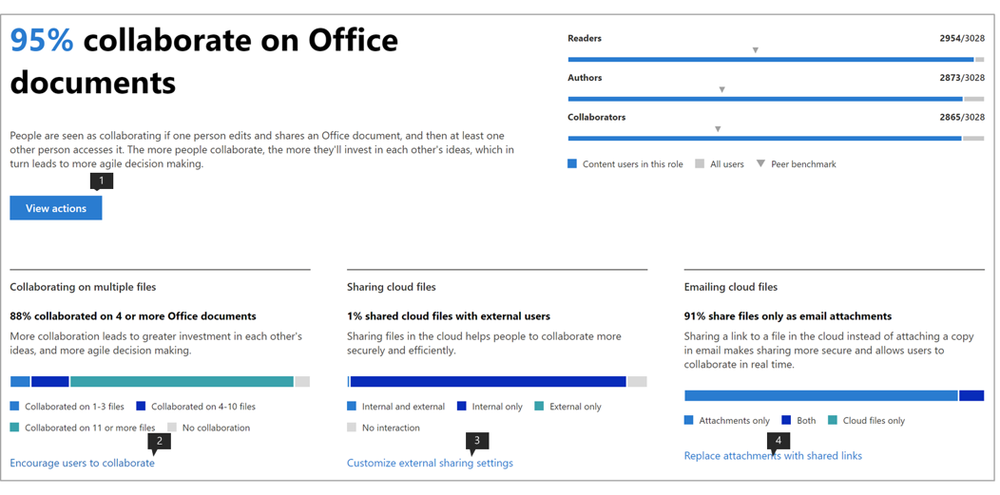

# Microsoft-productiviteitsscore (voorbeeld)Microsoft Productivity score (Preview)

Microsoft 365 biedt productiviteitsoplossingen waarmee uw organisatie haar bedrijfsdoelstellingen kan bereiken.Microsoft 365 offers productivity solutions that enables your organization to meet its business goals. Productivity Score biedt inzichten om deze oplossingen te gebruiken die u transformeren naar hoe werk wordt gedaan.Productivity Score provides insights to use these solutions that you can transform to how work gets done.Het bevat: It contains: 

- **Zichtbaarheid** door hen te helpen begrijpen hoe mensen werken in de vorm van hun huidige score met uitsplitsing over categorieën employee experience en technologieervaring (binnenkort beschikbaar).**Visibility** by helping them understand how people work in the form of their current score with breakdown across categories of Employee experience and Technology experience (coming soon). 
- **Inzichten** om mogelijkheden te identificeren om verbeterde ervaringen mogelijk te maken.**Insights** to identify opportunities to enable improved experiences. 
- **Acties** om vaardigheden en systemen bij te werken, zodat iedereen zijn best kan doen.**Actions** to update skills and systems so everyone can do their best work. 

De score en de inzichten zijn aanwezig in twee categorieën –The score and the insights are present across two categories –  

- **Werknemerservaring:** laat zien hoe Microsoft 365 helpt om een productief en betrokken personeelsbestand te creëren door te kwantificeren hoe mensen samenwerken aan inhoud, overal werken, door communicatiestijlen te begrijpen (binnenkort beschikbaar te stellen) en door een vergadercultuur te ontwikkelen (binnenkort)**Employee experience:** shows how Microsoft 365 is helping to create a productive and engaged workforce by quantifying how people collaborate on content, work anywhere, by understanding communication styles (coming soon), and by developing a meeting culture (coming soon) 

- **Technologie-ervaring** (binnenkort beschikbaar): helpt u bij het optimaliseren van uw apparaatervaringen, zoals het proactief oplossen van veelvoorkomende helpdeskproblemen en het verbeteren van de opstarttijden van pc's en uw netwerk om ervoor te zorgen dat uw apps goed werken.**Technology experience** (coming soon): Assists you to optimize your device experiences such as proactively fixing common helpdesk issues,  and improving PC startup times and your network to ensure your apps work well.  

## Hoe het werktHow it works

### Punten van scorenAreas of scoring 

Binnen elke scorecategorie biedt productivity score inzicht in uw werktransformatie op verschillende gebieden.Within each score category, Productivity Score provides insights on your work transformation across areas. De gebieden die onder de werknemerservaring vallen zijn:The areas covered within Employee experience are:

- Samenwerken aan inhoudCollaborating on content  
- Overal werkenWorking anywhere 
- Inzicht in communicatiestijlen (binnenkort beschikbaar)Understanding communication styles (coming soon) 
- Het ontwikkelen van een vergadercultuur (binnenkort)Developing a meeting culture (coming soon) 

### Acties van gebruikers scorenScoring user actions 

Binnen elk gebied meten we de op onderzoek gebaseerde kernactiviteiten die de manier van werken vertegenwoordigen die organisaties in staat stellen om te transformeren naar een zeer productieve organisatie.Within each area, we measure the research-based key actions which represent the ways of working that enable organizations to transform into highly productive organization. Voor elk gebied berekenen we het percentage gebruikers dat deze acties in de afgelopen 28 dagen uitvoert.For each area we compute the % of users who perform these actions within the last 28 days. 

De employee experience score wordt samengesteld als een gemiddelde score op alle gebieden.The Employee experience score is curated as an average score across all areas. Houd er rekening mee dat we in de loop van de tijd meer gebieden zullen blijven toevoegen aan de ervaring van werknemers en technologie.Note that we will keep adding more areas to Employee experience and Technology experience over time. 

### Producten die zijn opgenomen in de productiviteitsscoreProducts included in the Productivity Score 

Productiviteitsscore bevat momenteel signalen van de belangrijkste Microsoft 365-workloads OneDrive, SharePoint, Word, Excel, PowerPoint, OneNote, Outlook, Yammer, Teams, Skype.Productivity Score currently includes signals from the key Microsoft 365 workloads OneDrive, SharePoint, Word, Excel, PowerPoint, OneNote, Outlook, Yammer, Teams, Skype. 

Uw score wordt dagelijks bijgewerkt en weerspiegelt de acties van gebruikers die in de afgelopen 28 dagen zijn voltooid (inclusief de huidige dag).Your score is updated daily and reflects user actions completed in the last 28 days (including the current day).

## Toegang en vereiste machtigingenAccess and required permissions 

Voor de werknemerservaring moet u een abonnement hebben op een Office 365 voor Bedrijven-abonnement of een Microsoft 365 Business-abonnement met meerdere gebruikers.For the employee experience, you must have a subscription to an Office 365 for business plan or a Microsoft 365 Business plan with multiple users. 

Als u toestemming wilt hebben voor toegang tot de Microsoft Productivity Score, moet u de volgende rollen hebben:To have permission to access Microsoft Productivity Score, you must have of the following roles: 

- Algemene beheerderGlobal admin 
- Exchange-beheerdersExchange admins 
- SharePoint-beheerdersSharePoint admins 
- Skype voor Bedrijven-beheerdersSkype for Business admins 
- Teams-beheerderTeams admin 
- Globale lezerGlobal Reader 
- Rapporten ReaderReports Reader 

U hebt toegang tot de ervaring vanuit microsoft 365-beheerhuis door **Rapporten** > **productiviteitsscore** te kiezen in de linkernavigatie.You can access the experience from Microsoft 365 Admin home by choosing **Reports** > **Productivity Score** in the left navigation.

## Productiviteitsscore interpreterenInterpreting Productivity Score 

### Ontdek hoe uw organisatie werktLearn how your organization works 

hij Productivity Score home page biedt de huidige score en geschiedenis op een percentage basis, primaire inzichten voor gebieden binnen elke score categorie aangevuld met benchmarks.he Productivity Score home page provides the current score and history on a percentage basis, primary insights for areas within each score category supplemented by benchmarks. 

1.**Productiviteitsscore** wordt vermeld op een basis <numerator> / <denominator> van percentages en in het formaat, zodat u ook uw absolute punten (teller) en maximaal mogelijke punten zien1.**Productivity Score** is listed on a percentage basis as well as in the <numerator>/<denominator> format so you can also see your absolute points (numerator) and maximum possible points  
1. Met deze draaidraai u de scorecategorie selecteren waarop u zich wilt concentreren.This pivot allows you to select the score category you want to focus on. In de preview u alleen **de ervaring van werknemers**bekijken, maar de selectie wordt binnenkort uitgebreid met **technologie-ervaring.**In the preview, you can only view **Employee experience**, but the selection will soon expand to include **Technology experience**. 
1. **Peer benchmark** u uw huidige score te vergelijken met organisaties zoals jij.**Peer benchmark** allows you to compare your current score with organizations like you. De benchmarkmaat wordt berekend als het gemiddelde van de maatregelen binnen een reeks vergelijkbare organisaties.The benchmark measure is calculated as the average of measures within a set of similar organizations. De set bestaat uit organisaties die een vergelijkbaar aantal ingeschakelde gebruikers, regio, de typen licenties die u bezit, branche en ambtstermijn hebben binnen Microsoft 365 of Office 365.The set is composed of organizations who have similar number of enabled users, region, the types of licenses you own, industry, and tenure within Microsoft 365 or Office 365. 
1. De sectie **Scorecategorieën** biedt een uitsplitsing van uw productiviteitsscore met benchmarks per categorie.The **Score categories** section provides a breakdown of your Productivity Score with benchmarks per category.
1. **Scoregeschiedenis** geeft aan hoe uw score in elke categorie in de afgelopen 6 maanden is verplaatst.**Score history** displays how your score in each category has moved in the past 6 months.
1. Het primaire inzicht voor **Samenwerken aan content** toont de relevante maatregelen met benchmarks uit dit gebied die bijdragen aan de score.The primary insight for **Collaborating on content** shows the relevant measures with benchmarks from this area that contribute to the score. Selecteer **Details weergeven** om de pagina met gebiedsdetails weer te geven.Select **View Details** to see the area detail page.
1. Het primaire inzicht voor **Werken overal** toont de relevante maatregelen met benchmarks uit dit gebied die bijdragen aan de score.The primary insight for **Working anywhere** shows the relevant measures with benchmarks from this area that contribute to the score. Selecteer **Details weergeven** om de pagina met gebiedsdetails weer te geven.Select **View Details** to see the area detail page.  

### Inzichten om mogelijkheden te identificeren om ervaringen te verbeterenInsights to identify opportunities to improve experiences 

Selecteer voor elk gebied **Details weergeven** in het primaire inzicht om de pagina met details van het gebied weer te geven die aanvullende inzichten, gerelateerd onderzoek en acties weergeeft om uw score te verbeteren.For each area, select **View Details** in the primary insight to view the area detail page that displays additional insights, related research and actions to improve your score. ..

Alle pagina's met gebiedsdetails volgen de volgende structuur:All area detail pages follow the following structure: 

- Linksboven: Primair inzicht behouden vanaf de startpagina.Top left: Primary insight retained from the home page.
- Linksonder: Inzichten ondersteunen met contextuele acties.Bottom left: Supporting insights with contextual actions.  
- Rechts: Academisch onderzoek dat de relatie tussen het gebied en productiviteit aantoont.Right: Academic research demonstrating the relationship between the area and productivity.

Bovendien bevatten alle inzichten de volgende elementen:Additionally, all insights contain the following elements: 

- Koptekst: Key takeaway of outcome bijgehouden voor elk inzicht;Header: Key takeaway or outcome tracked for each insight;
- Samenvatting: Verdere uitleg waarom de maatregelen in het inzicht belangrijk zijn voor de productiviteit van uw organisatie.Summary: Further explanation of why the measures in the insight are important for your organization’s productivity. 
- Datavisualisatie: Kwantificeert visueel de positie van uw organisatie met betrekking tot de maatregelen in het inzicht met benchmarks zoals van toepassing.Data visualization: Visually quantifies your organization’s position with regard to the measures in the insight with benchmarks as applicable.
- Acties: Contextuele actie die kan helpen om meer van het gewenste resultaat per het inzicht te stimuleren en zo uw score te verbeteren.Actions: Contextual action that can help drive more of the desired outcome per the insight and thus improve your score.

### Pagina Gebiedsdetails – Samenwerken aan inhoudArea detail page – Collaborating on content 

Samenwerken op de inhoudspagina bevat het primaire inzicht van de startpagina van productiviteitsscore.Collaborating on content page contains the primary insight from the Productivity Score home page. Het heeft de volgende componenten:It has the following components:

1. Koptekst: kwantificeert welk percentage gebruikers samenwerkt aan inhoud (sleutelresultaat).Header: Quantifies what percentage of users are collaborating on content (key outcome).
1. Lichaam: Meer details over hoe een verhoogde samenwerking leidt tot een hogere productiviteit.Body: More detail on how increased collaboration leads to higher productivity.
1. Visualisatie: Hiermee wordt elk element dat bijdraagt aan de score voor dit gebied visueel gekwantificeerd met benchmarks:Visualization: This visually quantifies each element that contributes to the score for this area with benchmarks:

    - **Lezers**: hiermee worden gebruikers gekwantificeerd die bestanden openen of downloaden in de cloud (OneDrive en SharePoint) binnen een basis van gebruikers met OneDrive en SharePoint.**Readers**: Quantifies users accessing or downloading files on the cloud (OneDrive and SharePoint) within a base of OneDrive and SharePoint enabled users.
    - **Auteurs**: Kwantificeert gebruikers die bestanden wijzigen, uploaden, synchroniseren, inchecken, kopiëren of verplaatsen binnen een basis van gebruikers met OneDrive en SharePoint.**Authors**:  Quantifies users modifying, uploading, syncing, checking in, copying or moving files on the cloud (OneDrive and SharePoint) within a base of OneDrive and SharePoint enabled users.
    - **Bijdragers**: kwantificeert gebruikers die samenwerken aan bestanden in de cloud (OneDrive en SharePoint) binnen een basis van gebruikers met OneDrive en SharePoint.**Collaborators**: Quantifies users collaborating on files on the cloud (OneDrive and SharePoint) within a base of OneDrive and SharePoint enabled users. Twee gebruikers zijn bijdragers als een van hen een Word-, Excel-, PowerPoint-, OneNote- of PDF-clouddocument heeft gelezen of bewerkt nadat het andere binnen een periode van 28 dagen is gemaakt of gewijzigd.Two users are Collaborators if one of them read or edited a Word, Excel, PowerPoint, OneNote or PDF cloud document after the other created or modified it within a 28-day window.

1. **Waarom het er toe doet,** biedt een samenvatting van onderzoek dat samenwerking op cloudbestanden koppelt aan productiviteit.**Why it matters** provides a summary of research linking collaboration on cloud files with productivity. **Lees het onderzoek van Forrester** gaat naar een onderzoeksartikel dat meer context biedt over hoe samenwerking bevorderlijk is voor een hogere productiviteit.**Read the research from Forrester** goes to a research article that provides more context on how collaboration is conducive to increased productivity.
1. Als u inzicht ondersteunt in **samenwerken aan meerdere bestanden,** kwantificeert de manier waarop gebruikers in uw organisatie samenwerken in verschillende bestanden.Supporting insight on **Collaborating on multiple files** quantifies how users in your organization are collaborating across different files. 
1. Als u inzicht ondersteunt in **het delen van cloudbestanden,** wordt gekwantificeerd als gebruikers inhoud delen in de cloud terwijl ze onderscheid maken tussen intern en extern delen.Supporting insight on **Sharing cloud files** quantifies if users are sharing content on the cloud while drawing distinction between internal and external sharing.
1. Als u inzicht ondersteunt in **het e-mailen van cloudbestanden,** wordt gekwantificeerd als gebruikers die bestanden via e-mail delen, bijlagen versus koppelingen naar cloudbestanden gebruiken.Supporting insight on **Emailing cloud files** quantifies if users sharing files via email are using attachments versus links to cloud files.

De bestandstypen die in aanmerking worden genomen voor samenwerking zijn Word/Excel/PowerPoint/OneNote/PDF.The file types considered for collaboration are Word/Excel/PowerPoint/OneNote/PDF.

### Pagina Gebiedsdetails – Overal werkenArea detail page – Working anywhere 

De pagina Werken overal kwantificeert de gebruikers (als percentage en absolute waarde) die ten minste één productiviteitsapp gebruikten op twee of meer platforms, namelijk desktop, mobiel en web.The Working anywhere page quantifies the users (as a percentage and absolute value) who used at least one productivity app across two or more platforms, which are desktop, mobile and web. Gebruikers worden hoger gescoord voor het gebruik van meer apps en platforms.Users get scored higher for using more apps and platforms. De apps die in aanmerking komen zijn Outlook, Teams, Word, Excel, PowerPoint, OneNote, Yammer, Skype.The apps being considered are Outlook, Teams, Word, Excel, PowerPoint, OneNote, Yammer, Skype. De basis van het inzicht zijn gebruikers die zijn ingeschakeld voor Office 365 ProPlus, Exchange, Yammer, Skype of Teams.The base of the insight are users enabled for Office 365 ProPlus, Exchange, Yammer, Skype or Teams.

1. **Waarom het er toe doet,** biedt een samenvatting van onderzoek dat het gebruik van meerdere platforms koppelt aan een hogere productiviteit.**Why it matters** provides a summary from research linking usage of multiple platforms to higher productivity. **Lees het onderzoek van Forrester** gaat naar een onderzoeksartikel dat meer context biedt over hoe werken over een hogere productiviteit bevorderlijk is.**Read the research from Forrester** goes to a research article that provides more context on how working across is conducive to increased productivity.
1. Als u overal inzicht in **e-mail** ondersteunt, kwantificeert het aantal gebruikers in uw organisatie dat Outlook gebruikt op verschillende platforms binnen de basis van gebruikers die actief zijn in Outlook.Supporting insight on **Email anywhere** quantifies number of users in your organization using Outlook across platforms within base of users active on Outlook.
1. Als u **overal** inzicht in chat ondersteunt, kwantificeert u hoe gebruikers in uw organisatie Teams op verschillende platforms gebruiken binnen de basis van gebruikers die actief zijn in Teams.Supporting insight on **Chat anywhere** quantifies how users in your organization are using Teams across platforms within base of users active on Teams.
1. Als u inzicht ondersteunt bij het **openen van Office-documenten, wordt overal** kwantificeerd hoe gebruikers in uw organisatie Word, Excel, PowerPoint en OneNote gebruiken op verschillende platforms binnen de basis van gebruikers die actief zijn op Word, Excel, PowerPoint of OneNote.Supporting insight on **Accessing Office documents anywhere** quantifies how users in your organization are using Word, Excel, PowerPoint and OneNote across platforms within base of users active on Word, Excel, PowerPoint or OneNote.

### Acties voor updatevaardigheden en -systemenActions for update skills and systems 

Om de uitvoerbaarheid te bevorderen, wordt elk ondersteunend inzicht geleverd met inline-acties die kunnen helpen bij het transformeren van uw werknemerservaring, waarvan sommige configuratiewijzigingen of bewustmakingscampagnes kunnen zijn.In order to promote actionability, each supporting insight comes with inline actions that can help transform your employee experience some of which can be configuration changes or awareness campaigns. Als u op deze call-to-action klikt, wordt deze geopend in de opties van het deelvenster Aanbevolen acties die u zou kunnen overwegen.Clicking on these calls-to-action opens in the recommended actions panel options that you might consider. Momenteel zijn de acties in de **Samenwerken aan de inhoud** ingeschakeld.Currently the actions in the **Collaborating on content** are enabled.

1. De **acties weergeven** gaat naar een deelvenster met alle acties met betrekking tot Samenwerken aan inhoud.The **View Actions** goes to a pane listing all actions related to Collaborating on content.
1. **Gebruikers aanmoedigen om samen te werken** gaat naar een lijst met instructievideo's over samenwerking met onderwerpen zoals co-authoring en @mentions.**Encourage users to collaborate** goes to a list of instructional videos on collaboration with topics such as co-authoring and @mentions. 
1. **De** instellingen voor extern delen aanpassen gaat naar een pagina met een overzicht van extern delen waarin wordt beschreven wat er gebeurt wanneer gebruikers delen, afhankelijk van wat ze delen en met wie.**Customize external sharing** settings goes to a page with an overview on external sharing describing what happens when users share, depending on what they're sharing and with whom.  
1. **Bijlagen vervangen door gedeelde koppelingen** gaat naar een pagina waarin wordt uitgelegd hoe u OneDrive-koppelingen delen in plaats van bijlagen via e-mail voor een betere samenwerking.**Replace attachments with shared links** goes to a page explaining how to share OneDrive links instead of attachments over email for better collaboration.

Als u een van de actieknoppen selecteert, wordt het deelvenster **Aanbevolen acties** aan de rechterkant geopend met een overzicht van elke actie en een koppeling naar de documentatiepagina's.Selecting any of the action buttons opens the **Recommended actions** pane on the right that has a summary of each action and a link to the documentation pages.

## We willen graag van u horenWe want to hear from you 

We willen het privépreviewprogramma gebruiken om feedback te verzamelen en de lessen te gebruiken om het product samen met u in de toekomst te maken.We want to utilize the private preview program to glean feedback and use the learnings to co-create the product with you going forward. U de **feedbacksecties** in het product gebruiken en/of contact opnemen met het team Productiviteitsscore op ProductivityScorePreview@service.microsoft.com.You can use the **Feedback** sections within the product and/or reach out to the Productivity Score team at ProductivityScorePreview@service.microsoft.com.

Als u toegang wilt vragen tot de https://aka.ms/productivityscorepreviewprivévoorbeeld, vult u het formulier in op .To request access to the private preview please fill out the form at https://aka.ms/productivityscorepreview.  
